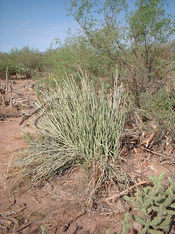
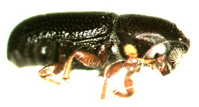

```{r}
#| echo: false
library( maps )
suppressMessages( suppressPackageStartupMessages( library( igraph ) ) )
suppressMessages( suppressPackageStartupMessages( library( tidyverse ) ) )
library( gstudio )
```

Is a quick summary of the use of genetic gravity in a coupled plant insect system in Baja California. These data were published previously individually looking at phylogeny and spatial genetic structure of either species. This system includes a plant that serves as a host for a bark beetle. The plant does not need the bark beetle, but the bark beetle only lives within the senescing stems stems of the plant, so there is a one-way spatial/evolutionary/ecological relationship here.


```{r}
#| echo: false
map_data("world") |>
  filter( region == "Mexico") -> map

ggplot( ) + 
  geom_polygon( aes( x=long, 
                     y=lat, 
                     group=group ), 
                data=map, 
                fill="grey" ) + 
  xlab("Longitude") + 
  ylab("Latitude") + 
  theme_bw( base_size = 12 ) +
  coord_sf( xlim = c(-115, -107),
            ylim = c(22, 30) ) -> bajaCalifornia 
```


## Host Plant - *Euphorbia lomelii*



This is the host plant, which is an endemic of the Sonoran desert, and it is ubiquitous throughout its range. Both this plant and the following bark beetle exist on both Peninsula Baja California and mainland Sonora, though much of the habitat on the mainland has been converted to agricultural use, and we were only able to find samples in relictual or marginal habitats.

The topology using a population graph from genetic markers is mostly connected with a single population serving as an isllated node.  This apology is presented in graph space, based upon the conditional covariance between each node, independent of where it was collected from, on the physical landscape.

```{r}
#| label: fig-pedimaTopology
#| fig-cap: "the topography of genetic covariance as measured within the plant, *Euphoria lomeli*."
read_population( "data/PedimaFinal.csv", 
                    type="zyme", 
                    locus.columns = 10:15, 
                    sep="\t" ) |>
    select( -SoC, -IoL, -MSP, -Geneland, -ID) |>
    mutate( Population = factor( Pop) ) |>
    select( Population, 
            Latitude = Lat, Longitude = Lon, 
            everything() ) -> pedima
pedima |>
    population_graph(decorate=TRUE) -> pgraph 
plot( pgraph, layout="kk")
```


 placing these nodes on the landscape itself, we see that there is a non-trivial amount of covariance throughout the peninsula with mainland relictual populations.

```{r}
#| label: fig-pedimaTopologySpatial
#| fig-cap: "the spatial distribution of conditional genetic variants in *Euphoria lomeli*."
plot( pgraph, base = bajaCalifornia )
```


### Isolation by Distance

When measured on the population graph itself, we find a significant relationship between graph distance and physical separation on the landscape, using classic isolation by graph distance. In the original manuscript, we also evaluated the relative physical links of these edges on the landscape based upon compression and or expansion, which highlighted a couple scenarios where we felt that there was intervening landscape features that prevent direct connectivity, compression, or potential long distance dispersal events, extension.

```{r}
ibgd( pgraph ) -> ibd.pedima
ibd.pedima
```


### Genetic Gravity 

Estimating genetic gravity for this particular set of populations yields the following topology, here displayed in graph space to understand the relative source sink dynamics in the topology independent of the landscape itself.

```{r}
#| label: fig-pedimaTopologyGravity
#| fig-cap: "the distribution of asymmetries within the conditional covariance topology for *Euphoria lomeli*."
gravity_field( pgraph ) -> pgravity 
plot( pgravity, layout="kk")
```


And here it is over laying on two this spatial locations of each of the populations sampled.

```{r}
#| label: fig-pedimaTopologyGravitySpatial
#| fig-cap: "the spatial distribution of asymmetry among populations in Baja California of *Euphoria lomeli*."
plot( pgravity, base = bajaCalifornia, alpha=0.75 )
```

In the original manuscript, we hypothesized looking at the spatial pattern of loss of diversity that there may have been two refugium for the plant species, both of which following the Pleistocene were hypothesized to quickly spread in a southern direction. The geography of Baja California is one where the eastern edge is tipped up with a huge elevational gradient off of the Sea of Cortez and a gradual slope towards the Pacific Ocean. We originally argued that the refugium was in the Sea of Cortez area and then once the expansion crested the top of the eastern ridges along Baja California and the central region, there was a rapid expansion southward of the host plant. From the patterns we mapped, there may have been up to two separate and isolated refugia. And we showed that applying that refugium hypothesis to the distribution of genetic variants, we explain 29% of the among population genetic structure due to this pattern of range expansion alone.


### Asymmetric Isolation By Distance

The richness–latitude pattern splits at about 25°N into two separate relationships. One covers central and northern Baja (slope 0.387, R² 0.60); the other covers the southern Cape Region (slope 1.334, R² 0.67). The split coincides with a genetic break estimated (via GeneLand at the time).  And we offered two explanations for the southern pattern: a second expansion, or mixing of gene pools that were once separated across the Isthmus of La Paz.

Giving the genetic gravity framework, we can now set up an isolation by weighted distance for a symmetric connectivity based upon these two hypothesized refugium.

```{r}
# Expansion distance: km (by latitude) from each population to the refugium
# that seeded it.  With more than one refugium (ordered south to north),
# 'breaks' assigns populations to refugia by latitude.
expansion_km <- function( graph, refugia, breaks = NULL ) {
    lat <- V( graph )$Latitude
    dom <- if( is.null( breaks ) ) rep( 1, length( lat ) ) else findInterval( lat, breaks ) + 1
    setNames( 111.2 * abs( lat - refugia[ dom ] ), V( graph )$name )
}

# Refugium hypothesis for ibgd( mode="pgd" ): great-circle distance (km)
# between populations, and forward[i,j] = TRUE when j lies further along the
# expansion than i (gene flow runs away from the refugium).
refugium_hypothesis <- function( graph, refugia, breaks = NULL ) {
    nodes <- V( graph )$name
    e <- expansion_km( graph, refugia, breaks )
    data.frame( Stratum = nodes,
                Longitude = V( graph )$Longitude,
                Latitude = V( graph )$Latitude ) |>
        strata_distance( mode = "Circle" ) |>
        as.matrix() -> D
    list( distance = D[ nodes, nodes ],
          forward = outer( e, e, function( a, b ) b > a ) )
}

pedima |>
    filter( !(Population %in% c("32","101","102")) ) |>
    population_graph(decorate=TRUE) -> pgraph_pen

# plant distances under refugia hypotheses: a single northern refugium
# (~29°N) vs. a second refugium at ~25°N seeding the Cape Region.
plant.one <- refugium_hypothesis( pgraph_pen, refugia = 29 )
plant.two <- refugium_hypothesis( pgraph_pen, refugia = c(25, 29), breaks = 25 )

# cGD vs. pGD under each hypothesis.  Delta R2 > 0 favours the directional
# model; a slope ratio < 1 supports the hypothesized direction (genetic
# distance accumulates more slowly moving away from the refugium).
ibgd( pgraph_pen ) -> fit.cgd.pedima
ibgd( pgraph_pen, mode = "pgd",
      distance = plant.one$distance, forward = plant.one$forward ) -> fit.pgd1.pedima
ibgd( pgraph_pen, mode = "pgd",
      distance = plant.two$distance, forward = plant.two$forward ) -> fit.pgd2.pedima
fit.cgd.pedima
fit.pgd1.pedima
fit.pgd2.pedima

```

==Insert findings here and compare pgd vs cgd for isolation==


## Bark Beetle - *Araptus attenuatus*



This barked beetle is only known to inhabit the senescing stems of the putative host plant. Two date has never been found on any other plant in the Sonoran desert. We sampled individuals from the same locations as the plants in the previous section, yet there was more subdivision in this species than in the plant species.

What we found in the beetle was a separation of three putative species, whose genetic divergence in the mitochondria region was significant, and for individuals occurring in simpatry, we we showed non-overlapping allele presence, suggesting no intergeneration. Furthermore, within the largest group, we named as peninsula group, we found a subsequent partitioning of that putative species into a north, a central, and a Cape region, and we highlighted the potential that Pleistocene habitat suitability was partially responsible for that genetic partitioning within a single large distributed species along the peninsula of Baja California.

```{r}
#| label: fig-araptusTopology
#| fig-cap: "The the genetic covariance of the bark beetle populations in graph space."
data( arapat ) 
arapat |> 
    filter( Species == "Peninsula") |>
    filter( !(Population %in% c("157", "73", "75", "98", "Const", "ESan", "Mat") ) )  |> 
    droplevels() -> peninsula

peninsula |>
    select( Cluster, Species ) |> 
    table()
```


For this example, we're only going to use the larger clade that we identified in the manuscript as the peninsula "species".  We will also drop some populations that have small sample size, as in the southern region there were some populations that had more than one species occurring in sympatry, though never mixing within a single host plant. For robustness, we prevent population graphs being constructed from samples with fewer than five individuals each.

```{r}
peninsula |> 
    population_graph( decorate=TRUE ) -> agraph
comp <- components(agraph)
V( agraph )$Subgraph <- factor( comp$membership )
plot( agraph, layout="kk", node_fill = "Subgraph")
```


When we mapped those groups found in the population graph onto the landscape, we can see it coincides with roughly the partitioning we defined in the original paper.

```{r}
#| label: fig-araptusTopologySpatial
#| fig-cap: "The spatial distribution of subcomponents within the bark beetles genetic topology."
plot( agraph, node_fill = "Subgraph", base=bajaCalifornia)
```

### Isolation By Graph Distance

In a similar fashion, we can carry out an isolation by graph distance using the separation between nodes in the topology, and we also find the level of contluence here in the insect is much more than what observed in the houseplant.

```{r}
ibgd( agraph ) -> fit.cgd 
fit.cgd
```

### Asymmetries 

Our hypotheses in the original paper, based on a range of inferences, including coalescent modeling and spatial patterns of a lyric loss set up a scenario for identifying asymmetries using genetic gravity. The topology that we get shows a significant degree of asymmetries in the underlying covariance structure.

```{r}
#| label: fig-gravityArapatus
#| fig-cap: "The graph structure of a symmetry in the bark beetle based upon a symmetry in connectivity."
gravity_field( agraph ) -> agravity
plot( agravity, layout = "kk" )
```

And when we display that overlaying on the landscape from which the organisms were sampled, we can see a degree of similarity in source- sink dynamics as hypothesized through systematic changes in the leak richness.

```{r}
#| label: fig-gravityArapatusSpatial
#| fig-cap: "The spatial location of a symmetry in source and sink dynamics within the bark beetle."
plot( agravity, node_fill = "Subgraph", base = bajaCalifornia, alpha=0.5 )
```

### Asymmetric Isolation By Distance


Similar to *E. lomelli*, genetic gravity allows us to actually test whether an isolation by graft distance using the partition genetic distance pGD rather than symmetric conditional genetic distance cGD provides a better fit to the observed data.

```{r}
# beetle distances under a single central refugium (~27.5°N) expanding
# both north and south (helpers defined in the E. lomelii section).
beetle.one <- refugium_hypothesis( agraph, refugia = 27.5 )

# cGD (fit.cgd, above) vs. pGD under the refugium hypothesis.
ibgd( agraph, mode = "pgd",
      distance = beetle.one$distance, forward = beetle.one$forward ) -> fit.pgd.arapat
fit.pgd.arapat

```


==Insert findings here and compare pgd vs cgd for isolation==


## Congruent Inferences

The next natural step was to examine any levels of congruence in the topologies between the plant and the bark beetle.  To look at congruence between these two topologies, we had to make one adjustment in that we had sampled two additional populations in the bark beetle that were not in this data set for the plant. Because the topology depends upon the covariance between all population simultaneously, we cannot compare the two with non-overlapping node sets. So for comparison purposes, we will reconstruct both topologies with the intersection of sample locations.

### Topological Congruence

Topological congruence in a population graph is defined by the intersection of the edge sets. Two topologies are congruent if they have the exact same pattern of connectivity between nodes. For the host plant and the insect, we can define the subset of edges where the conditional independence within each species is spatially congruent and plotted here.

In this case, the disconnect of the peninsula groups within the bark beetle are carried over into the congruence topology, where we have a set of connected populations in North Baja California, a diffuse collection within central Baja California, a Cape group, and then similarity again within the Sonoran desert groups.

```{r}
#| label: fig-congruence
#| fig-cap: "The congruence in conditional genetic structure based on the shared edge sets found in the plant and the insect topologies."
pops <- intersect( V(agraph)$name, V(pgraph)$name) 
peninsula |>
    filter( Population %in% pops ) |>
    population_graph( decorate = TRUE ) -> congA 

pedima |>
    filter( Population %in% pops ) |>
    population_graph( decorate = TRUE ) -> congP 


cong <- congruence_topology( congP, congA )
V(cong)$Latitude <- V(congA)$Latitude
V(cong)$Longitude <- V(congA)$Longitude 
plot( cong, base=bajaCalifornia )
```

Of note, in this display of spatial congruence in conditional genetic structure, is that while in the insect the senoran group is most likely a different species, that pattern of connectivity is shared within the plant group which we see no evidence of taxonomic divergence divergence we see in the insect.

### Congruence in Asymmetry

The following demonstrates similarity in the underlying genetic gravities produced by each individual species. We have indicated where a particular node has similarity as source, similarity as sink, between the two species, or where they are discordant. The same feature for edges, discordant edges are indicated as – whereas edges with arrows on them show a concordance in the directionality of genetic gravity or the flow into a node between both parental topologies.

```{r}
gravity_congruence( gravity_field(congA), gravity_field(congP) ) -> gravCong 
gravCong
```


```{r}
#| label: fig-gravCong
#| fig-cap: "The congruence topology in a symmetry measured in both the plant and insect species as estimated through genetic gravity."
plot( gravCong )
```


We see there's a significant correlation between the plant and the insect, with respect to the spatial distribution of sources and sinks across the Sonoran desert (Spearman $\rho$ = `r format(gravCong$tests$statistic[1], digits=3)`, P = `r format(gravCong$tests$p.value[1], digits=4)`). However, the edges do not show an overall significant correlation in the directions that they point (Binomial sign test: $S$ = `r format(gravCong$tests$statistic[2], digits=3)`, P = `r format(gravCong$tests$p.value[2], digits=4)`). This discordance in edge direction versus population source and sink may be a function of that in one of the taps that we have a single proposed refugium and in the other we have two proposed refugia, so following the Pleistocene, the insect was emerging from the central portion of the peninsula, whereas the plant had a secondary refugium whose resident insects lineages are no longer found in contemporary data.

