# Genetic Gravity I: Extracting Directional Gene Flow from Population Graphs

Rodney J. Dyer  
rjdyer@vcu.edu  
https://rodneydyer.com

[School of Life Sciences and Sustainability](https://slss.vcu.edu)  
[Virginia Commonwealth University](https://vcu.edu)  
Richmond, Virginia 23284

# Abstract

Inferring the directionality of gene flow from genetic data is a long-standing goal in evolutionary and landscape genetics, yet the measures most commonly employed, $F_{ST}$ pairwise genetic distances and model-based migration rates—are either explicitly symmetric or depend on equilibrium assumptions routinely violated in the colonizing, fragmenting, and environmentally filtered systems where directional flow matters most. Population Graphs (Dyer & Nason, 2004) recover the multivariate, conditional structure of genetic covariance as an undirected topology but do not, in canonical form, direct their edges. Here I introduce *genetic gravity*, a node-centric framework that converts a Population Graph’s undirected skeleton into a signed field of directional influence: for every retained edge, a pair of asymmetric weights $w_{i\rightarrow j}$ and $w_{j\rightarrow i}$ is derived from a Gaussian kernel over conditional genetic distances with a node-specific local bandwidth $b_i$, and their difference $\Delta_{ij}$ partitions the edge into directed components with no new connectivity and no free tuning parameter. Using stochastic individual-based simulations under isotropic and anisotropic migration, I characterize the index from single population-genetic snapshots: a hierarchy of significance tests matched to the inferential target; its specificity (it remains near zero under symmetric migration however much neutral differentiation accumulates); the sensitivity of its sign and rank to the bandwidth choice; its single-snapshot detection limits as functions of migration ratio and effective size; and its behaviour relative to the differentiation-based estimator `divMigrate`, which it complements while avoiding the latter’s drift-driven false positives and fixation artifacts. Genetic gravity offers a topology-derived, equilibrium-free measure of directional connectivity; its longitudinal dynamics are treated in a companion paper. All analyses are implemented in the gstudio R package.

# Introduction

Inferring the pattern and direction of genetic connectivity from molecular data is a central problem in evolutionary, population, and landscape genetics (Slatkin, 1985; Dyer, 2015).  The distribution of population genetic covariance we see today is the result of overlapping evolutionary processes—stochastic, neutral, and adaptive.  A common approach to elucidating the relative importance of these processes is to partition genetic variance into within- and among-stratum components using Wright’s $F_{ST}$ (or one of its many derivatives).  Applying an underlying evolutionary model then allows us to compute the expected values of evolutionarily relevant parameters, such as migration rate (*m*; Slatkin 1981, 1993), genetic effective population size ($N_e$; XXX), inbreeding ($F_{IS}$; XXXX), and others.  This process raises several specific challenges to using the current distribution of genetic variation to infer historical processes.  First, the relationship between a standardized parameter estimated and the stratigraphy of evolutionary and demographic histories that produced the set of sampled alleles and genotypes is non-reversible—the same ratio of within- and among-stratum variances can arise from completely non-overlapping demographic and evolutionary histories.   Second, treating connectivity as a scalar, undirected quantity is analytically convenient, but it homogenizes the varied histories of interactions that created these systems by taking an ‘average across generations under equilibrium conditions’ rather than directly embracing the potential for spatial and temporal heterogeneity within populations.  Estimating the effective number of migrants per generation, *Nem*, is critical for comparative inferences, but may be too coarse when the analytical questions focus on more intricate demographic processes or when attempting to include more granular landscape, demographic, or ecological features that may affect standing genetic structure.  Questions focusing on understanding how genetic structure is affected by colonization, range expansion, source–sink dynamics, wind- or water-mediated dispersal, and environmentally filtered gene flow benefit from approaches that are more fine-grained than a single summarizing parameter, as these inter-strata interactions are heterogeneous and fundamentally *directional* in nature (Baker & Dyer, 2011; Wogan et al., 2024).

The field is not, of course, without tools for addressing questions such as these, and an increasingly sophisticated set of approaches is available for estimating heterogeneity in connectivity and asymmetric gene flow from genetic data. Assignment-based tools such as `BayesAss` infer recent, directional migration rates from multilocus genotypes under linkage and Hardy–Weinberg assumptions (Wilson & Rannala, 2003), while coalescent and isolation-with-migration frameworks recover asymmetric long-term migration matrices, either by direct likelihood over genealogies (Beerli & Felsenstein, 2001) or by fitting the joint site-frequency spectrum of a few populations (e.g., Gutenkunst et al., 2009). Where the question is specifically the direction of a range expansion, the directionality index $\psi$ reads the origin and axis of spread from pairwise allele-frequency asymmetries (Peter & Slatkin, 2013). At the landscape scale, effective-migration-surface methods map spatial heterogeneity in gene flow (Marcus et al., 2021; Petkova et al., 2016), and recent extensions of that family relax their symmetry assumption to render the surface directional. Each of these is powerful within its domain, but each also exacts a characteristic cost: a prespecified demographic or spatial model, an assumption of migration–drift equilibrium, genome-scale marker panels, a small number of demes, explicit spatial coordinates, or substantial computational resources. This manuscript provides a lightweight, assumption-free summary of *directional structure* that can be read directly from the multivariate covariance dependency topology and scales to many populations from a single snapshot. The framework extended herein is intended to fill this niche by using conditional genetic covariance structures, as represented within Population Graphs (Dyer & Nason, 2004; Dyer, 2007, 2015), to identify and quantify asymmetry in population migration.

Population Graphs offer a partial escape from the symmetry assumption using multilocus conditional genetic covariance within a graph-theoretic model. Rather than estimating a single pairwise statistic that describes the average among-stratum variance structure, the Population Graph framework translates the among-stratum variance into a weighted network of connectivity using conditional genetic covariance.  Population Graphs are distinct from pairwise structure or genetic distance analyses in one important way.  Pairwise approaches focus on estimates from each combinatorial pair of strata and, for example, reconstruct a relationship with pairwise distance (such as Slatkin’s $\hat{M}$ 19XX) to estimate isolation.  Conversely, estimates of stratum-to-stratum covariance in a Population Graph are based on the multilocus covariance between the two populations in question, statistically conditional on their covariance structures with the remaining populations in the analysis.  This resulting covariance topology captures dependencies that pairwise measures obscure. Moreover, the networks shape is diagnostic of the evolutionary processes that produced it—range expansions, vicariance, and equilibrium isolation-by-distance each leave characteristic signatures in node degree, edge length, and network diameter (Dyer, 2007, 2015). Population Graphs have been used to address questions of connectivity and structure in a broad range of scenarios including landscape genetics (Daniel et al., 2024; Dyer, 2015), conservation planning (Vilaça et al., 2024), biogeography (Wogan et al., 2024), life-history effects (Reed et al., 2023), invasive species management (Baker & Dyer, 2011), and pollen-mediated gene flow (Dileo et al., 2014; Dyer et al., 2004; Smouse et al., 2001).

The edges in a Population Graph are weighted estimates of conditional inter-population covariance: the conditional covariance $e_{ij}$ is a scalar, and the overall genetic covariance topology produced by the approach is, by definition, undirected.  Both source and sink populations may share a strong conditional dependency, but the *direction* of that dependency—who is overwriting whose allele frequencies—is a biologically distinct question that cannot be read directly from the undirected edge any more easily than it can be addressed with pairwise structure statistics. The same edge weight can be produced by a stable, symmetric exchange and by a unidirectional colonization pulse, yet the evolutionary implications are opposite, and in most cases, the actual inference of highest practical interest to the researcher.

Here, I introduce the concept of *genetic gravity*, an extension of the topology of the classic Population Graph that creates a node-centric framework for extracting directional information from an otherwise undirected Population Graph.  The goal here is to determine whether the conditional genetic structure encoded in the Population Graph topology itself can be used to partition symmetric covariance into asymmetric components, without invoking any new population-genetic model or incorporating additional outside information.  To this end,I begin by formalizing the notion of genetic-gravity deriving a pair of directional weights ($w_{i\rightarrow j}$ and  $w_{j\rightarrow i}$) for each edge ($e_{ij}$) to define an asymmetry index, $\Delta_{ij}$, associted with each edge.  For this, I introduce a node-local Gaussian kernel approach whose bandwidth is read directly from the Population Graph.  Second, I characterize the parameters' behavior—highlighting boundary effects that arise at low-degree nodes—under both stochastic models of symmetric and asymmetric connectivity. I validate the framework with stochastic individual-based simulations under three migration regimes—isotropic, redistributed anisotropic, and obstructed anisotropic—tracking both the canonical undirected Population Graph metrics and their directed counterparts derived from genetic gravity, as well as a mean asymmetry index $\Delta^{-}$. Next, I characterize the temporal dynamics and detectability of the directional signal against a within-replicate empirical null, using a standardized mixed-effects framework that explicitly models the strong autocorrelation of densely sampled graph trajectories.  Finally, I benchmark the asymmetry index against an existing approach suitable for the kinds of data found in the simulations using `divMigrate`, a widely used differentiation-based estimator of directional relative migration (Sundqvist et al., 2016), to show where the two agree and where the topology-derived index may be more specific in its inferences. All simulation routines and analysis functions have been implemented in the `gstudio` R package maintained by the author and are freely available. 
# Methods
The directional framework proposed here assumes that a Population Graph has already been constructed from multilocus genetic data; the relevant inputs are the symmetric edge weights $e_{ij}$ and the adjacency structure of the graph $G=\{V,E\}$ retained by the construction of this Markov independence graph. Notation follows the *Q*-mode formulation of Dyer et al. (2004) and the original Population Graph derivation in Dyer & Nason (2004); a compact summary sufficient for the derivation below is collected in the Supplementary Materials (Tab_Notation).
## The Model of Genetic Gravity
A Population Graph is a Markov independence graph and possesses several statistical features, two of which are relevant to the development of asymmetry models. First, a core property of all independence graphs concerns *graph separation*. Any pair of populations *directly* connected in a graph topology (e.g., $A\leftrightarrow B$ denoted by the edge $e_{AB}$) are, by definition, not genetically independent. Evolutionary processes that lead to conditional dependence include ongoing genetic connectivity or recent divergence from a common ancestral population.  Cessation of connectivity through time allows genetic drift and other processes to lead populations towards genetic independence. If populations are connected only *through* one or more other populations, in a stepwise fashion (e.g., $A\leftrightarrow B\leftrightarrow C$), populations not directly connected (such as $A$ and $C$) are, in population graphs, conditionally independent such that $P(A,C\mid B)=P(A\mid B)P(C\mid B)$.

Second, nodes in a Population Graph have pairwise *Markov independence*, meaning that any two non-adjacent populations are genetically independent, conditional to *all other populations* in the topology. If a sampling population is added or removed from the data set, the entire topology must be re-evaluated because the presence (and absence) of each edge depends on *all the data simultaneously*, not just the populations attached to that edge. This is one feature of Population Graphs that distinguishes them from more traditional pairwise structure estimators commonly used in evolutionary, landscape, and population genetic analyses. Markov independence is also reflexive: each target population is evolutionarily independent of all other populations in the topology, *given its* direct neighbors. Biologically, this guarantees that an edge weight reflects a genuine, direct evolutionary relationship between the two populations it connects, rather than an artifact of which other populations happened to be included in the sample—a property that matters when attributing a directional signal to a specific corridor of gene flow rather than incidental sampling design artifcacts. 
## Directional Weights
Each symmetric edge in a Population Graph is the pooled product of two conditional relationships: the contribution of population $j$ to the genetic structure of $i$, and the symmetric and opposite contribution of $i$ to $j$.  The edge weight, $e_{ij}$,  has been used as a measure of conditional genetic distance (cGD) to infer isolation by graph distance (Dyer 2015; Miles et al. 2018).

Focusing on each target node and its collection of neighboring edges ($N(i)$), I define a *directional weight* from node $i$ to node $j$ as the conditional probability that $j$ is the most influential neighbor of $i$ given the other nodes in $N(i)$ using a t-distribution Stochastic Neighborhood Embedding (tSNE; van der Maaten & Hinton 2008) approach where:

$$
w_{i\rightarrow j}= \frac{exp\left({- e_{ij}^{2}/2b_i^{2}}\right)}{\sum\limits_{k\in N(i)}^{}exp\left({- e_{ik}^{2}/2b_i^{2}}\right)}
$$

where $e_{ij}$ is the symmetric conditional-covariance edge weight from the Population Graph and $b_{i}$ is a node-specific *local bandwidth* parameter. The kernel is strictly local: only retained neighboring nodes, $j\in N(i)$ contribute to the denominator, so nodes that are conditionally independent of $i$ in $G$ (e.g., those beyond the first degree neighbors) contribute nothing due to the Markov properties of the Population Graph.  The bandwidth $b_{i}$ controls the rate at which the Gaussian kernel in Equation 1 decays with distance: a large $b_{i}$ spreads influence broadly across the neighborhood, while a small $b_{i}$ concentrates it on the nearest neighbor. Intuitively, a node whose retained neighbors are genetically more divergent, whether because it occupies a bridging position between differentiated clusters in the connectivity network or because it lies at the edge of a stepping-stone chain, receives a broad kernel that distributes its directional influence proportionally over that extended neighborhood, whereas a node embedded in a tight cluster of genetically similar populations receives a narrow kernel that concentrates its signal on its closest retained neighbors.  I set the local bandwidth to the mean edge weight over node $i$’s retained neighborhood:

$$
b_{i} = \frac{s_{i}}{k_{i}} = \frac{1}{k_{i}}\sum\limits_{j\in N(i)}^{}e_{ij}
$$

where $s_{i}=\sum\limits_{j\in N(i)}^{}e_{ij}$ is the *strength* (weighted degree) of node $i$.  Moreover, this parameter is scale-equivariant: for any constant $c>0$, rescaling every conditional distance $e_{ij}\mapsto c e_{ij}$ sends $b_{i}\mapsto c b_{i}$, leaves each exponent $e_{ij}^{2}/2b_i^{2}$ fixed, and hence

$$
w_{i\rightarrow j}(c e)=w_{i\rightarrow j}(e),  \; \; \Delta_{ij}(c e)=\Delta_{ij}(e) \;\;  (c>0).
$$
In practice, this means $\Delta_{ij}$ captures relative directional imbalance rather than absolute genetic differentiation: two Population Graphs built from markers with very different overall levels of divergence—or the same graph with every distance rescaled by an arbitrary constant—will agree on which edges are directional and by how much in relative terms, so the index is comparable across datasets and marker panels rather than being an artifact of how much raw differentiation happens to be present.
## Genetic Gravity: The Asymmetry Index
For every edge $e_{ij}\in E$, the directional weights $w_{i\rightarrow j}$ and $w_{j\rightarrow i}$ are computed independently from the two nodes’ local bandwidths:
$$
w_{i\rightarrow j}=\frac{exp(-e_{ij}^{2}/2b_i^{2})}{\sum\limits_{k\in N(i)}^{}exp(-e_{ik}^{2}/2b_i^{2})}, \; \; \; \;  w_{j\rightarrow i}=\frac{exp(-e_{ij}^{2}/2b_j^{2})}{\sum\limits_{k\in N(j)}^{}exp(-e_{jk}^{2}/2b_j^{2})}
$$
Because $b_{i}\ne b_{j}$ in general, the weights differ. The signed difference
$$
\Delta_{ij} = w_{i\rightarrow j}-w_{j\rightarrow i}
$$
is the *asymmetry index*, interpretable as the net directional pressure exerted on edge $(i,j)$. Positive $\Delta_{ij}$ indicates that the edge contributes disproportionately more to the conditional structure of node $j$ than of node $i$—a signature consistent with $i$ acting as a source and $j$ as a sink. A value near zero indicates a symmetric balanced exchange; a large estimate of $|\Delta_{ij}|$ indicates a strongly directional edge (the sign of which will determine direction).   Disproportionate importance in conditional covariance is what I define as *Genetic Gravity* and can be though of as a kind of introgression pressure developed by the identity of individuals in the two populations and their topological location within the larger Population Graph.

It is worth being explicit about how a *directed* quantity can arise from an object that is symmetric by construction. The conditional-covariance structure underlying a Population Graph, and the edge weights $e_{ij}$ read from it, are symmetric (e.g., $e_{ij}=e_{ji}$); no manipulation of a single edge weight can yield a direction. The asymmetry index does not come from the edge itself, it comes from the two *neighborhoods the edge is compared against*.  The local bandwidth $b_{i}$ is node $i$’s native genetic-distance scale, the mean conditional distance over its retained neighborhood, and the directional weight $w_{i\rightarrow j}$ measures how near edge $(i,j)$ is *relative to that scale*. The same edge weight $e_{ij}$ therefore reads as relatively near when $i$ sits in a diffuse, genetically distant neighborhood (large $b_{i}$) and relatively far when $j$ sits in a tight, genetically similar one (small $b_{j}$). The difference between these two relative readings, $\Delta_{ij}$, determines whether the edge is more typical of $i$’s local scale or of $j$’s. Biologically, a tight local scale is what a population diverging largely on its own, with limited outside input, is expected to show, while a broad local scale is what a population absorbing gene flow from several more differentiated sources, or sitting at a junction between distinct clusters, is expected to exhibit—so comparing scales across an edge is, in effect, comparing how isolated versus how connected each of the two populations has been. A symmetric edge embedded between two neighborhoods of *different scales* are asymmetric in this relational sense, and that asymmetry is information the symmetric matrix contains but that a pairwise reading of the edge in isolation discards; hence the nomenclature of *Genetic Gravity.* For more on the separability of directionality from node degree, see Supplementary Materials, *Bandwidth is Not Degree*.

Because the local bandwidth $b_{i}=s_{i}/k_{i}$ is itself a modeling choice, its sensitivity was assessed directly: $\Delta$ was recomputed on the forward-phase snapshots under three departures from this canonical local bandwidth—a fixed *global* bandwidth (a single scale, the mean retained edge weight, applied to every node), the local bandwidth *scaled* by $\frac{1}{2}$ and by $2$ (a sharper and a flatter kernel), and a *perplexity*-based per-node bandwidth (a tSNE-style $\sigma$ search)—and compared, edge by edge and at the graph-mean level, to the canonical estimator (Results; Supplementary Materials).

Classic population genetic theory provides some expectations for the asymmetry statistic in discrete populations under migration–drift processes. First, population size, $N_e$, dictates the degree to which drift can impact any population, and across a range of population sizes, we'd expect a real, migration-driven asymmetry to be harder to resolve from a single snapshot as $N_e$ shrinks and drift comes to dominate the conditional covariance structure the Population Graph itself is built from—the classical population-genetics scaling of migration against drift, $4N_e\Delta m$, offers a natural composite for how strongly a fixed migration differential should register against a given level of drift. Second, comparing systems with isotropic and anisotropic gene flow, we expect diverging responses in the trajectory of resident allele frequencies. In isotropic systems, the entire metapopulation is connected and will, eventually, tend to $\bar{p}$, minimizing structure and erasing any evidence of isolation by distance. The introduction of asymmetry will be impacted by two factors: 1) the magnitude of $m$, and 2) the relative ratio of asymmetry in $m_{i\rightarrow i+1}$ vs. $m_{i\leftarrow i+1}$. These act on different aspects of the system's response: the relative difference between the two rates sets the direction and strength of the net force driving the metapopulation away from a differentiated topology, while the absolute magnitude of both rates together sets how quickly the system moves along that trajectory, independent of direction. Two migration regimes with the same directional imbalance but different total flux are therefore expected to approach the same eventual state at different rates, and this should be visible both in how quickly the asymmetry index itself develops and in how quickly the graph's topology responds.

## Individual-based simulations
The sensitivity and temporal behavior of the asymmetry index were evaluated using *individual-based stochastic simulation* following Dyer (2007). Every replicate run tracks a metapopulation of $K=25$ discrete demes, each of which has $N=100$ diploid individuals with $L=20$ independently segregating, codominant, biallelic loci.  Each replicate run of the simulations started with random allele frequencies.  Generations were simulated as non-overlapping and all mating is random within the population.  Mutation was excluded to isolate drift–migration dynamics. Migrants were selected at random each generation according to the fixed migration rate.  Every replicate run begins with a 2,000-generation burn-in of symmetric gene flow on a one-dimensional symmetric stepping-stone topology ($m_{i\rightarrow i+1}=m_{i\leftarrow i+1}=0.025$, where the population pair is always ordered $(i,i{+}1)$ and the arrow alone indicates forward versus reverse flow).  For the burn in period, total emigration $m=0.05$ at interior nodes, $0.025$ at the two ends).  Simulations were evaluatd to ensure they were in drift–migration equilibrium.  Fifty replicates were run to provide confidence on resulting patterns.

After burn-in, each replicate run was used as the initial configuration to examine the consequences of separate patterns of connectivity for another 2,000 generations (Tab_ScenarioParameters) applied to the same evolutionary trajectory.  *Isotropic* migration continued symmetric connectivity between all populations ($m_{i\rightarrow i+1} = m_{i\leftarrow i+1} = 0.025$) and served as a null case onto which asymmetric connectivity was evaluated.  *Redistributed* asymmetry kept overall migration rate fixed ($m = 0.05$), but reconfigured it in a 4:1 bias in direction ($m_{i\rightarrow i+1} = 0.04$; $m_{i\leftarrow i+1} = 0.01$).  Across all simulated demes, bias was implemented in the same direction (as may be experienced under a model of range expansion or down stream dispersal).  Holding per-population drift dynamics fixed alowed changes in $\Delta_{ij}$ to reflect redistribution of total migration.  A second asymmetry scenario was also added, an *obstructed* asymmetry which held forward migration rate fixed but suppressed reverse migration by 60% ($m_{i\rightarrow i+1} = 0.025$; $m_{i\leftarrow i+1} = 0.01$), modeling ambient-rate forward dispersal (as in the *isotropic* case) against a partially obstructed return path connectivity.  Each asymmetric case was designed to deviate from the paired isotoropic simulation in exactly one parameter so their contrasts would elucidated orthogonal drivers on the parameter $\Delta_{ij}$: isotropic versus redistributed isolates directional balance at fixed total flux rates and isotropic versus obstructed isolates back-flow suppression at fixed forward rate.  Comparisons between the redistributed and obstructed scenarios also uncovers the incremental effect of forward-rate migration elevation. Because all three scenarios branch from the same burn-in state within each replicate, the isotropic trajectory at each forward generation serves as a within-replicate empirical, fixed evolutionary trajectory null. 

A snapshot of multilocus genotypes was retained every five generations in each replicate during both the burn-in period as well as through the application of *isotropic*, *redistributed*, and *obstructed* treatments.  The genotypes of each snapshot were converted into a Population Graph (Dyer & Nason 2004).  In addition to directional weights and asymmetry indices, edge density, graph diameter, and mean conditional genetic distance (cGD) were retained for each snapshot for compison to structure and isolation by distance inferences after Dyer (2007).

Forward-phase trajectories were not expected to share a single functional form across metrics or scenarios: the shape produced by 2,000 generations of imposed asymmetry, layered on burn-in equilibrium, is itself part of what the simulations were designed to reveal. Trends reported for each metric were therefore fit empirically rather than to a pre-specified parametric family, using whichever flexible curve satisfied two requirements: that it track the shape actually present in a given metric's replicate trajectories, and that the same fitting procedure be applied identically across the isotropic, redistributed, and obstructed forward phases so trends remain directly comparable to one another. The specific form used for each metric, and diagnostics supporting that choice, are reported alongside the corresponding result (Results; Supplementary Materials).

==Because each replicate begins its forward phase from the same burn-in-equilibrated genealogy but then evolves as an independent stochastic realization, replicates are not expected to track a single shared trajectory once asymmetric migration is imposed. The burn-in period homogenizes the conditional covariance structure within each replicate's own genealogy, but after treatment onset each replicate's Population Graph structure reorganizes from that shared symmetric starting point toward the imposed asymmetry at its own rate, governed by which lineages happen to drift toward fixation first. In the limit as $t\rightarrow\infty$ every replicate is expected to converge on the same homogenized equilibrium (above), but before that limit is reached, replicates that have already lost more of their standing genetic diversity are further along this reorganization than replicates that have not. We therefore expect the variance across replicates in any snapshot-based statistic—not just its mean—to change over the forward phase: as an increasing fraction of replicates begin losing diversity while others have yet to, across-replicate variance should rise, reach a zenith, and then fall again as the remaining replicates catch up and all trend toward the same fixed, homogenized endpoint. To evaluate this, replicate trajectories were examined both in ordinary generation time and re-indexed against each lineage's own remaining diversity (summed effective number of alleles across loci, $\sum A_e$; Fig_LineageDiversity, Fig_LineageClock), and the asymmetry index was compared against a null built from information loss alone (Fig_InformationNull) to rule out declining locus polymorphism, rather than genuine directional signal, as the source of the late-phase rise in $|\Delta_{ij}|$. Replicate trajectories were also aligned to each replicate's own smoothed peak in $|\Delta_{ij}|$, rather than to generation time, to separate the rise toward that peak from the differing timing between replicates (Fig_PeakAlignment); whether the decline that follows exceeds what a stable trajectory's own noise would produce is examined in Results.==

> ==In a closed migration–drift system without mutation, a sustained directional bias in pairwise migration rate is expected, in the limit as $t\rightarrow\infty$, to homogenize allele frequencies across the chain rather than sustain a differentiated topology—for two exchanging demes with $m_{i\rightarrow i+1}>m_{i\leftarrow i+1}$, classical migration theory gives $p_{i+1}\rightarrow p_{i}$ as $t\rightarrow\infty$, with reverse migration only slowing that convergence—so the redistributed and obstructed treatments examined below are, over a sufficiently long horizon, expected to erode rather than sustain the graph's differentiated topology.==  

The three-scenario design above holds population size fixed at $N=100$ to isolate the effect of migration ratio cleanly, following Dyer (2007); a complementary question is how the strength of genetic drift, set by effective population size, interacts with that ratio to determine whether a given directional signal can actually be detected from a single snapshot. To address this, the migration-asymmetry ratio (down to 1.5:1) was swept against effective size $N_e$ (via $N\in\{50,100,200,400\}$) under the redistributed convention, and single-snapshot power was scored against the matched 1:1 (isotropic) null at each $N_e$. This grid tests whether detectability collapses onto the composite scale $4N_e\Delta m$ introduced above, or instead tracks the migration ratio or $N_e$ more directly.

## Significance Testing for Asymmetry

The asymmetry index is derived from the conditional genetic distances among strata, the topologial configuration of the Population Graph, and the node bandwidths estimated from them, none of which has a closed-form sampling distribution; inference must therefore rely on resampling. Significance is assessed by permutation through a hierarchy of successively conditioned hypotheses: whether the graph shows any directional structure at all (*existence*), which edges carry it (*location*), and whether an edge's asymmetry reflects properties of the populations it connects (*mechanism*). 

1. **The Existence of Asymmetry.** $H_0:\Delta_{ij} = 0 \; \forall (i,j) \in E$.  This hypothesis tests whether gene flow across the Population Graph has directional structure (e.g., such as source–sink dynamics, range expansion, or movement along currents, winds or downstream corridors) beyond what similar topologies with the same size and connectivity characteristics would show.  Failing to reject this null indicates that the overall asymmetry in the graph is no greater than randomly generated Population Graphs would produce—there's no evidence that gene flow in this system has asymmetry and no basis for asking which edges carry it.
2. **Location of Asymmetry.** $H_0: \Delta_{ij} = 0$ for a specific edge $(i,j) \in E$ in the graph.  This hypothesis tests whether a particular pair of connected populations exchanges genes in one direction more than the other, marking that connection as a specific corridor of directional gene flow rather than just part of the general pattern of connectivity.  Failing to reject this null indicates that the apparent directionality between these two populations is no stronger than you would see if individuals were assigned to populations at random, so this connection can't be singled out as a member of a specific *directional corridor*, even if gene flow across the system as a whole has a preferred direction. Because this permutation holds the graph's adjacency and conditional distances fixed and reassigns only which centroid belongs to which node, the geometric component of $\Delta_{ij}$—the contribution to asymmetry from the graph's topology alone, independent of any biological signal—is reproduced identically in each edge's null; consequently, under symmetric migration, the empirical false-positive rate of this test is expected to stay at its nominal level regardless of how much neutral genetic differentiation has accumulated.
3. **Mechanisms of Asymmetry.** $H_0: \Delta_{ij}(\mathbf{b}) \overset{d}{=} \Delta_{ij}(\mathbf{b}_{\pi})$.  This hypothesis tests whether the apparent direction of gene flow along an edge comes from differences between the two populations themselves (how genetically close or isolated each is from its own neighbours, the kind of difference that separates a source from a sink) rather than from where they sit in the wider network of connectivity.  Failing to reject this null indicates that the edge's asymmetry comes from the fixed structure of the graph (its topology, node degrees and edge distances), not from which bandwidth each endpoint carries.

For each edge whose asymmetry is asserted, we can also estimate the confidence interval (by resampling individuals with replacement within each stratum, re-estimating the Population Graph on every resample, and taking the spread of the resulting $\Delta_{ij}$ values as the interval).  All of the preceding approaches have been added to the `gstudio` R package.  

## Comparison with a differentiation-based directional method
To evaluate the sensitivity of the asymmetry statistic, $\Delta_{ij}$,  the data were also evaluated against an existing tool that ingests the same data, `divMigrate` (Sundqvist et al., 2016).  This method estimates directional relative migration between population pairs by estimating genetic differentiation and is among the most widely used network-level descriptors of asymmetric gene flow that is applied to population-level sampling with co-dominant multilocus genotypes.  Directional relative migration $m_{i\rightarrow j}$ from `divMigrate` used Jost’s $D$ to quantify differentiation and formed the edge-level asymmetry $A_{ij}=m_{i\rightarrow j}-m_{j\rightarrow i}$  estimates on the same retained, oriented edges as $\Delta_{ij}$.  This provided a direct comparison via per-edge *concordance* under the asymmetric scenarios.  A Spearman correlation was used to quantify similarity in both direction and rank of the resulting asymmetry signals.  Both were also comapred for *specificity* under the isotropic null (testing which index more cleanly returns to zero when migration is symmetric), thus evaluating each index’s *single-snapshot sensitivity* (e.g., how reliably one replicate’s snapshot separates an asymmetric scenario) when compared to the symmetric null.  

All simulations were performed using code added to the `gstudio` R library and the complete set of all simulation and analysis scripts are available from the manuscript’s github repository (https://github.com/dyerlab/Genetic_Gravity).
# Results

### Isotropic baseline

Individual-based simulations were run to establish that the burn-in period produces stable, comparable starting topologies before any directional treatment is applied. Dyer (2007) showed that mean degree centrality ($\bar{C}_D$) and graph diameter track standard population-genetic measures of structure and gene flow ($F_{ST}$ and Slatkin's $\hat{M}$); here, where the focus is the graph's topology itself rather than that correspondence, the same two metrics serve as a check that replicate runs have converged to equilibrium. Across the isotropic replicates, $\bar{C}_D$ falls and graph diameter rises from their initial values, each relaxing toward a stable plateau within the 2,000-generation burn-in and remaining flat through the subsequent isotropic forward phase (Fig_IsotropicBaseline). The magnitude of the asymmetry index, $\overline{|\Delta_{ij}|}$, follows the same relaxation on the same timescale—rising from near zero toward its own plateau—consistent with it inheriting the graph's topological legacy rather than reflecting any directional gene flow, since none is present in this scenario. The signed mean, by contrast, remains centered on zero throughout the simulation (not shown; forward-phase $\bar{\Delta}$ = 0.0014, 95% CI 0.0003–0.0025), confirming that the isotropic replicates carry no net directional bias. Every replicate therefore enters the forward phase—and the redistributed and obstructed treatments that follow—from a topologically equilibrated, directionally unbiased, and directly comparable starting configuration, establishing the isotropic scenario as the empirical null against which asymmetry in the other two scenarios is judged.

### Consequences of Redistributed and Obstructed connectivity

Trends across the forward phase were estimated with a penalized regression spline rather than the parametric exponential-equilibrium curve used for the isotropic burn-in (Fig_IsotropicBaseline). The burn-in is a relaxation to a single equilibrium and the exponential form fits it well, but the forward-phase trajectories are not: redistributed diameter follows a sigmoidal decline, redistributed signed $\bar{\Delta}$ is biphasic (negative before reversing to positive), and obstructed diameter rises before declining back toward its starting value (Fig_ScenarioComparison; Fig_SignedAsymmetry in Supplementary Materials) — no single parametric family fit all three without one or more parameters running to their bounds (e.g., a plateau parameter projected far beyond the range of the data). Each trend line is therefore a generalized additive model, $y \sim s(\text{generation}, k=20) + s(\text{replicate}, \text{bs}=\text{"re"})$, fit by REML (`mgcv`) to every replicate snapshot in the forward phase, with the per-replicate random intercept excluded from the plotted prediction; the random effect keeps a few extreme replicates from dominating the fitted trend without altering what the trend represents. The isotropic reference shown alongside each scenario is the burn-in's exponential-equilibrium fit (Fig_IsotropicBaseline), extrapolated across the forward phase.

Under the redistributed treatment, the topological signature of directional migration emerges within the forward phase itself, well before the terminal snapshot (Fig_ScenarioComparison, left). $\bar{C}_D$ and graph diameter, both flat through the isotropic forward phase (Isotropic baseline), diverge from the isotropic reference soon after treatment begins: over the final 50 snapshots (generations 2950–2999), $\bar{C}_D$ averages 0.270 against an isotropic 0.318, and diameter averages 7.90 — roughly half the isotropic 16.14 — following a sigmoidal decline. The asymmetry index tracks the same divergence: mean $|\Delta_{ij}|$ remains within the isotropic band through the early redistributed phase before climbing steadily to a late-phase average of 0.133 (isotropic: 0.034), roughly four-fold, consistent with the terminal-generation value reported in Tab_GravityVsDivMigrate. This combination — rising asymmetry alongside a collapsing diameter and falling $\bar{C}_D$ — is consistent with the expectation noted in Methods that a sustained directional bias in a closed migration–drift system erodes rather than sustains a differentiated topology: redistribution is not only making gene flow asymmetric, it is progressively homogenizing the chain.

Under the obstructed treatment the asymmetry index also rises, but on this window's evidence, more slowly than under redistribution (Fig_ScenarioComparison, right). $\bar{C}_D$ declines in a similar fashion to redistributed (late-phase average 0.259 against isotropic 0.318). Graph diameter behaves qualitatively differently from redistributed, rather than tracing a delayed version of the same shape: redistributed diameter stays near the isotropic level until about generation 2350, then collapses sharply to roughly 7, while obstructed diameter instead rises substantially — to roughly 19.5 — around generation 2500–2750, holds near that peak, and only eases slightly after generation 2800 (late-phase average 18.37 against isotropic 16.14, still declining at generation 3000). The two trajectories differ in kind, not merely in timescale; it is the signed asymmetry index, not diameter, that preserves the same trough-and-reversal shape across both treatments. The signed asymmetry index shows the same ratio (Supplementary Materials, Fig_SignedAsymmetry): redistributed $\bar{\Delta}$ reaches its minimum around generation 2400 (~400 generations post-onset) before reversing sign near generation 2680, while obstructed $\bar{\Delta}$ reaches its minimum around generation 2800 (~800 generations post-onset) and is only beginning to reverse by the end of the window. This two-fold timescale difference tracks the difference in net directional migration bias between the scenarios exactly: $m_{i\rightarrow i+1}-m_{i\leftarrow i+1}=0.03$ for redistributed versus $0.015$ for obstructed (Methods; each scenario was designed to isolate one departure from isotropic rather than to hold total migration rate fixed against the other, so total flux also differs between them—0.05 versus 0.035—and is not excluded as a contributor, though its smaller, roughly 1.4-fold difference tracks the observed timescale ratio less closely than $\Delta m$ does). Mean $|\Delta_{ij}|$ is consistent with the same picture, rising more gradually than under redistribution to a late-phase average of 0.062, roughly half the redistributed value. The asymmetry index and diameter therefore diverge in what they show about obstructed's progress toward homogenization within this window: $|\Delta_{ij}|$ and the signed asymmetry index both trace slowed, roughly twice-as-slow versions of redistributed's trajectory, but graph diameter instead rises and holds near a new plateau rather than collapsing—==perhaps because the smaller net bias and reduced total flux under obstruction are enough to reshape the graph's connectivity pattern without yet driving the chain toward the single, fully homogenized topology that redistribution reaches within this window==; the 1,000-generation forward window may simply not be long enough to see obstructed's diameter collapse the way redistributed's does.

# Discussion
## The contribution and its scope
Genetic gravity converts the undirected skeleton of a Population Graph into a signed field of directional influence using only the conditional edge weights the graph already produces, with no demographic model, no equilibrium assumption, no spatial layer, and no free tuning parameter. The preceding sections establish what the asymmetry index certifies from a single snapshot: it is specific, sitting near zero under symmetric migration however high neutral differentiation rises; its directional content is robust at the network level though bandwidth-sensitive at the level of the individual edge; it has a characterizable detection limit set chiefly by the migration ratio and bounded at small effective size by graph constructibility; and it avoids the drift-driven false positives and fixation artifacts of pairwise differentiation-based estimators. The complementary question of how these directional signals *accumulate over time*—the deep-time trajectory of $\bar{\Delta}$ and the restructuring of the graph’s spectral and path-based metrics under sustained asymmetric connectivity—is the subject of a companion paper.
## Relationship to existing methods
The directional methods surveyed in the Introduction each occupy a different point on the trade-off between demographic interpretability and assumption load. Assignment-based estimators of recent migration (Wilson & Rannala, 2003) and coalescent or site-frequency spectrum approaches (Beerli & Felsenstein, 2001; Gutenkunst et al., 2009) return demographically interpretable, asymmetric migration rates, but at the cost of equilibrium or explicit-model assumptions, genome-scale data or few populations, and substantial computational cost. Resistance-surface and effective-migration-surface methods (Daniel et al., 2024; Marcus et al., 2021; Petkova et al., 2016) recover landscape-level effective gene flow but require spatial coordinates and, in their classical form, treat migration as symmetric. The expansion directionality index $\psi$ (Peter & Slatkin, 2013) is closest in spirit—reading direction from allele-frequency asymmetry—but is tailored to a single range-expansion origin rather than to an arbitrary connectivity topology. Genetic gravity complements all of these: a topology-derived, coordinate-free index of directional influence that requires no demographic model, no equilibrium assumption, and no spatial layer, that can be computed from a single snapshot, and that scales trivially with sample and population size. It is not a replacement for migration-rate estimation; it is a prior structural summary that narrows the hypothesis space for those heavier methods.

The direct comparison with divMigrate above makes the trade-off concrete. Where directional flow is genuinely present, the two indices agree on the edges and orientations involved; under symmetric migration, however, divMigrate’s reliance on pairwise differentiation leaves it reporting residual asymmetry driven by drift and effective-size heterogeneity, while the asymmetry index—calibrated against the conditional graph topology—remains near zero. The practical implication is that genetic gravity is the more specific screen for *whether* directionality is present, and the differentiation- and model-based estimators are the appropriate follow-ups for quantifying *how much* and *at what rate*, once it is present.

This contrast is, at root, about *network conditioning*. divMigrate, like any pairwise estimator, evaluates each dyad in isolation: the relative migration assigned to $(i,j)$ is computed from the differentiation of $i$ and $j$ alone, with no reference to the rest of the network. An indirect channel—gene flow from $A$ to $C$ routed through an intermediate $B$—therefore registers as direct $A$–$C$ differentiation, and across a landscape these indirect signals accumulate into a dense field of spurious directional edges that an analyst cannot easily separate from the genuine ones. Genetic gravity begins from a different object. A Population Graph is a Markov random field in which every retained edge has already been conditioned on the rest of the network, and conditionally independent pairs—precisely the indirect $A$–$C$ channels—are pruned before any direction is assigned; the kernel then reads direction only off edges that survived that conditioning. The conditional-independence structure thus acts as a structural filter against false-positive directional edges: the framework cannot manufacture an apparent $A\rightarrow C$ flow that is in fact $A\rightarrow B\rightarrow C$, because the $A$–$C$ edge does not exist in the graph to be directed. This is a categorical rather than incremental advantage—no degree of care in a pairwise method recovers the global conditioning the Population Graph performs by construction—and it is the deeper reason the asymmetry index stays near zero under symmetric migration where a differentiation-based estimator cannot.

The biological interpretation of $\Delta_{ij}$ is straightforward when the framework’s assumptions align with the system. Positive $\Delta_{ij}$ identifies edges where population $i$ is overwriting the conditional allele-frequency structure of population $j$—a signature of range expansion, source-sink dynamics, or asymmetric vector-mediated dispersal. More broadly, the emergent distinction between “extended” edges (high $w_{i\rightarrow j}$ at long $e_{ij}$; a putative corridor or expansion front) and “compressed” edges (low $w_{i\rightarrow j}$ at short $e_{ij}$; a putative vicariance or dispersal barrier) connects the framework directly to the evolutionary processes cataloged in R. Dyer (2007).
## Scope and reliability: matching the tool to the question
In the spirit of Box’s dictum that all models are wrong but some are useful, the genetic-gravity kernel is plainly an idealization—it imposes a Gaussian decay and a particular local bandwidth that the biology never guarantees—and the purpose of the simulations was less to vindicate it than to bench-test where it is useful and where it is not. The clearest result to emerge is a separation by *scale of inference*: the framework is robust at the aggregate, network level, and fragile at the level of the individual edge. The graph-mean asymmetry index $\bar{\Delta}$ and the longitudinal graph-metric trajectories reliably and specifically recover the presence, mechanism, and timing of asymmetric connectivity, and the aggregate orientation survives bandwidth changes that reshuffle individual edges. Individual-edge orientations, by contrast, are sensitive to the bandwidth choice (roughly one edge in five changes sign under a non-local bandwidth), carry a deterministic degree component, are not independent observations, and are only approximately calibrated by the available per-edge nulls; they are therefore best read as hypothesis-generating rather than confirmatory.

This separation organizes the inferential targets into the hierarchy in Tab_ToolSummary and tells a practitioner which tool certifies what. At the network level, the question “is there directional structure, and of what kind?” is answered by $\bar{\Delta}$ and the graph metrics against the empirical isotropic null—the most reliable use of the framework. Edge-level scanning is the exploratory tier, supported by the Location test (mildly anti-conservative, since it compares against a panmixia rather than a symmetric-structure null) or the Mechanism test (conservative, conditioning on the geometry), with multiplicity control. A complementary detection question—“is the signal strong enough relative to drift to be found at all?”—is characterized by the operating envelope, governed by the migration ratio and approximately invariant to $N_{e}$ over the tested range, with the binding constraint at small $N_{e}$ being whether a Population Graph can be constructed at all rather than the index’s sensitivity. And the contrast with divMigrate positions genetic gravity among differentiation-based estimators: concordant where directional flow is genuinely present, more specific under symmetry, and structurally insulated from the fixation-driven normalization blow-up that destabilizes differentiation-magnitude methods.

The contribution, then, is not a single index but a suite of complementary tools with an explicit reliability envelope around each. Stating those envelopes honestly—what is robust, what is exploratory, and which null answers which question—is what allows the framework to be applied responsibly: a practitioner who treats $\bar{\Delta}$ and the graph-level trajectories as load-bearing while reading individual-edge arrows as leads for further work, and who matches the significance test to the sampling design, can extract directional inference from undirected Population Graphs without overreaching what the data support.
## Caveats and limitations
Several caveats apply. First, the bandwidth estimator $b_{i}=s_{i}/k_{i}$ is a modeling choice, though a constrained one, defended on the three grounds set out in the Methods (parameter-free, scale-equivariant, and singled out by the graph’s Markov structure). Whether the *sign* and rank order of $\Delta_{ij}$ are preserved under deliberately non-local alternatives—a fixed global bandwidth, a locally rescaled bandwidth, or a perplexity-based per-node bandwidth—was tested directly (Results; Tab_BandwidthSensitivity), and the answer is split by scale: edge-level direction is only *moderately* preserved, with the sign of $\Delta_{ij}$ agreeing with the canonical estimator on 75–84% of edges (roughly one edge in five reorienting) and signed rank order correlating at Spearman $\rho=0.38$–0.78, weakest for the perplexity kernel; the graph-mean $\bar{\Delta}$ is steadier, its sign preserved across alternatives in 87% of redistributed and 84% of obstructed snapshots. The bandwidth is therefore a genuine modeling choice at the edge level rather than an immaterial convenience; what is robust is the aggregate directional signal, which is what the conclusions in this manuscript rest on, while individual-edge $\Delta_{ij}$ should be read as exploratory, consistent with the edge non-independence and degree dependence discussed below. The local estimator remains the principled default on the grounds above, not on edge-level invariance.

Second, because the directional weights are normalized within each node’s neighborhood, the asymmetry index carries a purely topological component that is largest at the periphery of the graph. A degree-one node—a chain endpoint, or any population retained with a single neighbor—places its entire kernel mass on that one neighbor, so $w_{i\rightarrow j}=1$ irrespective of bandwidth or migration direction; the edge incident to such a node then registers a large $|\Delta_{ij}|$ that reflects graph geometry rather than directional gene flow. More generally, whenever two endpoints differ in degree or neighborhood composition, their directional weights differ even under perfectly symmetric migration. This is why $\bar{\Delta}$ is calibrated against the empirical isotropic null rather than an algebraic zero (Methods), and why edge-level $\Delta_{ij}$ values at low-degree nodes should be interpreted cautiously. I examine the boundary contribution directly under Boundary effects and the drift–migration balance at chain termini, decomposing the signal into leaf-incident and interior edges and showing that scenario discrimination is an interior property. That boundary contribution is not merely a nuisance to be calibrated away, however: a terminus deme exchanges with a single neighbor and so receives roughly half the immigrant input of an interior deme, tipping its drift–migration balance toward drift and accelerating the loss of the variation the graph is built from (Results) — the same process that, seen at the periphery, collapses divMigrate's $D_{max}$ at late generations, where a differentiation-based estimator runs out of signal precisely as drift has run polymorphism down while the topology-derived index keeps reading the conditional structure that remains. The leaf-node behavior of $\Delta_{ij}$ is thus a marker of a genuine evolutionary regime at a stepping-stone terminus — weak immigration, strong drift, and an unambiguous source- or sink-terminus polarity — not only a geometric artifact; a principled correction—for instance, conditioning the null on node degree—is a natural refinement left to future work.

Third, the local kernel only reads directionality off edges that already exist in the topology; populations that are conditionally independent in the Population Graph receive zero directional weight by construction. The method therefore inherits the edge-retention properties of the underlying Population Graph estimator, and directional inference is only as good as the topology it rides on. Fourth, $\Delta_{ij}$ reflects the *structural* influence of one population on another, not a demographic migration rate; inferring $m$ from $\Delta$ requires an additional model and is outside the scope of this work. Finally, the validation simulations omit mutation, so allelic diversity decays slowly under drift across the 3,000-generation horizon; this isolates the drift–migration processes the framework is designed to detect, but it bounds the window over which the metapopulation retains the polymorphism needed to estimate conditional covariance, and a mutation–drift treatment would be required to extend the analysis to longer timescales.
## Extensions
Several extensions follow naturally. Landscape-conditioned genetic gravity—in which the kernel bandwidth $b_{i}$ is modulated by at-site ecological covariates, after the gravity-model treatment of pollen flow in Dileo et al. (2014)—should improve the biological specificity of the directional signal. Temporal sampling, either by resampling the same populations across years or by using time-structured genotypes, converts the static $\Delta_{ij}$ into a series whose derivative directly encodes the expansion rate. And the Location-test framework introduced above generalizes to multi-edge test statistics (e.g., mean $|\Delta |$ over all edges incident to a node) that support hypothesis tests about individual populations acting as sources or sinks.

Taken together, these results argue that directionality is recoverable from the information already present in a Population Graph, without introducing new modeling machinery, and that the asymmetry index $\Delta_{ij}$—together with the directed-graph metrics and $\bar{\Delta}$ it generates—provides a useful, interpretable summary of that directional information. The approach is implemented in the gstudio R package and is ready for use on existing data.
## Software and data availability
The asymmetry index, the local-bandwidth estimator, and the significance procedures described here are implemented in the open-source gstudio R package (R. Dyer, 2013), which also incorporates the conditional genetic-covariance routines of the former popgraph package.  The simulation code, analysis scripts, and derived data that reproduce all figures and tables in this paper are available in the project repository.
# References
Baker, S. A., & Dyer, R. J. (2011). Invasion genetics of Microstegium vimineum (Poaceae) within the James River basin of Virginia, USA. *Conservation Genetics*, *12*. [https://doi.org/10.1007/s10592-011-0186-0](https://doi.org/10.1007/s10592-011-0186-0)

Beerli, P., & Felsenstein, J. (2001). Maximum likelihood estimation of a migration matrix and effective population sizes in n subpopulations by using a coalescent approach. *Proceedings of the National Academy of Sciences*, *98*(8), 4563–4568.

Daniel, A., Savary, P., Foltête, J. C., Vuidel, G., Faivre, B., Garnier, S., & Khimoun, A. (2024). What can optimized cost distances based on genetic distances offer? A simulation study on the use and misuse of ResistanceGA. *Molecular Ecology Resources*. [https://doi.org/10.1111/1755-0998.14024](https://doi.org/10.1111/1755-0998.14024)

Dileo, M. F., Siu, J. C., Rhodes, M. K., Lõpez-Villalobos, A., Redwine, A., Ksiazek, K., & Dyer, R. J. (2014). The gravity of pollination: Integrating at-site features into spatial analysis of contemporary pollen movement. *Molecular Ecology*, *23*. [https://doi.org/10.1111/mec.12839](https://doi.org/10.1111/mec.12839)

Dyer, R. J., Westfall, R. D., Sork, V. L., & Smouse, P. E. (2004). Two-generation analysis of pollen flow across a landscape v: A stepwise approach tor extracting factors contributing to pollen structure. *Heredity*, *92*, 204–211.

Dyer, R. J. (2015). Population graphs and landscape genetics. In *Annual Review of Ecology, Evolution, and Systematics* (Vol. 46). [https://doi.org/10.1146/annurev-ecolsys-112414-054150](https://doi.org/10.1146/annurev-ecolsys-112414-054150)

Dyer, R. (2007). The evolution of genetic topologies. *Theoretical Population Biology*, *71*, 71–79.

Dyer, R. (2013). *Popgraph: An r package for estimating conditional genetic covariance.* [https://github.com/dyerlab/popgraph/](https://github.com/dyerlab/popgraph/)

Dyer, R. J., & Nason, J. D. (2004). Population graphs: The graph theoretic shape of genetic structure. *Molecular Ecology*, *13*, 1713–1727. [http://www.ncbi.nlm.nih.gov/pubmed/15189198](http://www.ncbi.nlm.nih.gov/pubmed/15189198)

Gower, J. C. (1966). Some distince properties of latent root and vector methods used in multivariate analysis. *Biometrika*, *53*, 325–338.

Gutenkunst, R. N., Hernandez, R. D., Williamson, S. H., & Bustamante, C. D. (2009). Inferring the joint demographic history of multiple populations from multidimensional SNP frequency data. *PLoS Genetics*, *5*(10), e1000695.

Marcus, J., Ha, W., Barber, R. F., & Novembre, J. (2021). Fast and flexible estimation of effective migration surfaces. *eLife*, *10*, e61927.

Miles, L. S., Dyer, R. J., & Verrelli, B. C. (2018). Urban hubs of connectivity: Contrasting patterns of gene flow within and among cities in the western black widow spider. *Proceedings of the Royal Society B: Biological Sciences*, *285*. [https://doi.org/10.1098/rspb.2018.1224](https://doi.org/10.1098/rspb.2018.1224)

Peter, B. M., & Slatkin, M. (2013). Detecting range expansions from genetic data. *Evolution*, *67*(11), 3274–3289.

Petkova, D., Novembre, J., & Stephens, M. (2016). Visualizing spatial population structure with estimated effective migration surfaces. *Nature Genetics*, *48*(1), 94–100.

Reed, E. M. X., Reiskind, M. H., & Reiskind, M. O. B. (2023). Life-history stage and the population genetics of the tiger mosquito, *Aedes albopictus*, at a fine spatial scale. *Medical and Veterinary Entomology*, *37*, 132–142. [https://doi.org/10.1111/mve.12618](https://doi.org/10.1111/mve.12618)

Slatkin, M. (1985). Gene flow in natural populations. *Annual Review of Ecology and Systematics*, *16*, 393–430.

Slatkin, M. (1981). Estimating levels of gene flow in natural populations. *Genetics*, *99*, 323–335.

Slatkin, M. (1993). Isolation by distance in equilibrium and non-equilibrium populations. *Evolution*, *47*, 264–279.

Smouse, P. E., Dyer, R. J., Westfall, R. D., & Sork, V. L. (2001). Two-generation analysis of pollen flow across a landscape i: Male gamete heterogeneity among females. *Evolution*, *55*, 260–271.

Sundqvist, L., Zackrisson, M., & Kleinhans, D. (2016). Directional genetic differentiation and relative migration. *Ecology and Evolution*, *6*(11), 3461–3475.

van der Maaten L. J. P., & Hinton, G. E.  2008.  Visualizing high-dimensional data using t-SNE.  *Journal of Machine Learning Research*, 9: 2579-2605.

Vilaça, S. T., Dalapicolla, J., Soares, R., Guedes, N. M. R., Miyaki, C. Y., & Aleixo, A. (2024). Prioritizing conservation areas for the hyacinth macaw (Anodorhynchus hyacinthinus) in Brazil from low-coverage genomic data. *Evolutionary Applications*, *17*. [https://doi.org/10.1111/eva.70039](https://doi.org/10.1111/eva.70039)

Wilson, G. A., & Rannala, B. (2003). Bayesian inference of recent migration rates using multilocus genotypes. *Genetics*, *163*(3), 1177–1191.

Wogan, G. O. U., Voelker, G., Jain, T., Kaliba, P., & Bowie, R. C. K. (2024). Niche dynamics modulate population connectivity between disjunct ranges of the Cape Robin-Chat (Cossypha caffra), supporting an aridlands species pump. *Frontiers of Biogeography*, *17*. [https://doi.org/10.21425/fob.17.132679](https://doi.org/10.21425/fob.17.132679)

Wright, S. (1943). Isolation by distance. *Genetics*, *28*, 114–156.
# Tables
*Tab_ScenarioParameters:* Post-burn-in migration parameters for the three simulation scenarios. All scenarios share an identical 2,000-generation isotropic burn-in before the treatment matrix is applied.

| Name          | $m_{i \rightarrow i+1}$ |  $m_{i \leftarrow i+1}$ |  $m_{Total}$ | Ratio | Constant               |
|---------------|:-----------------------:|:-----------------------:|:------------:|:-----:|------------------------|
| Isotropic     | 0.025                   | 0.025                   | 0.050        | 1:1   | Symmetric connectivity |
| Redistributed | 0.040                   | 0.010                   | 0.050        | 4:1   | Total emigration rate  |
| Obstructed    | 0.025                   | 0.010                   | 0.035        | 2.5:1 | Forward rate           |

*Tab_GravityVsDivMigrate:* Genetic-gravity asymmetry versus divMigrate directional relative migration at the final forward generation, by scenario. gravity |Δ| and divM |A| are the mean absolute edge asymmetries (the typical magnitude of the directional signal each index reports); median ρ is the median across-replicate Spearman correlation between the two indices over the retained edges.

| Scenario | gravity \|Δ\| | divM \|A\| | median ρ (Δ, A) |
| :---- | :---: | :---: | :---: |
| Isotropic | 0.0329 | 0.053 | 0.112 |
| Redistributed | 0.1246 | NA | -0.054 |
| Obstructed | 0.0637 | NA | 0.036 |

*Tab_SensitivityAUC:* Single-snapshot sensitivity at several checkpoints after onset, by index, for each asymmetric scenario (panels). Each cell is AUC (power at a fixed 5% false-positive rate); column headers are generations since onset (targets \~50–400, snapped to the every-fifth-generation census grid). AUC is the rank-based separation of asymmetric from symmetric replicates (0.5 = no discrimination, 1 = perfect). The checkpoints span the early window, where AUC can dip toward or below 0.5 before recovering, as well as the later plateau.

*A. Redistributed* 

| Method          | +50        | +100       | +150       | +200       | +250       | +300       | +350       | +400       |
|-----------------|:-----------:|:-----------:|:-----------:|:-----------:|:-----------:|:-----------:|:-----------:|:-----------:|
| Genetic gravity | 0.43 (0.04) | 0.54 (0.08) | 0.69 (0.28) | 0.66 (0.18) | 0.70 (0.22) | 0.76 (0.30) | 0.89 (0.50) | 0.86 (0.58) |
| divMigrate      | 0.61 (0.04) | 0.34 (0.02) | 0.30 (0.04) | 0.20 (0.00) | 0.26 (0.02) | 0.11 (0.00) | 0.15 (0.00) | 0.09 (0.02) |

*(B) Obstructed*

| Method          | +50        | +100       | +150       | +200       | +250       | +300       | +350       | +400       |
|-----------------|:-----------:|:-----------:|:-----------:|:-----------:|:-----------:|:-----------:|:-----------:|:-----------:|
| Genetic gravity | 0.32 (0.00) | 0.38 (0.02) | 0.62 (0.16) | 0.50 (0.16) | 0.58 (0.10) | 0.68 (0.14) | 0.68 (0.12) | 0.57 (0.16) |
| divMigrate      | 0.61 (0.08) | 0.43 (0.04) | 0.47 (0.06) | 0.34 (0.04) | 0.39 (0.00) | 0.34 (0.10) | 0.27 (0.02) | 0.32 (0.02) |

*Tab_BandwidthSensitivity:* Bandwidth sensitivity of the asymmetry index, pooled over the two directional scenarios ($N=100$, generation 2999). Each row recomputes Delta under a non-local bandwidth and compares it edge-by-edge to the canonical local estimator $b_{i}=s_{i}/k_{i}$: the fraction of edges with the same sign, the Spearman correlation of the sign of Δ and of its absolute value (|Δ| rank order), and the fraction of snapshots whose graph-mean Delta-bar keeps its sign. Higher values indicate greater preservation of the canonical directional structure; the rows show moderate edge-level preservation alongside a steadier graph-mean.

| Bandwidth | Concordance | Rank ρ (signed) | Rank ρ (\|Δ\|) | Δ̄ sign kept |
| :---: | :---: | :---: | :---: | :---: |   
| Fixed global | 84.2% | 0.710 | 0.562 | 83% |   
| Local × ½ | 78.5% | 0.616 | 0.385 | 91% |   
| Local × 2 | 82.8% | 0.781 | 0.644 | 76% |   
| Perplexity  | 74.5% | 0.382 | 0.329 | 91% |   

*Tab_EdgeClassDecomposition:* Asymmetry index decomposed by edge class, pooled over an established-signal window (generations 2254-2354, ~254-354 generations after onset), averaged across replicates and snapshots in that window. Leaf-incident edges touch a degree-one terminus (e.g., a solitary directional weight); interior edges have both endpoints of degree \>= 2; ‘all’ pools both. Mean signed Δ carries the directional signal; mean |Δ| is the typical magnitude. No leaf-incident edges occurred under the Isotropic scenario in the sampled window (see prose).

| Scenario | Edge class | Mean signed Δ | Mean \|Δ\| | Edges/graph |
| :---- | :---: | :---: | :---: | :---: |
| Isotropic | interior | 0.002 | 0.034 | 96.1 |
| Isotropic | all | 0.002 | 0.034 | 96.1 |
| Redistributed | interior | -0.016 | 0.042 | 88.6 |
| Redistributed | leaf-incident | 0.357 | 0.491 | 2.0 |
| Redistributed | all | -0.016 | 0.043 | 88.6 |
| Obstructed | interior | -0.007 | 0.037 | 91.6 |
| Obstructed | leaf-incident | 0.495 | 0.495 | 1.0 |
| Obstructed | all | -0.007 | 0.037 | 91.6 |

*Tab_FPRCalibration:* Calibration of the Location test across the symmetric differentiation gradient. For each symmetric scenario, the table gives the mean and median conditional genetic distance (the median guards against a few large-cGD edges inflating the mean) and the empirical edge-level false-positive rate—the mean fraction of edges flagged at p \< α over the sampled snapshots—at three nominal α. The diagnostic property is that each FPR column remains roughly constant across rows (invariant under differentiation), not that it equals α exactly: the rates run modestly above nominal by a differentiation-independent offset.

| Scenario | Mean cGD | Median cGD | FPR (α=0.01) | FPR (α=0.05) | FPR (α=0.10) |
| :---- | :---: | :---: | :---: | :---: | :---: |
| Isotropic | 3.881 | 3.599 | 0.036 | 0.088 | 0.132 |
| sym-mid | 5.311 | 4.982 | 0.019 | 0.066 | 0.108 |
| sym-low | 6.640 | 6.054 | 0.033 | 0.089 | 0.135 |
| sym-verylow | 8.181 | 7.646 | 0.025 | 0.061 | 0.100 |

*Tab_DifferentiationVsAsymmetry:* Differentiation versus asymmetry at the final forward generation across the symmetric gradient. Mean cGD rises as migration falls (drift-driven differentiation); the signed and absolute mean asymmetry index stay near the isotropic baseline.

| Scenario | Mean cGD | Signed Δ̄ | \|Δ̄\| |
| :---- | :---: | :---: | :---: |
| Isotropic | 3.730 | 9e-04 | 0.0047 |
| sym-mid | 5.526 | -2e-04 | 0.0050 |
| sym-low | 7.140 | 2e-04 | 0.0067 |
| sym-verylow | 9.553 | 1e-04 | 0.0058 |

*Tab_DetectionLimitsEndState:* Minimum detectable migration asymmetry ratio as a function of population size N: the smallest simulated ratio reaching \>= 80% net power at a 5% FPR (net power counts graph-construction failures as non-detections). The composite evolutionary scale 4 \* Ne \* delta\_m at each threshold is shown for comparison. Population sizes that do not reach 80% net power at any tested ratio are omitted.

| Population Size (N) | Detectable Ratio | Power at Threshold | Composite Scale (4NeΔm) |
| :---- | :---: | :---: | :---: |
| 100 | 2.0:1 | 80.0% | 6.67 |
| 200 | 2.5:1 | 95.0% | 17.14 |
| 400 | 2.5:1 | 95.0% | 34.29 |

*Tab_DetectionLimitsPreFixation:* Minimum detectable migration asymmetry ratio at the common pre-fixation horizon — the latest forward generation at which every grid cell (including N = 50) yields a constructible graph for all replicates. Because no replicate has yet failed to build at this horizon, net power equals conditional power, and all population sizes are compared on complete samples, isolating sensitivity from the buildability floor that truncates the N = 50 end-state. Population sizes that do not reach 80% power at any tested ratio are omitted.

| Population Size (N) | Detectable Ratio | Power at Threshold | Composite Scale (4NeΔm) |
| :---- | :---: | :---: | :---: |
| 50 | 2.5:1 | 80.0% | 4.29 |
| 200 | 2.5:1 | 80.0% | 17.14 |
| 400 | 4.0:1 | 90.0% | 48.00 |

*Tab_ToolSummary:* What each tool in the framework certifies, the null it is referenced to, and its principal limitation. The framework is reliable at the network level and exploratory at the edge level; practitioners should select the strongest level their sampling design supports and reference significance to the matching null.

| Inferential target | Recommended tool | Null / reference | Reliably certifies | Principal limitation |
| :---- | :---- | :---- | :---- | :---- |
| Network-level direction | $\bar{\Delta}$, graph metrics | Empirical isotropic null | Presence, cause, and timing of asymmetry | Needs a replicate or time-series null; sign needs a node ordering |
| Edge-level (which edges) | $\Delta_{ij}$ + permutation / bandwidth null + FDR | Location (anti-cons.) or Mechanism (cons.) | Exploratory ranking of candidate edges | Bandwidth-sensitive sign/rank, degree-confounded, non-independent |
| Detection feasibility | Single-snapshot power envelope | Matched isotropic null at each $N_{e}$ | Whether a given asymmetry is detectable from one snapshot | Graph buildability floor at small $N_{e}$ (fixation) |
| Cross-method check | divMigrate comparison | — | Concordance where flow is present | divMigrate confounds differentiation magnitude; blows up at fixation |

*Tab_Notation:* Mathematical notation used throughout.

| Symbol                   | Description                                                  |
|:------------------------:|--------------------------------------------------------------|
|  $K$                     | Number of populations (strata)                               |
|  $N$                     | Number of individuals per population                         |
|  $L$                     | Number of loci                                               |
|  $D$                     | $K\times K$ matrix of inter-centroid Euclidean distances in genetic space  |
|  $C$                     | Double-centered covariance matrix derived from $D$           |
|  $H$                     | Idempotent centering operator  $I-\frac{1}{K}\mathbf{1}\mathbf{1}^{T}$ |
|  $G=\{V,E\}$             | Population Graph with vertex set $V$ and edge set $E$        |
| $N(i)$                   | Neighbor set of node $i$ in $G$                              |
| $k_{i}$                  | Topological degree of node $i$                               |
| $e_{ij}$                 | Symmetric edge weight between populations $i$ and $j$        |
| $b_{i}$                  | Local genetic-gravity bandwidth of the node $i$              |
| $p_{j\mid i}$            | Conditional probability that $j$ is a neighbor of $i$        |
| $w_{i\rightarrow j}$     | Directional weight from $i$ to $j$ (equal to $p_{j\mid i}$ ) |
| $\Delta_{ij}$            | Asymmetry index $w_{i\rightarrow j}-w_{j\rightarrow i}$      |
| $\bar{\Delta}$           | Mean asymmetry index over all retained edges, $\|E\|^{-1}\sum\limits_{(i,j)\in E}^{}\Delta_{ij}$  |
| $\hat{y}_{i,2000}$       | Replicate-specific MM-predicted equilibrium of metric $y$ at the final burn-in census (generation 2000)  |
| $\delta y_{i,t}$         | Standardized forward-phase deviation $y_{i,t}-{\hat{y}}_{i,2000}$  |
| $\bar{C}_D$             | Mean degree centrality of the Population Graph, averaged over nodes |
| Diameter                 | Longest shortest-path distance between any two nodes in the Population Graph |
# Figures

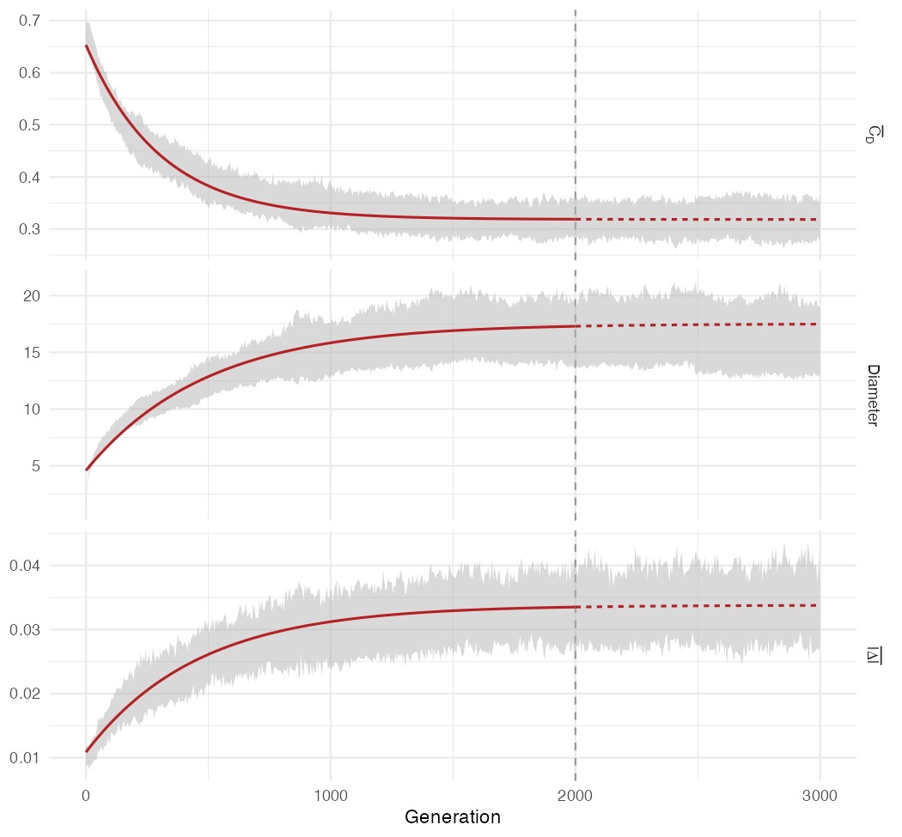

*Fig_IsotropicBaseline*: Structural stability of Population Graphs under symmetric (isotropic) migration as depicted by degree centrality, $\bar{C}_D$, and graph diameter (following Dyer 2007), and by the mean absolute asymmetry index, $\overline{|\Delta_{ij}|}$, for the isotropic replicates. The background shading represents the empirical $\pm$ 1 standard deviation from the simulated data. The red line is an exponential approach to equilibrium, $y = y_\infty + (y_0 - y_\infty)e^{-t/\tau}$, fit to the burn-in period; it is extended as a dashed line to show its projection across the isotropic phase (n.b., the vertical dashed line represents the end of the ‘burn-in’ period).

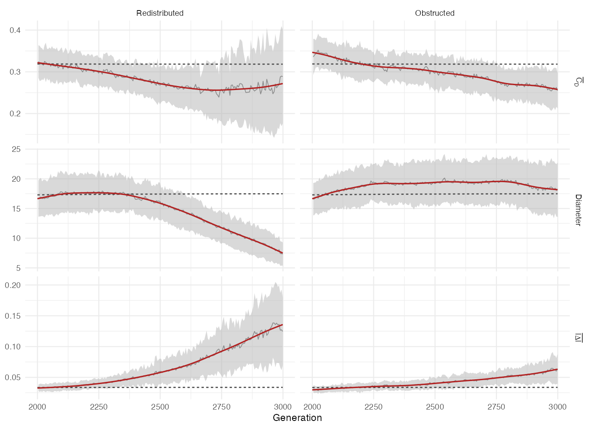

*Fig_ScenarioComparison*: Forward-phase (generations 2000–2999) trends in graph structure and asymmetry magnitude under the redistributed (left) and obstructed (right) scenarios, on shared axes for direct comparison—mean degree centrality ($\bar{C}_D$), graph diameter, and mean absolute asymmetry ($\overline{|\Delta_{ij}|}$)—mirroring Fig_IsotropicBaseline. The dashed line is the isotropic burn-in's fitted exponential-equilibrium curve, extrapolated across the forward phase, as the null reference; the shaded band is the empirical $\pm$1 SD across replicates and the solid red line is a fitted trend (a penalized regression spline; see Results for the fitting rationale, Supplementary Materials for diagnostics). Diameter shows the clearest contrast: redistributed stays near the isotropic level before collapsing sharply after about generation 2350, while obstructed rises well above it, holds, and only eases slightly after generation 2800 — a qualitatively different trajectory, not simply a slower version of the same collapse.

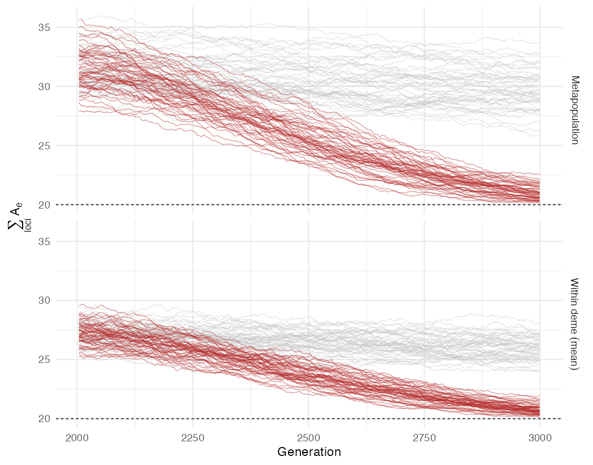

*Fig_LineageDiversity*: Loss of genetic diversity in independent redistributed lineages, measured as the sum across all 20 loci of the effective number of alleles, $\sum A_e$, for the metapopulation (top) and averaged within demes (bottom). Each red line is one redistributed replicate; grey lines are the isotropic replicates. The dashed line ($\sum A_e = 20$) marks fixation at every locus. The difference between the two panels is the among-deme component of diversity from which the Population Graph is estimated.

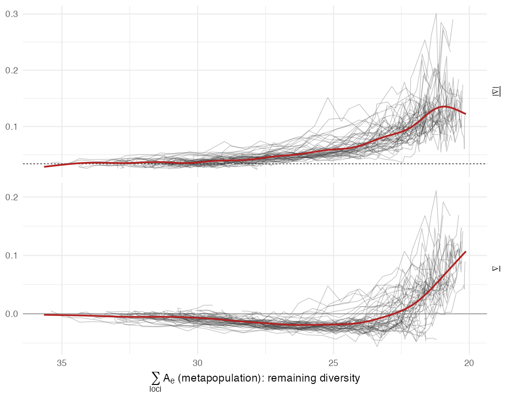

*Fig_LineageClock*: Asymmetry plotted against each lineage's own remaining diversity rather than generation, so that replicates are compared at equivalent genetic states. Mean absolute (top) and signed (bottom) asymmetry index for each redistributed replicate (faint lines, 25-generation windows) against its metapopulation $\sum A_e$. The red line is a penalized-spline trend across replicates, and the dashed line is the isotropic plateau of $\overline{|\Delta_{ij}|}$ (Fig_IsotropicBaseline).

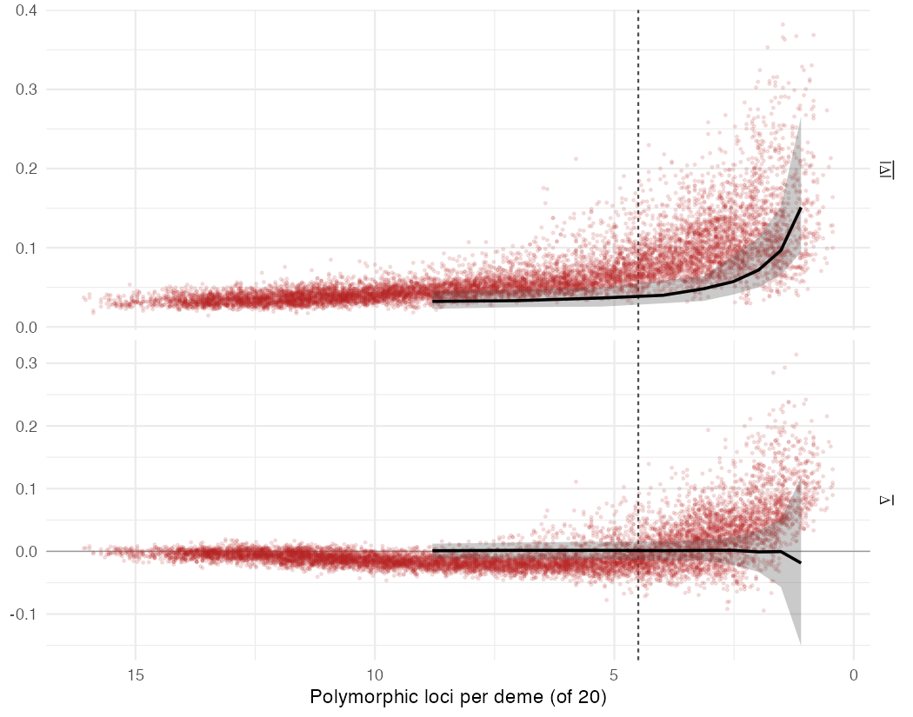

*Fig_InformationNull*: Directional signal versus information loss. Mean absolute (top) and signed (bottom) asymmetry index for every redistributed snapshot (points) against the mean number of loci polymorphic within demes. The black line and band are the median and 90% range for isotropic graphs rebuilt from random subsets of polymorphic loci—the values expected from information content alone. The vertical dashed line marks the informative horizon (4.5 polymorphic loci per deme), below which information loss alone inflates $\overline{|\Delta_{ij}|}$ by more than 10%.

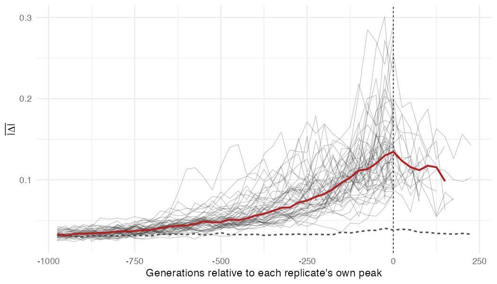

*Fig_PeakAlignment*: Redistributed lineages rise to a peak in mean absolute asymmetry, $\overline{|\Delta_{ij}|}$, and then decline. Each faint line is one replicate (25-generation windows), aligned at the peak of a penalized spline fit to that replicate's trajectory (vertical dashed line). The red line is the median across replicates, shown where at least five replicates contribute. The dashed grey line applies the same alignment to the isotropic replicates, whose $\overline{|\Delta_{ij}|}$ is stationary, and shows the rise and fall produced by the alignment procedure alone.

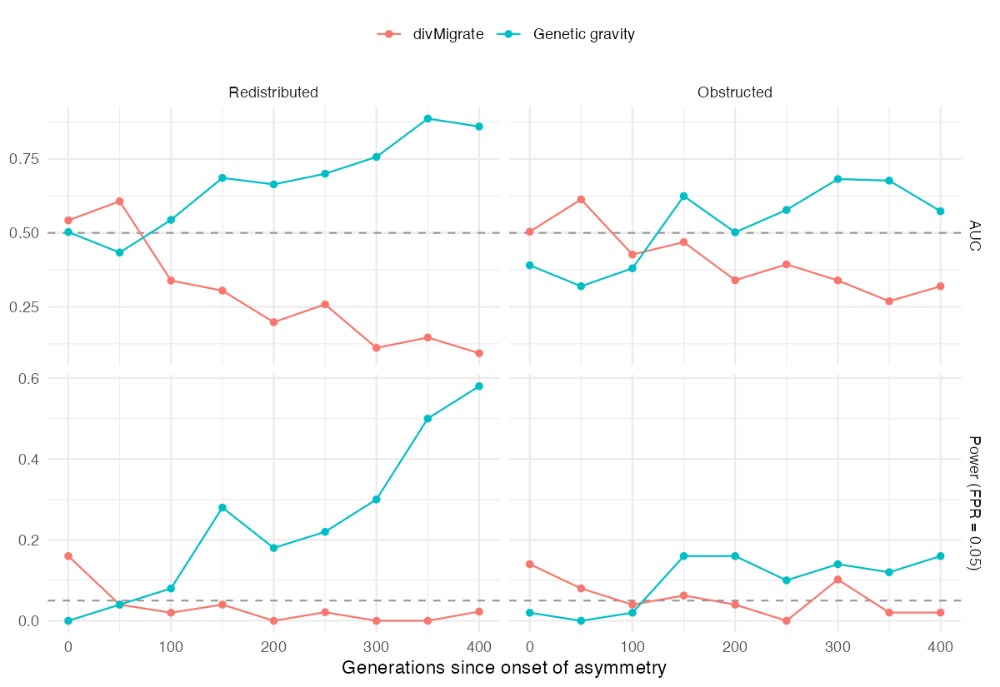
*Fig_DivMigrateSensitivity:* Single-snapshot sensitivity of the two indices over the generations following the onset of asymmetry, treating each replicate as an independent trial scored against the isotropic null. Top row: rank-based AUC (separation of asymmetric from symmetric replicates; dashed line is the AUC = 0.5 no-discrimination null). Bottom row: power — the fraction of asymmetric replicates detected at a fixed 5% false-positive rate (dashed line at 0.05 is the chance rate). Columns are the two asymmetric scenarios. The window is restricted to the first \~400 generations, where the gravity curves rise toward their plateau and before the divMigrate fixation artifact (see below) sets in. divMigrate’s AUC sits at or below the 0.5 no-information line throughout, indicating that its asymmetry magnitude does not separate asymmetric from symmetric replicates.

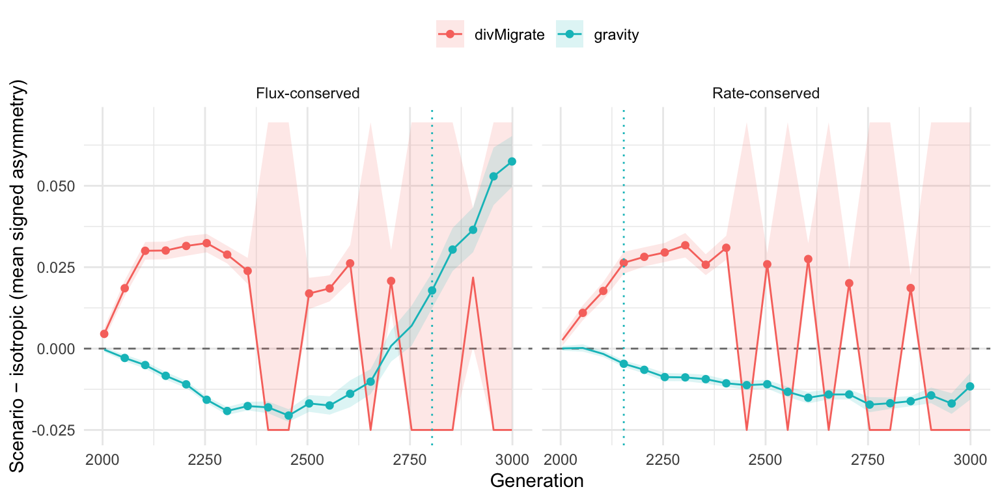
*Fig_DivMigrateTimecourse:* Descriptive view of the raw signal underlying the sensitivity analysis (Fig_DivMigrateSensitivity). Each curve is the across-replicate mean (± 1 SE) of the per-replicate difference between an asymmetric scenario and its paired isotropic value, in mean signed edge asymmetry, over the forward phase; the dashed line at zero is the symmetric-migration null. Filled points mark generations at which the paired difference is significant at α = 0.05; the vertical rule marks each method’s first sustained-significant generation, shown for reference only. Panels are the two asymmetric scenarios. The y-axis is winsorized at the gravity-index 1st/99th-percentile range (approximately ±0.07): a subset of divMigrate values at late generations exceed this range by many orders of magnitude due to a numerical artifact — strong directional drift drives near-complete allele fixation in some replicates, collapsing Jost’s D\_max toward zero and causing divMigrate’s relative-migration normalization ($m=1-D/D_{max}$) to blow up; the gravity index, which derives from the conditional graph topology rather than from pairwise differentiation, is unaffected.

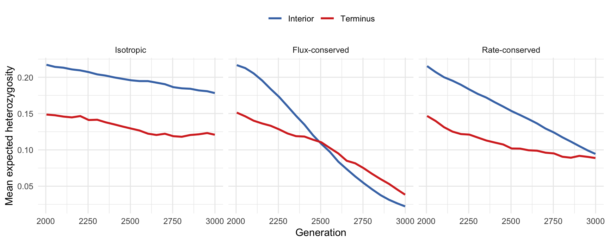
*Fig_BoundaryDiversity:* Expected heterozygosity at the chain termini versus the interior over the forward phase, by scenario (mean across replicates and populations within each class). Termini exchange with a single neighbor and thus receive roughly half the immigrant input of an interior deme; they lose variation faster, and fastest under obstructed connectivity, where lower total migration compounds peripheral isolation.

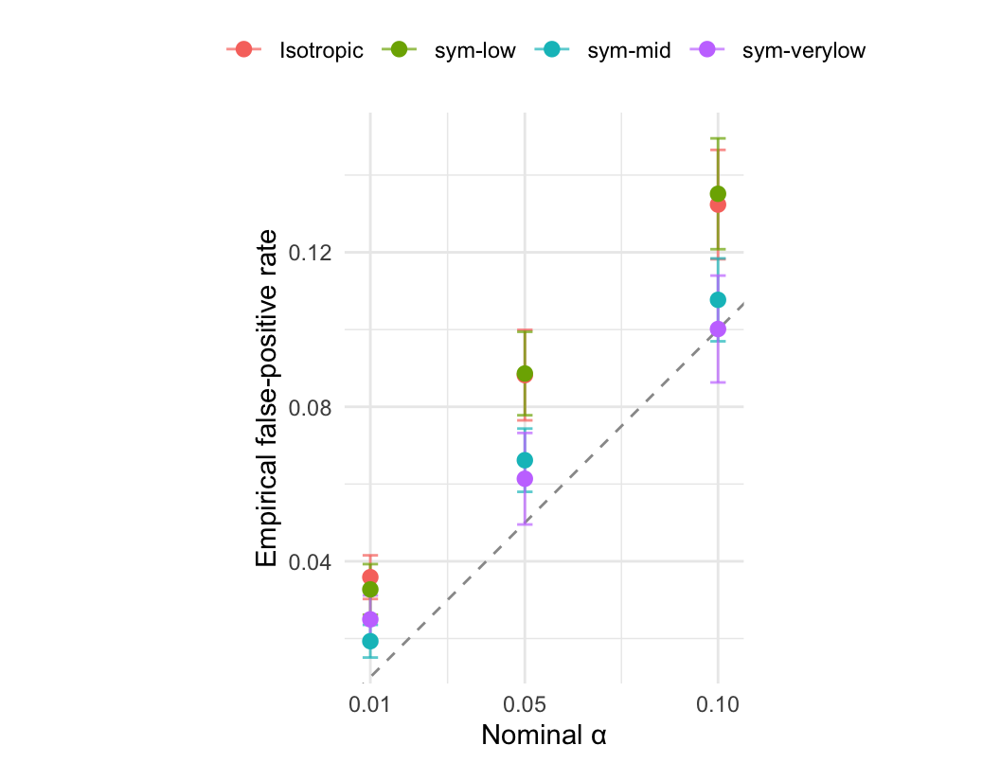
*Fig_FPRCalibration:* Observed versus nominal false-positive rate for the Location test across the symmetric gradient. Points are the mean empirical edge-level FPR (± 1 SE over sampled snapshots) at each nominal α, coloured by scenario (increasing neutral differentiation). The dashed line is perfect calibration (observed = nominal). The scenarios cluster at a common height at each α rather than climbing with differentiation (the false-positive rate is invariant to drift-mediated differentiation) while sitting modestly above the diagonal by a differentiation-independent offset.

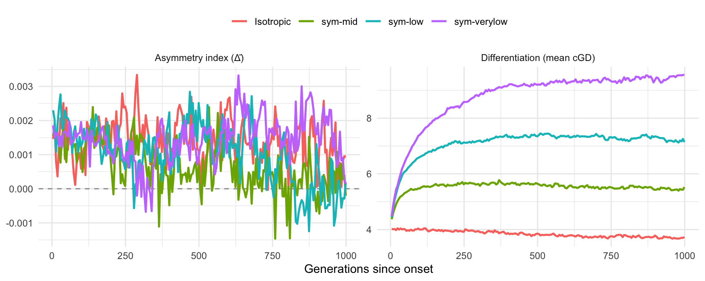
*Fig_StreamCScissors:* Specificity ‘scissors’ across the symmetric differentiation gradient. Left: neutral differentiation (mean conditional genetic distance) rises as per-direction migration falls and drift dominates. Right: the mean asymmetry index stays pinned at the isotropic null (dashed line at zero) over the same gradient. Symmetric migration raises the amount of structure but imposes no direction, so the index does not move.

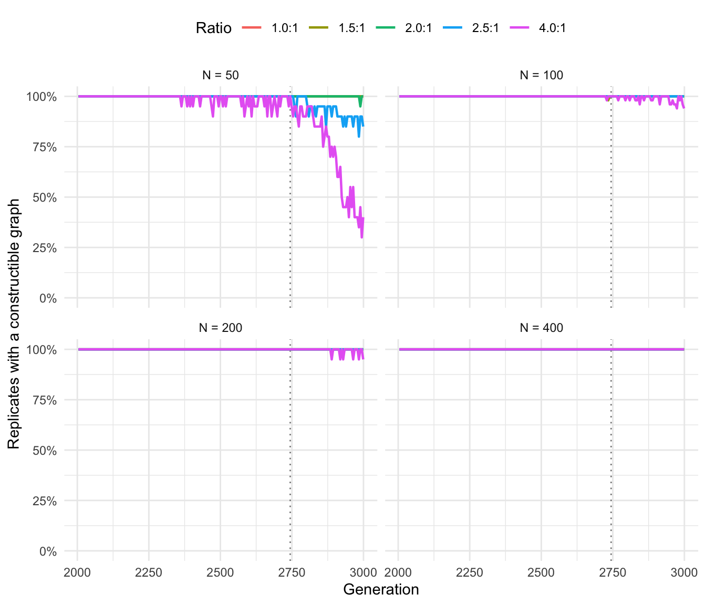
*Fig_ConstructionSurvival:* Graph-construction survival across the forward window. Each line shows the percentage of replicates that yield a constructible Population Graph at each census generation, for alternative migration ratios and population sizes. For every N \>= 100, the graph is constructible for all replicates throughout the window; only at N = 50 does drift-driven fixation erode constructibility—earliest and most severely at the steepest (4:1) ratio. The dotted vertical line marks the latest generation at which every cell is still fully constructible (the common pre-fixation horizon).

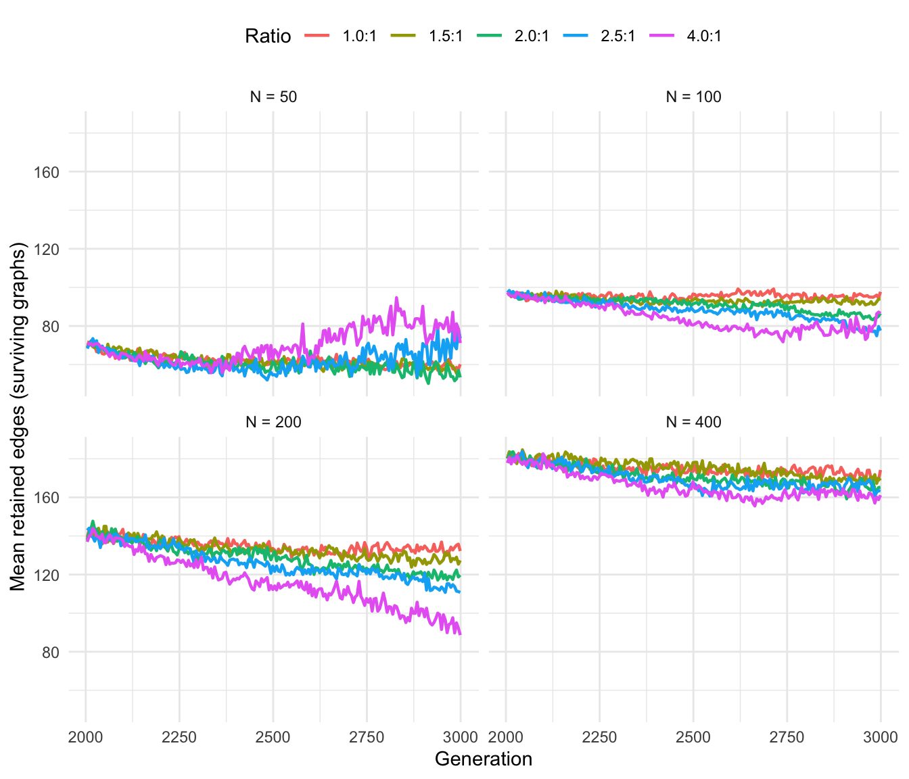
*Fig_ConstructionErosion:* Erosion of the Population Graph approaching construction failure: mean retained edges among the surviving graphs, by migration ratio and population size. Each line ends at the last generation a graph could be built. Edge counts decline smoothly as drift removes conditional dependencies.

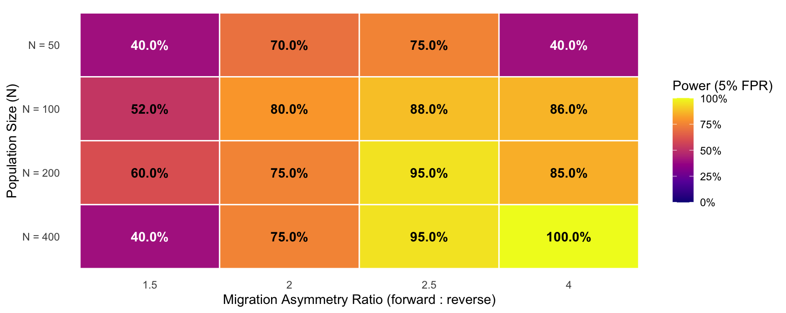
*Fig_StreamCPower:* Operating envelope of genetic gravity across the migration-ratio × $N_{e}$ grid. Cells show net single-snapshot power at a fixed 5% false-positive rate (matched symmetric null at each Ne), computed over all intended replicates. Graph-construction failures are counted as non-detections rather than dropped. Power increases with the migration asymmetry ratio and with population size; at N = 50, graph-construction failure under strong drift limits the attainable power irrespective of signal strength.
