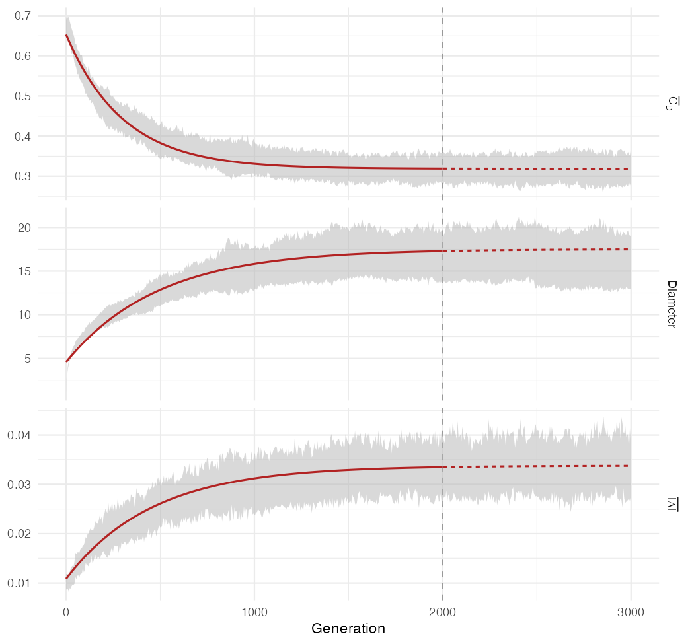
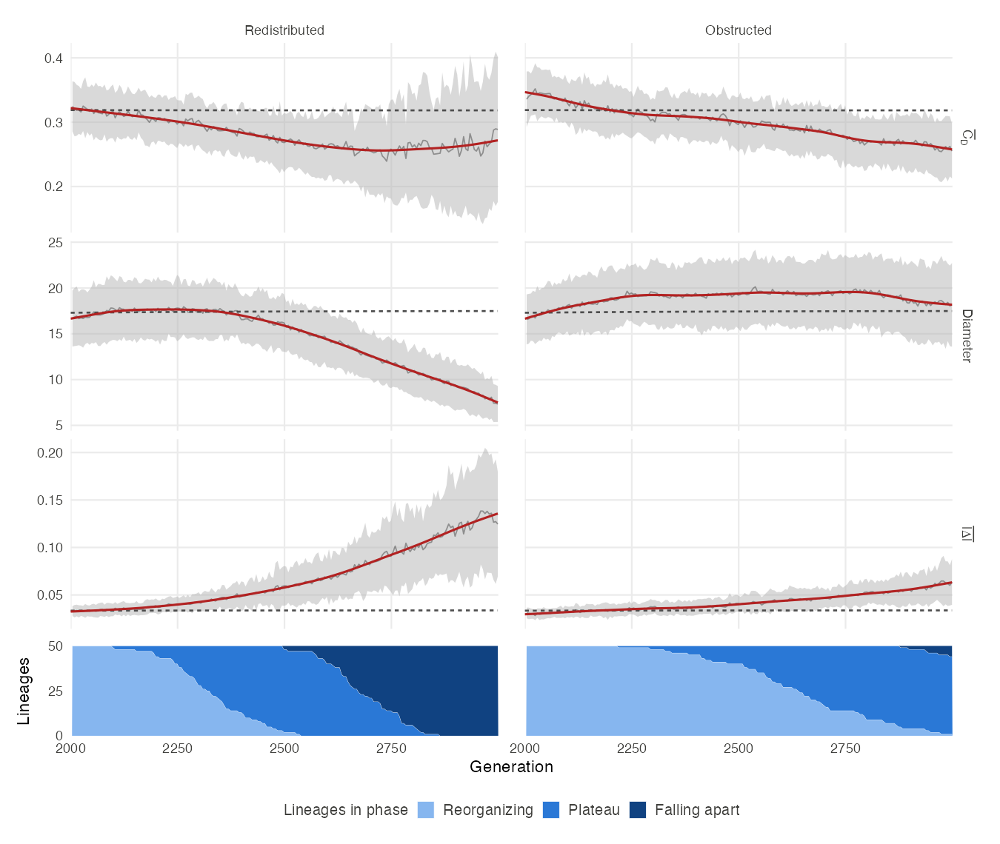
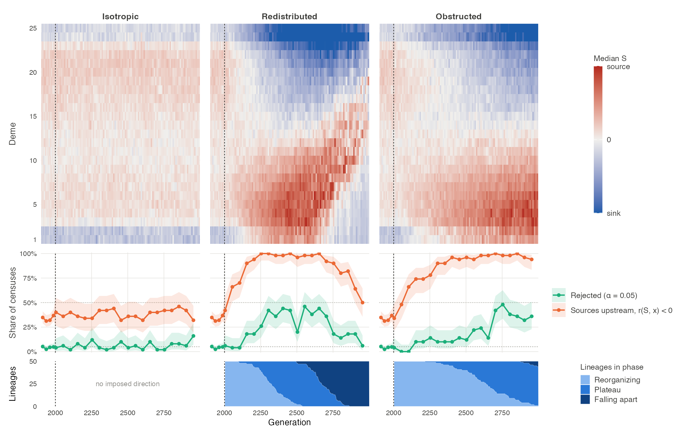
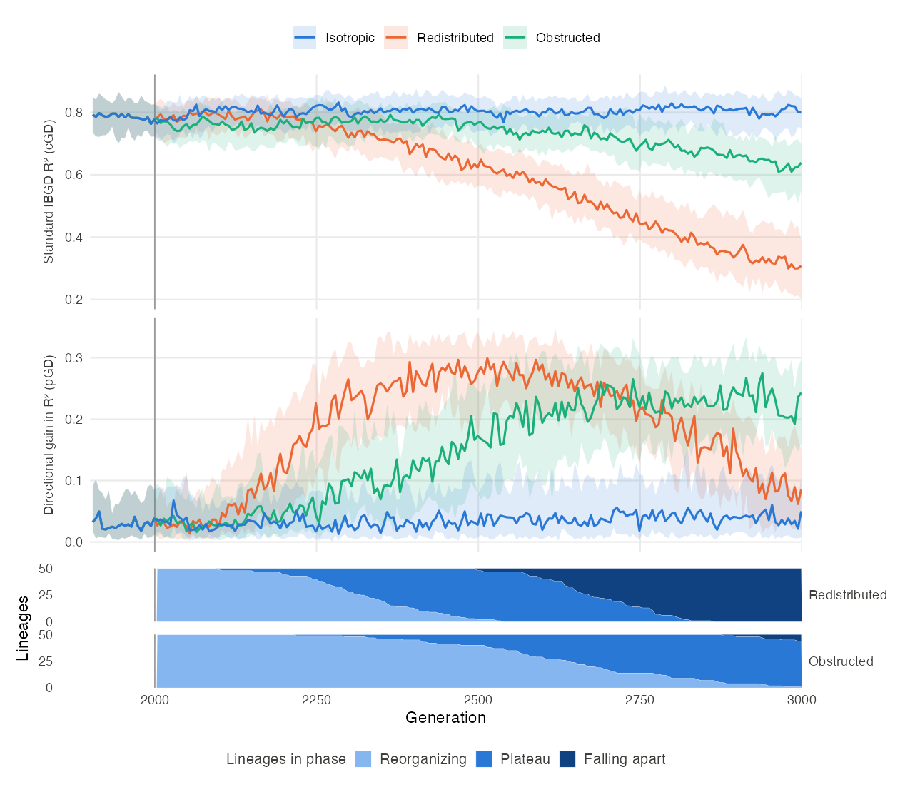
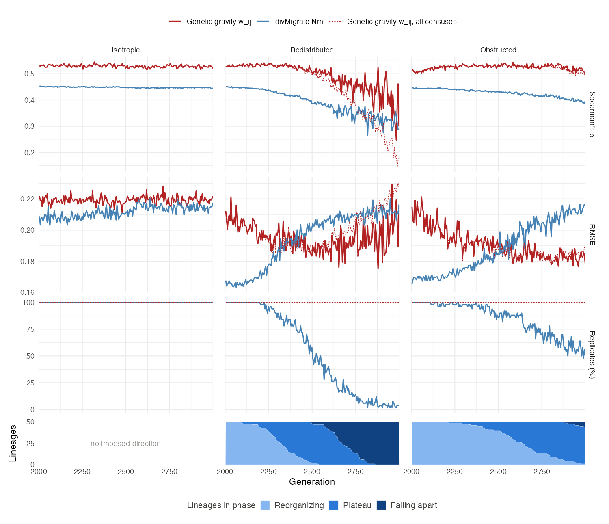

# Genetic Gravity I: Extracting Directional Gene Flow from Population Graphs

Rodney J. Dyer  
rjdyer@vcu.edu  
https://rodneydyer.com

[School of Life Sciences and Sustainability](https://slss.vcu.edu)  
[Virginia Commonwealth University](https://vcu.edu)  
Richmond, Virginia 23284

# Abstract

> Inferring the directionality of gene flow from genetic data is a long-standing goal in evolutionary and landscape genetics, yet the measures most commonly employed—$F_{ST}$, pairwise genetic distances, and model-based migration rates—are either explicitly symmetric or depend on equilibrium assumptions routinely violated in the colonizing, fragmenting, and environmentally filtered systems where directional flow matters most. Population Graphs (Dyer & Nason, 2004) recover the multivariate, conditional structure of genetic covariance as an undirected topology but do not, in canonical form, direct their edges. Here I introduce *genetic gravity*, a node-centric framework that converts a Population Graph’s undirected skeleton into a signed field of directional influence: for every retained edge, a pair of neighbourhood weights $w_{j\mid i}$ and $w_{i\mid j}$ is derived from a Gaussian kernel over conditional genetic distances with a node-specific local bandwidth $b_i$, and their difference, the gravity asymmetry $\Delta_{i\rightarrow j}$, partitions the edge into directed components with no new connectivity and no free tuning parameter. Summing the weight each population holds in its neighbours' neighbourhoods gives its *gravity*, and a single source–sink score per population, fit to every edge at once, maps which populations act as genetic sources and which as sinks. Using individual-based simulations of a 25-deme stepping-stone metapopulation under symmetric and asymmetric migration, I follow each lineage through its *ascent* under a new migration regime, a *plateau*, and *decay*, when the loss of polymorphism erases the among-population variance from which any method must read migration. On the *plateau* the source–sink score placed the sources upstream in every lineage. A gradient test on that score, calibrated by a spectral null built on the Population Graph itself (a better null basis than the true landscape adjacency), rejected in 30–40% of single snapshots while holding a 3.6–6.0% false-positive rate under symmetric migration, however much neutral differentiation accumulated. A comparison of directional and symmetric isolation-by-graph-distance models detected asymmetry more often (54–67%) but became anti-conservative (about 14%) when drift dominated. Power depended on the kernel: node-local or sharper bandwidths retained it, flatter or global ones lost it. Against the known migration matrix, the neighbourhood weights identified which populations exchange migrants better than the differentiation-based estimator `divMigrate`, which oriented individual corridors better while it remained defined but became undefined within the *plateau*, before the Population Graph lost information. Genetic gravity offers a topology-derived, equilibrium-free measure of directional connectivity from a single snapshot of genotypes. All analyses are implemented in the gstudio R package.

# Introduction

Inferring the pattern and direction of genetic connectivity from molecular data is a central problem in evolutionary, population, and landscape genetics (Slatkin, 1985; Dyer, 2015).  The distribution of population genetic covariance we see today is the result of overlapping evolutionary processes—stochastic, neutral, and adaptive.  A common approach to elucidating the relative importance of these processes is to partition genetic variance into within- and among-stratum components using Wright’s $F_{ST}$ (or one of its many derivatives).  Applying an underlying evolutionary model then allows us to compute the expected values of evolutionarily relevant parameters, such as migration rate (*m*; Slatkin 1981, 1993), genetic effective population size ($N_e$; Wright 1931), inbreeding ($F_{IS}$; Wright 1965, Weir and Cockerham 1984), and others.  This process raises several specific challenges to using the current distribution of genetic variation to infer historical processes.  First, the relationship between a standardized parameter estimated and the stratigraphy of evolutionary and demographic histories that produced the set of sampled alleles and genotypes is non-reversible—the same ratio of within- and among-stratum variances can arise from completely non-overlapping demographic and evolutionary histories.   Second, treating connectivity as a scalar, undirected quantity is analytically convenient, but it homogenizes the varied histories of interactions that created these systems by taking an ‘average across generations under equilibrium conditions’ rather than directly embracing the potential for spatial and temporal heterogeneity within populations.  Estimating the effective number of migrants per generation, *Nem*, is critical for comparative inferences, but may be too coarse when the analytical questions focus on more intricate demographic processes or when attempting to include more granular landscape, demographic, or ecological features that may affect standing genetic structure.  Questions focusing on understanding how genetic structure is affected by colonization, range expansion, source–sink dynamics, wind- or water-mediated dispersal, and environmentally filtered gene flow benefit from approaches that are more fine-grained than a single summarizing parameter, as these inter-strata interactions are heterogeneous and fundamentally *directional* in nature (Baker & Dyer, 2011; Wogan et al., 2024).

The field is not, of course, without tools for addressing questions such as these, and an increasingly sophisticated set of approaches is available for estimating heterogeneity in connectivity and asymmetric gene flow from genetic data. Assignment-based tools such as `BayesAss` infer recent, directional migration rates from multilocus genotypes under linkage and Hardy–Weinberg assumptions (Wilson & Rannala, 2003), while coalescent and isolation-with-migration frameworks recover asymmetric long-term migration matrices, either by direct likelihood over genealogies (Beerli & Felsenstein, 2001) or by fitting the joint site-frequency spectrum of a few populations (e.g., Gutenkunst et al., 2009). Where the question is specifically the direction of a range expansion, the directionality index $\psi$ reads the origin and axis of spread from pairwise allele-frequency asymmetries (Peter & Slatkin, 2013). At the landscape scale, effective-migration-surface methods map spatial heterogeneity in gene flow (Marcus et al., 2021; Petkova et al., 2016), and recent extensions of that family relax their symmetry assumption to render the surface directional. Each of these is powerful within its domain, but each also exacts a characteristic cost: a prespecified demographic or spatial model, an assumption of migration–drift equilibrium, genome-scale marker panels, a small number of demes, explicit spatial coordinates, or substantial computational resources. This manuscript provides a lightweight, assumption-free summary of *directional structure* that can be read directly from the multivariate covariance dependency topology and scales to many populations from a single snapshot. The framework extended herein is intended to fill this niche by using conditional genetic covariance structures, as represented within Population Graphs (Dyer & Nason, 2004; Dyer, 2007, 2015), to identify and quantify asymmetry in population migration.

Population Graphs offer a partial escape from the symmetry assumption using multilocus conditional genetic covariance within a graph-theoretic model. Rather than estimating a single pairwise statistic that describes the average among-stratum variance structure, the Population Graph framework translates the among-stratum variance into a weighted network of connectivity using conditional genetic covariance.  Population Graphs are distinct from pairwise structure or genetic distance analyses in one important way.  Pairwise approaches focus on estimates from each combinatorial pair of strata and, for example, reconstruct a relationship with pairwise distance (such as Slatkin’s $\hat{M}$ 19XX) to estimate isolation.  Conversely, estimates of stratum-to-stratum covariance in a Population Graph are based on the multilocus covariance between the two populations in question, statistically conditional on their covariance structures with the remaining populations in the analysis.  This resulting covariance topology captures dependencies that pairwise measures obscure. Moreover, the networks shape is diagnostic of the evolutionary processes that produced it—range expansions, vicariance, and equilibrium isolation-by-distance each leave characteristic signatures in node degree, edge length, and network diameter (Dyer, 2007, 2015). Population Graphs have been used to address questions of connectivity and structure in a broad range of scenarios including landscape genetics (Daniel et al., 2024; Dyer, 2015), conservation planning (Vilaça et al., 2024), biogeography (Wogan et al., 2024), life-history effects (Reed et al., 2023), invasive species management (Baker & Dyer, 2011), and pollen-mediated gene flow (Dileo et al., 2014; Dyer et al., 2004; Smouse et al., 2001).

The edges in a Population Graph are weighted estimates of conditional inter-population covariance: the conditional covariance $e_{ij}$ is a scalar, and the overall genetic covariance topology produced by the approach is, by definition, undirected.  Both source and sink populations may share a strong conditional dependency, but the *direction* of that dependency—who is overwriting whose allele frequencies—is a biologically distinct question that cannot be read directly from the undirected edge any more easily than it can be addressed with pairwise structure statistics. The same edge weight can be produced by a stable, symmetric exchange and by a unidirectional colonization pulse, yet the evolutionary implications are opposite, and in most cases, the actual inference of highest practical interest to the researcher.

Here, I introduce the concept of *genetic gravity*, an extension of the topology of the classic Population Graph that creates a node-centric framework for extracting directional information from an otherwise undirected Population Graph.  The goal here is to determine whether the conditional genetic structure encoded in the Population Graph topology itself can be used to partition symmetric covariance into asymmetric components, without invoking any new population-genetic model or incorporating additional outside information.  To this end,I begin by formalizing the notion of genetic-gravity deriving a pair of directional weights ($w_{j\mid i}$ and $w_{i\mid j}$) for each edge ($e_{ij}$) to define an asymmetry index, $\Delta_{i\rightarrow j}$, associated with each edge, and aggregate those edges into a population-level gravity and a source–sink score that orders populations from genetic sources to sinks.  For this, I introduce a node-local Gaussian kernel approach whose bandwidth is read directly from the Population Graph.  Second, I characterize their behavior under stochastic models of symmetric and asymmetric connectivity. I validate the framework with stochastic individual-based simulations under three migration scenarios—*Symmetric*, *Redistributed* and *Obstructed*—tracking both the canonical undirected Population Graph metrics and their directed counterparts derived from genetic gravity, as well as a mean asymmetry index $\bar{\Delta}$. Next, I characterize the temporal dynamics and detectability of the directional signal against a within-replicate empirical null, following each replicate lineage through its own phases rather than pooling lineages by generation, and introduce two single-graph tests for directional gene flow: a source–sink gradient test on population-level gravity, and a comparison of directional against symmetric isolation-by-graph-distance models.  Finally, I benchmark the asymmetry index against an existing approach suitable for the kinds of data found in the simulations using `divMigrate`, a widely used differentiation-based estimator of directional relative migration (Sundqvist et al., 2016).  The two methods estimate different quantities, so the comparison asks only which better approximates the true migration matrix used in the simulations, and in which phase of a lineage's history each can still be relied on.  All simulation routines and analysis functions have been implemented in the `gstudio` R package maintained by the author and are freely available. Although the simulations and worked examples here use simple spatial position along a one-dimensional stepping stone, neither test is tied to Euclidean geography: substituting a resistance-based or other ecological distance for the spatial separation used throughout is a direct extension of the framework to the kinds of landscape-genetic questions Population Graphs are already well suited to (Dyer, 2015).
# Methods
The directional framework proposed here assumes that a Population Graph has already been constructed from multilocus genetic data; the relevant inputs are the symmetric edge weights $e_{ij}$ and the adjacency structure of the graph $G=\{V,E\}$ retained by the construction of this Markov independence graph. Notation follows Dyer & Nason (2004).

A Population Graph is a Markov independence graph, and three of its Markov properties bear on the development of asymmetry models. The first, the *global* Markov property, concerns graph separation. Any pair of populations *directly* connected in the topology (e.g., $A\leftrightarrow B$, denoted by the edge $e_{AB}$) are, by definition, not genetically independent. Evolutionary processes that lead to conditional dependence include ongoing genetic connectivity or recent divergence from a common ancestral population; cessation of connectivity allows genetic drift and other processes to lead populations towards genetic independence. If populations are connected only *through* one or more other populations, in a stepwise fashion (e.g., $A\leftrightarrow B\leftrightarrow C$), populations not directly connected (such as $A$ and $C$) are conditionally independent, such that $P(A,C\mid B)=P(A\mid B)P(C\mid B)$.

Second, under the *pairwise* Markov property any two non-adjacent populations are genetically independent conditional on *all other populations* in the topology. If a sampling population is added or removed from the data set, the entire topology must be re-evaluated, because the presence or absence of each edge depends on *all the data simultaneously*, not just the populations attached to that edge. This distinguishes Population Graphs from the pairwise structure estimators commonly used in evolutionary, landscape, and population genetic analyses. Third, under the *local* Markov property each population is independent of all others in the topology *given its* direct neighbors. Biologically, an edge therefore reflects a direct relationship between two populations *given the populations sampled*, not one routed through any other sampled population—the property that matters when a directional signal is attributed to a particular corridor of gene flow.

Each symmetric edge in a Population Graph is the pooled product of two conditional relationships: the contribution of population $j$ to the genetic structure of $i$, and the symmetric and opposite contribution of $i$ to $j$. The edge weight, $e_{ij}$, has been used as a measure of conditional genetic distance (cGD) to infer isolation by graph distance (Dyer 2015; Miles et al. 2018).

## The Model of Genetic Gravity
Focusing on each target node and its collection of neighboring edges ($N(i)$), I define a *neighbourhood weight*, $w_{j\mid i}$, as $j$'s weight in $i$'s neighbourhood: the conditional probability that $j$ is the most influential neighbor of $i$ given the other nodes in $N(i)$, using a Gaussian Stochastic Neighbor Embedding (Gaussian SNE; Hinton & Roweis, 2002) approach where:

$$
w_{j\mid i}= \frac{exp\left({- e_{ij}^{2}/2b_i^{2}}\right)}{\sum\limits_{k\in N(i)}^{}exp\left({- e_{ik}^{2}/2b_i^{2}}\right)}
$$

where $e_{ij}$ is the symmetric conditional-covariance edge weight from the Population Graph (the conditional genetic distance, cGD) and $b_{i}$ is a node-specific *local bandwidth* parameter. The kernel is strictly local: only retained neighboring nodes, $j\in N(i)$, contribute to the denominator, so nodes that are conditionally independent of $i$ in $G$ (those beyond its first-degree neighbors) contribute nothing, by the Markov properties above. The bandwidth $b_{i}$ controls the rate at which the kernel decays with distance: a large $b_{i}$ spreads weight broadly across the neighborhood, while a small $b_{i}$ concentrates it on the nearest neighbor. A node whose retained neighbors are genetically more divergent, whether because it bridges differentiated clusters in the connectivity network or because it lies at an end of a linear stepping stone, receives a broad kernel that distributes its neighbourhood weight over that extended neighborhood. Conversely, a node embedded in a tight cluster of genetically similar populations receives a narrow kernel that concentrates its weight on its closest retained neighbors.

The local bandwidth is set to the mean edge weight over node $i$'s retained neighborhood:
$$
b_{i} = \frac{s_{i}}{k_{i}} = \frac{1}{k_{i}}\sum\limits_{j\in N(i)}^{}e_{ij}
$$
where $s_{i}=\sum_{j\in N(i)}e_{ij}$ is the *strength* (weighted degree) of node $i$ and $k_i$ its degree.

Every edge is read from both of its ends: $w_{j\mid i}$ from $i$'s neighbourhood with bandwidth $b_i$, and, symmetrically, $w_{i\mid j}$ from $j$'s neighbourhood with bandwidth $b_j$. Because the two neighbourhoods differ, the two weights generally differ, and their signed difference defines a local, edge-specific direction,
$$
\Delta_{i\rightarrow j} = w_{i\mid j}-w_{j\mid i},
$$
the *gravity asymmetry* along the edge—$i$'s pull on $j$ minus $j$'s pull on $i$. Positive $\Delta_{i\rightarrow j}$ means $i$ holds more weight in $j$'s neighbourhood than $j$ holds in $i$'s: $j$'s kernel points more strongly back at $i$ than the reverse, marking $i$ as the genetic source and $j$ as the sink. The asymmetry does not come from the edge itself but from the two *neighbourhoods the edge is compared against*. The local bandwidth $b_{i}$ is node $i$'s native genetic-distance scale, and $w_{j\mid i}$ measures how near edge $(i,j)$ is *relative to that scale*. The same edge weight $e_{ij}$ therefore reads as relatively near from $i$'s side when $b_i$ is large (when $i$'s other neighbours are, on average, farther away) and relatively far from $j$'s side when $b_j$ is small, and $\Delta_{i\rightarrow j}$ records whether the edge is more typical of $i$'s local scale or of $j$'s. Bandwidth contrast alone is not a reliable guide to which population is the source; direction should be read from $\Delta_{i\rightarrow j}$ itself (Supplementary Materials).

A value of $\Delta_{i\rightarrow j}$ near zero indicates balanced exchange between the two populations, as expected under symmetric migration. A large $|\Delta_{i\rightarrow j}|$ indicates a strongly directional edge, and its sign gives the direction. Throughout, higher values mean more of a source: this holds for $\Delta_{i\rightarrow j}$ and for every population-level quantity built from it below, and no asymmetry or population-level score in the paper carries the opposite sign. The one directional quantity that reads the other way is the partitioned distance pGD (below): because it is a distance, it is shorter in the direction of gene flow.

Because $b_i$ scales with the edge weights, rescaling every conditional distance by a constant $c>0$ leaves each exponent $e_{ij}^2/2b_i^2$, and therefore every $w_{j\mid i}$ and $\Delta_{i\rightarrow j}$, unchanged. The index measures relative directional imbalance rather than absolute differentiation, so graphs built from marker panels with very different overall divergence can be compared directly.

The Population Graph topology is derived from the conditional covariance structure of all populations together and determines both the placement and the magnitude of every edge (Dyer & Nason, 2004). The edge-level asymmetry $\Delta_{i\rightarrow j}$, although defined on a single edge, is estimated from both of its nodes and their immediate neighbours, so edges sharing a population are not independent. Direction therefore accumulates at the population level, where I define the *gravity* of population $i$:
$$
g_{i} = \sum\limits_{j\in N(i)}^{} w_{i\mid j}
$$
the total weight $i$ holds in its neighbours' neighbourhoods. Because each population's own neighbourhood weights ($w_{j\mid i}$ over $j\in N(i)$) sum to 1 by construction, gravity is conserved across the graph: $\sum_{i} g_{i}=K$ for any Population Graph without isolated populations. The *source–sink balance*, $g_{i}-1$, therefore sums to zero over the graph whatever the underlying migration matrix—every population that reads as a source is balanced by populations that read as sinks. A population sits at $g_{i}=1$ when it holds exactly as much weight in its neighbours' neighbourhoods as it gives them in its own; $g_{i}-1$ is positive for a source and negative for a sink. Individual populations can depart from 1 through degree alone, even under symmetric migration (the topological floor, below).

"Source" and "sink" here are genetic, not demographic. A genetic source is a population whose allele frequencies its neighbours have been pulled toward, read from standing conditional genetic structure; it is not a count of migrants, and it is distinct from the demographic sense of Pulliam (1988), in which a sink is a population with $\lambda<1$ maintained by immigration. Low gravity is not by itself proof of immigration: an isolated, strongly drifted population can read as a sink for the same reason a true recipient does, because "sink" means weak genetic gravity, which directional immigration produces but isolation can mimic. A low score is best interpreted alongside within-population diversity.

*Source-Sink Scores:* summarizes each population separately; the *source–sink score*, $S$, places all populations on a single directional scale. $S$ assigns each population the value whose pairwise differences best reproduce the gravity asymmetries along every retained edge at once,
$$
\hat{S}=\arg\min_{S}\sum_{(i,j)\in E}\left[\Delta_{i\rightarrow j}-(S_i-S_j)\right]^2, \qquad \sum_{i}S_i=0 \text{ within each connected component},
$$
so that $S_i-S_j\approx\Delta_{i\rightarrow j}$. A high $S$ marks a source and a low $S$ a sink. $S$ is the quantity mapped onto geography and tested against a hypothesized covariate; its computation and properties are given in the Supplementary Materials.

### Partitioned Conditional Genetic Distance, pGD

The same two neighbourhood weights that define $\Delta_{i\rightarrow j}$ also let the edge's conditional genetic distance itself be split into relative directional components. Partitioning $e_{ij}$ in proportion to $w_{j\mid i}$ and $w_{i\mid j}$ yields a *partitioned conditional genetic distance* (pGD): $p_{ij} = e_{ij}\,w_{j\mid i}/(w_{j\mid i}+w_{i\mid j})$, and correspondingly $p_{ji} = e_{ij}\,w_{i\mid j}/(w_{j\mid i}+w_{i\mid j})$, so that $p_{ij}+p_{ji}=e_{ij}$, with $p_{ij}=p_{ji}=e_{ij}/2$ under symmetric connectivity. Because pGD is a distance, its direction reads opposite to the source–sink convention: when $i$ is a source for $j$ ($\Delta_{i\rightarrow j}>0$, so $w_{i\mid j}>w_{j\mid i}$), $p_{ij}<p_{ji}$—conditional distance is shorter in the direction of gene flow. Unlike $e_{ij}$ itself, which is symmetric by construction, pGD assigns each direction of an edge its own share of the symmetrical cGD, turning the Population Graph's otherwise-undirected edge set into a directed, asymmetrically-weighted graph over the same topology. Where this is relevant is that the Population Graph topology is often not the end result, but simply the input for downstream analyses such as spatial structure (e.g., isolation by graph distance, IBGD; Dyer and Nason 2004, Miles et al. 2018), ecological resistance modeling (Dyer 2015), range expansion processes (Baker and Dyer 2011),  pollination networks (DiLeo et al. 2014), etc.  Using pGD in place of cGD lets the researcher investigate asymmetry in these analyses.

### Bandwidth Sensitivity

Because the local bandwidth $b_{i}=s_{i}/k_{i}$ is itself a modeling choice, its sensitivity was assessed directly: $\Delta$ was recomputed on the forward-phase snapshots under four alternatives to this canonical local bandwidth—a fixed *global* bandwidth (a single scale, the mean retained edge weight, applied to every node), the local bandwidth *scaled* by $\frac{1}{2}$ and by $2$ (a sharper and a flatter kernel), and a *perplexity*-based per-node bandwidth (a tSNE-style $\sigma$ search)—and compared, edge by edge and at the graph-mean level, to the canonical estimator. The source–sink gradient test was also rerun under each alternative, recomputing $S$ with that bandwidth while keeping the test's null unchanged, on the same census grid used to evaluate the test (every 50 generations, 50 replicates per scenario), and its false-positive rate and power were summarized by each lineage's phase.

## Individual-based simulations
The behavior of genetic gravity was evaluated with individual-based stochastic simulations following Dyer (2007). Each replicate tracks a metapopulation of $K=25$ discrete demes, each of $N=100$ diploid individuals scored at $L=20$ independently segregating, codominant, biallelic loci. Replicates start from random allele frequencies; generations are non-overlapping, mating is random within demes, and mutation is excluded so that only migration and drift act. Migrants are drawn at random each generation according to the migration matrix. Every replicate first runs a 2,000-generation *burn-in* of symmetric migration in a one-dimensional stepping-stone model ($m_{i\rightarrow i+1}=m_{i\leftarrow i+1}=0.025$, where the pair is always ordered $(i,i{+}1)$ and the arrow gives forward or reverse flow). Dyer (2007) showed that graph-theoretic summaries such as mean degree centrality ($\bar{C}_D$) and graph diameter ($\bar{d}_G$) stabilize much sooner than population-genetic statistics such as multilocus structure ($\Phi_{ST}$) or isolation by distance ($\hat{M}$); both kinds of metric were checked for stability at the end of the *burn-in*, and $\bar{C}_D$ and $\bar{d}_G$ are reported alongside $\Delta_{i\rightarrow j}$ and $S$ for context. Fifty replicates were run. Multilocus genotypes were saved every five generations, and each snapshot was converted into a Population Graph (Dyer & Nason 2004), from which the neighbourhood weights, gravity asymmetries, source–sink scores, edge density, diameter and mean cGD were recorded.

At generation 2000 each replicate was continued for a further 1,000 generations (2000–2999) under each of three scenarios (Tab_ScenarioParameters), so that all three share an identical history up to that point. *Symmetric* migration continued the symmetric *burn-in* matrix and serves, within each replicate, as the null trajectory against which the asymmetric scenarios are compared. *Redistributed* migration kept the total rate fixed ($m=0.05$) but split it 4:1 in one direction ($m_{i\rightarrow i+1}=0.04$; $m_{i\leftarrow i+1}=0.01$). *Obstructed* migration kept the forward rate of the *Symmetric* scenario ($m_{i\rightarrow i+1}=0.025$) but suppressed the reverse rate ($m_{i\leftarrow i+1}=0.01$). In both asymmetric scenarios the bias ran toward higher deme numbers at every link. Three further symmetric scenarios at progressively lower migration rates (sym-mid, sym-low and sym-verylow), which raise neutral differentiation without imposing a direction, were used only to calibrate false-positive rates (Supplementary Materials). Together they test a simple expectation: the difference between forward and reverse rates sets the direction and strength of the net force homogenizing the metapopulation, while total migration sets how quickly a lineage moves toward that state. *Obstructed* migration, with half the net bias of *Redistributed* migration (0.015 against 0.03) and lower total migration, should therefore pass through the same sequence of states more slowly.

*Tab_ScenarioParameters:* Post-*burn-in* migration parameters for the three simulation scenarios. All scenarios share an identical 2,000-generation symmetric *burn-in* before the treatment matrix is applied.

| Scenario      | $m_{i \rightarrow i+1}$ | $m_{i \leftarrow i+1}$ | $m_{Total}$ | Ratio | Constant               |
| ------------- | :---------------------: | :--------------------: | :---------: | :---: | ---------------------- |
| *Symmetric* |          0.025          |         0.025          |    0.050    |  1:1  | Symmetric connectivity |
| *Redistributed* |          0.040          |         0.010          |    0.050    |  4:1  | Total emigration rate  |
| *Obstructed*    |          0.025          |         0.010          |    0.035    | 2.5:1 | Forward rate           |

### Phases of the forward simulations

Each lineage passes through these phases at its own pace, so results for the asymmetric scenarios are reported by phase, with each lineage's censuses assigned to phases by boundaries read from its own genotypes, never from the Population Graph or any statistic under evaluation (Supplementary Materials). The *Symmetric* forward phase is reported as a whole.

*Burn-in* (generations 0–1999). Starting from random allele frequencies under a fixed, symmetric migration matrix, within- and among-population variance settle toward drift–migration balance. Its length is fixed, following Dyer (2007).

*Ascent*. The modified migration matrix applied at generation 2000 restructures among-population covariance, at a pace that depends on how genetic variation is distributed among demes in each lineage. Under directional migration, upstream demes receive fewer immigrants and lose heterozygosity faster, so within-deme $H_e$ comes to increase along the axis of flow. The slope of $H_e$ on deme position, smoothed within each lineage with a penalized spline ($k=10$), was used only to date this phase boundary—not as evidence of direction; *ascent* ends when a lineage's gradient has completed 90% of its rise from its own *burn-in* level.

*Plateau*. Once the covariance structure has adjusted to the new migration matrix, it changes only slowly while allele frequencies across demes continue to converge. The *plateau* has no marker of its own; it lasts until the loss of among-population variance begins to erode the ability to estimate structure, which marks the onset of *decay*.

*Decay*. In a closed migration–drift system without mutation, allele frequencies converge under any migration matrix: to the simple mean $\bar{p}$ when migration is symmetric, and to a mean weighted toward the upstream demes when it is directional. Migration does not stop as frequencies converge, but the among-population variance through which it is observed does. $F_{ST}=\sigma^2_p/\bar{p}(1-\bar{p})$ falls toward zero as populations homogenize, which the equilibrium relation $F_{ST}\approx 1/(4N_em+1)$ would read as unrestricted gene flow, and becomes undefined as loci fix; beyond that point migration cannot be identified from standing variation by any method that relies on among-population variance or covariance. *Decay* begins at the first census at which a lineage's demes carry, on average, fewer than 4.5 of the 20 loci polymorphic, the level below which information loss alone inflates the asymmetry index (Supplementary Materials).

## Significance Testing for Asymmetry

The presence and weight of each edge in a Population Graph are already tested during its construction (Dyer & Nason, 2004).  Initially, significance testing using graph permutation was explored (e.g., see Mills et al. 2018).  However, nulls that permute or resample parts of a single Population Graph were consistently anti-conservative under symmetric migration, because $\Delta_{i\rightarrow j}$ and $S$ both inherit smooth, node-level structure from the graph's Markov topology (see Supplementary Materials for more on this).  Asymmetry was tested with two complementary procedures, a gradient test on the source–sink score $S$, and a comparison of directional (pGD) and symmetric (cGD) isolation-by-graph-distance models. 

### Source–sink gradient test

This test asks whether the source–sink scores of the populations change monotonically along a hypothesized covariate $x$, such as position along a suspected axis of flow, as expected if gene flow runs consistently in one direction along it. It is the natural first check: a rejection identifies both that a gradient exists and, from the sign of $S$ against $x$, which way it runs. The test statistic is Spearman's $r(S,x)$. Because high $S$ marks a source, $r(S,x)<0$ places the sources at low values of $x$ (upstream, when $x$ increases downstream) and $r(S,x)>0$ places them at high values. The null preserves $S$'s spectral power on the census's own Population Graph: Moran spectral randomization (`adespatial::msr`, "singleton" method) on the kernel-weighted adjacency $\exp(-e_{ij}^{2}/2\bar b^{2})$, where $\bar b$ is the mean retained edge weight, with $B=999$ randomizations, tested two-sided at $\alpha=0.05$. Because it reproduces the node-level smoothness that $S$ inherits from drift on the graph, a rejection reflects a gradient along the hypothesized covariate beyond what drift alone produces. Power was measured as the rejection rate on the same census grid under the *Redistributed* and *Obstructed* scenarios, by each lineage's own phase (above).

 

### Directional isolation by graph distance

This test asks whether modelling direction explicitly improves how well the graph explains isolation by distance, one of the most common downstream uses of Population Graphs. It compares two isolation models fit to the same Population Graph, one assuming symmetric gene flow and one allowing it to be directional, and can follow a gradient detected by the source–sink test or be applied on its own:

1. **Estimate the topology and fit standard IBGD.** The Population Graph is estimated as usual, and all-pairs conditional genetic distance (cGD, the shortest-path distance over edge weights $e_{ij}$) is regressed on pairwise spatial separation, $|dx_{ij}|$, giving $R^2_{cGD}$. If asymmetry is not suspected, the analysis ends here.
2. **Estimate the directional distances.** If asymmetry is suspected, the directed graph with arc costs $p_{ij}$ (pGD; above) is formed and all-pairs directed shortest-path distances are computed, so that the distance from $i$ to $j$ may differ from the distance from $j$ to $i$.
3. **Fit a directional isolation model.** A directional model requires direction on both sides of the regression: the genetic response (pGD, over ordered pairs $i\neq j$) and the spatial separation. Spatial direction is supplied by a hypothesized axis of flow—downstream, a prevailing wind or current, or the front of a range expansion; here, the one-dimensional stepping stone—so that each ordered pair is either *forward* ($j$ lies downstream of $i$) or *reverse*. The model $\text{pGD}_{ij} \sim |dx_{ij}| + |dx_{ij}| \cdot r_{ij}$, where $r_{ij}=1$ for reverse pairs, gives pGD separate forward and reverse isolation slopes, with fit $R^2_{pGD}$ (adjusted for the additional slope).
4. **Compare the fits.** If $\Delta R^2 = R^2_{pGD} - R^2_{cGD} > 0$, the directional description of the graph explains isolation better than the symmetric one, which is consistent with asymmetric gene flow along the hypothesized axis. If $\Delta R^2 \le 0$, the symmetric description is sufficient; this is an absence of evidence for asymmetry, not evidence of symmetry.
5. **Describe the asymmetry.** Where the directional fit is supported, the ratio of the forward to the reverse slope, $b_{fwd}/b_{rev}$, gives the direction and relative strength of isolation along the axis: a ratio below one means genetic distance accumulates more slowly downstream than upstream.

Because $R^2_{cGD}$ and $R^2_{pGD}$ are fit to different response matrices, the comparison is not a nested-model test; it asks which representation of the same Population Graph—symmetric or directional—geography describes better. Its error rates were therefore characterized empirically. The false-positive rate is the fraction of censuses with $\Delta R^2>0$ under symmetric migration, using both the final 100 generations of *burn-in* (twenty 5-generation censuses per replicate, 1,000 censuses in total), the entire *Symmetric* forward phase (200 censuses per replicate, 10,000 in total), and the three low-migration symmetric scenarios (every 5 generations of the forward phase, 10,000 censuses each). Detection was measured as the same fraction under the *Redistributed* and *Obstructed* scenarios, summarized by each lineage's own phase—*ascent*, *plateau* and *decay*.

## Comparison with a differentiation-based method
To place genetic gravity alongside an existing method, the simulated data were also analysed with a tool that ingests the same kind of genetic data, `divMigrate` (Sundqvist et al., 2016). The two methods do not estimate the same quantity—`divMigrate`'s statistic is a differentiation-based index of relative migration, whereas gravity is read from conditional genetic structure—so no equivalence between their parameters is sought. The comparison asks a narrower question: which estimator better reproduces the true migration matrix, which is known here because it was simulated but is unknown in practice.  This method estimates directional relative migration between population pairs by estimating genetic differentiation and is among the most widely used network-level descriptors of asymmetric gene flow that is applied to population-level sampling with co-dominant multilocus genotypes. The statistic used throughout this comparison, divMigrate's $N_m$, is not a classical migration-rate estimator despite the name; it is Alcalá et al.'s (2014) formula, which combines harmonic-mean $G_{ST}$ and Jost's $D$, and is the statistic Sundqvist et al. (2016) report behaves most like $G_{ST}$, their recommended choice. 

The Population Graph's minimal topology and divMigrate's exhaustive pairwise estimation are not directly comparable: the Population Graph retains only a subset of the $K(K-1)/2$ potential pairs as edges, and the more spatial genetic structure present in the system, the fewer edges remain (Dyer 2007). The comparison is therefore made over all ordered pairs of populations, with pairs not joined by a retained edge carrying zero neighbourhood weight, and agreement is summarized by each lineage's phase (above).  

**Correlation with the underlying migration matrix.** Because the forward-phase simulations impose a known, fixed migration schedule (Tab_ScenarioParameters), the true directional migration matrix is available independently of any inference drawn from the simulated genotypes: for every scenario, $m_{i\rightarrow j}$ equals the scenario's forward or reverse rate on each stepping-stone link and zero for every non-adjacent pair.  These rates were held constant across the entire forward phase of the simulations. This lets `divMigrate`'s $N_m$ and genetic gravity's own neighbourhood weight, $w_{j\mid i}$, each be tested directly against ground truth rather than each other. ==[Check: ground truth — orientation rationale and direction-scoring added by the CLI; confirm you agree with comparing $w_{j\mid i}$ against the transposed truth and with the 24-link direction score as the direction test.]== Gene flow from $j$ to $i$ pulls $i$'s allele frequencies toward $j$'s and so raises $j$'s weight in $i$'s neighbourhood, $w_{j\mid i}$; the neighbourhood weight is therefore compared against the transposed truth, $m_{j\rightarrow i}$. `divMigrate`'s relative migration matrix is read from row to column—entry $[i,j]$ is relative migration from $i$ to $j$ (Sundqvist et al., 2016)—and is compared against $m_{i\rightarrow j}$ directly. With these orientations a positive gravity asymmetry $\Delta_{i\rightarrow j}$ and a positive `divMigrate` asymmetry, $N_m[i,j]-N_m[j,i]$, both mark $i$ as the source. Because the true matrix is zero on all but the 48 stepping-stone pairs, agreement over all ordered pairs mainly measures whether an estimator separates corridor from non-corridor pairs rather than whether it orients the corridors correctly, so direction was also scored separately: the fraction of the 24 stepping-stone links on which each estimate is larger in the imposed (forward) direction. Because `divMigrate`'s $N_m$ is itself a relative-migration statistic, rescaled within each census to its own maximum, $w_{j\mid i}$ and the true migration matrix values from the simulations were similarly standardized to homogenize comparisons.  At each census and replicate, agreement with the true matrix was summarized as Spearman's $\rho$ for both Nm and $w_{j\mid i}$.  The deviance was also evaluated using the root mean square error (RMSE).  It is important to point out that the true migration rates throughout the majority of the K(K-1)/2 entries were zero, so RMSE is dominated by agreement on non-corridor pairs rather than by how well either estimator resolves the corridors that matter—restricting to only the first-neighbor migration rates used in the simulations felts biased since the entire purpose of doing this is to try to recover the underlying patterns of connectivity, which we never have *a priori*. It is reported nonetheless for transparency rather than omitted as an unfavorable or uninformative comparison. 

# Results

## Symmetric Baseline 

Individual-based simulations were run to establish that the *burn-in* period produces stable, comparable starting topologies before any directional treatment is applied. Dyer (2007) showed that mean degree centrality ($\bar{C}_D$) and graph diameter track standard population-genetic measures of structure and gene flow ($F_{ST}$ and Slatkin's $\hat{M}$); here, where the focus is the graph's topology itself rather than that correspondence, the same two metrics serve as a check that replicate runs have converged to equilibrium. Across the *Symmetric* replicates, $\bar{C}_D$ falls and graph diameter rises from their initial values, each relaxing toward a stable plateau within the 2,000-generation *burn-in* and remaining flat through the subsequent *Symmetric* forward phase (Fig_SymmetricBaseline). The magnitude of the asymmetry index, $\overline{|\Delta_{i\rightarrow j}|}$, follows the same relaxation on the same timescale—rising from near zero toward its own plateau—consistent with it inheriting the graph's topological legacy rather than reflecting any directional gene flow, since none is present in this scenario. The signed mean, by contrast, stays close to zero throughout the simulation (not shown; forward-phase $\bar{\Delta}=-0.0014$, 95% CI $-0.0025$ to $-0.0003$), an order of magnitude below the values reached under asymmetric migration. The small negative offset is a lineage-level lean inherited from the *burn-in* rather than a bias of the index: 36 of the 50 *burn-in* lineages lean the same way (sign test $p=0.003$), every symmetric scenario branches from those same lineages, and the lean runs against the direction imposed in the asymmetric treatments (below). Rebuilding graphs after mirroring the deme labels reverses it exactly, and a direct check of the simulation's migration and mating steps found no directional mechanism (Supplementary Materials). Every replicate therefore enters the forward phase—and the *Redistributed* and *Obstructed* treatments that follow—from a topologically equilibrated and directly comparable starting configuration, with at most this small lineage-level lean, establishing the *Symmetric* scenario as the empirical null against which asymmetry in the other two scenarios is judged.

*Fig_SymmetricBaseline*: Structural stability of Population Graphs under *Symmetric* migration as depicted by degree centrality, $\bar{C}_D$, and graph diameter (following Dyer 2007), and by the mean absolute asymmetry index, $\overline{|\Delta_{i\rightarrow j}|}$, for the *Symmetric* replicates. The background shading represents the empirical $\pm$ 1 standard deviation from the simulated data. The red line is an exponential approach to equilibrium, $y = y_\infty + (y_0 - y_\infty)e^{-t/\tau}$, fit to the *burn-in* period; it is extended as a dashed line to show its projection across the *Symmetric* phase (n.b., the vertical dashed line represents the end of the *burn-in* period).

Gravity has a topological floor. Under symmetric migration $S$ tracks node degree closely (correlation magnitude $\approx 0.8$): hubs score as sources and leaves as sinks, independent of any directional gene flow. Asymmetric migration decouples the two (correlation magnitude falls to about 0.49 under *Redistributed* and 0.61 under *Obstructed* connectivity), so the degree-driven floor and the migration-driven signal are separable empirically, though not perfectly, the same way the edge-level topological term $\Delta^{0}_{i\rightarrow j}$ separates from the directional remainder (Supplementary Materials). Degree-one leaves are the extreme case: a leaf's single neighbourhood weight is 1, so it reads as a sink by construction ($\Delta_{\text{leaf}\rightarrow j}\le 0$). In these simulations leaves were rare—present in under 1% of symmetric censuses and 5–8% of asymmetric ones—were never the strongest source and only occasionally (at most 4% of censuses) the strongest sink, and $r(S,x)$ computed on interior populations alone was nearly identical to the full value.

## Consequences of *Redistributed* and *Obstructed* connectivity

Trends across the forward phase were estimated with a penalized regression spline rather than the parametric exponential-equilibrium curve used for the *burn-in* (Fig_SymmetricBaseline). The *burn-in* is a relaxation to a single equilibrium and the exponential form fits it well, but the forward-phase trajectories are not: diameter rises, holds and then declines under both treatments—compressed into the first 400 generations and followed by a sigmoidal collapse under *Redistributed* migration, stretched over the whole window under *Obstructed* migration—and *Redistributed* signed $\bar{\Delta}$ rises to a peak and then changes sign late in the window (Fig_ScenarioComparison; Fig_SignedAsymmetry in Supplementary Materials) — no single parametric family fit all three without one or more parameters running to their bounds (e.g., a plateau parameter projected far beyond the range of the data). Each trend line is therefore a generalized additive model, $y \sim s(\text{generation}, k=20) + s(\text{replicate}, \text{bs}=\text{"re"})$, fit by REML (`mgcv`) to every replicate snapshot in the forward phase, with the per-replicate random intercept excluded from the plotted prediction; the random effect keeps a few extreme replicates from dominating the fitted trend without altering what the trend represents. The *Symmetric* reference shown alongside each scenario is the *burn-in*'s exponential-equilibrium fit (Fig_SymmetricBaseline), extrapolated across the forward phase.

*Fig_ScenarioComparison*: Forward-phase (generations 2000–2999) trends in graph structure and asymmetry magnitude under the *Redistributed* (left) and *Obstructed* (right) scenarios, on shared axes for direct comparison—mean degree centrality ($\bar{C}_D$), graph diameter, and mean absolute asymmetry ($\overline{|\Delta_{i\rightarrow j}|}$)—mirroring Fig_SymmetricBaseline. The dashed line is the *burn-in*'s fitted exponential-equilibrium curve, extrapolated across the forward phase, as the null reference; the shaded band is the empirical $\pm$1 SD across replicates and the solid red line is a fitted trend (a penalized regression spline; Supplementary Materials). Diameter follows the same rise–hold–decline sequence under both treatments on different timescales: *Redistributed* rises slightly above the *Symmetric* level, peaks near generation 2230 and collapses after about generation 2350, whereas *Obstructed* rises further, holds from about generation 2300 to 2800, and has only begun to decline by the end of the window. The strip beneath each column shows, at each census, how many of the 50 lineages are in *ascent*, on the *plateau*, or in *decay*, with each lineage assigned to a phase by its own boundaries. Because lineages change phase at different generations, every point on the curves above averages lineages in different phases; under *Obstructed* migration almost no lineage reaches the *decay* phase within the window.

The *Redistributed* scenario serves as the worked example of the three phases, because every *Redistributed* lineage passes through all of them within the forward window. *Ascent* ended at a median of generation 2324 (IQR 2264–2402) and *decay* began at a median of 2674 (IQR 2634–2765), leaving a *plateau* of a median 335 generations (means: *ascent* 328 ± 103 generations after onset; *plateau* 356 ± 109 generations). $\bar{C}_D$ fell from 0.310 during *ascent* to 0.275 on the *plateau* and 0.241 once lineages entered *decay* (*Symmetric* 0.315; medians of lineage means within each phase). Diameter first rose slightly—from 16.7 to a trend maximum of 17.7 near generation 2230, as each lineage neared the end of its *ascent*—then declined, to a median of 15.4 on the *plateau* and 10.4 after the horizon (*Symmetric* 16.3), and to 7.9 over the final 50 censuses (Fig_ScenarioComparison, left). Mean $|\Delta_{i\rightarrow j}|$ tracked the same staging in the opposite direction: 0.036 during *ascent*, barely above the *Symmetric* 0.034, then 0.056 on the *plateau* and 0.111 after the horizon. Rising asymmetry alongside a collapsing diameter and falling $\bar{C}_D$ is the expected consequence of a sustained directional bias in a closed migration–drift system: *Redistributed* migration is not only making gene flow asymmetric, it is progressively homogenizing the metapopulation. Part of the rise after the horizon is information loss rather than signal, since by definition the horizon is where the loss of polymorphic loci alone begins to inflate $|\Delta_{i\rightarrow j}|$ by more than 10% (Supplementary Materials, Fig_InformationNull); the *plateau* values carry no such inflation.

The signed graph mean $\bar{\Delta}$ carries the imposed direction through the first two phases and loses it in the third (Supplementary Materials, Fig_SignedAsymmetry). It was positive—upstream populations reading as sources—in 98% of *Redistributed* lineages during *ascent* (median 0.007) and in 88% of them on the *plateau* (median 0.018), with the across-lineage trend peaking near generation 2435; after the horizon it was negative in 78% of lineages (median $-0.028$), with a median crossing at generation 2684 in the 39 lineages whose smoothed series changed sign. That sign change is not a reversal of the direction of gene flow. The population-level source–sink score keeps the imposed ordering through it: $r(S,x)<0$ in 98% of *plateau* censuses and still in 77% of *decay* censuses (below). The sign change is carried by the interior of the graph rather than its ends: in 92% of the crossing lineages it coincides with the sign change of the sum over interior edges, and in none with that of the terminal-deme terms. Because $\bar{\Delta}$ weights each population's score by the balance of its edges pointing upstream versus downstream along the stepping stone, rewiring of the interior graph as lineages enter *decay* can change the sign of $\bar{\Delta}$ while the ordering of sources and sinks along the stepping stone largely holds (Supplementary Materials). $\bar{\Delta}$ is therefore a reliable summary of direction on the *plateau*, not after the horizon.

The *Obstructed* scenario was designed to test a prediction: with the same forward rate but half the net directional bias ($m_{i\rightarrow i+1}-m_{i\leftarrow i+1}=0.015$ against 0.03) and lower total flux (0.035 against 0.05), it should pass through the same phases more slowly. It did (Fig_ScenarioComparison, right). *Ascent* ended at a median of generation 2639 (IQR 2524–2774), 639 generations after onset (mean 631 ± 179) against 324 under *Redistributed* migration; $\bar{\Delta}$'s trend peaked near generation 2820 against 2435; and each lineage's smoothed diameter peaked at a median of generation 2632 (IQR 2354–2838) against 2224 (IQR 2114–2337). Depending on the measure, *Obstructed* lineages reached each stage 1.9 to 2.8 times later—2.0 times later for the end of *ascent*—close to the two-fold difference in net bias; total flux also differs between the scenarios and is not excluded as a contributor. Diameter traced the same rise–hold–decline sequence, stretched over the whole window: it rose from 16.7 to about 19.2 by generation 2300, held between 19.2 and 19.6 until about generation 2800, and then began to decline, to 18.2 by generation 2999. The *Obstructed* rise was larger (a median of 5.5 against 2.7 units per lineage) and its *plateau* far longer, consistent with the lower total migration letting drift differentiate the metapopulation further before directional homogenization took over. Once on the *plateau*, however, *Obstructed* lineages looked like *Redistributed* ones: $\bar{C}_D$ 0.269 against 0.275, mean $|\Delta_{i\rightarrow j}|$ 0.050 against 0.056, and $\bar{\Delta}$ 0.016 against 0.018, positive in 92% of lineages. The difference in net bias therefore set how quickly a lineage reached its *plateau* rather than how strong the directional signal was once there. The two routes to a net directional bias that the scenarios were built to contrast—redistributing a fixed migration budget and suppressing back-flow at a fixed forward rate—thus produced the same directional signal on the *plateau*; the contrast appears in timing, not in the kind of signal. Only 6 of the 50 *Obstructed* lineages crossed the informative horizon, all after generation 2900, so the last 200 generations of the *Obstructed* scenario show what the first 400 of the *Redistributed* scenario show—a diameter peak followed by the start of a decline—and the *Obstructed* scenario's own *decay* phase lies beyond the 1,000-generation window. Observing it would require longer simulations that would add little beyond what the *Redistributed* scenario already shows, so *Obstructed* results are reported below for *ascent* and the *plateau* only.

## Significance Testing

### Source–sink gradients

False-positive rates were measured on censuses simulated under symmetric migration: the final 100 generations of *burn-in* (every 5 generations, 1,000 censuses), the *Symmetric* forward phase, and the three low-migration symmetric scenarios (every 50 generations, 1,000 censuses per scenario). Under symmetric migration the source–sink gradient test rejected at close to its nominal rate (Tab_SourceSinkCalibration). At $\alpha=0.05$ it rejected in 4.2% of *burn-in* censuses and 6.0% of *Symmetric* forward-phase censuses, and across the symmetric differentiation gradient in 3.6–5.8%, with no increase as neutral differentiation rose (sym-mid 5.1%, sym-low 5.8%, sym-verylow 3.6%; Supplementary Materials). The p-values were close to uniform (*burn-in*: 8–12% of censuses in each tenth of the unit interval). The null is what makes this possible. Permuting $S$ across populations while ignoring the graph rejected in 24% of *burn-in* censuses, and Moran spectral randomization on the true landscape adjacency—the 24-link stepping-stone adjacency that generated the data—still rejected in 11%. Spectral randomization on the census's own Population Graph did better than either, because $S$ inherits its smoothness from the graph's topology, including its non-adjacent edges, not from the stepping-stone adjacency; the Population Graph is therefore the better basis for a spatial null than the landscape itself. Seven of the 7,000 census graphs had more than one connected component and were randomized as whole graphs; excluding them changes no reported rate by more than 0.2 percentage points (within-component randomization, the appropriate treatment for disconnected graphs, was not evaluated).

*Tab_SourceSinkCalibration:* False-positive rate of the source–sink gradient test (Spearman $r(S,x)$) under symmetric migration, at $\alpha$ = 0.01 / 0.05 / 0.10, for the spectral null on the census's own Population Graph with two alternative nulls at $\alpha=0.05$ for comparison: plain permutation of $S$ across populations, and spectral randomization on the true stepping-stone adjacency. 1,000 censuses per sample (*burn-in*: generations 1904–1999, every 5 generations; forward phase: generations 2004–2954, every 50 generations; 50 replicates).

| Sample | Graph spectral null, $\alpha$ = 0.01 / 0.05 / 0.10 | Plain permutation, 0.05 | Stepping-stone spectral null, 0.05 |
| :---- | :---: | :---: | :---: |
| *Burn-in* | 0.017 / 0.042 / 0.082 | 0.240 | 0.112 |
| *Symmetric* | 0.022 / 0.060 / 0.112 | 0.303 | 0.154 |
| sym-mid | 0.019 / 0.051 / 0.091 | 0.257 | 0.138 |
| sym-low | 0.012 / 0.058 / 0.118 | 0.322 | 0.166 |
| sym-verylow | 0.014 / 0.036 / 0.086 | 0.265 | 0.116 |

Under asymmetric migration the test's single-census power was modest, and it tracked the same phases as the other measures (Fig_SourceSinkScore, bottom; Supplementary Materials, Tab_SourceSinkPower). Under *Redistributed* migration the rejection rate was 15% during *ascent*, 40% on the *plateau*, and 18% after the informative horizon; under *Obstructed* migration it was 14% during *ascent* and 30% on the *plateau*. The direction was far more consistent than any single census could certify. On the *plateau* the median $r(S,x)$ was $-0.76$ under *Redistributed* migration and $-0.71$ under *Obstructed* migration—sources upstream, the imposed direction—and $r(S,x)$ was negative in 98% and 99% of *plateau* censuses. When each lineage's *plateau* censuses were averaged, every lineage placed the sources upstream under both treatments, against 28% of *Symmetric* lineages over the forward phase. After the horizon, *Redistributed* lineages still placed the sources upstream in 77% of censuses (96% of lineages on average), with a weaker median $r(S,x)$ of $-0.37$.

*Fig_SourceSinkScore:* The population-level source–sink score $S$ through time. Top: median $S$ across the 50 replicates for each deme (rows; migration in the asymmetric treatments runs toward higher deme numbers) at each census (every 5 generations in the final 100 generations of the shared *burn-in*, left of the dashed onset line, and every 10 generations in the forward phase), by scenario (columns). Red marks genetic sources (high $S$), blue marks sinks (low $S$), and grey is zero; the colour scale is symmetric and saturates at the 98th percentile of $|S|$. Bottom: the source–sink gradient test at each census (50 replicates; *burn-in* censuses pooled into 25-generation bins): the fraction of censuses in which the test rejects at $\alpha=0.05$ (aqua) and the fraction with sources upstream, $r(S,x)<0$ (orange), with binomial 95% intervals. Dotted lines mark the nominal 5% rate and 50%. $S$ was computed from every saved graph on this grid; the test was run every 50 generations in the forward phase (Supplementary Materials, Tab_SourceSinkPower). The strip at the bottom shows, at each census, how many of the 50 lineages in each asymmetric scenario are in *ascent*, on the *plateau*, or in *decay*, each lineage assigned by its own boundaries.

The map shows where the gradient comes from (Fig_SourceSinkScore, top). Under symmetric migration the two populations at each end of the stepping stone read as mild sinks—they have fewer retained neighbours (median degree 5–7 against 8 in the interior), the topological floor described in Methods—and the interior reads as weak sources; the upstream end is the slightly stronger sink, which is the lineage lean described below. Once asymmetry is imposed, the downstream end deepens into a sink within 200–400 generations and a band of sources forms upstream, centred on demes 4–5 in both treatments. Under *Obstructed* migration that band holds its place to the end of the window. Under *Redistributed* migration it moves: the population with the highest $S$ stays at demes 4–5 until about generation 2600, then shifts downstream, to deme 7 in generations 2700–2800, deme 9 in 2800–2900 and deme 11 in 2900–3000, while the demes it leaves behind fade to neutral. The collapse of a *Redistributed* lineage therefore advances downstream along the stepping stone from its upstream end, and the source–sink gradient weakens as the band of sources contracts toward the sink, which is why the fraction of censuses with sources upstream falls from about 100% to 50% over the final 300 generations, as *Redistributed* lineages cross the informative horizon.

Under symmetric migration the median $r(S,x)$ is not zero but slightly positive (about 0.10 in the *Symmetric* forward phase), and this lean is a property of the lineages rather than of individual censuses. Averaged over each lineage's censuses, $r(S,x)$ is positive in 36 of the 50 *burn-in* lineages (sign test $p=0.003$), and every symmetric scenario inherits the lean because all of them branch from those same 50 lineages: 36 of 50 in the *Symmetric* forward phase ($p=0.003$), and 31, 33 and 35 of 50 in sym-mid, sym-low and sym-verylow. The lean places sources slightly downstream, opposite to the direction imposed in the asymmetric treatments, so it works against detection there rather than inflating it. It is also the source of the small negative *Symmetric* $\bar{\Delta}$ noted above. The graph construction does not produce it: rebuilding the Population Graphs after mirroring the deme labels reverses $r(S,x)$ exactly, and one simulated generation of migration and mating from the saved *burn-in* states shows no upstream or downstream preference in the parents of interior demes (Supplementary Materials).

### Directional isolation by graph distance

The three phases are also visible in the graph's principal downstream use: relating conditional genetic distance to geographic distance as a measure of isolation by graph distance (IBGD). Standard IBGD—the fit ($R^2$) of symmetric cGD regressed against pairwise spatial separation, $|dx|$—stays flat under *Symmetric* migration (median 0.80 across the forward phase) but weakens once migration becomes asymmetric: under *Redistributed* migration from a median of 0.78 during *ascent* to 0.63 on the *plateau* and 0.39 after the informative horizon, and under *Obstructed* migration from 0.77 to 0.68 on the *plateau* (Fig_DirectionalIBGD, top). Part of what standard IBGD loses under asymmetry is directional structure that a model allowing pGD separate forward and reverse slopes against the same spatial distance can recover: the $R^2$ gained by modelling direction explicitly—a direction-aware pGD fit minus a direction-blind pGD fit against the same $|dx|$—sits at a floor of about 0.03 under *Symmetric* migration (not exactly zero; see below). Under *Redistributed* migration it rises from a median of 0.10 during *ascent* to 0.27 on the *plateau* and falls back to 0.17 after the horizon; under *Obstructed* migration it reaches 0.23 on the *plateau*, which most *Obstructed* lineages occupy through the end of the window.

*Fig_DirectionalIBGD:* Isolation by graph distance under symmetric and directional treatment of the same edges, by scenario. Top: $R^2$ for standard IBGD, cGD regressed against spatial distance $|dx|$. Bottom: the additional $R^2$ gained by letting pGD's forward and reverse edge distances take separate slopes against the same $|dx|$, relative to a single shared (direction-blind) pGD slope. The vertical line marks the end of *burn-in*. *Symmetric* remains flat on both measures throughout the forward phase; *Redistributed* and *Obstructed* both trace the phases established above, *Redistributed* reaching its *plateau* gain earlier and falling back as its lineages cross the informative horizon, *Obstructed* reaching a similar *plateau* later and holding it through the end of the window. The curves are medians by generation; because lineages change phase at different times, the phase-matched values in the text and in Tab_IBGDFitComparison are the more precise summary. The strip beneath shows, at each census, how many of the 50 lineages in each asymmetric scenario are in *ascent*, on the *plateau*, or in *decay*, each lineage assigned by its own boundaries.

*Tab_IBGDFitComparison:* Median $R^2$ for standard (symmetric) IBGD compared against pGD fit without and with direction modelled explicitly, by scenario and phase (*Symmetric*: whole forward phase; *Redistributed* and *Obstructed*: each lineage's own phases, Methods). The rightmost column is the fraction of censuses in that phase at which the direction-aware pGD model's $R^2$ exceeds standard cGD IBGD's. Censuses every 5 generations, 50 replicates.

| Scenario | Phase | Standard cGD $R^2$ | pGD, direction-blind | pGD, direction-aware | Direction-aware beats cGD |
| :---- | :---- | :---: | :---: | :---: | :---: |
| *Symmetric* | whole forward phase | 0.80 | 0.67 | 0.74 | 4% of censuses |
| *Redistributed* | *ascent* | 0.78 | 0.61 | 0.73 | 18% |
| *Redistributed* | *plateau* | 0.63 | 0.37 | 0.66 | 67% |
| *Redistributed* | *decay* | 0.39 | 0.23 | 0.42 | 59% |
| *Obstructed* | *ascent* | 0.77 | 0.60 | 0.72 | 18% |
| *Obstructed* | *plateau* | 0.68 | 0.43 | 0.69 | 54% |

The gain shown in Fig_DirectionalIBGD is measured against pGD's own direction-blind fit, not against standard cGD IBGD directly, and the distinction matters: splitting each edge into two directional pGD observations against the same undirected spatial distance adds scatter that a shared, direction-blind slope cannot absorb, so a direction-blind pGD model fits worse than standard cGD IBGD even under *Symmetric* migration (Tab_IBGDFitComparison). Modelling direction recovers that loss and, under strong asymmetry, a little more (Tab_IBGDFitComparison). The claim these data support is accordingly narrower than "pGD gives a better IBGD fit than cGD": standard IBGD weakens under asymmetric gene flow, part of what it loses is directional structure, and a direction-aware model recovers that loss—exceeding the standard symmetric fit when, and largely only when, gene flow is asymmetric. That asymmetry-specific reversal is what makes the comparison usable as a test, and splitting each edge into two directional observations is also why the gain sits slightly above zero under *Symmetric* migration, where the extra slope absorbs noise along with each lineage's small *burn-in* lean.

Under symmetric migration the directional isolation model almost never displaces standard IBGD. In the final 100 generations of *burn-in*, $R^2_{pGD}$ exceeded $R^2_{cGD}$ in 1.9% of censuses (19 of 1,000; 95% CI 1.1–3.0%), and across the entire *Symmetric* forward phase in 4.1% (95% CI 3.7–4.5%, 10,000 censuses), with a median $\Delta R^2$ of $-0.055$ in both. At these migration rates the decision rule $\Delta R^2>0$ therefore holds a false-positive rate at or below 5% without any calibration. That does not hold once drift dominates. Across the symmetric differentiation gradient the rate rose from 5.8% (sym-mid) to 13.6% (sym-low) and 14.3% (sym-verylow; Tab_IBGDDetection), even though the median $\Delta R^2$ stayed negative in every arm. The false detections were concentrated in a few lineages (per-lineage rates up to 39–74%) and mostly pointed against the forward axis (slope ratio above one in 59–67% of them), following the lineage lean described above. On the same scenarios the source–sink gradient test stayed at 3.6–5.8%. The model comparison has no null that absorbs drift-generated structure along the graph, so where the drift–migration balance tips toward drift a preferred directional fit should be read alongside the source–sink test rather than on its own.

==[For Rodney to decide: ΔR² plus slope-ratio rule. Requiring both $\Delta R^2>0$ and $b_{fwd}/b_{rev}<1$ would give joint false-positive rates of 2.4% (sym-mid, 0.058×0.41), 5.2% (sym-low, 0.136×0.38), 4.7% (sym-verylow, 0.143×0.33) and 1.4% in the *Symmetric* forward phase (0.041×0.35); these are exact products because the second factor is the share of detections with a ratio below one. Power under asymmetry would barely change, since 99% of detections under both asymmetric scenarios already had a ratio below one. Caveats: (1) the rule was identified after seeing these data, so it must be labelled post hoc or validated on fresh replicates; (2) it needs a hypothesized direction of flow, not just an axis, which makes the test one-sided; (3) sym-low still sits at about 5%, so it narrows rather than removes the drift problem.]== The negative median is the cost of the directional description when there is no direction to describe (above).

Under asymmetric migration the comparison reverses, tracking each lineage's phase (Tab_IBGDDetection, Supplementary Materials). During *ascent* the directional model was preferred in 18% of *Redistributed* and 18% of *Obstructed* censuses—the imposed asymmetry has not yet restructured the graph in most of them. On the *plateau* detection rose to 67% of *Redistributed* and 54% of *Obstructed* censuses, and after the informative horizon it fell back to 59% of *Redistributed* censuses. Where the directional model was preferred, it also recovered the imposed direction: the forward-to-reverse slope ratio was below one in every *plateau* detection under both asymmetric scenarios (median 0.31 *Redistributed*, 0.35 *Obstructed*) and still in 98% after the horizon, against a median of 1.11 (IQR 0.87–1.40) over all *Symmetric* censuses.

The test is one-sided in what it can establish. At migration rates like those of the *burn-in*—though not under strong drift (above)—a preferred directional fit is good evidence of asymmetric gene flow along the hypothesized axis, but a preferred symmetric fit is not evidence against it: even on the *plateau*, 33% of *Redistributed* and 46% of *Obstructed* censuses still favored cGD, and during *ascent* 82% did. Two alternatives were considered and rejected as the decision statistic. The gain from adding the direction term within pGD alone (direction-aware against direction-blind pGD) is positive in 94% of *Symmetric* censuses, because the added slope always absorbs some noise, so it can serve as a test only with a threshold calibrated by simulation. The slope ratio separates the scenarios more sharply (AUC 0.92–0.99 against *Symmetric* once asymmetry is established), but its detection threshold is likewise simulation-specific; it is reported here as the description of a detected asymmetry rather than as the test for one.

The comparison also bears on what each representation of the graph is for. For isolation by distance in the ordinary sense—genetic distance against the separation of sampling locations, with no hypothesis about direction—cGD is the appropriate distance, and splitting it directionally only adds noise. When the migration process is itself directional, however, the directional partition of the same edges describes isolation better than the symmetric one, and it does so specifically when, and because, gene flow is asymmetric. ==[Check: ground truth. The truth comparison shows the neighbourhood weights recover *which* populations exchange migrants, not the direction along each corridor (below). Proposed replacement:]== This is the downstream counterpart of the ground-truth result (below): the neighbourhood weights recover which populations exchange migrants, and the directional isolation model reads direction from that structure along a hypothesized axis.

The two tests answer different questions and suit different conditions. The source–sink gradient test is the more conservative: it held its false-positive rate across the whole drift gradient (3.6–6.0%), needs only a population-level covariate rather than pairwise distances, and resolves which populations act as sources. It is therefore the appropriate test when differentiation is high or migration low, when the aim is to locate sources and sinks, or when the hypothesis is framed as a population attribute such as elevation, position along a river, or distance from a presumed refugium. The directional isolation model is the more powerful (54–67% of *plateau* censuses, against 30–40% for the source–sink test) and speaks directly to how Population Graphs are used downstream, so it is the natural choice when the question is whether an isolation-by-distance or landscape-resistance model should be directional and drift is moderate. Under strong drift its false-positive rate rose to about 14%, so a directional fit there should be corroborated by the source–sink test. The two tests detected largely different censuses. The overlap was greatest on the *plateau*, where 39% (*Redistributed*) and 32% (*Obstructed*) of censuses flagged by either test were flagged by both, and about 20% during *ascent* and *Redistributed* *decay*. Yet in every phase of both asymmetric scenarios, every census flagged by both tests agreed on the direction of flow (274 of 274 over the *ascent*, *plateau* and *Redistributed* *decay* phases); under symmetric migration joint detections were rare and mostly disagreed with the forward axis (2 of 8 in the *Symmetric* forward phase; Supplementary Materials, Tab_TestOverlap). Used together, the two tests therefore detect more often than either alone and, where both reject, give an independent check on direction.

### Bandwidth sensitivity

The bandwidth estimator $b_{i}=s_{i}/k_{i}$ is a modeling choice; the question here is not its absolute scale but whether the *sign* and *rank order* of $\Delta_{i\rightarrow j}$—which edge flows which way, and which edges carry the strongest signal—survive a different choice. $\Delta$ was recomputed under each of the alternative bandwidths and compared, edge by edge, to the canonical local estimator on the comparable $w_{i\mid j}-w_{j\mid i}$ scale: the fraction of edges with the same sign, the Spearman correlation of the signed $\Delta$ and of $|\Delta |$, and whether the graph-mean $\bar{\Delta}$ keeps its sign, all recorded against the canonical index over the directional scenarios.

*Tab_BandwidthSensitivity:* Bandwidth sensitivity of the asymmetry index by phase, pooled over the two directional scenarios (censuses every 50 generations, 50 replicates each; *ascent* 1,000 censuses, *plateau* 697, *decay* 303, the last almost entirely *Redistributed*). Each row recomputes $\Delta_{i\rightarrow j}$ under an alternative bandwidth and compares it edge by edge to the canonical local estimator $b_{i}=s_{i}/k_{i}$: the fraction of edges with the same sign, the Spearman correlation of signed $\Delta_{i\rightarrow j}$ and of $|\Delta_{i\rightarrow j}|$, and the fraction of censuses whose graph-mean $\bar{\Delta}$ keeps its sign. Each cell gives the *plateau* value, with *ascent* and *decay* in parentheses. The perplexity search failed on 31 *plateau* and 131 *decay* graphs, which are omitted from its row.

| Bandwidth | Same sign | Rank ρ (signed) | Rank ρ (\|Δ\|) | Δ̄ sign kept |
| :---- | :---: | :---: | :---: | :---: |
| Fixed global | 85% (87%, 86%) | 0.70 (0.83, 0.74) | 0.57 (0.70, 0.60) | 85% (88%, 87%) |
| Local × ½ | 77% (72%, 80%) | 0.52 (0.49, 0.72) | 0.32 (0.30, 0.54) | 95% (84%, 90%) |
| Local × 2 | 83% (83%, 83%) | 0.78 (0.80, 0.82) | 0.62 (0.63, 0.67) | 76% (79%, 84%) |
| Perplexity | 71% (68%, 75%) | 0.27 (0.25, 0.46) | 0.26 (0.32, 0.33) | 94% (82%, 83%) |

The result separates the aggregate from the edge level (Tab_BandwidthSensitivity). On the *plateau*, edge-level direction is only *moderately* preserved: across the four alternatives the sign of $\Delta_{i\rightarrow j}$ agrees with the canonical local estimator on 71–85% of edges—roughly one edge in five changes orientation—and the signed rank order correlates at Spearman $\rho=0.27$–0.78, weakest for the perplexity kernel (a genuinely different construction rather than a rescaling) and imperfect even for the mild $\times\frac{1}{2}$ and $\times 2$ rescalings. The graph-mean $\bar{\Delta}$ is steadier, keeping its sign in 76–95% of *plateau* censuses. Agreement is similar during *ascent* and somewhat higher after the informative horizon. A summary taken at the final census alone would describe the *decay* phase for the *Redistributed* scenario, since every *Redistributed* lineage has crossed the horizon by generation 2904.

The source–sink gradient test depends on the bandwidth more than the graph mean does (Tab_BandwidthSensitivitySourceSink). Every alternative kept the test calibrated under *Symmetric* migration (2.8–5.9% at $\alpha=0.05$). On the *plateau*, a sharper kernel (local $\times\frac{1}{2}$) was at least as powerful as the canonical estimator (56% and 41% rejection under *Redistributed* and *Obstructed* migration, against 39% and 30%), and both placed the sources upstream in every lineage. Flatter or non-local kernels—local $\times 2$, the perplexity search and a fixed global bandwidth—cut *plateau* power to 3–15% and weakened the directional signal (sources upstream in 65–94% of lineages). After the informative horizon they reversed it, placing the sources upstream in only 8–40% of *Redistributed* lineages, whereas the canonical and sharper kernels kept the imposed direction (96–100%). The population-level signal is carried by which of a population's neighbours are close; a kernel broad enough to spread weight evenly over the neighbourhood lets the graph's degree structure dominate $S$ instead, most of all once lineages enter *decay*.

*Tab_BandwidthSensitivitySourceSink:* The source–sink gradient test with $S$ recomputed under each bandwidth, the null unchanged. *Symmetric*: false-positive rate at $\alpha=0.05$ over the forward phase (1,000 censuses). *Redistributed* and *Obstructed* *plateau* (358 and 339 censuses; 50 and 48 lineages): rejection rate at $\alpha=0.05$ / median $r(S,x)$ / fraction of lineages whose mean $r(S,x)$ places the sources upstream. Censuses every 50 generations, $B=999$. The perplexity search failed on 31 *plateau* graphs (23 *Redistributed*, 8 *Obstructed*), which are omitted from its row.

| Bandwidth | *Symmetric* FPR | *Redistributed* *plateau* | *Obstructed* *plateau* |
| :---- | :---: | :---: | :---: |
| Local (canonical) | 5.9% | 39% / −0.76 / 100% | 30% / −0.71 / 100% |
| Local × ½ | 2.8% | 56% / −0.77 / 100% | 41% / −0.71 / 100% |
| Local × 2 | 5.3% | 7% / −0.26 / 92% | 9% / −0.23 / 73% |
| Perplexity | 3.3% | 15% / −0.47 / 94% | 11% / −0.35 / 90% |
| Fixed global | 4.0% | 3% / −0.10 / 70% | 5% / −0.10 / 65% |

## Relative Performance Using `divMigrate`

Because the forward-phase simulations impose a known, fixed migration schedule, the true directional migration matrix is available independently of any inference drawn from the genotypes themselves — a comparison possible here only because the underlying process was simulated rather than observed, and one with no analog when applying either method to empirical data. Against this ground truth, genetic gravity's raw neighbourhood weight $w_{j\mid i}$, compared with the transposed truth $m_{j\rightarrow i}$, tracks the true matrix more closely than divMigrate's $N_m$ (Fig_DivMigrateTruth): median Spearman's $\rho$ is 0.53 against 0.45 under *Symmetric* migration, and on the *plateau* 0.51 against 0.40 under *Redistributed* migration and 0.51 against 0.41 under *Obstructed* migration, with $w_{j\mid i}$ the higher in 99% of *plateau* censuses at which both are defined. The advantage lies in identifying *which* pairs exchange migrants rather than in orienting them. Transposing the truth matrix changes either estimator's median agreement by no more than 0.001, because over all ordered pairs $\rho$ is dominated by the separation of the 48 true corridors from the 552 pairs with no direct migration, which the Population Graph's sparse topology captures well. Scored on direction alone, $N_m$ does better, and not because of the *decay* phase. Within the *plateau*—between each lineage's end of *ascent* and the point at which its demes drop below 4.5 polymorphic loci, the informative horizon—$N_m$ is larger in the imposed direction on 66% of the 24 true stepping-stone links under *Redistributed* migration and 62% under *Obstructed* migration, against 55% and 54% for $w_{j\mid i}$ (11 and 8 percentage points higher on the same censuses), and it does better in 43 of 44 *Redistributed* and 43 of 44 *Obstructed* lineages; the gap is already present during *ascent* (61% and 59% against 51% and 51%), and both sit at 50% under *Symmetric* migration. The weak orientation of individual adjacent links is consistent with the directional signal in the graph being carried mostly by the longer, non-adjacent edges and read most reliably at the population level (above). As lineages lose polymorphism, loci at affected pairs become fixed and `divMigrate`'s $N_m$ turns undefined or spuriously negative rather than simply small (census counts in the Fig_DivMigrateTruth caption); any census carrying such a value on any of the $K(K-1)$ pairs — not only retained graph edges — was excluded from the paired comparison entirely, for both `divMigrate` and its own rescaling denominator, rather than clipped or substituted. This exclusion begins before the Population Graph itself loses information: $N_m$ is defined in 96% of *Redistributed* censuses during *ascent*, 57% on the *plateau*, and only 6% after the informative horizon, where those censuses come from 14 of the 50 lineages. A *Redistributed* lineage's $N_m$ first becomes undefined for three consecutive censuses at a median of generation 2504, about 170 generations before its horizon and after its *ascent* ends, so divMigrate's loss of inference begins within the *plateau*. To avoid crediting $w_{j\mid i}$ with an advantage that is partly an artifact of that shrinking, easier subset, its agreement with the truth is also reported across every census regardless of $N_m$'s availability, alongside the percentage of replicates retained at each census; on that fairer, all-censuses basis, $w_{j\mid i}$'s own agreement with the truth also falls once *Redistributed* lineages cross the horizon, to a median of 0.31 (0.43 on the censuses at which $N_m$ survives, against $N_m$'s 0.33), coinciding with the same loss of topological structure evident in graph diameter. Neither estimator should be relied on after the horizon. Spearman's $\rho$ is the primary measure of agreement reported here; RMSE was also examined but discriminates less cleanly between the two estimators and is reported alongside it for completeness.

*Fig_DivMigrateTruth:* ==[Check: caption numbers (exclusions 46.9% / 15.4%, late ρ 0.14–0.22 vs 0.29–0.36) filled by the CLI.]== Agreement of each directional estimator with the true simulated migration matrix, by scenario (columns) and metric (rows: Spearman's $\rho$, RMSE, and percent of replicates retained). At every census, $\rho$ and RMSE are computed between an estimate and the true matrix across all 600 ordered population pairs (diagonals excluded); the true matrix carries the scenario's forward and reverse rates on the 48 stepping-stone links and zero elsewhere. The gravity estimate is the raw neighbourhood weight $w_{j\mid i}$, used directly rather than through the pGD transform and compared with the transposed truth $m_{j\rightarrow i}$; divMigrate's estimate is its relative $N_m$, compared with $m_{i\rightarrow j}$. Each matrix, including the truth, is rescaled by its own maximum. Solid lines are the across-replicate median restricted to censuses at which $N_m$ is defined on every pair, the same censuses underlying $N_m$'s own curve; the dashed line ($w_{j\mid i}$, all censuses) instead includes every census regardless of $N_m$'s availability, and the bottom row shows the percentage of replicates retained by the paired restriction at each census. Censuses at which $N_m$ was non-finite or negative on any pair are excluded from the paired series: 4,692 of 10,000 *Redistributed* censuses (46.9%), 1,544 of 10,000 *Obstructed* (15.4%), and none *Symmetric*. Under *Symmetric* and *Obstructed* migration, $w_{j\mid i}$ tracks the truth more closely than $N_m$ throughout, and the paired and all-censuses series stay close together, consistent with the low, gradual $N_m$ dropout in those two scenarios (bottom row). Under *Redistributed* migration, dropout reaches 96% by generation 2999; the paired series, resting on that shrinking and increasingly unrepresentative subset of replicates, stays elevated and noisy late in the window, while the all-censuses series — the fairer measure of $w_{j\mid i}$'s own performance — declines to roughly 0.14–0.22 over the final 25 generations, below $N_m$'s own late-window level (0.29–0.36); over each *Redistributed* lineage's whole *decay* phase its median is 0.31. This late-redistributed decline falls after the informative horizon for nearly every lineage (median generation 2674) and should be read as both estimators degrading together once lineages enter *decay*, not as $w_{j\mid i}$ retaining an advantage throughout. RMSE is reported for completeness despite its limited utility here: it is dominated by the large majority of true-zero pairs, is weakened as a magnitude measure by the per-matrix rescaling both series require, and crosses between the two estimators at different points in each scenario without a clear mechanistic explanation. The strip at the bottom shows, at each census, how many of the 50 lineages in each asymmetric scenario are in *ascent*, on the *plateau*, or in *decay*, each lineage assigned by its own boundaries. Under *Redistributed* migration, $N_m$'s retention falls as lineages move from the *plateau* into the *decay* phase.

# Discussion

==NOT INTEGRATED UNTIL METHODS & RESULTS ARE FINALIZED==

The two kinds of estimator lose this information differently. Pairwise statistics such as $F_{ST}$, or the differentiation-based relative migration of `divMigrate`, are computed one pair of populations at a time, so each pair's estimate becomes undefined as soon as that pair's differentiation is lost. A Population Graph estimates every edge from the multilocus covariance of all populations jointly, so a pair that has converged loses information locally, weakening or losing its edge, while the rest of the graph is still estimated. Directional information therefore erodes gradually across the system rather than failing pair by pair, although once among-population variance is exhausted across the whole system, direction cannot be identified by either approach.

==[extra stuff perhaps for discussion] Past that point neither the presence nor the direction of migration can be identified from standing genetic variation by any method that relies on among-population variance or covariance. Statistics normalized by differentiation between populations become numerically unstable, returning undefined, negative or spuriously extreme values, and the conditional covariance from which a Population Graph is estimated degenerates, so edges are lost and eventually no graph can be estimated. The two degrade differently: pairwise statistics fail one pair at a time as each pair loses its differentiation, whereas a Population Graph estimates every edge from all populations jointly and loses information gradually across the system.==

## Software and data availability

The asymmetry index, the local-bandwidth estimator, and the significance procedures described here are implemented in the open-source gstudio R package (R. Dyer, 2013), which also incorporates the conditional genetic-covariance routines of the former popgraph package.  The simulation code, analysis scripts, and derived data that reproduce all figures and tables in this paper are available in the project repository.

# References

Alcalá, N., Goudet, J., & Vuilleumier, S. (2014). On the transition of genetic differentiation from isolation to panmixia: What we can learn from $G_{ST}$ and $D$. *Theoretical Population Biology*, *93*, 75–84.

Baker, S. A., & Dyer, R. J. (2011). Invasion genetics of Microstegium vimineum (Poaceae) within the James River basin of Virginia, USA. *Conservation Genetics*, *12*. [https://doi.org/10.1007/s10592-011-0186-0](https://doi.org/10.1007/s10592-011-0186-0)

Beerli, P., & Felsenstein, J. (2001). Maximum likelihood estimation of a migration matrix and effective population sizes in n subpopulations by using a coalescent approach. *Proceedings of the National Academy of Sciences*, *98*(8), 4563–4568.

Daniel, A., Savary, P., Foltête, J. C., Vuidel, G., Faivre, B., Garnier, S., & Khimoun, A. (2024). What can optimized cost distances based on genetic distances offer? A simulation study on the use and misuse of ResistanceGA. *Molecular Ecology Resources*. [https://doi.org/10.1111/1755-0998.14024](https://doi.org/10.1111/1755-0998.14024)

Dileo, M. F., Siu, J. C., Rhodes, M. K., Lõpez-Villalobos, A., Redwine, A., Ksiazek, K., & Dyer, R. J. (2014). The gravity of pollination: Integrating at-site features into spatial analysis of contemporary pollen movement. *Molecular Ecology*, *23*. [https://doi.org/10.1111/mec.12839](https://doi.org/10.1111/mec.12839)

Dyer, R. J., Westfall, R. D., Sork, V. L., & Smouse, P. E. (2004). Two-generation analysis of pollen flow across a landscape v: A stepwise approach tor extracting factors contributing to pollen structure. *Heredity*, *92*, 204–211.

Dyer, R. J. (2015). Population graphs and landscape genetics. In *Annual Review of Ecology, Evolution, and Systematics* (Vol. 46). [https://doi.org/10.1146/annurev-ecolsys-112414-054150](https://doi.org/10.1146/annurev-ecolsys-112414-054150)

Dyer, R. (2007). The evolution of genetic topologies. *Theoretical Population Biology*, *71*, 71–79.

Dyer, R. (2013). *Popgraph: An r package for estimating conditional genetic covariance.* [https://github.com/dyerlab/popgraph/](https://github.com/dyerlab/popgraph/)

Dyer, R. J., & Nason, J. D. (2004). Population graphs: The graph theoretic shape of genetic structure. *Molecular Ecology*, *13*, 1713–1727. [http://www.ncbi.nlm.nih.gov/pubmed/15189198](http://www.ncbi.nlm.nih.gov/pubmed/15189198)

Gower, J. C. (1966). Some distince properties of latent root and vector methods used in multivariate analysis. *Biometrika*, *53*, 325–338.

Gutenkunst, R. N., Hernandez, R. D., Williamson, S. H., & Bustamante, C. D. (2009). Inferring the joint demographic history of multiple populations from multidimensional SNP frequency data. *PLoS Genetics*, *5*(10), e1000695.

Marcus, J., Ha, W., Barber, R. F., & Novembre, J. (2021). Fast and flexible estimation of effective migration surfaces. *eLife*, *10*, e61927.

Miles, L. S., Dyer, R. J., & Verrelli, B. C. (2018). Urban hubs of connectivity: Contrasting patterns of gene flow within and among cities in the western black widow spider. *Proceedings of the Royal Society B: Biological Sciences*, *285*. [https://doi.org/10.1098/rspb.2018.1224](https://doi.org/10.1098/rspb.2018.1224)

Peter, B. M., & Slatkin, M. (2013). Detecting range expansions from genetic data. *Evolution*, *67*(11), 3274–3289.

Petkova, D., Novembre, J., & Stephens, M. (2016). Visualizing spatial population structure with estimated effective migration surfaces. *Nature Genetics*, *48*(1), 94–100.

Reed, E. M. X., Reiskind, M. H., & Reiskind, M. O. B. (2023). Life-history stage and the population genetics of the tiger mosquito, *Aedes albopictus*, at a fine spatial scale. *Medical and Veterinary Entomology*, *37*, 132–142. [https://doi.org/10.1111/mve.12618](https://doi.org/10.1111/mve.12618)

Slatkin, M. (1985). Gene flow in natural populations. *Annual Review of Ecology and Systematics*, *16*, 393–430.

Slatkin, M. (1981). Estimating levels of gene flow in natural populations. *Genetics*, *99*, 323–335.

Slatkin, M. (1993). Isolation by distance in equilibrium and non-equilibrium populations. *Evolution*, *47*, 264–279.

Smouse, P. E., Dyer, R. J., Westfall, R. D., & Sork, V. L. (2001). Two-generation analysis of pollen flow across a landscape i: Male gamete heterogeneity among females. *Evolution*, *55*, 260–271.

Sundqvist, L., Zackrisson, M., & Kleinhans, D. (2016). Directional genetic differentiation and relative migration. *Ecology and Evolution*, *6*(11), 3461–3475.

van der Maaten L. J. P., & Hinton, G. E.  2008.  Visualizing high-dimensional data using t-SNE.  *Journal of Machine Learning Research*, 9: 2579-2605.

Vilaça, S. T., Dalapicolla, J., Soares, R., Guedes, N. M. R., Miyaki, C. Y., & Aleixo, A. (2024). Prioritizing conservation areas for the hyacinth macaw (Anodorhynchus hyacinthinus) in Brazil from low-coverage genomic data. *Evolutionary Applications*, *17*. [https://doi.org/10.1111/eva.70039](https://doi.org/10.1111/eva.70039).

Weir, B. S., & Cockerham, C. C. (1984). Estimating *F*-statistics for the analysis of population structure. *Evolution*, 38(6), 1358–1370

Wilson, G. A., & Rannala, B. (2003). Bayesian inference of recent migration rates using multilocus genotypes. *Genetics*, *163*(3), 1177–1191.

Wogan, G. O. U., Voelker, G., Jain, T., Kaliba, P., & Bowie, R. C. K. (2024). Niche dynamics modulate population connectivity between disjunct ranges of the Cape Robin-Chat (Cossypha caffra), supporting an aridlands species pump. *Frontiers of Biogeography*, *17*. [https://doi.org/10.21425/fob.17.132679](https://doi.org/10.21425/fob.17.132679).

Wright, S. (1931). Evolution in Mendelian populations. *Genetics*, 16(2), 97–159

Wright, S. (1943). Isolation by distance. *Genetics*, *28*, 114–156.

Wright, S. (1965). The interpretation of population structure by F-statistics with special regard to systems of mating. *Evolution*, 19(3), 395–420.
