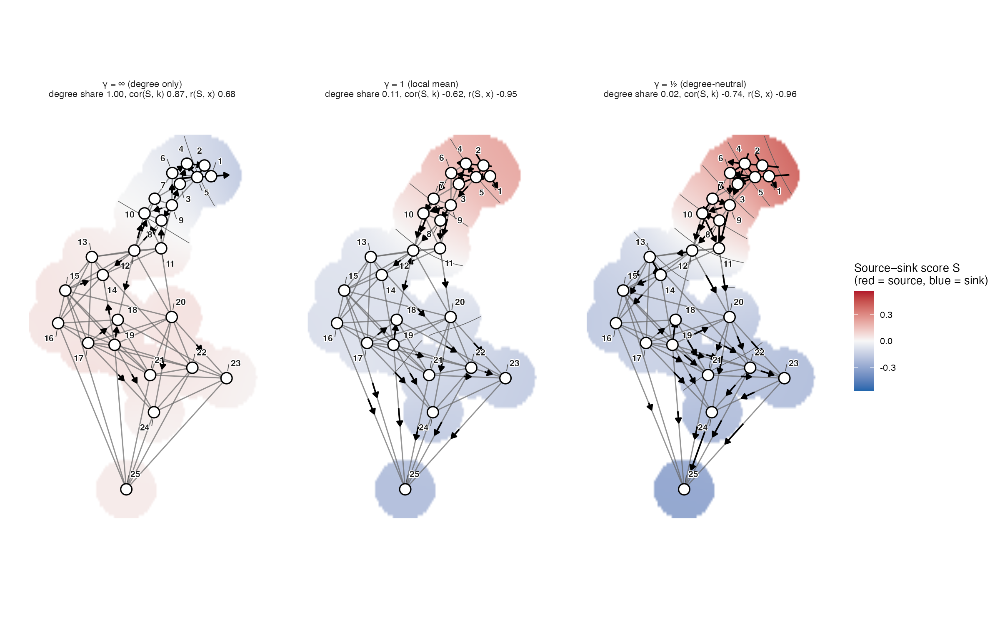
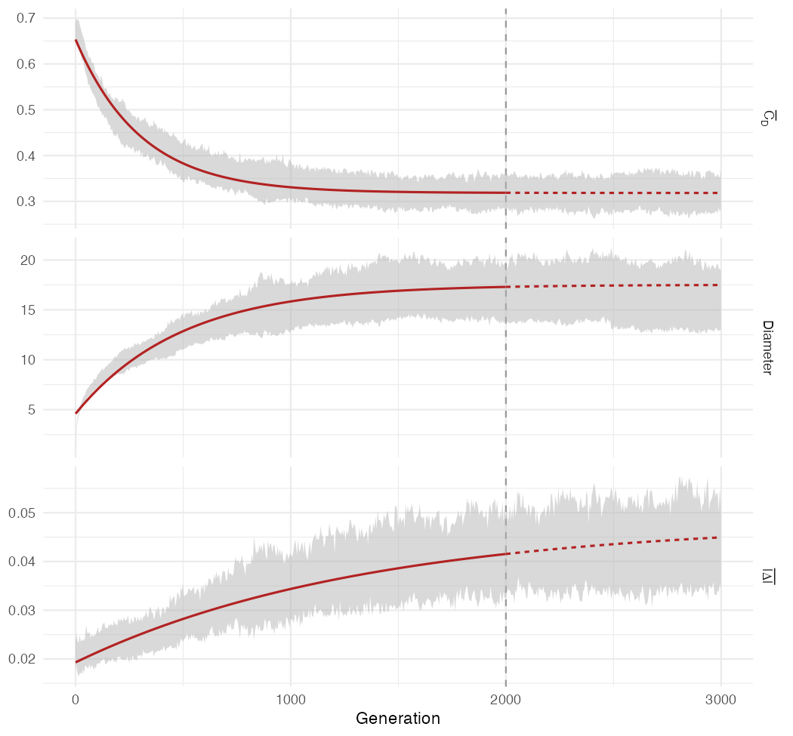
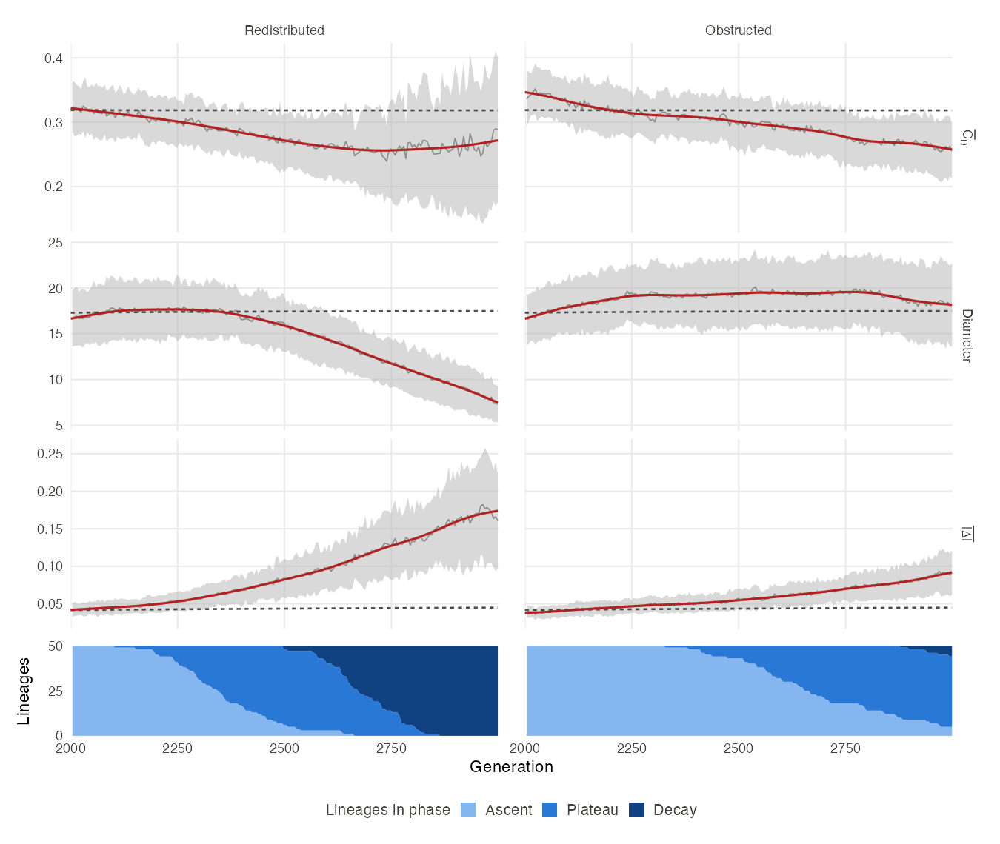
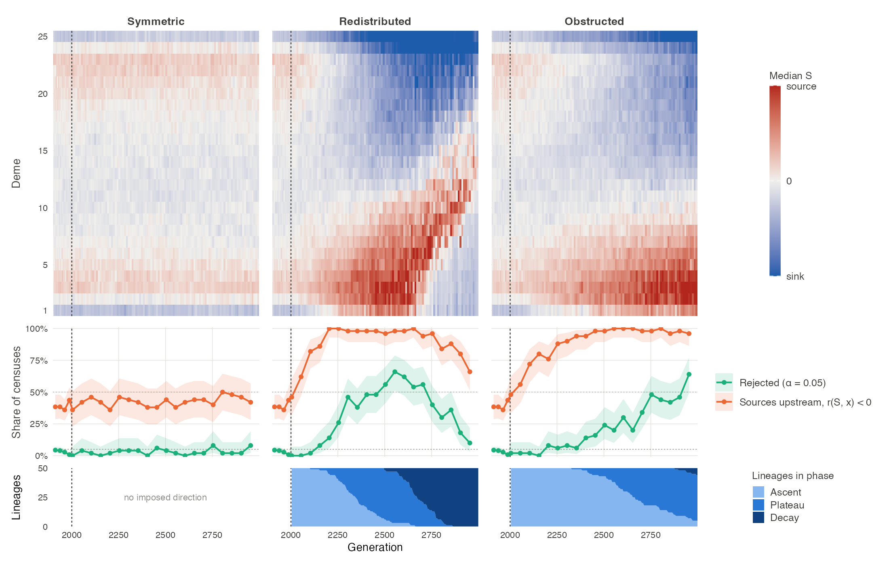
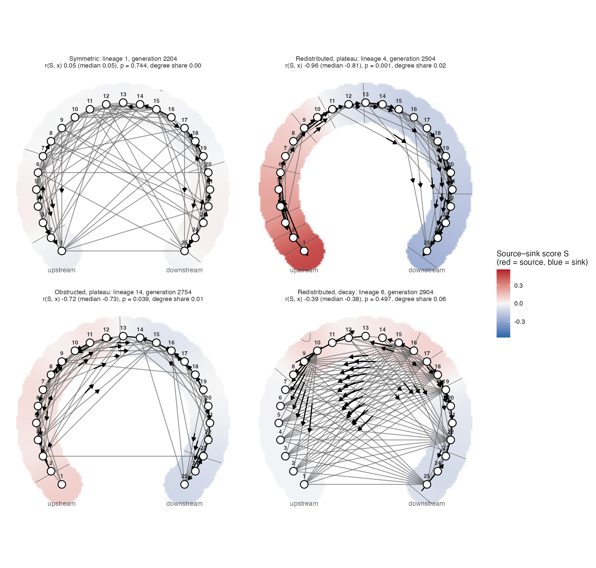
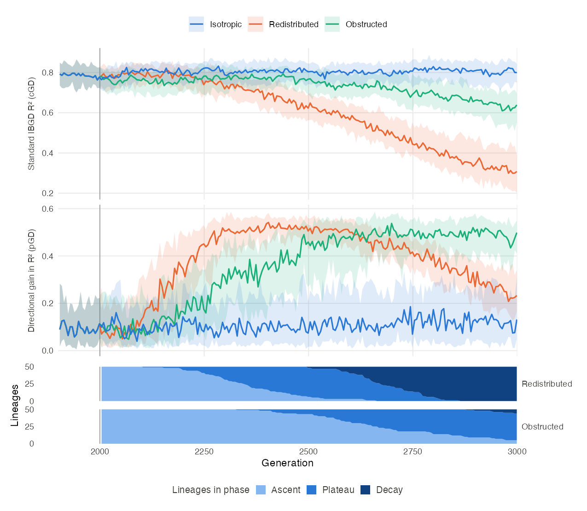
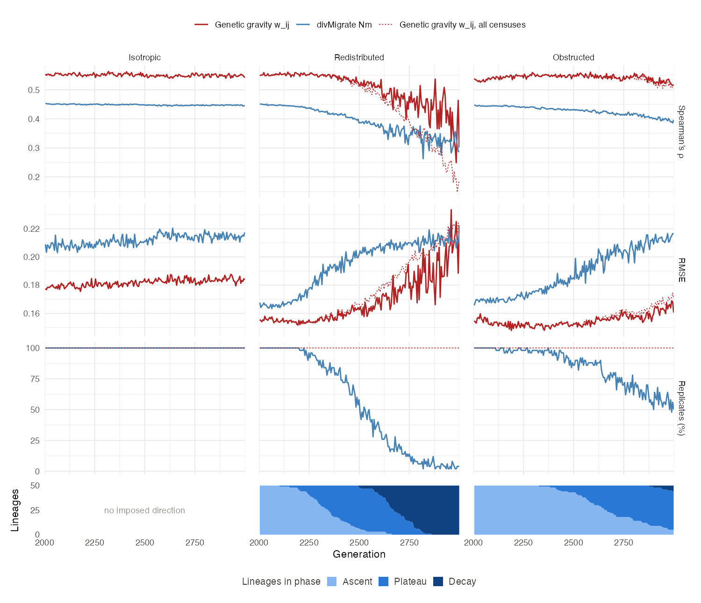
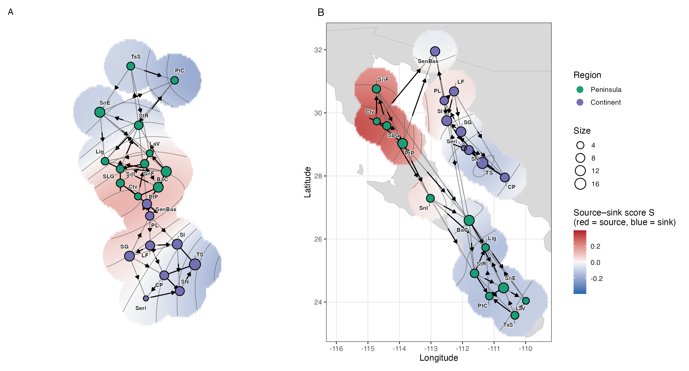

# Genetic Gravity: Extracting Directional Gene Flow from Population Graphs

Rodney J. Dyer  
rjdyer@vcu.edu  
https://rodneydyer.com

[School of Life Sciences and Sustainability](https://slss.vcu.edu)  
[Virginia Commonwealth University](https://vcu.edu)  
Richmond, Virginia 23284

# Abstract

> ==To be added after discussion is finished==

# Introduction

Inferring the pattern and direction of genetic connectivity from molecular data is a central problem in evolutionary, population, and landscape genetics (Slatkin, 1985; Dyer, 2015).  The distribution of population genetic covariance we see today is the result of overlapping evolutionary processes—stochastic, neutral, and adaptive.  A common approach to elucidating the relative importance of these processes is to partition genetic variance into within- and among-stratum components using Wright’s $F_{ST}$ (or one of its many derivatives).  Applying an underlying evolutionary model then allows us to compute the expected values of evolutionarily relevant parameters, such as migration rate (*m*; Slatkin, 1981, 1993), genetic effective population size ($N_e$; Wright, 1931), inbreeding ($F_{IS}$; Wright, 1965; Weir & Cockerham, 1984), and others.  This process raises several specific challenges to using the current distribution of genetic variation to infer historical processes.  First, the relationship between an estimated standardized parameter and the stratigraphy of evolutionary and demographic histories that produced the set of sampled alleles and genotypes is non-reversible—the same ratio of within- and among-stratum variances can arise from completely non-overlapping demographic and evolutionary histories.   Second, treating connectivity as a scalar, undirected quantity is analytically convenient, but it homogenizes the varied histories of interactions that created these systems by taking an ‘average across generations under equilibrium conditions’ rather than directly embracing the potential for spatial and temporal heterogeneity within populations.  Estimating the effective number of migrants per generation, *Nem*, is critical for comparative inferences, but may be too coarse when the analytical questions focus on more intricate demographic processes or when attempting to include more granular landscape, demographic, or ecological features that may affect standing genetic structure.  Questions focusing on understanding how genetic structure is affected by colonization, range expansion, source–sink dynamics, wind- or water-mediated dispersal, and environmentally filtered gene flow benefit from approaches that are more fine-grained than a single summarizing parameter, as these inter-strata interactions are heterogeneous and fundamentally *directional* in nature (Baker & Dyer, 2011; Wogan et al., 2024).

The field is not, of course, without tools for addressing questions such as these, and an increasingly sophisticated set of approaches is available for estimating heterogeneity in connectivity and asymmetric gene flow from genetic data. Assignment-based tools such as `BayesAss` infer recent, directional migration rates from multilocus genotypes under linkage and Hardy–Weinberg assumptions (Wilson & Rannala, 2003), while coalescent and isolation-with-migration frameworks recover asymmetric long-term migration matrices, either by direct likelihood over genealogies (Beerli & Felsenstein, 2001) or by fitting the joint site-frequency spectrum of a few populations (e.g., Gutenkunst et al., 2009). Where the question is specifically the direction of a range expansion, the directionality index $\psi$ reads the origin and axis of spread from pairwise allele-frequency asymmetries (Peter & Slatkin, 2013). At the landscape scale, effective-migration-surface methods map spatial heterogeneity in gene flow (Marcus et al., 2021; Petkova et al., 2016), and recent extensions of that family relax their symmetry assumption to render the surface directional. Each of these is powerful within its domain, but each also exacts a characteristic cost: a prespecified demographic or spatial model, an assumption of migration–drift equilibrium, genome-scale marker panels, a small number of demes, explicit spatial coordinates, or substantial computational resources. This manuscript provides a lightweight summary of *directional structure* that requires no demographic model, can be read directly from the multivariate covariance dependency topology, and scales to many populations from a single snapshot; it does leave the researcher choices—of bandwidth and of test—that depend on what she is trying to test and examine. The framework extended herein is intended to fill this niche by using conditional genetic covariance structures, as represented within Population Graphs (Dyer & Nason, 2004; Dyer, 2007, 2015), to identify and quantify asymmetry in population migration.

The Population Graph framework translates the total among-stratum variance into a weighted connectivity network using conditional genetic covariance.  This approach is distinct from pairwise structure or genetic distance analyses in one important way.  Pairwise approaches focus on estimates from each pair of strata whereas estimates of stratum-to-stratum covariance in a Population Graph are based on the multilocus covariance between all populations in the analysis.  This resulting covariance topology is able to capture dependencies that pairwise measures obscure and the resulting network’s topological shape is diagnostic of the evolutionary processes that produced it—range expansions, vicariance, and equilibrium isolation-by-distance each leave characteristic signatures in node degree, edge length, and network diameter (Dyer, 2007, 2015). Population Graphs have been used to address questions of connectivity and structure in a broad range of scenarios including landscape genetics (Daniel et al., 2024; Dyer, 2015), conservation planning (Vilaça et al., 2024), biogeography (Wogan et al., 2024), life-history effects (Reed et al., 2023), invasive species management (Baker & Dyer, 2011), and pollen-mediated gene flow (DiLeo et al., 2014; Dyer et al., 2004; Smouse et al., 2001).

The edges in a Population Graph are weighted estimates of conditional inter-population covariance: the conditional covariance $e_{ij}$ is a scalar, and the overall genetic covariance topology produced by the approach is, by definition, undirected.  Both source and sink populations may share a strong conditional dependency, but the *direction* of that dependency—who is overwriting whose allele frequencies—is a biologically distinct question that cannot be read directly from the undirected edge any more easily than it can be addressed with pairwise structure statistics. The same edge weight can be produced by a stable, symmetric exchange and by a unidirectional colonization pulse, yet the evolutionary implications are opposite, and in most cases, the actual inference of highest practical interest to the researcher.

Here, I introduce the concept of *genetic gravity*, an extension of the topology of the classic Population Graph that creates a node-centric framework for extracting directional information from an otherwise undirected Population Graph.  The goal here is to determine whether the conditional genetic structure encoded in the Population Graph topology itself can be used to partition symmetric covariance into asymmetric components, without invoking any new population-genetic model or incorporating additional outside information.  To this end, I begin by formalizing the notion of genetic gravity, deriving a pair of directional weights ($w_{j\mid i}$ and $w_{i\mid j}$) for each edge ($e_{ij}$) to define an asymmetry index, $\Delta_{i\rightarrow j}$, associated with each edge, and aggregate those edges into a population-level gravity and a source–sink score that orders populations from genetic sources to sinks.  For this, I introduce a node-local Gaussian kernel approach whose bandwidth is read directly from the Population Graph and scaled by a single multiplier chosen by the question being asked: a degree-neutral bandwidth for inferring the direction of gene flow, and the local mean for describing connectivity.  Second, I characterize their behavior under stochastic models of symmetric and asymmetric connectivity. I validate the framework with stochastic individual-based simulations under three migration scenarios—*Symmetric*, *Redistributed* and *Obstructed*—tracking both the canonical undirected Population Graph metrics and their directed counterparts derived from genetic gravity, as well as a mean asymmetry index $\bar{\Delta}$. Next, I characterize the temporal dynamics and detectability of the directional signal against a within-replicate empirical null, following each replicate lineage through its own phases rather than pooling lineages by generation, and introduce two single-graph tests for directional gene flow: a source–sink gradient test on population-level gravity, and a comparison of directional against symmetric isolation-by-graph-distance models.  Finally, I benchmark the asymmetry index against an existing approach suitable for the kinds of data found in the simulations using `divMigrate`, a widely used differentiation-based estimator of directional relative migration (Sundqvist et al., 2016).  The two methods estimate different quantities, so the comparison asks only which better approximates the true migration matrix used in the simulations, and in which phase of a lineage's history each can still be relied on.  All simulation routines and analysis functions have been implemented in the `gstudio` R package maintained by the author and are freely available. Although the simulations and worked examples here use simple spatial position along a one-dimensional stepping stone, neither test is tied to Euclidean geography: substituting a resistance-based or other ecological distance for the spatial separation used throughout is a direct extension of the framework to the kinds of landscape-genetic questions Population Graphs are already well suited to (Dyer, 2015).
# Methods
The directional framework proposed here assumes that a Population Graph has already been constructed from multilocus genetic data; the relevant inputs are the symmetric edge weights $e_{ij}$ and the adjacency structure of the graph $G=\{V,E\}$ retained by the construction of this Markov independence graph. The notation here follows Dyer & Nason (2004) and Dyer (2007).

A Population Graph is a Markov independence graph, and three of its Markov properties bear on the development of asymmetry models. The first, the *global* Markov property, concerns graph separation. Any pair of populations *directly* connected in the topology (e.g., $A\leftrightarrow B$, denoted by the edge $e_{AB}$) are, by definition, not genetically independent. Evolutionary processes that lead to conditional dependence include ongoing genetic connectivity or recent divergence from a common ancestral population; cessation of connectivity via gene flow allows genetic drift and other processes to lead populations towards genetic independence. If populations are connected only *through* one or more other populations, in a stepwise fashion (e.g., $A\leftrightarrow B\leftrightarrow C$), populations not directly connected (such as $A$ and $C$) are conditionally independent, such that $P(A,C\mid B)=P(A\mid B)P(C\mid B)$.  Second, under the *pairwise* Markov property any two non-adjacent populations are genetically independent conditional on *all other populations* in the topology. If a sampling population is added or removed from the data set, the entire topology must be re-estimated.  The presence or absence of each edge depends on *all the data simultaneously*, not just the populations attached to that edge. This distinguishes Population Graphs from the pairwise structure estimators commonly used in evolutionary, landscape, and population genetic analyses. Third, under the *local* Markov property each population is independent of all others in the topology *given its* direct neighbors. Biologically, an edge therefore reflects a direct relationship between two populations *given the populations sampled*, not one routed through any other sampled population—the property that matters when a directional signal is attributed to a an edge intended to represent patterns of genetic connectivity.

## The Model of Genetic Gravity
Each symmetric edge in a Population Graph is the pooled product of two conditional relationships: the contribution of population $j$ to the genetic structure of $i$, and the symmetric and opposite contribution of $i$ to $j$. The edge weight, $e_{ij}$, has been used as a measure of conditional genetic distance (cGD) to infer isolation by graph distance (Dyer, 2015; Miles et al., 2018).  Focusing on each target node and its collection of neighboring edges (e.g., $N(i)$), I define a *neighborhood weight*, $w_{j\mid i}$, as $j$'s weight in $i$'s neighborhood: the conditional probability that $j$ is the most influential neighbor of $i$ given the other nodes in $N(i)$, using a Gaussian Stochastic Neighbor Embedding (Gaussian SNE; Hinton & Roweis, 2003) approach where:

$$
w_{j\mid i}= \frac{exp\left({- e_{ij}^{2}/2b_i^{2}}\right)}{\sum\limits_{k\in N(i)}^{}exp\left({- e_{ik}^{2}/2b_i^{2}}\right)}
$$

where $e_{ij}$ is the symmetric conditional-covariance edge weight from the Population Graph (the conditional genetic distance, cGD) and $b_{i}$ is a node-specific *local bandwidth* parameter. The kernel is strictly local: only retained neighboring nodes, $j\in N(i)$, contribute to the denominator, so nodes that are conditionally independent of $i$ in $G$ (those beyond its first-degree neighbors) contribute nothing (by definition of the Markov properties above). The bandwidth $b_{i}$ controls the rate at which the kernel decays with distance: a large $b_{i}$ spreads weight broadly across the neighborhood, while a small $b_{i}$ concentrates it on the nearest neighbor. A node whose retained neighbors are genetically more divergent, whether because it bridges differentiated clusters in the connectivity network or because it lies at an end of a linear stepping stone, receives a broad kernel that distributes its neighborhood weight over that extended neighborhood. Conversely, a node embedded in a tight cluster of genetically similar populations receives a narrow kernel that concentrates its weight on its closest retained neighbors.

The local bandwidth is set as a multiple of the mean edge weight over node $i$'s retained neighborhood:
$$
b_{i} = \gamma\,\frac{s_{i}}{k_{i}} = \frac{\gamma}{k_{i}}\sum\limits_{j\in N(i)}^{}e_{ij}
$$
where $s_{i}=\sum_{j\in N(i)}e_{ij}$ is the *strength* (weighted degree) of node $i$, $k_i$ its degree, and $\gamma$ a fixed multiplier whose choice is set out below: $\gamma=\tfrac{1}{2}$ for inferring the direction of gene flow, used for every directional analysis in this paper, and $\gamma=1$, the local mean, for describing connectivity.

Every edge is read from both of its ends: $w_{j\mid i}$ from $i$'s neighborhood with bandwidth $b_i$, and, symmetrically, $w_{i\mid j}$ from $j$'s neighborhood with bandwidth $b_j$. Because the two neighborhoods differ, the two weights generally differ, and their signed difference defines a local, edge-specific direction,
$$
\Delta_{i\rightarrow j} = w_{i\mid j}-w_{j\mid i},
$$
the *gravity asymmetry* along the edge—$i$'s pull on $j$ minus $j$'s pull on $i$. Positive $\Delta_{i\rightarrow j}$ means $i$ holds more weight in $j$'s neighborhood than $j$ holds in $i$'s: $j$'s kernel points more strongly back at $i$ than the reverse, marking $i$ as the genetic source and $j$ as the sink. The asymmetry does not come from the edge itself but from the two *neighborhoods the edge is compared against*. The local bandwidth $b_{i}$ is node $i$'s native genetic-distance scale, and $w_{j\mid i}$ measures how near edge $(i,j)$ is *relative to that scale*. The same edge weight $e_{ij}$ therefore reads as relatively near from $i$'s side when $b_i$ is large (when $i$'s other neighbors are, on average, farther away) and relatively far from $j$'s side when $b_j$ is small, and $\Delta_{i\rightarrow j}$ records whether the edge is more typical of $i$'s local scale or of $j$'s. Bandwidth contrast alone is not a reliable guide to which population is the source; direction should be read from $\Delta_{i\rightarrow j}$ itself (Supplementary Materials).

A value of $\Delta_{i\rightarrow j}$ near zero indicates balanced exchange between the two populations, as expected under symmetric migration. A large $|\Delta_{i\rightarrow j}|$ indicates a strongly directional edge, and its sign gives the direction. Throughout, higher values mean more of a source: this holds for $\Delta_{i\rightarrow j}$ and for every population-level quantity built from it below, and no asymmetry or population-level score in the paper carries the opposite sign. The one directional quantity that reads the other way is the partitioned distance pGD (below): because it is a distance, it is shorter in the direction of gene flow.

Because $b_i$ scales with the edge weights, rescaling every conditional distance by a constant $c>0$ leaves each exponent $e_{ij}^2/2b_i^2$, and therefore every $w_{j\mid i}$ and $\Delta_{i\rightarrow j}$, unchanged. The index measures relative directional imbalance rather than absolute differentiation, so graphs built from marker panels with very different overall divergence can be compared directly.

The Population Graph topology is derived from the conditional covariance structure of all populations together and determines both the placement and the magnitude of every edge (Dyer & Nason, 2004). The edge-level asymmetry $\Delta_{i\rightarrow j}$, although defined on a single edge, is estimated from both of its nodes and their immediate neighbors, so edges sharing a population are not independent. Direction therefore accumulates at the population level, where I define the *gravity* of population $i$:
$$
g_{i} = \sum\limits_{j\in N(i)}^{} w_{i\mid j}
$$
the total weight $i$ holds in its neighbors' neighborhoods. Because each population's own neighborhood weights ($w_{j\mid i}$ over $j\in N(i)$) sum to 1 by construction, gravity is conserved across the graph: $\sum_{i} g_{i}=K$ for any Population Graph without isolated populations. The *source–sink balance*, $g_{i}-1$, therefore sums to zero over the graph whatever the underlying migration matrix—every population that reads as a source is balanced by populations that read as sinks. A population sits at $g_{i}=1$ when it holds exactly as much weight in its neighbors' neighborhoods as it gives them in its own; $g_{i}-1$ is positive for a source and negative for a sink. Individual populations can depart from 1 through degree alone, even under symmetric migration (the topological floor, below).

"Source" and "sink" here are genetic, not demographic. A genetic source is a population whose allele frequencies its neighbors have been pulled toward, read from standing conditional genetic structure; it is not a count of migrants, and it is distinct from the demographic sense of Pulliam (1988), in which a sink is a population with $\lambda<1$ maintained by immigration. Low gravity is not by itself proof of immigration: an isolated, strongly drifted population can read as a sink for the same reason a true recipient does, because "sink" means weak genetic gravity, which directional immigration produces but isolation can mimic. A low score is best interpreted alongside within-population diversity.

*Source–sink scores.* Gravity summarizes each population separately; the *source–sink score*, $S$, places all populations on a single directional scale. $S$ assigns each population the value whose pairwise differences best reproduce the gravity asymmetries along every retained edge at once,
$$
\hat{S}=\arg\min_{S}\sum_{(i,j)\in E}\left[\Delta_{i\rightarrow j}-(S_i-S_j)\right]^2, \qquad \sum_{i}S_i=0 \text{ within each connected component},
$$
so that $S_i-S_j\approx\Delta_{i\rightarrow j}$. A high $S$ marks a source and a low $S$ a sink. Gravity and the source–sink score are two views of the same quantity. Because $\Delta_{j\rightarrow i}=-\Delta_{i\rightarrow j}$ and each population's own neighborhood weights sum to one, the gravity balance is the net asymmetry over a population's edges, $g_i-1=\sum_{j\in N(i)}\Delta_{i\rightarrow j}$, and the least-squares scores solve $L\hat{S}=g-1$, where $L$ is the Laplacian of $G$: $S$ is the potential on the graph whose local imbalance is the gravity balance, gravity being the local source–sink signal and $S$ its integral over the topology (Supplementary Materials). This is the construction of HodgeRank, which recovers a global ranking from pairwise comparisons on a graph by projecting them onto the space of gradient flows (Jiang et al., 2011); the part of $\Delta_{i\rightarrow j}$ that $S$ does not reproduce is the divergence-free, circulating component of the flow. $S$ is the quantity mapped onto geography and tested against a hypothesized covariate; its computation and properties are given in the Supplementary Materials.

### Partitioned Conditional Genetic Distance, pGD

The same two neighborhood weights that define $\Delta_{i\rightarrow j}$ also let the edge's conditional genetic distance itself be split into relative directional components. Partitioning $e_{ij}$ in proportion to $w_{j\mid i}$ and $w_{i\mid j}$ yields a *partitioned conditional genetic distance* (pGD): $p_{ij} = e_{ij}\,w_{j\mid i}/(w_{j\mid i}+w_{i\mid j})$, and correspondingly $p_{ji} = e_{ij}\,w_{i\mid j}/(w_{j\mid i}+w_{i\mid j})$, so that $p_{ij}+p_{ji}=e_{ij}$, with $p_{ij}=p_{ji}=e_{ij}/2$ under symmetric connectivity. Because pGD is a distance, its direction reads opposite to the source–sink convention: when $i$ is a source for $j$ ($\Delta_{i\rightarrow j}>0$, so $w_{i\mid j}>w_{j\mid i}$), $p_{ij}<p_{ji}$—conditional distance is shorter in the direction of gene flow. Unlike $e_{ij}$ itself, which is symmetric by construction, pGD assigns each direction of an edge its own share of the symmetrical cGD, turning the Population Graph's otherwise-undirected edge set into a directed, asymmetrically-weighted graph over the same topology. Where this is relevant is that the Population Graph topology is often not the end result, but simply the input for downstream analyses such as spatial structure (e.g., isolation by graph distance, IBGD; Dyer & Nason, 2004; Miles et al., 2018), ecological resistance modeling (Dyer, 2015), range expansion processes (Baker & Dyer, 2011),  pollination networks (DiLeo et al., 2014), etc.  Using pGD in place of cGD lets the researcher investigate asymmetry in these analyses.

## Individual-based simulations
The behavior of genetic gravity was evaluated with individual-based stochastic simulations following Dyer (2007). Each replicate tracks a metapopulation of $K=25$ discrete demes, each of $N=100$ diploid individuals scored at $L=20$ independently segregating, codominant, biallelic loci. Replicates start from random allele frequencies; generations are non-overlapping, mating is random within demes, and mutation is excluded so that only migration and drift act. Migrants are drawn at random each generation according to the migration matrix. Every replicate first runs a 2,000-generation *burn-in* of symmetric migration in a one-dimensional stepping-stone model ($m_{i\rightarrow i+1}=m_{i\leftarrow i+1}=0.025$, where the pair is always ordered $(i,i{+}1)$ and the arrow gives forward or reverse flow). Dyer (2007) showed that graph-theoretic summaries such as mean degree centrality ($\bar{C}_D$) and graph diameter ($\bar{d}_G$) stabilize much sooner than population-genetic statistics such as multilocus structure ($\Phi_{ST}$) or isolation by distance ($\hat{M}$); both kinds of metric were checked for stability at the end of the *burn-in*, and $\bar{C}_D$ and $\bar{d}_G$ are reported alongside $\Delta_{i\rightarrow j}$ and $S$ for context. Fifty replicates were run. Multilocus genotypes were saved every five generations, and each snapshot was converted into a Population Graph (Dyer & Nason, 2004), from which the neighborhood weights, gravity asymmetries, source–sink scores, edge density, diameter and mean cGD were recorded.

At generation 2000 each replicate was continued for a further 1,000 generations (2000–2999) under each of three scenarios (Tab_ScenarioParameters), so that all three share an identical history up to that point. *Symmetric* migration continued the symmetric *burn-in* matrix and serves, within each replicate, as the null trajectory against which the asymmetric scenarios are compared. *Redistributed* migration kept the total rate fixed ($m=0.05$) but split it 4:1 in one direction ($m_{i\rightarrow i+1}=0.04$; $m_{i\leftarrow i+1}=0.01$). *Obstructed* migration kept the forward rate of the *Symmetric* scenario ($m_{i\rightarrow i+1}=0.025$) but suppressed the reverse rate ($m_{i\leftarrow i+1}=0.01$). In both asymmetric scenarios the bias ran toward higher deme numbers at every link. Three further symmetric scenarios at progressively lower migration rates (sym-mid, sym-low and sym-verylow), which raise neutral differentiation without imposing a direction, were used only to calibrate false-positive rates (Supplementary Materials). Together they test a simple expectation: the difference between forward and reverse rates sets the direction and strength of the net force homogenizing the metapopulation, while total migration sets how quickly a lineage moves toward that state. *Obstructed* migration, with half the net bias of *Redistributed* migration (0.015 against 0.03) and lower total migration, should therefore pass through the same sequence of states more slowly.

*Tab_ScenarioParameters:* Post-*burn-in* migration parameters for the three simulation scenarios. All scenarios share an identical 2,000-generation symmetric *burn-in* before the scenario's migration matrix is applied.

| Scenario      | $m_{i \rightarrow i+1}$ | $m_{i \leftarrow i+1}$ | $m_{Total}$ | Ratio | Constant               |
| ------------- | :---------------------: | :--------------------: | :---------: | :---: | ---------------------- |
| *Symmetric* |          0.025          |         0.025          |    0.050    |  1:1  | Symmetric connectivity |
| *Redistributed* |          0.040          |         0.010          |    0.050    |  4:1  | Total emigration rate  |
| *Obstructed*    |          0.025          |         0.010          |    0.035    | 2.5:1 | Forward rate           |

### Phases of the forward simulations

Each lineage passes through these phases at its own pace, so results for the asymmetric scenarios are reported by phase, with each lineage's censuses assigned to phases by boundaries read from its own genotypes (Supplementary Materials). The boundaries are heuristics for separating three regimes that any summary by generation would mix, not constants of the system, and where a boundary sits affects what is measured close to it. Phase summaries are therefore taken from the core of each lineage's phase—the middle half of the interval between its boundaries—so that the transitions from *ascent* to *plateau* and from *plateau* to *decay* do not blend regimes, and their sensitivity to where the boundaries are placed is reported (Supplementary Materials). The *Symmetric* forward phase is reported as a whole.

*Burn-in* (generations 0–1999). Starting from random allele frequencies under a fixed, symmetric migration matrix, within- and among-population variance settle toward drift–migration balance. Its length is fixed, following Dyer (2007).

*Ascent*. The modified migration matrix applied at generation 2000 restructures among-population covariance, at a pace that depends on how genetic variation is distributed among demes in each lineage. Under directional migration, upstream demes receive fewer immigrants and lose heterozygosity faster, so within-deme $H_e$ comes to increase along the axis of flow. The slope of $H_e$ on deme position, smoothed within each lineage with a penalized spline ($k=10$), was used only to date this phase boundary—not as evidence of direction; *ascent* ends when a lineage's gradient has completed 90% of its rise from its own *burn-in* level. Lineages whose rise did not exceed the 95th percentile of rises among *Symmetric* lineages were held in *ascent* until the onset of *decay* (Supplementary Materials).

*Plateau*. Once the covariance structure has adjusted to the new migration matrix, it changes only slowly while allele frequencies across demes continue to converge. The *plateau* has no marker of its own; it lasts until the loss of among-population variance begins to erode the ability to estimate structure, which marks the onset of *decay*.

*Decay*. In a closed migration–drift system without mutation, allele frequencies converge under any migration matrix: to the simple mean $\bar{p}$ when migration is symmetric, and to a mean weighted toward the upstream demes when it is directional. Migration does not stop as frequencies converge, but the among-population variance through which it is observed does. $F_{ST}=\sigma^2_p/\bar{p}(1-\bar{p})$ falls toward zero as populations homogenize, which the equilibrium relation $F_{ST}\approx 1/(4N_em+1)$ would read as unrestricted gene flow, and becomes undefined as loci fix; beyond that point migration cannot be identified from standing variation by any method that relies on among-population variance or covariance. *Decay* begins at the first census at which a lineage's demes carry, on average, fewer than 4.5 of the 20 loci polymorphic. This is a heuristic marker of where information loss begins to matter—calibrated on *Symmetric* graphs as roughly the level below which losing loci alone inflates the asymmetry index by about 10%—and the conclusions reported below for *ascent* and the *plateau* do not change with the horizon set at 6 polymorphic loci (Supplementary Materials). A panel of loci chosen for their polymorphism, as SNP panels routinely are, would rarely sit in this regime; *decay* is reported mainly to show where inference from standing variation ends, for any method.

## Significance Testing for Asymmetry

The presence and weight of each edge in a Population Graph are already tested during its construction (Dyer & Nason, 2004).  Initially, significance testing using graph permutation was explored (e.g., see Miles et al., 2018).  However, nulls that permute or resample parts of a single Population Graph were consistently anti-conservative under symmetric migration, because $\Delta_{i\rightarrow j}$ and $S$ both inherit smooth, node-level structure from the graph's Markov topology (see Supplementary Materials for more on this).  Asymmetry was tested with two complementary procedures, a gradient test on the source–sink score $S$, and a comparison of directional (pGD) and symmetric (cGD) isolation-by-graph-distance models. Censuses from the same lineage share its history and are correlated, so false-positive rates are given with lineage-clustered 95% intervals from a bootstrap that resamples the 50 lineages (10,000 resamples) rather than with census-level binomial intervals.

### Source–sink gradient test

This test asks whether the source–sink scores of the populations change monotonically along a hypothesized covariate $x$, such as position along a suspected axis of flow, as expected if gene flow runs consistently in one direction along it. It is the natural first check: a rejection identifies both that a gradient exists and, from the sign of $S$ against $x$, which way it runs. The test statistic is Spearman's $r(S,x)$, with $S$ computed at the degree-neutral bandwidth (below); scores within $10^{-10}\max|S|$ of one another are treated as tied before ranking, so that floating-point near-ties do not decide the ranks. Because high $S$ marks a source, $r(S,x)<0$ places the sources at low values of $x$ (upstream, when $x$ increases downstream) and $r(S,x)>0$ places them at high values. The null preserves $S$'s spectral power on the census's own Population Graph: Moran spectral randomization (Wagner & Dray, 2015) on the kernel-weighted adjacency $\exp(-e_{ij}^{2}/2\bar b^{2})$, where $\bar b$ is the mean retained edge weight, with $B=999$ randomizations, tested two-sided at $\alpha=0.05$. Because it reproduces the node-level smoothness that $S$ inherits from drift on the graph, a rejection reflects a gradient along the hypothesized covariate beyond what drift alone produces. Power was measured as the rejection rate on the same census grid under the *Redistributed* and *Obstructed* scenarios, by each lineage's own phase (above).

### Directional isolation by graph distance

This test asks whether modeling direction explicitly improves how well the graph explains isolation by distance (Wright, 1943), one of the most common downstream uses of Population Graphs. It compares two isolation models fit to the same Population Graph, one assuming symmetric gene flow and one allowing it to be directional, and can follow a gradient detected by the source–sink test or be applied on its own.  

1. **Estimate the topology and fit standard IBGD.** The Population Graph is estimated as usual, and all-pairs conditional genetic distance (cGD, the shortest-path distance over edge weights $e_{ij}$) is regressed on pairwise spatial separation, $|dx_{ij}|$, giving $R^2_{cGD}$. If asymmetry is not suspected, the analysis ends here.
2. **Estimate the directional distances.** If asymmetry is suspected, the directed graph with arc costs $p_{ij}$ (pGD; above, at the degree-neutral bandwidth set out below) is formed and all-pairs directed shortest-path distances are computed, so that the distance from $i$ to $j$ may differ from the distance from $j$ to $i$.
3. **Fit a directional isolation model.** A directional model requires direction on both sides of the regression: the genetic response (pGD, over ordered pairs $i\neq j$) and the spatial separation. Spatial direction is supplied by a hypothesized axis of flow—downstream, a prevailing wind or current, or the front of a range expansion; here, the one-dimensional stepping stone—so that each ordered pair is either *forward* ($j$ lies downstream of $i$) or *reverse*. The model $\text{pGD}_{ij} \sim |dx_{ij}| + |dx_{ij}| \cdot r_{ij}$, where $r_{ij}=1$ for reverse pairs, gives pGD separate forward and reverse isolation slopes, with fit $R^2_{pGD}$ (adjusted for the additional slope).
4. **Compare the fits.** If $\Delta R^2 = R^2_{pGD} - R^2_{cGD} > 0$, the directional description of the graph explains isolation better than the symmetric one, which is consistent with asymmetric gene flow along the hypothesized axis. If $\Delta R^2 \le 0$, the symmetric description is sufficient; this is an absence of evidence for asymmetry, not evidence of symmetry.
5. **Describe the asymmetry.** Where the directional fit is supported, the ratio of the forward to the reverse slope, $b_{fwd}/b_{rev}$, gives the direction and relative strength of isolation along the axis: a ratio below one means genetic distance accumulates more slowly downstream than upstream.

Because $R^2_{cGD}$ and $R^2_{pGD}$ are fit to different response matrices, the comparison is not a nested-model test; it asks which representation of the same Population Graph—symmetric or directional—geography describes better. Its error rates were therefore characterized empirically. Detection was measured as the fraction of censuses with $\Delta R^2>0$ under the *Redistributed* and *Obstructed* scenarios, summarized over the core of each lineage's own phase—*ascent*, *plateau* and *decay*.

## Choosing the bandwidth

The bandwidth sets the scale at which a population's neighbours are compared, and with it how much of $\Delta_{i\rightarrow j}$ reflects genetic distance and how much reflects the number of neighbours. As the kernel flattens ($b_i$ large relative to the edge weights), every neighbourhood weight tends to $1/k_i$, so the index reduces to the topological floor, $\Delta^{0}_{i\rightarrow j}=1/k_j-1/k_i$, and the source–sink score to $S^{0}_i=-1/k_i$, both of which depend on degree alone; as it sharpens, each population's weight concentrates on its nearest retained neighbour. Degree records how many populations are conditionally connected to $i$. When the question is the direction of gene flow, degree is a nuisance, and a bandwidth is wanted that is set by the edge weights and leaves as little of the index as possible to degree; when the question is a population's overall pull within the network, degree is part of the answer. Two bandwidths are therefore offered, both written as a multiple of the local mean, $b_i=\gamma\,s_i/k_i$. As with the choice between a rank and a parametric correlation, both are valid, and the question being asked determines which is appropriate.

*Degree-neutral bandwidth, for inferring direction* ($\gamma=\tfrac{1}{2}$). Under symmetric migration, source–sink scores computed at $\gamma=\tfrac{1}{2}$ carry no degree signature: the multiplier at which $\text{cor}(S,S^{0})=0$ had a median of 0.49 across the *Symmetric* censuses, and 0.51 in 50 further lineages simulated with new seeds. The multiplier is fixed once, from the symmetric null, rather than tuned on each graph: tuning it per graph lets the directional signal being tested shift the bandwidth and costs power (Supplementary Materials). It is the bandwidth used for the source–sink gradient test, the directional isolation comparison and the mapping of sources and sinks.

*Local mean bandwidth, for describing connectivity* ($\gamma=1$). $b_i=s_i/k_i$, the mean edge weight in $i$'s neighbourhood (above). It keeps the contribution of degree, so hub populations read as strong sources and leaves as sinks; it describes how much weight each population carries in the network as a whole. It is not suited to testing direction: under symmetric migration degree accounts for half of the variance in $\Delta_{i\rightarrow j}$ at this bandwidth (below).

Whichever bandwidth is used, the share of the variance in $\Delta_{i\rightarrow j}$ explained by $\Delta^{0}_{i\rightarrow j}$ reports how much of the index is set by degree, and it is reported with each analysis. Fig_GravityFieldBandwidth shows the effect of the choice on a single census.

*Fig_GravityFieldBandwidth:* One Population Graph drawn at three bandwidths: a *Redistributed* census on the *plateau* (lineage 4, generation 2504; gene flow biased toward higher-numbered demes, so the sources are expected at the top), distributed with gstudio as the example data set `gravity`. Nodes are numbered by deme and placed in the same positions in every panel (a Kamada–Kawai layout of the graph; Kamada & Kawai, 1989), so the upstream demes sit at the top and the downstream demes at the bottom. The shaded surface interpolates the source–sink score $S$ (red, source; blue, sink), and arrows on the edges point from source to sink with length proportional to $|\Delta_{i\rightarrow j}|$ (the weaker half are omitted). Each panel heading gives the degree share (the $R^2$ of $\Delta_{i\rightarrow j}$ on $\Delta^{0}_{i\rightarrow j}$), $\text{cor}(S,k)$, and $r(S,x)$, the Spearman correlation of $S$ with deme number used by the source–sink gradient test (negative: sources upstream). At $\gamma=\infty$ the weights are $1/k_i$, the degree share is one, and $S$ follows degree alone: the sparsely connected upstream demes read as sinks and the densely connected downstream demes as sources, so topology alone draws the reverse of the imposed flow ($r(S,x)=0.68$). At the local mean ($\gamma=1$) the gradient from upstream sources to downstream sinks appears ($r(S,x)=-0.95$), but 11% of the variance in $\Delta_{i\rightarrow j}$ is still degree. At the degree-neutral bandwidth ($\gamma=\tfrac{1}{2}$) degree accounts for 2% and the map shows the flow ($r(S,x)=-0.96$). Sharper kernels are compared in Supplementary Materials, Fig_BandwidthSweep. Under directional flow the sparsely connected upstream demes are the true sources, so $S$ correlates negatively with degree even at the degree-neutral bandwidth ($\text{cor}(S,k)=-0.74$); it is the degree share, not $\text{cor}(S,k)$, that measures how much of the index the topological floor sets.

Its sensitivity was assessed against four alternative bandwidths and a continuous rescaling of the local mean (Supplementary Materials, Bandwidth sensitivity).

## Comparison with a differentiation-based method
To place genetic gravity alongside an existing method, the simulated data were also analyzed with `divMigrate` (Sundqvist et al., 2016), one of the most widely used estimators of directional relative migration for population samples of codominant multilocus genotypes. The two methods do not estimate the same quantity—`divMigrate` reads relative migration from pairwise genetic differentiation, whereas gravity is read from conditional genetic structure—so no equivalence between their parameters is sought. The comparison asks a narrower question: which estimator better reproduces the true migration matrix, which is known here because it was simulated. The statistic used, `divMigrate`'s $N_m$, is not a classical migration-rate estimator despite its name; it is the formula of Alcalá et al. (2014), which combines harmonic-mean $G_{ST}$ and Jost's $D$, and the statistic that Sundqvist et al. (2016) report behaves most like $G_{ST}$ and recommend.

The true matrix is fixed across the forward phase: $m_{i\rightarrow j}$ equals the scenario's forward or reverse rate on each of the 48 directed stepping-stone links and zero for every other pair (Tab_ScenarioParameters), so each estimator was compared with the truth rather than with the other. Gene flow from $j$ to $i$ pulls $i$'s allele frequencies toward $j$'s and so raises $j$'s weight in $i$'s neighborhood, $w_{j\mid i}$ (degree-neutral bandwidth); the neighborhood weight is therefore compared with the transposed truth, $m_{j\rightarrow i}$. `divMigrate`'s matrix is read from row to column—entry $[i,j]$ is relative migration from $i$ to $j$ (Sundqvist et al., 2016)—and is compared with $m_{i\rightarrow j}$ directly. With these orientations a positive $\Delta_{i\rightarrow j}$ and a positive $N_m[i,j]-N_m[j,i]$ both mark $i$ as the source. A Population Graph retains only some of the $K(K-1)/2$ pairs as edges, fewer as spatial structure increases (Dyer, 2007), whereas `divMigrate` estimates every pair, so the comparison is made over all ordered pairs, with pairs not joined by a retained edge carrying zero neighborhood weight. Because $N_m$ is a relative statistic, each matrix, including the truth, was rescaled by its own maximum.

At each census, agreement with the truth was summarized as Spearman's $\rho$ over all ordered pairs. Because the truth is zero on all but the stepping-stone pairs, $\rho$ mainly measures whether an estimator separates corridors from non-corridors, so direction was scored separately as the fraction of the 24 stepping-stone links on which an estimate is larger in the imposed direction. The root mean square error (RMSE) is also reported, although it too is dominated by the many true-zero pairs. $N_m$ is undefined or negative at pairs whose loci have fixed; any census with such a value on any pair was excluded from the paired comparison for both estimators rather than clipped or substituted, and because these censuses accumulate as lineages lose polymorphism, the agreement of $w_{j\mid i}$ with the truth was also summarized over every census, together with the share of replicates retained. Agreement is summarized over the core of each lineage's phase (above).

## Case Study: Senita Cactus Across the Sea of Cortéz

To show how the framework handles a specific, *a priori* hypothesis of direction, I reanalyzed the Population Graph of the senita cactus, *Lophocereus schottii* (Cactaceae), with which Population Graphs were first introduced (Dyer & Nason, 2004). The graph was estimated from 29 polymorphic allozyme loci scored in 21 populations, 12 on the Baja California peninsula and 9 on the continent, spanning 23.6°N to 32.0°N (Nason et al., 2002); its 50 edges and their weights are those of Table 1 in Dyer & Nason (2004), and the graph and sampling coordinates are distributed with the gstudio R package. In that graph the one population from southern Arizona, SenBas, is joined to four populations in northern and central Baja (BaC, Ctv, PtP and StR) and to a single continental population, PL, which is its only link to the remaining continental populations. From this connectivity, the absence of isolation by distance between SenBas and the other continental populations, and palaeoecological evidence that *L. schottii* was absent from northern Baja and Sonora until about 2,000 years ago, Dyer & Nason (2004) proposed that SenBas was founded by recent long-distance dispersal out of the peninsula. The undirected graph could identify the connection but not its direction. The hypothesis makes a local, directional prediction: on the edges joining SenBas to the peninsula, the peninsular populations should read as sources and SenBas as their sink ($\Delta_{\text{Baja}\rightarrow\text{SenBas}}>0$). As outlined above, neighborhood weights, gravity asymmetries and source–sink scores were computed at the degree-neutral bandwidth ($\gamma=\tfrac{1}{2}$), with the degree share reported alongside, and again at the local mean ($\gamma=1$), because edge-level orientation was the quantity least stable across bandwidths in the simulations.

# Results

## *Symmetric* baseline

Individual-based simulations were run to establish that the *burn-in* period produces stable, comparable starting topologies before any directional migration is imposed. Dyer (2007) showed that mean degree centrality ($\bar{C}_D$) and graph diameter track standard population-genetic measures of structure and gene flow ($F_{ST}$ and $\hat{M}$); here, where the focus is the graph's topology itself rather than that correspondence, the same two metrics serve as a check that replicate runs have converged to equilibrium. Across the *Symmetric* replicates, $\bar{C}_D$ falls and graph diameter rises from their initial values, each relaxing toward a stable plateau within the 2,000-generation *burn-in* and remaining flat through the subsequent *Symmetric* forward phase (Fig_SymmetricBaseline). The magnitude of the asymmetry index, $\overline{|\Delta_{i\rightarrow j}|}$, rises from near zero more slowly than the topological metrics (median relaxation time 1,346 generations) and is still rising gently at the end of the *burn-in*; it reflects the structure the graph accumulates under drift and migration rather than any directional gene flow, since none is present in this scenario. The signed mean stays close to zero throughout (not shown; forward-phase $\bar{\Delta}=-0.0015$, 95% CI $-0.0029$ to $0.0000$), an order of magnitude below the values reached under asymmetric migration. Averaged within lineages, the source–sink score shows a weak lean—sources slightly downstream in 33 of the 50 *burn-in* lineages (sign test $p=0.033$)—that runs against the direction imposed in the asymmetric scenarios, so it can only work against detection there. It is a property of these particular lineages rather than of the method: it is stronger at the local mean bandwidth, reverses exactly when the deme labels are mirrored, is not produced by the simulation's migration and mating steps, and did not recur in 50 further lineages simulated with new seeds (Supplementary Materials). Every replicate therefore enters the *Redistributed* and *Obstructed* scenarios from a topologically equilibrated and directly comparable starting configuration, establishing the *Symmetric* scenario as the empirical null against which asymmetry in the other two scenarios is judged.

*Fig_SymmetricBaseline*: Structural stability of Population Graphs under *Symmetric* migration as depicted by degree centrality, $\bar{C}_D$, and graph diameter (following Dyer, 2007), and by the mean absolute asymmetry index, $\overline{|\Delta_{i\rightarrow j}|}$, for the *Symmetric* replicates. The background shading represents the empirical $\pm$ 1 standard deviation from the simulated data. The red line is an exponential approach to equilibrium, $y = y_\infty + (y_0 - y_\infty)e^{-t/\tau}$, fit to the *burn-in* period; it is extended as a dashed line to show its projection across the *Symmetric* phase (n.b., the vertical dashed line represents the end of the *burn-in* period). The asymmetry index is computed at the degree-neutral bandwidth; its fit has not reached its asymptote by the end of the *burn-in*, so the dashed projection runs slightly above the observed forward level.

Gravity has a topological floor, and the bandwidth determines how much of it the index carries. At the local mean bandwidth ($\gamma=1$), $S$ tracks node degree closely under symmetric migration (median correlation with the degree-only score $S^{0}$ of 0.78–0.83 across the symmetric samples): hubs score as sources and leaves as sinks, independent of any directional gene flow, and asymmetric migration only partly decouples the two (0.49 under *Redistributed* and 0.61 under *Obstructed* migration). At the degree-neutral bandwidth the floor is gone: the median correlation is 0.01–0.06 under symmetric migration and −0.11 under both asymmetric scenarios (correlations pooled over all censuses of each scenario, since the floor follows from topology alone). The edge-level topological term $\Delta^{0}_{i\rightarrow j}$ separates from the directional remainder in the same way (Supplementary Materials). Degree-one leaves are the extreme case: a leaf's single neighborhood weight is 1 at any bandwidth, so it reads as a sink by construction ($\Delta_{\text{leaf}\rightarrow j}\le 0$). Leaves were rare—present in under 1% of symmetric censuses and 5–8% of asymmetric ones—were never the strongest source and were the strongest sink in at most 1.2% of censuses, and $r(S,x)$ computed on interior populations alone tracked the full value closely (correlation 0.84–0.92).

## Consequences of *Redistributed* and *Obstructed* connectivity

Forward-phase trends are fitted with generalized additive models rather than the exponential-equilibrium curve used for the *burn-in*, because the forward trajectories rise, hold and decline rather than relaxing to a single equilibrium (Supplementary Materials). The *Symmetric* reference shown with each scenario is the *burn-in* fit, extrapolated across the forward phase.

*Fig_ScenarioComparison*: Forward-phase (generations 2000–2999) trends in graph structure and asymmetry magnitude under the *Redistributed* (left) and *Obstructed* (right) scenarios, on shared axes for direct comparison—mean degree centrality ($\bar{C}_D$), graph diameter, and mean absolute asymmetry ($\overline{|\Delta_{i\rightarrow j}|}$)—mirroring Fig_SymmetricBaseline. The dashed line is the *burn-in*'s fitted exponential-equilibrium curve, extrapolated across the forward phase, as the null reference; the shaded band is the empirical $\pm$1 SD across replicates and the solid red line is a fitted trend (a penalized regression spline; Supplementary Materials). Diameter follows the same rise–hold–decline sequence under both scenarios on different timescales: *Redistributed* rises slightly above the *Symmetric* level, peaks near generation 2230 and collapses after about generation 2350, whereas *Obstructed* rises further, holds from about generation 2300 to 2800, and has only begun to decline by the end of the window. The strip beneath each column shows, at each census, how many of the 50 lineages are in *ascent*, on the *plateau*, or in *decay*, with each lineage assigned to a phase by its own boundaries. Because lineages change phase at different generations, every point on the curves above averages lineages in different phases; under *Obstructed* migration almost no lineage reaches the *decay* phase within the window.

The *Redistributed* scenario serves as the worked example of the three phases, because every *Redistributed* lineage passes through all of them within the forward window. In the 46 lineages whose rise exceeded drift, *ascent* ended at a median of generation 2332 (IQR 2267–2408) and the *plateau* lasted a median of 325 generations (means: *ascent* 335 ± 100 generations after onset; *plateau* 355 ± 107 generations); *decay* began at a median of generation 2674 (IQR 2634–2765) across all 50. $\bar{C}_D$ fell from 0.309 during *ascent* to 0.274 on the *plateau* and 0.236 once lineages entered *decay* (*Symmetric* 0.315; medians of lineage means within the core of each phase). Diameter first rose slightly—from 16.7 to a trend maximum of 17.7 near generation 2230, as each lineage neared the end of its *ascent*—then declined, to a median of 15.8 on the *plateau* and 10.2 after the horizon (*Symmetric* 16.3), and to 7.9 over the final 50 censuses (Fig_ScenarioComparison, left). Mean $|\Delta_{i\rightarrow j}|$ tracked the same staging in the opposite direction: 0.049 during *ascent*, slightly above the *Symmetric* 0.043, then 0.080 on the *plateau* and 0.147 after the horizon. Rising asymmetry alongside a collapsing diameter and falling $\bar{C}_D$ is the expected consequence of a sustained directional bias in a closed migration–drift system: *Redistributed* migration is not only making gene flow asymmetric, it is progressively homogenizing the metapopulation. Part of the rise after the horizon is information loss rather than signal, since the horizon marks roughly where the loss of polymorphic loci alone begins to inflate $|\Delta_{i\rightarrow j}|$ (Supplementary Materials, Fig_InformationNull); the *plateau* values carry no such inflation.

The signed graph mean $\bar{\Delta}$ carries the imposed direction through the first two phases and loses it in the third (Supplementary Materials, Fig_SignedAsymmetry). It was positive—upstream populations reading as sources—in 98% of *Redistributed* lineages during *ascent* (median 0.013) and in 98% of the 46 with a *plateau* (median 0.034), with the across-lineage trend peaking near generation 2493; after the horizon it was negative in 70% of lineages (median $-0.020$), with a median crossing at generation 2729 in the 37 lineages whose smoothed series changed sign. That sign change is not a reversal of the direction of gene flow. The population-level source–sink score keeps the imposed ordering through it: $r(S,x)<0$ in 98% of *plateau* censuses and still in 86% of *decay* censuses (below). The sign change is carried by the interior of the graph rather than its ends: in 97% of the crossing lineages it coincides with the sign change of the sum over interior edges, and in none with that of the terminal-deme terms. Because $\bar{\Delta}$ weights each population's score by the balance of its edges pointing upstream versus downstream along the stepping stone, rewiring of the interior graph as lineages enter *decay* can change the sign of $\bar{\Delta}$ while the ordering of sources and sinks along the stepping stone largely holds (Supplementary Materials). $\bar{\Delta}$ is therefore a reliable summary of direction on the *plateau*, not after the horizon.

The *Obstructed* scenario was designed to test a prediction: with the same forward rate but half the net directional bias ($m_{i\rightarrow i+1}-m_{i\leftarrow i+1}=0.015$ against 0.03) and lower total flux (0.035 against 0.05), it should pass through the same phases more slowly. It did (Fig_ScenarioComparison, right). In the 44 lineages whose rise exceeded drift, *ascent* ended at a median of generation 2642 (IQR 2544–2787), 642 generations after onset (mean 650 ± 162) against 332 under *Redistributed* migration; $\bar{\Delta}$'s trend peaked near generation 2884 against 2493; and each lineage's smoothed diameter peaked at a median of generation 2632 (IQR 2354–2838) against 2224 (IQR 2114–2337). Depending on the measure, *Obstructed* lineages reached each stage 1.8 to 2.8 times later—1.9 times later for the end of *ascent*—close to the two-fold difference in net bias; total flux also differs between the scenarios and is not excluded as a contributor. Diameter traced the same rise–hold–decline sequence, stretched over the whole window: it rose from 16.7 to about 19.2 by generation 2300, held between 19.2 and 19.6 until about generation 2800, and then began to decline, to 18.2 by generation 2999. The *Obstructed* rise was larger (a median of 5.5 against 2.7 units per lineage) and its *plateau* far longer, consistent with the lower total migration letting drift differentiate the metapopulation further before directional homogenization took over. Once on the *plateau*, however, *Obstructed* lineages looked like *Redistributed* ones: $\bar{C}_D$ 0.270 against 0.274, mean $|\Delta_{i\rightarrow j}|$ 0.074 against 0.080, and $\bar{\Delta}$ 0.030 against 0.034, positive in 98% of lineages. The difference in net bias therefore set how quickly a lineage reached its *plateau* rather than how strong the directional signal was once there. The two routes to a net directional bias that the scenarios were built to contrast—redistributing a fixed migration budget and suppressing back-flow at a fixed forward rate—thus produced the same directional signal on the *plateau*; the contrast appears in timing, not in the kind of signal. Only 6 of the 50 *Obstructed* lineages crossed the informative horizon, all after generation 2900, so the last 200 generations of the *Obstructed* scenario show what the first 400 of the *Redistributed* scenario show—a diameter peak followed by the start of a decline—and the *Obstructed* scenario's own *decay* phase lies beyond the 1,000-generation window. Observing it would require longer simulations that would add little beyond what the *Redistributed* scenario already shows, so *Obstructed* results are reported below for *ascent* and the *plateau* only.

## Significance Testing for Asymmetry

### Source–sink gradient test

False-positive rates were measured on censuses simulated under symmetric migration: the final 100 generations of *burn-in* (every 5 generations, 1,000 censuses), the *Symmetric* forward phase, and the three low-migration symmetric scenarios (every 50 generations, 1,000 censuses per scenario). Under symmetric migration the source–sink gradient test held its nominal rate (Tab_SourceSinkCalibration). At $\alpha=0.05$ it rejected in 3.0% of *burn-in* censuses (lineage-clustered 95% CI 2.0–4.1%) and 2.9% of *Symmetric* forward-phase censuses (2.0–3.9%), and across the symmetric differentiation gradient in 2.9–4.2%, with no increase as neutral differentiation rose (sym-mid 4.2%, sym-low 2.9%, sym-verylow 3.2%; every upper limit 5.8% or less; Supplementary Materials). At $\alpha=0.01$ it was conservative (0.3–1.0%). Clustering by lineage barely widens these intervals (design effects 0.9–1.7): the false positives are spread across lineages rather than concentrated in a few, the worst single lineage reaching 10–25%. The p-values were close to uniform, with slightly fewer small values than expected (*burn-in*: 6–14% of censuses in each tenth of the unit interval). The choice of null matters. Permuting $S$ across populations while ignoring the graph rejected in 10.4–18.2% of censuses, and Moran spectral randomization on the true landscape adjacency—the 24-link stepping-stone adjacency that generated the data—in 5.4–7.3%. The contrast is far sharper at the local mean bandwidth, where $S$ carries the degree floor (24–33% and 11–17%): $S$ inherits its smoothness from the graph's topology, including its non-adjacent edges, not from the stepping-stone adjacency, so the Population Graph is the safer basis for a spatial null than the landscape itself. Seven of the 7,000 census graphs had more than one connected component and were randomized as whole graphs; excluding them changes no reported rate by more than 0.2 percentage points (within-component randomization, the appropriate treatment for disconnected graphs, was not evaluated).

*Tab_SourceSinkCalibration:* False-positive rate of the source–sink gradient test (Spearman $r(S,x)$, degree-neutral bandwidth) under symmetric migration, at $\alpha$ = 0.01 / 0.05 / 0.10, for the spectral null on the census's own Population Graph with two alternative nulls at $\alpha=0.05$ for comparison: plain permutation of $S$ across populations, and spectral randomization on the true stepping-stone adjacency. The last column gives the graph spectral null at the local mean bandwidth ($\gamma=1$), $\alpha=0.05$. 1,000 censuses per sample (*burn-in*: generations 1904–1999, every 5 generations; forward phase: generations 2004–2954, every 50 generations; 50 replicates).

| Sample | Graph spectral null, $\alpha$ = 0.01 / 0.05 / 0.10 | Plain permutation, 0.05 | Stepping-stone spectral null, 0.05 | Local mean, graph spectral null, 0.05 |
| :---- | :---: | :---: | :---: | :---: |
| *Burn-in* | 0.004 / 0.030 / 0.056 | 0.104 | 0.054 | 0.046 |
| *Symmetric* | 0.005 / 0.029 / 0.059 | 0.138 | 0.058 | 0.062 |
| sym-mid | 0.010 / 0.042 / 0.076 | 0.177 | 0.065 | 0.051 |
| sym-low | 0.003 / 0.029 / 0.066 | 0.179 | 0.061 | 0.064 |
| sym-verylow | 0.008 / 0.032 / 0.061 | 0.182 | 0.073 | 0.038 |

Under asymmetric migration the test's single-census power tracked the same phases as the other measures (Fig_SourceSinkScore, bottom; Supplementary Materials, Tab_SourceSinkPower). In the core of each phase, the rejection rate under *Redistributed* migration was 15% during *ascent*, 65% on the *plateau*, and 26% after the informative horizon; under *Obstructed* migration it was 10% during *ascent* and 45% on the *plateau*. The direction was far more consistent than any single census could certify. On the *plateau* the median $r(S,x)$ was $-0.81$ under *Redistributed* migration and $-0.73$ under *Obstructed* migration—sources upstream, the imposed direction—and $r(S,x)$ was negative in 98% and 99% of *plateau* censuses. When each lineage's *plateau* censuses were averaged, every lineage placed the sources upstream in both scenarios (46 of 46 and 42 of 42), against 38% of *Symmetric* lineages over the forward phase. After the horizon, *Redistributed* lineages still placed the sources upstream in 86% of censuses (98% of lineages on average), with a weaker median $r(S,x)$ of $-0.38$.

*Fig_SourceSinkScore:* The population-level source–sink score $S$ (degree-neutral bandwidth) through time. Top: median $S$ across the 50 replicates for each deme (rows; migration in the asymmetric scenarios runs toward higher deme numbers) at each census (every 5 generations in the final 100 generations of the shared *burn-in*, left of the dashed onset line, and every 10 generations in the forward phase), by scenario (columns). Red marks genetic sources (high $S$), blue marks sinks (low $S$), and gray is zero; the color scale is symmetric and saturates at the 98th percentile of $|S|$. Bottom: the source–sink gradient test at each census (50 replicates; *burn-in* censuses pooled into 25-generation bins): the fraction of censuses in which the test rejects at $\alpha=0.05$ (aqua) and the fraction with sources upstream, $r(S,x)<0$ (orange), with 95% intervals. Each forward-phase point takes one census from each lineage, so its interval is binomial; each *burn-in* bin holds five censuses per lineage, so its interval is a bootstrap over lineages. Dotted lines mark the nominal 5% rate and 50%. $S$ was computed from every saved graph on this grid; the test was run every 50 generations in the forward phase (Supplementary Materials, Tab_SourceSinkPower). The strip at the bottom shows, at each census, how many of the 50 lineages in each asymmetric scenario are in *ascent*, on the *plateau*, or in *decay*, each lineage assigned by its own boundaries.

The map shows where the gradient comes from (Fig_SourceSinkScore, top). Under symmetric migration the terminal deme at each end reads as a mild sink and the next few demes inward as weak sources—the terminal demes have fewer retained neighbors (median degree 6 against 8 in the interior), which leaves a trace even at the degree-neutral bandwidth—while the interior is close to neutral (median $r(S,x)$ 0.05 in the *Symmetric* forward phase). Once asymmetry is imposed, the downstream end deepens into a sink within 200–400 generations and a band of sources forms upstream, centered on deme 3 in both scenarios. Under *Obstructed* migration that band holds its place to the end of the window. Under *Redistributed* migration it moves: the population with the highest $S$ stays near deme 3 until about generation 2600, then shifts downstream—to deme 6 in generations 2600–2700, deme 7 in 2700–2800, deme 10 in 2800–2900 and deme 11 in 2900–3000—while the demes it leaves behind fade to neutral. The collapse of a *Redistributed* lineage therefore advances downstream along the stepping stone from its upstream end, and the source–sink gradient weakens as the band of sources contracts toward the sink, which is why the fraction of censuses with sources upstream falls from about 95% to 66% over the final 300 generations, as *Redistributed* lineages cross the informative horizon.

Fig_SourceSinkExamples illustrates these patterns on single censuses, drawn as a researcher would draw their own graph with `plot(gravity_field(graph))`: what no direction, a clear direction, and a direction falling apart look like on a map. Under *Symmetric* migration the map has no direction: weak sources and sinks alternate around the stepping stone, and the arrows on neighbouring edges point both ways. On the *plateau* both asymmetric scenarios show a single run from red upstream to blue downstream, with the arrows on the short edges pointing downstream; the *Redistributed* example is the census distributed with gstudio as the data set `gravity` (also shown in Fig_GravityFieldBandwidth), so the map can be reproduced from genotypes. After the informative horizon the *Redistributed* map falls apart from its upstream end: the upstream demes 1–9, which no longer differ genetically, share one value of $S$, the band of sources has moved to the middle of the stepping stone, and arrows on the long edges point back toward the upstream end.

*Fig_SourceSinkExamples:* Four single censuses drawn as gravity fields at the degree-neutral bandwidth ($\gamma=\tfrac{1}{2}$): *Symmetric* migration (lineage 1, generation 2204), *Redistributed* on the *plateau* (lineage 4, generation 2504; the gstudio example data set `gravity`, the same graph as Fig_GravityFieldBandwidth, placed here in deme order rather than by graph layout), *Obstructed* on the *plateau* (lineage 14, generation 2754), and *Redistributed* in *decay* (lineage 6, generation 2904). The examples are illustrative. The *Symmetric*, *Obstructed* and *decay* censuses are each the one whose $r(S,x)$ is closest to its sample's median (ties broken by the lowest lineage number), among all 1,000 *Symmetric* forward-phase test censuses or the censuses in the core of the named phase (middle half of each lineage's phase); the *Redistributed* *plateau* census, from the core of its lineage's *plateau*, has the strongest gradient of the 160 *plateau*-core censuses ($r(S,x)=-0.96$, against a median of $-0.81$), so it is the clearest case rather than a typical one. Nodes are numbered by deme and placed in order around a horseshoe, the same in every panel, from upstream (deme 1, lower left) to downstream (deme 25, lower right), so that long edges separate. Surface, arrows and colour scale as in Fig_GravityFieldBandwidth, with a common scale across panels. Each heading gives $r(S,x)$, the sample median, the source–sink test $p$-value and the degree share.

### Directional isolation by graph distance

The three phases are also visible in the graph's principal downstream use: relating conditional genetic distance to geographic distance as a measure of isolation by graph distance (IBGD). Standard IBGD—the fit ($R^2$) of symmetric cGD regressed against pairwise spatial separation, $|dx|$—stays flat under *Symmetric* migration (median 0.80 across the forward phase) but weakens once migration becomes asymmetric: under *Redistributed* migration from a median of 0.78 during *ascent* to 0.63 on the *plateau* and 0.38 after the informative horizon, and under *Obstructed* migration from 0.78 to 0.68 on the *plateau* (Fig_DirectionalIBGD, top). Part of what standard IBGD loses under asymmetry is directional structure that a model allowing pGD separate forward and reverse slopes against the same spatial distance can recover: the $R^2$ gained by modeling direction explicitly—a direction-aware pGD fit minus a direction-blind pGD fit against the same $|dx|$—sits at a floor of about 0.10 under *Symmetric* migration (not zero; see below). Under *Redistributed* migration it rises from a median of 0.31 during *ascent* to 0.52 on the *plateau* and falls back to 0.34 after the horizon; under *Obstructed* migration it reaches 0.51 on the *plateau*, which most *Obstructed* lineages occupy through the end of the window.

*Fig_DirectionalIBGD:* Isolation by graph distance under symmetric and directional readings of the same edges, by scenario. Top: $R^2$ for standard IBGD, cGD regressed against spatial distance $|dx|$. Bottom: the additional $R^2$ gained by letting pGD's forward and reverse edge distances take separate slopes against the same $|dx|$, relative to a single shared (direction-blind) pGD slope. The vertical line marks the end of *burn-in*. *Symmetric* remains flat on both measures throughout the forward phase; *Redistributed* and *Obstructed* both trace the phases established above, *Redistributed* reaching its *plateau* gain earlier and falling back as its lineages cross the informative horizon, *Obstructed* reaching a similar *plateau* later and holding it through the end of the window. The curves are medians by generation; because lineages change phase at different times, the phase-matched values in the text and in Tab_IBGDFitComparison are the more precise summary. The strip beneath shows, at each census, how many of the 50 lineages in each asymmetric scenario are in *ascent*, on the *plateau*, or in *decay*, each lineage assigned by its own boundaries.

*Tab_IBGDFitComparison:* Median $R^2$ for standard (symmetric) IBGD compared against pGD (degree-neutral bandwidth) fit without and with direction modeled explicitly, by scenario and phase (*Symmetric*: whole forward phase; *Redistributed* and *Obstructed*: the core of each lineage's own phases; above). The rightmost column is the fraction of censuses in that phase at which the direction-aware pGD model's $R^2$ exceeds standard cGD IBGD's. Censuses every 5 generations, 50 replicates.

| Scenario | Phase | Standard cGD $R^2$ | pGD, direction-blind | pGD, direction-aware | Direction-aware beats cGD |
| :---- | :---- | :---: | :---: | :---: | :---: |
| *Symmetric* | whole forward phase | 0.80 | 0.35 | 0.53 | 4% of censuses |
| *Redistributed* | *ascent* | 0.78 | 0.30 | 0.66 | 26% |
| *Redistributed* | *plateau* | 0.63 | 0.21 | 0.74 | 89% |
| *Redistributed* | *decay* | 0.38 | 0.13 | 0.48 | 82% |
| *Obstructed* | *ascent* | 0.78 | 0.30 | 0.64 | 23% |
| *Obstructed* | *plateau* | 0.68 | 0.24 | 0.75 | 78% |

The gain shown in Fig_DirectionalIBGD is measured against pGD's own direction-blind fit, not against standard cGD IBGD directly, and the distinction matters: splitting each edge into two directional pGD observations against the same undirected spatial distance adds scatter that a shared, direction-blind slope cannot absorb, so a direction-blind pGD model fits much worse than standard cGD IBGD even under *Symmetric* migration (0.35 against 0.80; Tab_IBGDFitComparison). Modeling direction recovers part of that loss under symmetric migration and, under asymmetry, more than all of it (0.74 against 0.63 on the *Redistributed* *plateau*, 0.75 against 0.68 under *Obstructed* migration). The claim these data support is accordingly narrower than "pGD gives a better IBGD fit than cGD": standard IBGD weakens under asymmetric gene flow, part of what it loses is directional structure, and a direction-aware model recovers that loss—exceeding the standard symmetric fit when, and largely only when, gene flow is asymmetric. That asymmetry-specific reversal is what makes the comparison usable as a test, and splitting each edge into two directional observations is also why the gain sits above zero under *Symmetric* migration (about 0.10), where the extra slope absorbs noise along with each lineage's small *burn-in* lean.

False-positive rates were measured as the fraction of censuses with $\Delta R^2>0$ on the same symmetric samples as the source–sink test, but at every census (every 5 generations: 1,000 *burn-in* censuses, and 10,000 in the *Symmetric* forward phase and in each low-migration scenario). Under symmetric migration the directional isolation model rarely displaces standard IBGD. In the final 100 generations of *burn-in*, $R^2_{pGD}$ exceeded $R^2_{cGD}$ in 2.6% of censuses (26 of 1,000; lineage-clustered 95% CI 1.0–4.6%), and across the entire *Symmetric* forward phase in 4.4% (2.8–6.1%; 10,000 censuses), with median $\Delta R^2$ of $-0.29$ and $-0.27$. Censuses five generations apart within a lineage are close to duplicates for this test, so its clustered intervals are several times wider than census-level binomial ones (design effects 3–60). The strongly negative median is the cost of the directional description when there is no direction to describe (above). At these migration rates the decision rule $\Delta R^2>0$ therefore holds a false-positive rate near 5% without any calibration. That does not hold once drift dominates. Across the symmetric differentiation gradient the rate rose from 6.9% (sym-mid; 4.2–10.1%) to 12.2% (sym-low; 7.9–17.1%) and 14.6% (sym-verylow; 9.6–20.3%; Tab_IBGDDetection), even though the median $\Delta R^2$ stayed negative in every arm. The false detections were concentrated in a few lineages (per-lineage rates up to 54–81%) and, unlike detections under asymmetric migration, did not consistently point one way along the axis (slope ratio above one in 45–54% of them). On the same scenarios the source–sink gradient test stayed at 2.9–4.2%. The model comparison has no null that absorbs drift-generated structure along the graph, so where the drift–migration balance tips toward drift a preferred directional fit should be read alongside the source–sink test rather than on its own. Post hoc, requiring the slope ratio to agree with a hypothesized direction of flow ($b_{fwd}/b_{rev}<1$) would have lowered the rate to 1.9% (0.8–3.2%) under *Symmetric* migration with almost no loss of power, since more than 99% of detections under asymmetric migration already met it, but only to 6.7% and 6.8% under strong drift (upper limits 10.8–11.4%), so it narrows the drift problem rather than removing it. Because the rule was identified from these data and makes the test one-sided, it is reported here as an observation rather than adopted.

Under asymmetric migration the comparison reverses, tracking each lineage's phase (Tab_IBGDDetection, Supplementary Materials). In the *ascent* core the directional model was preferred in 26% of *Redistributed* and 23% of *Obstructed* censuses—the imposed asymmetry has not yet restructured the graph in most of them. On the *plateau* detection rose to 89% of *Redistributed* and 78% of *Obstructed* censuses, and after the informative horizon it was 82% of *Redistributed* censuses. Where the directional model was preferred, it also recovered the imposed direction: the forward-to-reverse slope ratio was below one in every detection in the phase cores under both asymmetric scenarios (*plateau* median 0.06 *Redistributed*, 0.08 *Obstructed*), against a median of 1.26 (IQR 0.69–2.24) over all *Symmetric* censuses.

The test is one-sided in what it can establish. At migration rates like those of the *burn-in*—though not under strong drift (above)—a preferred directional fit is good evidence of asymmetric gene flow along the hypothesized axis, but a preferred symmetric fit is not evidence against it: even on the *plateau*, 11% of *Redistributed* and 22% of *Obstructed* censuses still favored cGD, and during *ascent* 74–77% did. Two alternatives were considered and rejected as the decision statistic. The gain from adding the direction term within pGD alone (direction-aware against direction-blind pGD) is positive in 95% of *Symmetric* censuses, because the added slope always absorbs some noise, so it can serve as a test only with a threshold calibrated by simulation. The slope ratio separates the scenarios more sharply (AUC 0.97–0.99 against *Symmetric* censuses in the *plateau* cores and the *Redistributed* *decay* core, and 0.87 during *ascent*), but its detection threshold is likewise simulation-specific; it is reported here as the description of a detected asymmetry rather than as the test for one.

The comparison also bears on what each representation of the graph is for. For isolation by distance in the ordinary sense—genetic distance against the separation of sampling locations, with no hypothesis about direction—cGD is the appropriate distance, and splitting it directionally only adds noise. When the migration process is itself directional, however, the directional partition of the same edges describes isolation better than the symmetric one, and it does so specifically when, and because, gene flow is asymmetric. This is the downstream counterpart of the ground-truth result (below): the neighborhood weights recover which populations exchange migrants, and the directional isolation model reads direction from that structure along a hypothesized axis.

The two tests answer different questions and suit different conditions. The source–sink gradient test is the more conservative: it held its false-positive rate across the whole drift gradient (2.9–4.2%), needs only a population-level covariate rather than pairwise distances, and resolves which populations act as sources. It is therefore the appropriate test when differentiation is high or migration low, when the aim is to locate sources and sinks, or when the hypothesis is framed as a population attribute such as elevation, position along a river, or distance from a presumed refugium. The directional isolation model is the more powerful (78–89% of *plateau* censuses, against 45–65% for the source–sink test) and speaks directly to how Population Graphs are used downstream, so it is the natural choice when the question is whether an isolation-by-distance or landscape-resistance model should be directional and drift is moderate. Under strong drift its false-positive rate rose to 12–15% (lineage-clustered upper limits near 20%), so a directional fit there should be corroborated by the source–sink test. The two tests detected partly different censuses. The overlap was greatest on the *plateau*, where 61% (*Redistributed*) and 44% (*Obstructed*) of censuses flagged by either test were flagged by both, against 18–31% during *ascent* and 26% in *Redistributed* *decay*. Yet in every phase of both asymmetric scenarios every census flagged by both tests agreed on the direction of flow (226 of 226 over the *ascent*, *plateau* and *Redistributed* *decay* cores); under symmetric migration joint detections were rare (2 in the *Symmetric* forward phase; Supplementary Materials, Tab_TestOverlap). Used together, the two tests therefore detect more often than either alone and, where both reject, give an independent check on direction.

### Bandwidth sensitivity

The degree-neutral bandwidth was compared with the local mean, a sharper kernel ($\gamma=\tfrac{1}{4}$), a fixed global bandwidth, a perplexity-based search, and a continuous rescaling of the local mean from $\gamma=0.25$ to 2 (Supplementary Materials, Bandwidth sensitivity). Performance lay on a curve with an interior maximum near $\gamma=\tfrac{1}{2}$. Under symmetric migration degree explained 2–4% of the variance in $\Delta_{i\rightarrow j}$ at $\gamma\le\tfrac{1}{2}$, 50% at the local mean and 94% at $\gamma=2$, and the source–sink gradient test held its false-positive rate at every finite multiplier. In the phase cores, the degree-neutral bandwidth raised *plateau* power from 48% (*Redistributed*) and 37% (*Obstructed*) at the local mean to 65% and 45% for the source–sink test, and from 75% and 56% to 89% and 78% for the directional isolation comparison. Because $\gamma=\tfrac{1}{2}$ was identified on these lineages, both bandwidths were evaluated again on 50 lineages simulated with new seeds, where the degree-neutral bandwidth again held its false-positive rate and outperformed the local mean (46% and 47% against 33% and 33% for the source–sink test; 80% and 73% against 60% and 57% for the directional comparison). The one cost was that the directional comparison's false-positive rate under strong drift was highest near the same multipliers (12–15%). Edge-level orientation was the least stable quantity: between $\gamma=1$ and $\tfrac{1}{2}$, 22–28% of edges changed the sign of $\Delta_{i\rightarrow j}$, yet the population-level ordering held—every lineage placed the sources upstream on the *plateau* at both bandwidths, and 95–100% did so at every multiplier from 0.25 to 1.41. Kernels that do not scale with each population's own neighborhood failed: the fixed global and perplexity bandwidths cut *plateau* power to 3–18% and, after the informative horizon, placed the sources upstream in only 16–20% of *Redistributed* lineages, against 78–98% for the local kernels.

## Comparison with a differentiation-based method

Against the true migration matrix, gravity's neighborhood weight $w_{j\mid i}$ (compared with $m_{j\rightarrow i}$) agreed more closely than `divMigrate`'s $N_m$ (compared with $m_{i\rightarrow j}$; Fig_DivMigrateTruth). Median Spearman's $\rho$ was 0.55 against 0.45 under *Symmetric* migration, and on the *plateau* 0.52 against 0.39 under *Redistributed* and 0.53 against 0.41 under *Obstructed* migration; $w_{j\mid i}$ was the higher in more than 99% of *plateau* censuses at which both were defined. This agreement measures which pairs exchange migrants rather than the direction of exchange: over all ordered pairs, $\rho$ is dominated by the separation of the 48 true corridors from the 552 pairs with no direct migration, and transposing the truth matrix changes either estimator's median $\rho$ by no more than 0.002.

Scored on direction alone—the fraction of the 24 stepping-stone links on which an estimate is larger in the imposed direction—$N_m$ did better. On the *plateau* it was larger in the imposed direction on 67% of links under *Redistributed* and 62% under *Obstructed* migration, against 62% and 59% for $w_{j\mid i}$ on the same censuses, and did better in 92% of *Redistributed* and 80% of *Obstructed* lineages. The difference was already present during *ascent* (62% and 60% against 56% and 55%); both estimators sat at 50% under *Symmetric* migration. The degree-neutral bandwidth narrows the gap (at the local mean, $w_{j\mid i}$ oriented 56% and 54% of *plateau* links), but $N_m$ remains the better reader of direction on individual adjacent links. The weaker orientation of individual links by $w_{j\mid i}$ is consistent with the graph's directional signal being carried partly by longer, non-adjacent edges and read most reliably at the population level (above).

$N_m$ became unavailable before the Population Graph lost information. Under *Redistributed* migration it was defined in 98% of censuses in the *ascent* core, 59% in the *plateau* core and 5% after the informative horizon. A lineage's $N_m$ first became undefined for three consecutive censuses at a median of generation 2504, after its *ascent* ended and a median of 175 generations before its horizon. Over all censuses, the agreement of $w_{j\mid i}$ with the truth also fell once lineages crossed the horizon, to a median of 0.31 (0.44 on the censuses at which $N_m$ was defined, against 0.33 for $N_m$), coinciding with the loss of structure seen in graph diameter. Neither estimator should be relied on after the horizon.

*Fig_DivMigrateTruth:* Agreement of each directional estimator with the true simulated migration matrix, by scenario (columns) and metric (rows: Spearman's $\rho$, RMSE, and percent of replicates retained). At every census, $\rho$ and RMSE are computed between an estimate and the true matrix across all 600 ordered population pairs (diagonals excluded); the true matrix carries the scenario's forward and reverse rates on the 48 stepping-stone links and zero elsewhere. The gravity estimate is the raw neighborhood weight $w_{j\mid i}$ at the degree-neutral bandwidth, used directly rather than through the pGD transform and compared with the transposed truth $m_{j\rightarrow i}$; divMigrate's estimate is its relative $N_m$, compared with $m_{i\rightarrow j}$. Each matrix, including the truth, is rescaled by its own maximum. Solid lines are the across-replicate median restricted to censuses at which $N_m$ is defined on every pair, the same censuses underlying $N_m$'s own curve; the dashed line ($w_{j\mid i}$, all censuses) instead includes every census regardless of $N_m$'s availability, and the bottom row shows the percentage of replicates retained by the paired restriction at each census. Censuses at which $N_m$ was non-finite or negative on any pair are excluded from the paired series: 4,692 of 10,000 *Redistributed* censuses (46.9%), 1,544 of 10,000 *Obstructed* (15.4%), and none *Symmetric*. Under *Symmetric* and *Obstructed* migration, $w_{j\mid i}$ tracks the truth more closely than $N_m$ throughout, and the paired and all-censuses series stay close together, consistent with the low, gradual $N_m$ dropout in those two scenarios (bottom row). Under *Redistributed* migration, dropout reaches 96% by generation 2999; the paired series, resting on that shrinking and increasingly unrepresentative subset of replicates, stays elevated and noisy late in the window, while the all-censuses series — the fairer measure of $w_{j\mid i}$'s own performance — declines to roughly 0.15–0.32 over the final 25 generations, comparable to $N_m$'s own late-window level (0.29–0.36); over each *Redistributed* lineage's whole *decay* phase its median is 0.32. This late *Redistributed* decline falls after the informative horizon for nearly every lineage (median generation 2674) and should be read as both estimators degrading together once lineages enter *decay*, not as $w_{j\mid i}$ retaining an advantage throughout. RMSE is reported for completeness despite its limited utility here: it is dominated by the large majority of true-zero pairs, is weakened as a magnitude measure by the per-matrix rescaling both series require, and crosses between the two estimators at different points in each scenario without a clear mechanistic explanation. The strip at the bottom shows, at each census, how many of the 50 lineages in each asymmetric scenario are in *ascent*, on the *plateau*, or in *decay*, each lineage assigned by its own boundaries. Under *Redistributed* migration, $N_m$'s retention falls as lineages move from the *plateau* into the *decay* phase.

## Case Study: Senita Cactus Across the Sea of Cortéz

The Population Graph is a single connected component (50 edges, mean degree 4.8), so all source–sink scores share one reference (Fig_CaseStudyLopho). At the degree-neutral bandwidth the gravity index is independent of degree (degree share $<0.001$, $\text{cor}(S,k)=-0.13$), rising to 0.36 at the local mean.

The edges named by the long-distance dispersal hypothesis were oriented as it predicts. SenBas read as a sink ($S=-0.03$), drawing most strongly on Ctv ($\Delta=0.36$) and PtP ($\Delta=0.32$), two of the three strongest sources in the graph, whereas its edges with BaC ($\Delta=0.01$) and StR ($\Delta=-0.04$) were nearly symmetric. ==[At $\gamma=1$: $\Delta$ on the Ctv and PtP edges, and whether the signs hold.]== Its one continental edge also pointed into SenBas, from PL ($\Delta=0.07$), so SenBas receives from the continent rather than seeding it. Genetic gravity thus supplies the direction the undirected graph could not: the connection between the peninsula and southern Arizona runs out of northern Baja, through Ctv and PtP in particular. These are edge-level readings of a single graph, the least stable quantity in the simulations, so they are best read as directional support for a stated hypothesis rather than as a calibrated test of it. The gravity field over the rest of the graph, including gradients within each region, is shown for completeness (Fig_CaseStudyLopho) but not interpreted, because the published hypotheses for those gradients concern range expansion, a process the simulations did not model (Discussion).

*Fig_CaseStudyLopho:* Genetic gravity in the Population Graph of *Lophocereus schottii* (Dyer & Nason, 2004) at the degree-neutral bandwidth ($\gamma=\tfrac{1}{2}$), (A) in graph space, with a Kamada–Kawai layout (Kamada & Kawai, 1989), and (B) over the Sonoran Desert, with each population at its sampled coordinates. Nodes are colored by region (peninsular Baja California, continental Sonora and southern Arizona), and node size is within-population genetic variability. The shaded surface interpolates the source–sink score $S$ (red, source; blue, sink); the graph is a single connected component, so colors are comparable across the whole surface. Arrows on the edges point from source to sink, with length proportional to $|\Delta_{i\rightarrow j}|$. SenBas, in southern Arizona, is the only continental population joined to the peninsula, and its edge to PL the only link to the other continental populations.

# Discussion

==[Outline, 2026-10-07. Each section lists what it should argue (bullets), with the Results it rests on. Prose blocks marked "Pulled" come from the old Discussion.md and have been revised so their claims and numbers match the current Methods and Results. Everything else from the old file was left out because it no longer fits.]==

## Reading direction from a single Population Graph

*Outline:*

- Open with the claim: direction can be recovered from what a Population Graph already contains, from one snapshot, with no demographic model. The main product is a population-level map of genetic sources and sinks, not a set of edge arrows.
- Name the toolkit in one sentence each: the source–sink score $S$ and its map, two tests (the source–sink gradient test and the directional isolation comparison), and pGD for downstream analyses.
- Say early what it is not: not a migration rate, and not a demographic source or sink (Pulliam, 1988).

==[Pulled: old "Extensions" closing paragraph and old "Relationship" ¶1 last two sentences, revised. $\bar{\Delta}$ and "directed-graph metrics" replaced by $S$.]==

Taken together, these results show that directionality is recoverable from the information already present in a Population Graph, without new population-genetic modeling machinery. The neighborhood weights, and the asymmetry index $\Delta_{i\rightarrow j}$ they generate, summarized at the population level by the source–sink score $S$, give an interpretable map of that directional information from a single snapshot of genotypes. It is not a replacement for migration-rate estimation; it is a structural summary that narrows the hypothesis space for the heavier, model-based methods.

## The source–sink map: direction lives at the population level

*Outline:*

- **Why the population level.** Edges that share a population are not independent, and edge signs are the least stable quantity in the analysis. Population-level ordering is the most stable.
  - 22–28% of edges change sign between $\gamma=1$ and $\tfrac{1}{2}$.
  - Every lineage places the sources upstream on the *plateau* at both bandwidths, and 95–100% do at every multiplier from 0.25 to 1.41.
- **$S$ is a better aggregate than $\bar{\Delta}$.**
  - After the horizon $\bar{\Delta}$ turned negative in 70% of *Redistributed* lineages, while $r(S,x)<0$ held in 86% of censuses.
  - $S$ fits every edge at once; $\bar{\Delta}$ is sensitive to how the interior of the graph is wired. Recommend $S$ as the summary, and $\bar{\Delta}$ only on the *plateau*.
- **Gravity and the source–sink score as a pair.**
  - Gravity $g_i$ is conserved (it sums to $K$), so every source is balanced by sinks, a zero-sum budget of genetic influence.
  - $S$ turns that budget into one ordering consistent with every edge.
  - Gravity at $\gamma=1$ describes a population's pull in the network, where hubs count. $S$ at $\gamma=\tfrac{1}{2}$ describes direction. This connects to the bandwidth section.
- **How to read the map** (Fig_SourceSinkExamples, Fig_GravityFieldBandwidth).
  - No direction looks like weak sources and sinks alternating, with arrows pointing both ways.
  - Direction looks like one run from red upstream to blue downstream.
  - Collapse looks like the upstream demes merging to one value and the band of sources migrating downstream.
  - The map shows the *state* of the system, not only its direction. The downstream advance of the source band under *Redistributed* migration (deme 3 → 11) is something no scalar statistic shows.
  - The `gravity` data set makes the map reproducible from genotypes.
- **Magnitude is not rate.**
  - On the *plateau*, *Obstructed* and *Redistributed* lineages gave nearly the same $|\Delta|$, $\bar{\Delta}$ and $S$ gradient despite a two-fold difference in net bias.
  - Net bias set *when* the plateau was reached, not how strong the signal was once there.
  - So a strong map gradient is evidence of direction, not of a large asymmetry in $m$.
- **Genetic vs demographic sinks.**
  - Isolation and drift can mimic a sink.
  - Read low $S$ alongside within-population diversity. This is short here because Methods already defines it.

==[Pulled: old "Scope and reliability" ¶1, revised. The aggregate is now $S$ and the population ordering, not $\bar{\Delta}$ or graph metrics. The numbers are from the current bandwidth sweep. The $|\bar{\Delta}|$ "creep" caveat was dropped because the current Results don't show it. **Box needs a citation** (Box, 1976 or 1979).]==

In the spirit of Box's dictum that all models are wrong but some are useful, the genetic-gravity kernel is plainly an idealization—it imposes a Gaussian decay and a local bandwidth that the biology never guarantees—and the purpose of the simulations was less to vindicate it than to bench-test where it is useful and where it is not. The clearest result is a separation by *scale of inference*: the framework is robust at the level of the population and fragile at the level of the individual edge. Between the local mean and the degree-neutral bandwidth, 22–28% of edges changed the sign of $\Delta_{i\rightarrow j}$, yet every lineage placed the sources upstream on the *plateau* at both, and 95–100% did so at every multiplier from 0.25 to 1.41. Individual-edge orientations also carry a deterministic degree component, are not independent observations, and have no calibrated significance test—every null built from a single graph's own edges was anti-conservative (Supplementary Materials)—so they are best read as hypothesis-generating rather than confirmatory.

## Topology as signal and as nuisance: choosing the bandwidth by the question

*Outline:*

- **The degree floor is a real hazard.** At $\gamma=\infty$, topology alone draws the *reverse* of the imposed flow ($r(S,x)=0.68$; Fig_GravityFieldBandwidth). At the local mean, half the variance in $\Delta$ under symmetric migration is degree.
- **Two bandwidths for two questions.** Use $\gamma=\tfrac{1}{2}$ for direction and $\gamma=1$ for connectivity. Make the analogy of choosing a rank vs a parametric correlation.
  - The degree-neutral value was fixed once from the symmetric null (0.49) and replicated in fresh lineages (0.51).
  - It held its false-positive rate and gained power in independent lineages (Supplementary Materials, Tab_BandwidthFresh).
  - This retires the old "no free parameter" framing: the choice is real, it is set by the question, and it is reported.
- **Degree is not only nuisance.**
  - Under directional flow, the sparsely connected upstream demes are the true sources, so $\text{cor}(S,k)$ is negative even at $\gamma=\tfrac{1}{2}$.
  - That is why per-graph tuning lost power: it lets the signal under test move the bandwidth.
  - The degree share ($R^2$ of $\Delta$ on $\Delta^0$), not $\text{cor}(S,k)$, is the diagnostic to report.
- **The lineage lean lives in the degree term.** 36/50 lineages lean at $\gamma=1$ against 27–31 at $\gamma\le\tfrac{1}{2}$. This is a concrete case of topology posing as direction.
- **Leaves and termini.** Topology and biology coincide at the ends of the graph.

==[Pulled: old "Caveats" ¶2 ("Second…"), trimmed and revised. The stale claim "no leaf-incident edges under the isotropic scenario" is replaced with the current frequencies. The divMigrate digression was moved out. The Supplementary section it cited no longer exists.]==

A degree-one population places its entire neighborhood weight on its single neighbor, so its weight is 1 whatever the bandwidth or the direction of migration, and it reads as a sink by construction. Such leaves were rare here, and more frequent under asymmetric than symmetric migration (5–8% against under 1% of censuses), which suggests they are partly a signature of the asymmetric regime rather than only a geometric baseline. A terminus deme exchanges with a single neighbor and so receives roughly half the immigrant input of an interior deme, tipping its drift–migration balance toward drift and accelerating the loss of the variation the graph is built from. The behavior of $\Delta_{i\rightarrow j}$ at leaves is therefore partly a marker of a genuine regime—weak immigration and strong drift at a terminus—and not only a geometric artifact; conditioning the null on node degree is a natural refinement left to future work.

## Testing for direction

*Outline:*

- **Why the null has to come from the graph.**
  - A real study has exactly one lineage, which carries its own drift-generated, spatially smooth tilt. Use the lean as the worked example: weak and shared, absent in fresh seeds.
  - Plain permutation rejected in 10–18% of symmetric censuses, and 24–33% at $\gamma=1$. Spectral randomization on the stepping-stone adjacency rejected in 5–7%. Spectral randomization on the Population Graph itself held 2.9–4.2%.
  - So the graph is a better basis for a spatial null than the landscape that generated the data, which is a general point for landscape genetics.
- **Two tests, two questions.**
  - The source–sink test is conservative across the whole drift gradient and locates sources.
  - $\Delta R^2$ is more powerful (78–89% vs 45–65% on the *plateau*) and speaks to downstream IBD and resistance models. It is anti-conservative under strong drift (12–15%; lineage-clustered upper limits near 20%; false positives cluster in particular lineages).
  - Joint rejections agreed on direction 226/226.
- **Calibrating by simulation has its own uncertainty.**
  - Censuses within a lineage are correlated. Report lineage-clustered intervals.
  - Design effects are about 1 for the source–sink test and 3–60 for $\Delta R^2$.
  - Practical reading: a $\Delta R^2$ detection under strong drift in one system is weak evidence on its own.
- **No edge-level test.** Say why: none of the single-graph nulls is exchangeable (Supplementary Materials). Edge arrows are exploratory.
- **What pGD is for.**
  - cGD remains the right distance for ordinary IBD.
  - pGD is for when the process itself is directional; the direction-aware fit beats cGD largely only under asymmetry.
  - ==[Candidate, from the old "one-way streets" corollary: pGD shortest paths shrink unevenly, with the grain of strongly asymmetric edges, which may explain part of the direction-aware gain mechanically. Include only after checking whether cGD itself compresses for the same pairs; otherwise leave it out.]==

## Genetic gravity alongside existing methods

*Outline:*

- Position gravity on the trade-off between assumption load and interpretability (pulled ¶ below).
- **divMigrate: what each tool is good at.**
  - $N_m$ orients individual adjacent links better (67/62% vs 62/59% on the *plateau*).
  - $w_{j\mid i}$ separates corridors from non-corridors better ($\rho$ 0.52–0.53 vs 0.39–0.41). Say candidly that this is partly the Population Graph's sparsity.
  - $N_m$ becomes undefined earlier: 59% defined in the *Redistributed* *plateau* core, undefined at a median of 175 generations before the horizon.
  - The two are complementary, not competing. Gravity answers *where*, and *whether* at the population level. Pairwise or model-based estimators quantify adjacent-link direction and rate.
- **Network conditioning as the structural difference** (pulled ¶ below).
- ==[Dropped from old text: "divMigrate reports residual asymmetry under symmetric migration while gravity stays near zero". The current Results show both at 50% orientation under *Symmetric* migration, and nothing tests the claim directly. Also dropped: the census-to-census stability placeholder (no current result) and the "concordant on the edges and orientations" claim.]==

==[Pulled: old "Relationship to existing methods" ¶1, revised. "no equilibrium assumption, and no spatial layer" is softened, because the tests need a hypothesized axis or covariate.]==

The directional methods surveyed in the Introduction each occupy a different point on the trade-off between demographic interpretability and assumption load. Assignment-based estimators of recent migration (Wilson & Rannala, 2003) and coalescent or site-frequency-spectrum approaches (Beerli & Felsenstein, 2001; Gutenkunst et al., 2009) return demographically interpretable, asymmetric migration rates, but at the cost of equilibrium or explicit-model assumptions, genome-scale data or few populations, and substantial computation. Resistance-surface and effective-migration-surface methods (Daniel et al., 2024; Marcus et al., 2021; Petkova et al., 2016) recover landscape-level effective gene flow but require spatial coordinates and, in their classical form, treat migration as symmetric. The expansion directionality index $\psi$ (Peter & Slatkin, 2013) is closest in spirit—reading direction from allele-frequency asymmetry—but is tailored to a single range-expansion origin rather than to an arbitrary connectivity topology. Genetic gravity complements all of these: a topology-derived index of directional influence that requires no demographic model and no equilibrium assumption, needs spatial information only when a hypothesis about the axis of flow is tested, can be computed from a single snapshot, and scales readily with the number of populations.

==[Pulled: old "Relationship" ¶3 (network conditioning), revised. The closing claim that this is "the deeper reason the asymmetry index stays near zero under symmetric migration where a differentiation-based estimator cannot" was cut because it isn't supported. A sentence was added saying the mechanism was not tested directly.]==

The contrast with pairwise estimators is, at root, about *network conditioning*. `divMigrate`, like any pairwise estimator, evaluates each dyad in isolation: the relative migration assigned to $(i,j)$ is computed from the differentiation of $i$ and $j$ alone, with no reference to the rest of the network. An indirect channel—gene flow from $A$ to $C$ routed through an intermediate $B$—therefore registers as direct $A$–$C$ differentiation, and across a landscape these indirect signals accumulate into a dense field of directional estimates that an analyst cannot easily separate from the direct ones. Genetic gravity begins from a different object. A Population Graph is a Markov random field in which every retained edge has already been conditioned on the rest of the network, and conditionally independent pairs—precisely the indirect $A$–$C$ channels—are pruned before any direction is assigned; the kernel then reads direction only from edges that survived that conditioning. The framework therefore cannot manufacture an apparent $A\rightarrow C$ flow that is in fact $A\rightarrow B\rightarrow C$, because the $A$–$C$ edge does not exist in the graph to be directed. No degree of care in a pairwise method recovers the global conditioning the Population Graph performs by construction. Whether this filtering is what lets $w_{j\mid i}$ separate corridors from non-corridors more cleanly than $N_m$ was not tested directly here.

## What a single snapshot can and cannot show

*Outline:*

- **A snapshot sits somewhere in a sequence.** The phases are an analysis device, not something a user observes.
  - Detection is weakest early (*ascent*: 10–15% source–sink, 23–26% $\Delta R^2$) and late.
  - A non-significant result is not evidence of symmetry.
  - Temporal sampling is the way out (see Extensions).
- **Decay is mostly a simulation artifact, and a boundary every method shares.**
  - The simulations exclude mutation and loci are never filtered.
  - Real panels are filtered for polymorphism, for example with MAF filters on SNP panels, so they rarely sit in that regime.
  - Where diversity really is that low, any structure-based statistic loses the asymmetry. Bring in the $F_{ST}\approx 1/(4N_em+1)$ point.
  - The pairwise-vs-joint degradation contrast goes here (existing paragraphs below).
- **The topology is the ceiling** (pulled ¶ below).
- **Design limits to name.** These are reviewer-facing.
  - One-dimensional stepping stone with a known axis.
  - Every deme sampled, $N=100$, $L=20$ biallelic loci.
  - Unsampled populations change the whole topology (pairwise Markov property, Methods), and robustness to them was not tested.
  - 2-D landscapes and empirical data are untested.

==[Kept from the current Discussion placeholder: the two paragraphs already in index.md. These need merging into one.]==

The two kinds of estimator lose this information differently. Pairwise statistics such as $F_{ST}$, or the differentiation-based relative migration of `divMigrate`, are computed one pair of populations at a time, so each pair's estimate becomes undefined as soon as that pair's differentiation is lost. A Population Graph estimates every edge from the multilocus covariance of all populations jointly, so a pair that has converged loses information locally, weakening or losing its edge, while the rest of the graph is still estimated. Directional information therefore erodes gradually across the system rather than failing pair by pair, although once among-population variance is exhausted across the whole system, direction cannot be identified by either approach.

==[extra stuff perhaps for discussion] Past that point neither the presence nor the direction of migration can be identified from standing genetic variation by any method that relies on among-population variance or covariance. Statistics normalized by differentiation between populations become numerically unstable, returning undefined, negative or spuriously extreme values, and the conditional covariance from which a Population Graph is estimated degenerates, so edges are lost and eventually no graph can be estimated. The two degrade differently: pairwise statistics fail one pair at a time as each pair loses its differentiation, whereas a Population Graph estimates every edge from all populations jointly and loses information gradually across the system.==

==[Pulled: old "Caveats" ¶3 ("Third…" and "Fourth…") nearly verbatim, plus the first sentence of "Finally…" on mutation, revised. The rest of "Finally" was dropped: the *Obstructed* diameter question is now answered by the phase analysis, and Fig_PeakAlignment no longer exists.]==

The local kernel reads directionality only from edges that already exist in the topology; populations that are conditionally independent in the Population Graph receive zero directional weight by construction. The method therefore inherits the edge-retention properties of the underlying Population Graph estimator, and directional inference is only as good as the topology it rides on. Equally, $\Delta_{i\rightarrow j}$ and $S$ reflect the *structural* influence of one population on another, not a demographic migration rate; inferring $m$ from them requires an additional model and is outside the scope of this work. Finally, the validation simulations omit mutation, which isolates the drift–migration processes the framework is designed to detect but guarantees that every lineage eventually loses the polymorphism from which conditional covariance is estimated; a mutation–drift treatment would be needed to describe systems that persist on the *plateau* indefinitely.

## Recommendations for practice

==[Draft from the project note "user_guidance_running_list". The principle: the simulations show how the method behaves; they do not set universal constants. Each item says what to examine in your own data. Decide whether this is a numbered list, a box, or a closing table.]==

1. **Choose the bandwidth by the question.** Use the degree-neutral bandwidth ($\gamma=\tfrac{1}{2}$) for inferring direction: the source–sink test, $\Delta R^2$ and pGD, and mapping sources and sinks. Use the local mean ($\gamma=1$) to describe a population's overall weight in the network, where hubs should count.
2. **Report how much of the index is degree.** Give the share of the variance in $\Delta_{i\rightarrow j}$ explained by $\Delta^{0}_{i\rightarrow j}$. If it is large at the chosen bandwidth, direction read from the edges is mostly topology. A sweep over $\gamma$ on your own graph is a useful sensitivity analysis.
3. **Check information content before reading direction.** Count the loci that are polymorphic within populations, and rebuild the graph from random subsets of loci to see where $|\Delta|$ starts to inflate. Do this on your own graph rather than importing a threshold such as 4.5 loci.
4. **Choose the test by the drift regime and the question.** The source–sink test is calibrated across drift levels and locates sources and sinks. $\Delta R^2$ is more powerful but anti-conservative under strong drift; corroborate it with the source–sink test there. When both reject, check that they agree on direction.
5. **Read direction at the population level, not edge by edge.**
6. **Do not tune the bandwidth on the data being tested.**
7. **Treat a single snapshot as one point in a sequence.** A non-significant result is not evidence of symmetry.
8. **Map it.** Plot the gravity field (`plot(gravity_field(graph))`) at both bandwidths, and report the degree share with the map.

## Extensions

*Outline:*

- **Temporal sampling.** Repeated sampling of the same populations would place a system within the *ascent*–*plateau*–*decay* sequence instead of inferring it from one snapshot.
- **Landscape covariates and resistance distances.** Substitute ecological distance for spatial separation in both tests (already promised in the Introduction).
- **Covariate-conditioned bandwidth** (pulled ¶ below). Be careful how this sits next to "do not tune on the data being tested".
- **Node-restricted comparisons** (pulled ¶ below).
- **2-D landscapes, unsampled populations, empirical applications.** Say whether a companion paper is planned; the old text promised one on deep-time trajectories, and the title has since dropped "I".
- ==[Candidate testable extension, from the old "[Conjecture]" paragraph. If pairwise measures increasingly absorb indirect, multi-hop relatedness as a system homogenizes, the divergence between $N_m$ and the graph should track the growth of non-adjacent similarity specifically, not homogenization in general. Keep it only if you want a concrete prediction in the paper.]==

==[Pulled: old "Extensions" ¶1, revised. The bandwidth extension is reworded so the multiplier stays fixed. The "derivative directly encodes the expansion rate" claim was softened.]==

Several extensions follow naturally. Landscape-conditioned genetic gravity—in which each population's local scale is modulated by at-site ecological covariates, after the gravity-model treatment of pollen flow in DiLeo et al. (2014), while the multiplier itself stays fixed—could improve the biological specificity of the directional signal. Temporal sampling, by resampling the same populations across years or by using time-structured genotypes, would turn the static source–sink map into a series, letting a researcher see where a system sits in the sequence of states described here rather than infer it from a single snapshot. And the directional-versus-symmetric isolation comparison generalizes to node-restricted comparisons, for example restricting it to edges incident to a single population, which would support hypothesis tests about individual populations acting as sources or sinks.

## Software and data availability

All methods described here are implemented in the open-source R package gstudio (Dyer, 2013; version ==[X.Y.Z, CRAN, to be added on submission]==), which also incorporates the conditional genetic-covariance routines of the former popgraph package: construction of Population Graphs, the neighborhood weights and gravity asymmetry at a chosen bandwidth multiplier, gravity and the source–sink score, partitioned conditional genetic distance, the source–sink gradient test, the directional isolation-by-graph-distance comparison, and the gravity-field plots used here (`plot(gravity_field(graph))`). The *Redistributed* census shown in Fig_GravityFieldBandwidth is distributed with the package as the example data set `gravity`. The simulation code, analysis scripts and derived data that reproduce every figure and table are available at ==[repository / DOI to be added on submission]==.

# References

Alcalá, N., Goudet, J., & Vuilleumier, S. (2014). On the transition of genetic differentiation from isolation to panmixia: What we can learn from $G_{ST}$ and $D$. *Theoretical Population Biology*, *93*, 75–84.

Baker, S. A., & Dyer, R. J. (2011). Invasion genetics of *Microstegium vimineum* (Poaceae) within the James River basin of Virginia, USA. *Conservation Genetics*, *12*, 793–803. [https://doi.org/10.1007/s10592-011-0186-0](https://doi.org/10.1007/s10592-011-0186-0)

Beerli, P., & Felsenstein, J. (2001). Maximum likelihood estimation of a migration matrix and effective population sizes in n subpopulations by using a coalescent approach. *Proceedings of the National Academy of Sciences*, *98*(8), 4563–4568.

Daniel, A., Savary, P., Foltête, J. C., Vuidel, G., Faivre, B., Garnier, S., & Khimoun, A. (2024). What can optimized cost distances based on genetic distances offer? A simulation study on the use and misuse of ResistanceGA. *Molecular Ecology Resources*. [https://doi.org/10.1111/1755-0998.14024](https://doi.org/10.1111/1755-0998.14024)

DiLeo, M. F., Siu, J. C., Rhodes, M. K., López-Villalobos, A., Redwine, A., Ksiazek, K., & Dyer, R. J. (2014). The gravity of pollination: Integrating at-site features into spatial analysis of contemporary pollen movement. *Molecular Ecology*, *23*. [https://doi.org/10.1111/mec.12839](https://doi.org/10.1111/mec.12839)

Dyer, R. J. (2007). The evolution of genetic topologies. *Theoretical Population Biology*, *71*, 71–79.

Dyer, R. J. (2013). *popgraph: An R package for estimating conditional genetic covariance.* [https://github.com/dyerlab/popgraph/](https://github.com/dyerlab/popgraph/)

Dyer, R. J. (2015). Population graphs and landscape genetics. *Annual Review of Ecology, Evolution, and Systematics*, *46*, 327–342. [https://doi.org/10.1146/annurev-ecolsys-112414-054150](https://doi.org/10.1146/annurev-ecolsys-112414-054150)

Dyer, R. J., & Nason, J. D. (2004). Population graphs: The graph theoretic shape of genetic structure. *Molecular Ecology*, *13*, 1713–1727. [http://www.ncbi.nlm.nih.gov/pubmed/15189198](http://www.ncbi.nlm.nih.gov/pubmed/15189198)

Dyer, R. J., Westfall, R. D., Sork, V. L., & Smouse, P. E. (2004). Two-generation analysis of pollen flow across a landscape V: A stepwise approach for extracting factors contributing to pollen structure. *Heredity*, *92*, 204–211.

Gutenkunst, R. N., Hernandez, R. D., Williamson, S. H., & Bustamante, C. D. (2009). Inferring the joint demographic history of multiple populations from multidimensional SNP frequency data. *PLoS Genetics*, *5*(10), e1000695.

Hinton, G. E., & Roweis, S. T. (2003). Stochastic neighbor embedding. In S. Becker, S. Thrun, & K. Obermayer (Eds.), *Advances in Neural Information Processing Systems 15* (pp. 857–864). MIT Press.

Kamada, T., & Kawai, S. (1989). An algorithm for drawing general undirected graphs. *Information Processing Letters*, *31*, 7–15.

Jiang, X., Lim, L.-H., Yao, Y., & Ye, Y. (2011). Statistical ranking and combinatorial Hodge theory. *Mathematical Programming*, *127*(1), 203–244. [https://doi.org/10.1007/s10107-010-0419-x](https://doi.org/10.1007/s10107-010-0419-x)

Marcus, J., Ha, W., Barber, R. F., & Novembre, J. (2021). Fast and flexible estimation of effective migration surfaces. *eLife*, *10*, e61927.

Miles, L. S., Dyer, R. J., & Verrelli, B. C. (2018). Urban hubs of connectivity: Contrasting patterns of gene flow within and among cities in the western black widow spider. *Proceedings of the Royal Society B: Biological Sciences*, *285*. [https://doi.org/10.1098/rspb.2018.1224](https://doi.org/10.1098/rspb.2018.1224)

Nason, J. D., Hamrick, J. L., & Fleming, T. H. (2002). Historical vicariance and postglacial colonization effects on the evolution of genetic structure in *Lophocereus*, a Sonoran Desert columnar cactus. *Evolution*, *56*(11), 2214–2226.

Peter, B. M., & Slatkin, M. (2013). Detecting range expansions from genetic data. *Evolution*, *67*(11), 3274–3289.

Petkova, D., Novembre, J., & Stephens, M. (2016). Visualizing spatial population structure with estimated effective migration surfaces. *Nature Genetics*, *48*(1), 94–100.

Pulliam, H. R. (1988). Sources, sinks, and population regulation. *The American Naturalist*, *132*(5), 652–661.

Reed, E. M. X., Reiskind, M. H., & Reiskind, M. O. B. (2023). Life-history stage and the population genetics of the tiger mosquito, *Aedes albopictus*, at a fine spatial scale. *Medical and Veterinary Entomology*, *37*, 132–142. [https://doi.org/10.1111/mve.12618](https://doi.org/10.1111/mve.12618)

Slatkin, M. (1981). Estimating levels of gene flow in natural populations. *Genetics*, *99*, 323–335.

Slatkin, M. (1985). Gene flow in natural populations. *Annual Review of Ecology and Systematics*, *16*, 393–430.

Slatkin, M. (1993). Isolation by distance in equilibrium and non-equilibrium populations. *Evolution*, *47*, 264–279.

Smouse, P. E., Dyer, R. J., Westfall, R. D., & Sork, V. L. (2001). Two-generation analysis of pollen flow across a landscape I: Male gamete heterogeneity among females. *Evolution*, *55*, 260–271.

Sundqvist, L., Zackrisson, M., & Kleinhans, D. (2016). Directional genetic differentiation and relative migration. *Ecology and Evolution*, *6*(11), 3461–3475.

van der Maaten, L., & Hinton, G. (2008). Visualizing data using t-SNE. *Journal of Machine Learning Research*, *9*, 2579–2605.

Vilaça, S. T., Dalapicolla, J., Soares, R., Guedes, N. M. R., Miyaki, C. Y., & Aleixo, A. (2024). Prioritizing conservation areas for the hyacinth macaw (*Anodorhynchus hyacinthinus*) in Brazil from low-coverage genomic data. *Evolutionary Applications*, *17*. [https://doi.org/10.1111/eva.70039](https://doi.org/10.1111/eva.70039)

Wagner, H. H., & Dray, S. (2015). Generating spatially constrained null models for irregularly spaced data using Moran spectral randomization methods. *Methods in Ecology and Evolution*, *6*(10), 1169–1178.

Weir, B. S., & Cockerham, C. C. (1984). Estimating *F*-statistics for the analysis of population structure. *Evolution*, *38*(6), 1358–1370.

Wilson, G. A., & Rannala, B. (2003). Bayesian inference of recent migration rates using multilocus genotypes. *Genetics*, *163*(3), 1177–1191.

Wogan, G. O. U., Voelker, G., Jain, T., Kaliba, P., & Bowie, R. C. K. (2024). Niche dynamics modulate population connectivity between disjunct ranges of the Cape Robin-Chat (*Cossypha caffra*), supporting an aridlands species pump. *Frontiers of Biogeography*, *17*. [https://doi.org/10.21425/fob.17.132679](https://doi.org/10.21425/fob.17.132679)

Wright, S. (1931). Evolution in Mendelian populations. *Genetics*, *16*(2), 97–159.

Wright, S. (1943). Isolation by distance. *Genetics*, *28*, 114–156.

Wright, S. (1965). The interpretation of population structure by F-statistics with special regard to systems of mating. *Evolution*, *19*(3), 395–420.
