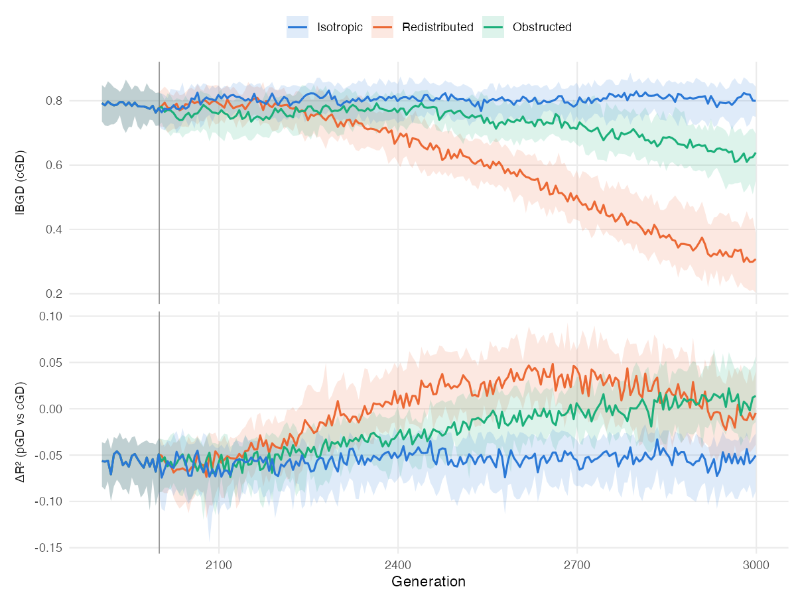

# Genetic Gravity I: Extracting Directional Gene Flow from Population Graphs

Rodney J. Dyer  
rjdyer@vcu.edu  
https://rodneydyer.com

[School of Life Sciences and Sustainability](https://slss.vcu.edu)  
[Virginia Commonwealth University](https://vcu.edu)  
Richmond, Virginia 23284

# Abstract

Inferring the directionality of gene flow from genetic data is a long-standing goal in evolutionary and landscape genetics, yet the measures most commonly employed, $F_{ST}$ pairwise genetic distances and model-based migration rates—are either explicitly symmetric or depend on equilibrium assumptions routinely violated in the colonizing, fragmenting, and environmentally filtered systems where directional flow matters most. Population Graphs (Dyer & Nason, 2004) recover the multivariate, conditional structure of genetic covariance as an undirected topology but do not, in canonical form, direct their edges. Here I introduce *genetic gravity*, a node-centric framework that converts a Population Graph’s undirected skeleton into a signed field of directional influence: for every retained edge, a pair of asymmetric weights $w_{i\rightarrow j}$ and $w_{j\rightarrow i}$ is derived from a Gaussian kernel over conditional genetic distances with a node-specific local bandwidth $b_i$, and their difference $\Delta_{ij}$ partitions the edge into directed components with no new connectivity and no free tuning parameter. Using stochastic individual-based simulations under isotropic and anisotropic migration, I characterize the index from single population-genetic snapshots: a model-comparison test for directional gene flow, usable on a single Population Graph without replicates, that asks whether a directional description of the graph's isolation-by-distance pattern fits better than a symmetric one; its specificity (it remains near zero under symmetric migration however much neutral differentiation accumulates); the sensitivity of its sign and rank to the bandwidth choice; and its behaviour relative to the differentiation-based estimator `divMigrate`, which it complements while avoiding the latter’s drift-driven false positives and fixation artifacts. Genetic gravity offers a topology-derived, equilibrium-free measure of directional connectivity; its longitudinal dynamics are treated in a companion paper. All analyses are implemented in the gstudio R package.

# Introduction

Inferring the pattern and direction of genetic connectivity from molecular data is a central problem in evolutionary, population, and landscape genetics (Slatkin, 1985; Dyer, 2015).  The distribution of population genetic covariance we see today is the result of overlapping evolutionary processes—stochastic, neutral, and adaptive.  A common approach to elucidating the relative importance of these processes is to partition genetic variance into within- and among-stratum components using Wright’s $F_{ST}$ (or one of its many derivatives).  Applying an underlying evolutionary model then allows us to compute the expected values of evolutionarily relevant parameters, such as migration rate (*m*; Slatkin 1981, 1993), genetic effective population size ($N_e$; XXX), inbreeding ($F_{IS}$; XXXX), and others.  This process raises several specific challenges to using the current distribution of genetic variation to infer historical processes.  First, the relationship between a standardized parameter estimated and the stratigraphy of evolutionary and demographic histories that produced the set of sampled alleles and genotypes is non-reversible—the same ratio of within- and among-stratum variances can arise from completely non-overlapping demographic and evolutionary histories.   Second, treating connectivity as a scalar, undirected quantity is analytically convenient, but it homogenizes the varied histories of interactions that created these systems by taking an ‘average across generations under equilibrium conditions’ rather than directly embracing the potential for spatial and temporal heterogeneity within populations.  Estimating the effective number of migrants per generation, *Nem*, is critical for comparative inferences, but may be too coarse when the analytical questions focus on more intricate demographic processes or when attempting to include more granular landscape, demographic, or ecological features that may affect standing genetic structure.  Questions focusing on understanding how genetic structure is affected by colonization, range expansion, source–sink dynamics, wind- or water-mediated dispersal, and environmentally filtered gene flow benefit from approaches that are more fine-grained than a single summarizing parameter, as these inter-strata interactions are heterogeneous and fundamentally *directional* in nature (Baker & Dyer, 2011; Wogan et al., 2024).

The field is not, of course, without tools for addressing questions such as these, and an increasingly sophisticated set of approaches is available for estimating heterogeneity in connectivity and asymmetric gene flow from genetic data. Assignment-based tools such as `BayesAss` infer recent, directional migration rates from multilocus genotypes under linkage and Hardy–Weinberg assumptions (Wilson & Rannala, 2003), while coalescent and isolation-with-migration frameworks recover asymmetric long-term migration matrices, either by direct likelihood over genealogies (Beerli & Felsenstein, 2001) or by fitting the joint site-frequency spectrum of a few populations (e.g., Gutenkunst et al., 2009). Where the question is specifically the direction of a range expansion, the directionality index $\psi$ reads the origin and axis of spread from pairwise allele-frequency asymmetries (Peter & Slatkin, 2013). At the landscape scale, effective-migration-surface methods map spatial heterogeneity in gene flow (Marcus et al., 2021; Petkova et al., 2016), and recent extensions of that family relax their symmetry assumption to render the surface directional. Each of these is powerful within its domain, but each also exacts a characteristic cost: a prespecified demographic or spatial model, an assumption of migration–drift equilibrium, genome-scale marker panels, a small number of demes, explicit spatial coordinates, or substantial computational resources. This manuscript provides a lightweight, assumption-free summary of *directional structure* that can be read directly from the multivariate covariance dependency topology and scales to many populations from a single snapshot. The framework extended herein is intended to fill this niche by using conditional genetic covariance structures, as represented within Population Graphs (Dyer & Nason, 2004; Dyer, 2007, 2015), to identify and quantify asymmetry in population migration.

Population Graphs offer a partial escape from the symmetry assumption using multilocus conditional genetic covariance within a graph-theoretic model. Rather than estimating a single pairwise statistic that describes the average among-stratum variance structure, the Population Graph framework translates the among-stratum variance into a weighted network of connectivity using conditional genetic covariance.  Population Graphs are distinct from pairwise structure or genetic distance analyses in one important way.  Pairwise approaches focus on estimates from each combinatorial pair of strata and, for example, reconstruct a relationship with pairwise distance (such as Slatkin’s $\hat{M}$ 19XX) to estimate isolation.  Conversely, estimates of stratum-to-stratum covariance in a Population Graph are based on the multilocus covariance between the two populations in question, statistically conditional on their covariance structures with the remaining populations in the analysis.  This resulting covariance topology captures dependencies that pairwise measures obscure. Moreover, the networks shape is diagnostic of the evolutionary processes that produced it—range expansions, vicariance, and equilibrium isolation-by-distance each leave characteristic signatures in node degree, edge length, and network diameter (Dyer, 2007, 2015). Population Graphs have been used to address questions of connectivity and structure in a broad range of scenarios including landscape genetics (Daniel et al., 2024; Dyer, 2015), conservation planning (Vilaça et al., 2024), biogeography (Wogan et al., 2024), life-history effects (Reed et al., 2023), invasive species management (Baker & Dyer, 2011), and pollen-mediated gene flow (Dileo et al., 2014; Dyer et al., 2004; Smouse et al., 2001).

The edges in a Population Graph are weighted estimates of conditional inter-population covariance: the conditional covariance $e_{ij}$ is a scalar, and the overall genetic covariance topology produced by the approach is, by definition, undirected.  Both source and sink populations may share a strong conditional dependency, but the *direction* of that dependency—who is overwriting whose allele frequencies—is a biologically distinct question that cannot be read directly from the undirected edge any more easily than it can be addressed with pairwise structure statistics. The same edge weight can be produced by a stable, symmetric exchange and by a unidirectional colonization pulse, yet the evolutionary implications are opposite, and in most cases, the actual inference of highest practical interest to the researcher.

Here, I introduce the concept of *genetic gravity*, an extension of the topology of the classic Population Graph that creates a node-centric framework for extracting directional information from an otherwise undirected Population Graph.  The goal here is to determine whether the conditional genetic structure encoded in the Population Graph topology itself can be used to partition symmetric covariance into asymmetric components, without invoking any new population-genetic model or incorporating additional outside information.  To this end,I begin by formalizing the notion of genetic-gravity deriving a pair of directional weights ($w_{i\rightarrow j}$ and  $w_{j\rightarrow i}$) for each edge ($e_{ij}$) to define an asymmetry index, $\Delta_{ij}$, associted with each edge.  For this, I introduce a node-local Gaussian kernel approach whose bandwidth is read directly from the Population Graph.  Second, I characterize the parameters' behavior—highlighting boundary effects that arise at low-degree nodes—under both stochastic models of symmetric and asymmetric connectivity. I validate the framework with stochastic individual-based simulations under three migration regimes—isotropic, redistributed anisotropic, and obstructed anisotropic—tracking both the canonical undirected Population Graph metrics and their directed counterparts derived from genetic gravity, as well as a mean asymmetry index $\Delta^{-}$. Next, I characterize the temporal dynamics and detectability of the directional signal against a within-replicate empirical null, using a standardized mixed-effects framework that explicitly models the strong autocorrelation of densely sampled graph trajectories.  Finally, I benchmark the asymmetry index against an existing approach suitable for the kinds of data found in the simulations using `divMigrate`, a widely used differentiation-based estimator of directional relative migration (Sundqvist et al., 2016).  The comparison is to evaluate the similarity in response of the two approaches, the sensitivity to changes in the underlying population covariance matrix driven by asymmetry in connectivity, and the relative accuracy at which each can approximate the true migration matrix used in the simulations.  All simulation routines and analysis functions have been implemented in the `gstudio` R package maintained by the author and are freely available. 
# Methods
The directional framework proposed here assumes that a Population Graph has already been constructed from multilocus genetic data; the relevant inputs are the symmetric edge weights $e_{ij}$ and the adjacency structure of the graph $G=\{V,E\}$ retained by the construction of this Markov independence graph. Notation follows the *Q*-mode formulation of Dyer et al. (2004) and the original Population Graph derivation in Dyer & Nason (2004); a compact summary sufficient for the derivation below is collected in the Supplementary Materials (Tab_Notation).
## The Model of Genetic Gravity
A Population Graph is a Markov independence graph and possesses several statistical features, two of which are relevant to the development of asymmetry models. First, a core property of all independence graphs concerns *graph separation*. Any pair of populations *directly* connected in a graph topology (e.g., $A\leftrightarrow B$ denoted by the edge $e_{AB}$) are, by definition, not genetically independent. Evolutionary processes that lead to conditional dependence include ongoing genetic connectivity or recent divergence from a common ancestral population.  Cessation of connectivity through time allows genetic drift and other processes to lead populations towards genetic independence. If populations are connected only *through* one or more other populations, in a stepwise fashion (e.g., $A\leftrightarrow B\leftrightarrow C$), populations not directly connected (such as $A$ and $C$) are, in population graphs, conditionally independent such that $P(A,C\mid B)=P(A\mid B)P(C\mid B)$.

Second, nodes in a Population Graph have pairwise *Markov independence*, meaning that any two non-adjacent populations are genetically independent, conditional to *all other populations* in the topology. If a sampling population is added or removed from the data set, the entire topology must be re-evaluated because the presence (and absence) of each edge depends on *all the data simultaneously*, not just the populations attached to that edge. This is one feature of Population Graphs that distinguishes them from more traditional pairwise structure estimators commonly used in evolutionary, landscape, and population genetic analyses. Markov independence is also reflexive: each target population is evolutionarily independent of all other populations in the topology, *given its* direct neighbors. Biologically, this guarantees that an edge weight reflects a genuine, direct evolutionary relationship between the two populations it connects, rather than an artifact of which other populations happened to be included in the sample—a property that matters when attributing a directional signal to a specific corridor of gene flow rather than incidental sampling design artifcacts. 
## Directional Weights
Each symmetric edge in a Population Graph is the pooled product of two conditional relationships: the contribution of population $j$ to the genetic structure of $i$, and the symmetric and opposite contribution of $i$ to $j$.  The edge weight, $e_{ij}$,  has been used as a measure of conditional genetic distance (cGD) to infer isolation by graph distance (Dyer 2015; Miles et al. 2018).

Focusing on each target node and its collection of neighboring edges ($N(i)$), I define a *directional weight* from node $i$ to node $j$ as the conditional probability that $j$ is the most influential neighbor of $i$ given the other nodes in $N(i)$ using a t-distribution Stochastic Neighborhood Embedding (tSNE; van der Maaten & Hinton 2008) approach where:

$$
w_{i\rightarrow j}= \frac{exp\left({- e_{ij}^{2}/2b_i^{2}}\right)}{\sum\limits_{k\in N(i)}^{}exp\left({- e_{ik}^{2}/2b_i^{2}}\right)}
$$

where $e_{ij}$ is the symmetric conditional-covariance edge weight from the Population Graph and $b_{i}$ is a node-specific *local bandwidth* parameter. The kernel is strictly local: only retained neighboring nodes, $j\in N(i)$ contribute to the denominator, so nodes that are conditionally independent of $i$ in $G$ (e.g., those beyond the first degree neighbors) contribute nothing due to the Markov properties of the Population Graph.  The bandwidth $b_{i}$ controls the rate at which the Gaussian kernel in Equation 1 decays with distance: a large $b_{i}$ spreads influence broadly across the neighborhood, while a small $b_{i}$ concentrates it on the nearest neighbor. Intuitively, a node whose retained neighbors are genetically more divergent, whether because it occupies a bridging position between differentiated clusters in the connectivity network or because it lies at the edge of a stepping-stone chain, receives a broad kernel that distributes its directional influence proportionally over that extended neighborhood, whereas a node embedded in a tight cluster of genetically similar populations receives a narrow kernel that concentrates its signal on its closest retained neighbors.  I set the local bandwidth to the mean edge weight over node $i$’s retained neighborhood:

$$
b_{i} = \frac{s_{i}}{k_{i}} = \frac{1}{k_{i}}\sum\limits_{j\in N(i)}^{}e_{ij}
$$

where $s_{i}=\sum\limits_{j\in N(i)}^{}e_{ij}$ is the *strength* (weighted degree) of node $i$.  Moreover, this parameter is scale-equivariant: for any constant $c>0$, rescaling every conditional distance $e_{ij}\mapsto c e_{ij}$ sends $b_{i}\mapsto c b_{i}$, leaves each exponent $e_{ij}^{2}/2b_i^{2}$ fixed, and hence

$$
w_{i\rightarrow j}(c e)=w_{i\rightarrow j}(e),  \; \; \Delta_{ij}(c e)=\Delta_{ij}(e) \;\;  (c>0).
$$
In practice, this means $\Delta_{ij}$ captures relative directional imbalance rather than absolute genetic differentiation: two Population Graphs built from markers with very different overall levels of divergence—or the same graph with every distance rescaled by an arbitrary constant—will agree on which edges are directional and by how much in relative terms, so the index is comparable across datasets and marker panels rather than being an artifact of how much raw differentiation happens to be present.
## Genetic Gravity: The Asymmetry Index
For every edge $e_{ij}\in E$, the directional weights $w_{i\rightarrow j}$ and $w_{j\rightarrow i}$ are computed independently from the two nodes’ local bandwidths:
$$
w_{i\rightarrow j}=\frac{exp(-e_{ij}^{2}/2b_i^{2})}{\sum\limits_{k\in N(i)}^{}exp(-e_{ik}^{2}/2b_i^{2})}, \; \; \; \;  w_{j\rightarrow i}=\frac{exp(-e_{ij}^{2}/2b_j^{2})}{\sum\limits_{k\in N(j)}^{}exp(-e_{jk}^{2}/2b_j^{2})}
$$
Because $b_{i}\ne b_{j}$ in general, the weights differ. The signed difference
$$
\Delta_{ij} = w_{i\rightarrow j}-w_{j\rightarrow i}
$$
is the *asymmetry index*, interpretable as the net directional pressure exerted on edge $(i,j)$. Positive $\Delta_{ij}$ indicates that the edge contributes disproportionately more to the conditional structure of node $j$ than of node $i$—a signature consistent with $i$ acting as a source and $j$ as a sink. A value near zero indicates a symmetric balanced exchange; a large estimate of $|\Delta_{ij}|$ indicates a strongly directional edge (the sign of which will determine direction).   Disproportionate importance in conditional covariance is what I define as *Genetic Gravity* and can be though of as a kind of introgression pressure developed by the identity of individuals in the two populations and their topological location within the larger Population Graph.

It is worth being explicit about how a *directed* quantity can arise from an object that is symmetric by construction. The conditional-covariance structure underlying a Population Graph, and the edge weights $e_{ij}$ read from it, are symmetric (e.g., $e_{ij}=e_{ji}$); no manipulation of a single edge weight can yield a direction. The asymmetry index does not come from the edge itself, it comes from the two *neighborhoods the edge is compared against*.  The local bandwidth $b_{i}$ is node $i$’s native genetic-distance scale, the mean conditional distance over its retained neighborhood, and the directional weight $w_{i\rightarrow j}$ measures how near edge $(i,j)$ is *relative to that scale*. The same edge weight $e_{ij}$ therefore reads as relatively near when $i$ sits in a diffuse, genetically distant neighborhood (large $b_{i}$) and relatively far when $j$ sits in a tight, genetically similar one (small $b_{j}$). The difference between these two relative readings, $\Delta_{ij}$, determines whether the edge is more typical of $i$’s local scale or of $j$’s. Biologically, a tight local scale is what a population diverging largely on its own, with limited outside input, is expected to show, while a broad local scale is what a population absorbing gene flow from several more differentiated sources, or sitting at a junction between distinct clusters, is expected to exhibit—so comparing scales across an edge is, in effect, comparing how isolated versus how connected each of the two populations has been. A symmetric edge embedded between two neighborhoods of *different scales* are asymmetric in this relational sense, and that asymmetry is information the symmetric matrix contains but that a pairwise reading of the edge in isolation discards; hence the nomenclature of *Genetic Gravity.* For more on the separability of directionality from node degree, see Supplementary Materials, *Bandwidth is Not Degree*.

The same two directional weights that define $\Delta_{ij}$ also let the edge's conditional genetic distance itself be split directionally. Partitioning $e_{ij}$ in proportion to $w_{i\rightarrow j}$ and $w_{j\rightarrow i}$ yields a *partitioned conditional genetic distance* (pGD): $p_{ij} = e_{ij}\,w_{i\rightarrow j}/(w_{i\rightarrow j}+w_{j\rightarrow i})$, and correspondingly $p_{ji} = e_{ij}\,w_{j\rightarrow i}/(w_{i\rightarrow j}+w_{j\rightarrow i})$, so that $p_{ij}+p_{ji}=e_{ij}$, with $p_{ij}=p_{ji}=e_{ij}/2$ under symmetric connectivity. Unlike $e_{ij}$ itself, which is symmetric by construction, pGD assigns each direction of an edge its own share of the conditional distance, turning the Population Graph's otherwise-undirected edge set into a directed, asymmetrically-weighted graph over the same topology—used directly in the comparison with `divMigrate` below.

Classic population genetic theory provides some expectations for the asymmetry statistic in discrete populations under migration–drift processes. Comparing systems with isotropic and anisotropic gene flow, we expect diverging responses in the trajectory of resident allele frequencies. In isotropic systems, the entire metapopulation is connected and will, eventually, tend to $\bar{p}$, minimizing structure and erasing any evidence of isolation by distance. The introduction of asymmetry will be impacted by two factors: 1) the magnitude of $m$, and 2) the relative ratio of asymmetry in $m_{i\rightarrow i+1}$ vs. $m_{i\leftarrow i+1}$. These act on different aspects of the system's response: the relative difference between the two rates sets the direction and strength of the net force driving the metapopulation away from a differentiated topology, while the absolute magnitude of both rates together sets how quickly the system moves along that trajectory, independent of direction. Two migration regimes with the same directional imbalance but different total flux are therefore expected to approach the same eventual state at different rates, and this should be visible both in how quickly the asymmetry index itself develops and in how quickly the graph's topology responds.

## Bandwidth sensitivity

Because the local bandwidth $b_{i}=s_{i}/k_{i}$ is itself a modeling choice, its sensitivity was assessed directly: $\Delta$ was recomputed on the forward-phase snapshots under three departures from this canonical local bandwidth—a fixed *global* bandwidth (a single scale, the mean retained edge weight, applied to every node), the local bandwidth *scaled* by $\frac{1}{2}$ and by $2$ (a sharper and a flatter kernel), and a *perplexity*-based per-node bandwidth (a tSNE-style $\sigma$ search)—and compared, edge by edge and at the graph-mean level, to the canonical estimator (Results; Supplementary Materials).

## Individual-based simulations
The sensitivity and temporal behavior of the asymmetry index were evaluated using *individual-based stochastic simulation* following Dyer (2007). Every replicate run tracks a metapopulation of $K=25$ discrete demes, each of which has $N=100$ diploid individuals with $L=20$ independently segregating, codominant, biallelic loci.  Each replicate run of the simulations started with random allele frequencies.  Generations were simulated as non-overlapping and all mating is random within the population.  Mutation was excluded to isolate drift–migration dynamics. Migrants were selected at random each generation according to the fixed migration rate. Dyer (2007) showed using similar indiviudal-based forward time simulations that graph-theoretic parametes such as average degree centrality ($\bar{C}_D$) and graph diameter ($\bar{d}_G$) stabilized much quicker than population genetic structure ($\Phi_{ST}$) or patterns of isolation by distance ($\hat{M}$).  While the primary focus of this paper is extending the Population Graph focus, we will be comparing the existence of asymmetry ($\Delta_{ij}$) from this framework to an approach that relies on genetic structure. Consequently, each replicate run will use a 2,000-generation burn-in of symmetric gene flow on a one-dimensional symmetric stepping-stone topology ($m_{i\rightarrow i+1}=m_{i\leftarrow i+1}=0.025$, where the population pair is always ordered $(i,i{+}1)$ and the arrow alone indicates forward versus reverse flow).  The previous work suggested this would be sufficient for burn in using both graph-theoretic and population genetic metrics.  Simulations were checked to ensure they were in drift–migration equilibrium.  Fifty replicates were run to provide confidence on resulting patterns.

*Tab_ScenarioParameters:* Post-burn-in migration parameters for the three simulation scenarios. All scenarios share an identical 2,000-generation isotropic burn-in before the treatment matrix is applied.

| Name          | $m_{i \rightarrow i+1}$ |  $m_{i \leftarrow i+1}$ |  $m_{Total}$ | Ratio | Constant               |
|---------------|:-----------------------:|:-----------------------:|:------------:|:-----:|------------------------|
| Isotropic     | 0.025                   | 0.025                   | 0.050        | 1:1   | Symmetric connectivity |
| Redistributed | 0.040                   | 0.010                   | 0.050        | 4:1   | Total emigration rate  |
| Obstructed    | 0.025                   | 0.010                   | 0.035        | 2.5:1 | Forward rate           |

After burn-in, each replicate run was used as the initial configuration to examine the consequences of separate patterns of connectivity for another 2,000 generations (Tab_ScenarioParameters) applied to the same evolutionary trajectory.  *Isotropic* migration continued symmetric connectivity between all populations ($m_{i\rightarrow i+1} = m_{i\leftarrow i+1} = 0.025$) and served as a null case onto which asymmetric connectivity was evaluated.  *Redistributed* asymmetry kept overall migration rate fixed ($m = 0.05$), but reconfigured it in a 4:1 bias in direction ($m_{i\rightarrow i+1} = 0.04$; $m_{i\leftarrow i+1} = 0.01$).  Across all simulated demes, bias was implemented in the same direction (as may be experienced under a model of range expansion or down stream dispersal).  Holding per-population drift dynamics fixed alowed changes in $\Delta_{ij}$ to reflect redistribution of total migration.  Across all replicates and scenarios, the simulations were run for an additional 1,000 generations.

A second asymmetry scenario was also added, an *obstructed* asymmetry which held forward migration rate fixed but suppressed reverse migration by 60% ($m_{i\rightarrow i+1} = 0.025$; $m_{i\leftarrow i+1} = 0.01$), modeling ambient-rate forward dispersal (as in the *isotropic* case) against a partially obstructed return path connectivity.  Each asymmetric case was designed to deviate from the paired isotoropic simulation in exactly one parameter so their contrasts would elucidated orthogonal drivers on the parameter $\Delta_{ij}$: isotropic versus redistributed isolates directional balance at fixed total flux rates and isotropic versus obstructed isolates back-flow suppression at fixed forward rate.  Comparisons between the redistributed and obstructed scenarios also uncovers the incremental effect of forward-rate migration elevation. Because all three scenarios branch from the same burn-in state within each replicate, the isotropic trajectory at each forward generation serves as a within-replicate empirical, fixed evolutionary trajectory null. 

There are several expectations and discrete phases in the evolution of population structure expected to emerge from these scenarios. The first phase (*Burn In*) allows all replicates to start from random initial conditions and, given the underlying migration matrix, gain stability in both within- and among-population covariance, measured using either graph-theoretic or population genetic parameters; because migration is symmetric throughout this phase, its endpoint is the only point in the simulation at which a genuinely symmetric migration–drift equilibrium is guaranteed to hold, and it is therefore the appropriate reference point for characterizing the false-positive rate of any significance test intended for later use in the forward phase, before drift-driven reorganization has had a chance to accumulate. The application of a modified migration matrix enters the populations into a second phase, *Reorganization*, in which population covariance is restructured in response to the new pattern and rate of connectivity; this phase would not be observed in the *Isotropic* scenario but would be evident in both the *Redistributed* and *Obstructed* lineages. Because each replicate enters this phase from the same burn-in-equilibrated starting configuration but then evolves as an independent stochastic realization, replicates are not expected to reorganize in lock-step: each replicate's Population Graph structure moves toward the imposed asymmetry at its own rate, governed by which lineages happen to drift toward fixation first, so the variance across replicates in any snapshot-based statistic is itself expected to change over the forward phase—rising as an increasing fraction of replicates begin losing diversity while others have not, reaching a zenith, and falling again as the remaining replicates catch up. This replicate-specific pacing is why lineages are aligned on their own informative state—remaining genetic diversity, or each replicate's own peak in the asymmetry index—rather than on generation time, whenever the question is the shape of the reorganization signal itself rather than its population-level average timing. The next phase is relative *Stability* under the new migration matrix, analogous to the stability sought at the end of the Burn In phase, though whether it is reached within a finite observation window depends on the strength of the imposed asymmetry. Finally, in a closed migration–drift system without mutation, a sustained directional bias in pairwise migration rate is expected, in the limit as $t\rightarrow\infty$, to homogenize allele frequencies across the chain rather than sustain a differentiated topology—for two exchanging demes with $m_{i\rightarrow i+1}>m_{i\leftarrow i+1}$, classical migration theory gives $p_{i+1}\rightarrow p_{i}$ as $t\rightarrow\infty$, with reverse migration only slowing that convergence—so in one-dimensional stepping-stone models at these levels of asymmetry, genetic homogenization is expected to cascade in the direction of dominant migration, and in the limit all populations converge and both diversity and structure collapse. This last phase, *Collapse*, has two distinct empirical signatures as loci approach fixation. First, the conditional genetic covariance from which a Population Graph is estimated degenerates as allele frequencies homogenize, so retained edges are progressively lost and, past some point, a graph can no longer be estimated at all—a structural failure that is itself diagnostic of how far a lineage has progressed. Second, differentiation-based statistics that normalize by a measure of genetic differentiation between populations are expected to become numerically unstable as that differentiation collapses toward zero at fixed pairs, returning undefined, negative, or spuriously extreme values rather than failing outright (Results, Comparison to `divMigrate`). The two behaviors matter differently for inference: a Population Graph that fails to build signals its own limits directly, whereas a differentiation-normalized statistic can return a value that looks like an ordinary estimate without signaling that it no longer reflects genuine biological signal. The time it takes each replicate to pass through these stages is therefore expected to be lineage-specific, depending on how, and how much, its own evolutionary trajectory has distributed genetic variation within and among populations.

To help identify these stages in each replicate, a snapshot of multilocus genotypes was retained every five generations. The genotypes of each snapshot were converted into a Population Graph (Dyer & Nason 2004).  In addition to directional weights and asymmetry indices, edge density, graph diameter, and mean conditional genetic distance (cGD) were retained for each snapshot for compison to structure and isolation by distance inferences after Dyer (2007).  

## Significance Testing for Asymmetry

In the simulations the direction of gene flow is known because it was imposed; in an empirical study it is not. Estimating a Population Graph and fitting isolation by graph distance (IBGD) to its conditional genetic distances is already routine, and the question of asymmetry arises only when a researcher suspects directional gene flow or wants to know whether it is present. We therefore treat the test for asymmetry as a comparison between two isolation models fit to the same Population Graph—one that assumes gene flow is symmetric and one that allows it to be directional—rather than as a permutation null on $\Delta_{ij}$ itself. Permutation and sign-exchangeability nulls on the asymmetry index were evaluated and found to be anti-conservative under symmetric migration (Supplementary Materials, Permutation nulls for $\Delta_{ij}$), because $\Delta_{ij}$ inherits node-level structure (degree and bandwidth) that no within-graph exchangeability null reproduces.

The procedure follows the order in which a researcher would apply it:

1. **Estimate the topology and fit standard IBGD.** The Population Graph is estimated as usual, and all-pairs conditional genetic distance (cGD, the shortest-path distance over edge weights $e_{ij}$) is regressed on pairwise spatial separation, $|dx_{ij}|$, giving $R^2_{cGD}$. If asymmetry is not suspected, the analysis ends here.
2. **Estimate the directional distances.** If asymmetry is suspected, the directed graph with arc costs $p_{ij}$ (pGD; *Genetic Gravity: The Asymmetry Index*) is formed and all-pairs directed shortest-path distances are computed, so that the distance from $i$ to $j$ may differ from the distance from $j$ to $i$.
3. **Fit a directional isolation model.** A directional model requires direction on both sides of the regression: the genetic response (pGD, over ordered pairs $i\neq j$) and the spatial separation. Spatial direction is supplied by a hypothesized axis of flow—downstream, a prevailing wind or current, or the front of a range expansion; here, the one-dimensional stepping-stone chain—so that each ordered pair is either *forward* ($j$ lies downstream of $i$) or *reverse*. The model $\text{pGD}_{ij} \sim |dx_{ij}| + |dx_{ij}| \cdot r_{ij}$, where $r_{ij}=1$ for reverse pairs, gives pGD separate forward and reverse isolation slopes, with fit $R^2_{pGD}$ (adjusted for the additional slope).
4. **Compare the fits.** If $\Delta R^2 = R^2_{pGD} - R^2_{cGD} > 0$, the directional description of the graph explains isolation better than the symmetric one, which is consistent with asymmetric gene flow along the hypothesized axis. If $\Delta R^2 \le 0$, the symmetric description is sufficient; this is an absence of evidence for asymmetry, not evidence of symmetry.
5. **Describe the asymmetry.** Where the directional fit is supported, the ratio of the forward to the reverse slope, $b_{fwd}/b_{rev}$, gives the direction and relative strength of isolation along the axis: a ratio below one means genetic distance accumulates more slowly downstream than upstream.

Because $R^2_{cGD}$ and $R^2_{pGD}$ are fit to different response matrices, the comparison is not a nested-model test; it asks which representation of the same Population Graph—symmetric or directional—geography describes better. Its error rates were therefore characterized empirically. The false-positive rate is the fraction of censuses with $\Delta R^2>0$ under symmetric migration, using both the final 100 generations of burn-in (twenty 5-generation censuses per replicate, 1,000 censuses in total; Individual-based simulations) and the entire isotropic forward phase (200 censuses per replicate, 10,000 in total). Detection was measured as the same fraction under the redistributed and obstructed treatments, summarized by forward-phase window so that the rate can be read against the reorganization, stability, and collapse phases described above.

## Comparison with a differentiation-based method
To evaluate the sensitivity of the asymmetry statistic, $\Delta_{ij}$,  the data were also evaluated against an existing tool that ingests the same kinds of genetic data used for these individual-based simululations, `divMigrate` (Sundqvist et al., 2016).  This method estimates directional relative migration between population pairs by estimating genetic differentiation and is among the most widely used network-level descriptors of asymmetric gene flow that is applied to population-level sampling with co-dominant multilocus genotypes. The statistic used throughout this comparison, divMigrate's $N_m$, is not a classical migration-rate estimator despite the name; it is Alcalá et al.'s (2014) formula, which combines harmonic-mean $G_{ST}$ and Jost's $D$, and is the statistic Sundqvist et al. (2016) report behaves most like $G_{ST}$, their recommended choice. 

As noted in the Introduction, the Population Graph's minimal topology and divMigrate's exhaustive pairwise estimation are not directly comparable: the Population Graph retains only a subset of the $K(K-1)/2$ potential pairs as edges, and the more spatial genetic structure present in the system, the fewer edges remain (Dyer 2007). Comparing the two therefore required translating the Population Graph's edge weights into a form defined over all pairs (pGD, above), and the comparison was examined from the following two perspectives.  

**Similarity in the evolution of asymmetry.** The pGD-weighted directed graph (*Genetic Gravity: The Asymmetry Index*) formed the basis for this comparison: all-pairs directed shortest-path distances $D_{ij}$ were computed across it, treating pGD as arc cost, rescaled to $[0,1]$, and converted to a bounded similarity $S_{ij}=1/(1+D_{ij})$, producing a dense $K\times K$ matrix comparable in form to divMigrate's output. We compared $S_{ij}$ to divMigrate's $N_m$-based relative migration matrix [@Sundqvist2016] at matching census points using Spearman's $\rho$ over the off-diagonal pairs, without significance testing; pairs unreachable in the Population Graph or undefined by divMigrate were excluded. This comparison was carried out across all three treatments — isotropic, redistributed, and obstructed — to assess whether the two independently derived measures of directional structure track one another, and how closely, over the course of the simulation. 

**Correlation with the underlying migration matrix.** The parameter $S_{ij}$ (Similarity in the evolution of asymmetry, above) and `divMigrate`'s $N_m$ agree with one another, but agreement between two indirect estimators cannot by itself establish that either one is reading the real underlying process. Because the forward-phase simulations impose a known, fixed migration schedule (Tab_ScenarioParameters), the true directional migration matrix is available independently of any inference drawn from the simulated genotypes: for every scenario, $m_{i\rightarrow j}$ equals the scenario's forward or reverse rate on each stepping-stone link and zero for every non-adjacent pair.  These rates were held constant across the entire forward phase of the simulations. This lets `divMigrate`'s $N_m$ and genetic gravity's own directional weight, $w_{i\rightarrow j}$, each be tested directly against ground truth rather than each other. Because `divMigrate`'s $N_m$ is itself a relative-migration statistic, rescaled within each census to its own maximum, $w_{i\rightarrow j}$ and the true migration matrix values from the simulations were similarly standardized to homogenize comparisons.  At each census and replicate, agreement with the true matrix was summarized as Spearman's $\rho$ for both Nm and $w_{i \to j}$.  The deviance was also evaluated using the root mean square error (RMSE).  It is important to point out that the true migration rates throughout the majority of the K(K-1)/2 entries were zero, so RMSE is dominated by agreement on non-corridor pairs rather than by how well either estimator resolves the corridors that matter—restricting to only the first-neighbor migration rates used in the simulations felts biased since the entire purpose of doing this is to try to recover the underlying patterns of connectivity, which we never have *a priori*. It is reported nonetheless for transparency rather than omitted as an unfavorable or uninformative comparison. 

# Results

### Isotropic baseline

Individual-based simulations were run to establish that the burn-in period produces stable, comparable starting topologies before any directional treatment is applied. Dyer (2007) showed that mean degree centrality ($\bar{C}_D$) and graph diameter track standard population-genetic measures of structure and gene flow ($F_{ST}$ and Slatkin's $\hat{M}$); here, where the focus is the graph's topology itself rather than that correspondence, the same two metrics serve as a check that replicate runs have converged to equilibrium. Across the isotropic replicates, $\bar{C}_D$ falls and graph diameter rises from their initial values, each relaxing toward a stable plateau within the 2,000-generation burn-in and remaining flat through the subsequent isotropic forward phase (Fig_IsotropicBaseline). The magnitude of the asymmetry index, $\overline{|\Delta_{ij}|}$, follows the same relaxation on the same timescale—rising from near zero toward its own plateau—consistent with it inheriting the graph's topological legacy rather than reflecting any directional gene flow, since none is present in this scenario. The signed mean, by contrast, remains centered on zero throughout the simulation (not shown; forward-phase $\bar{\Delta}$ = 0.0014, 95% CI 0.0003–0.0025), confirming that the isotropic replicates carry no net directional bias. Every replicate therefore enters the forward phase—and the redistributed and obstructed treatments that follow—from a topologically equilibrated, directionally unbiased, and directly comparable starting configuration, establishing the isotropic scenario as the empirical null against which asymmetry in the other two scenarios is judged.

*Fig_IsotropicBaseline*: Structural stability of Population Graphs under symmetric (isotropic) migration as depicted by degree centrality, $\bar{C}_D$, and graph diameter (following Dyer 2007), and by the mean absolute asymmetry index, $\overline{|\Delta_{ij}|}$, for the isotropic replicates. The background shading represents the empirical $\pm$ 1 standard deviation from the simulated data. The red line is an exponential approach to equilibrium, $y = y_\infty + (y_0 - y_\infty)e^{-t/\tau}$, fit to the burn-in period; it is extended as a dashed line to show its projection across the isotropic phase (n.b., the vertical dashed line represents the end of the ‘burn-in’ period).

### Consequences of Redistributed and Obstructed connectivity

Trends across the forward phase were estimated with a penalized regression spline rather than the parametric exponential-equilibrium curve used for the isotropic burn-in (Fig_IsotropicBaseline). The burn-in is a relaxation to a single equilibrium and the exponential form fits it well, but the forward-phase trajectories are not: redistributed diameter follows a sigmoidal decline, redistributed signed $\bar{\Delta}$ is biphasic (negative before reversing to positive), and obstructed diameter rises before declining back toward its starting value (Fig_ScenarioComparison; Fig_SignedAsymmetry in Supplementary Materials) — no single parametric family fit all three without one or more parameters running to their bounds (e.g., a plateau parameter projected far beyond the range of the data). Each trend line is therefore a generalized additive model, $y \sim s(\text{generation}, k=20) + s(\text{replicate}, \text{bs}=\text{"re"})$, fit by REML (`mgcv`) to every replicate snapshot in the forward phase, with the per-replicate random intercept excluded from the plotted prediction; the random effect keeps a few extreme replicates from dominating the fitted trend without altering what the trend represents. The isotropic reference shown alongside each scenario is the burn-in's exponential-equilibrium fit (Fig_IsotropicBaseline), extrapolated across the forward phase.

*Fig_ScenarioComparison*: Forward-phase (generations 2000–2999) trends in graph structure and asymmetry magnitude under the redistributed (left) and obstructed (right) scenarios, on shared axes for direct comparison—mean degree centrality ($\bar{C}_D$), graph diameter, and mean absolute asymmetry ($\overline{|\Delta_{ij}|}$)—mirroring Fig_IsotropicBaseline. The dashed line is the isotropic burn-in's fitted exponential-equilibrium curve, extrapolated across the forward phase, as the null reference; the shaded band is the empirical $\pm$1 SD across replicates and the solid red line is a fitted trend (a penalized regression spline; see Results for the fitting rationale, Supplementary Materials for diagnostics). Diameter shows the clearest contrast: redistributed stays near the isotropic level before collapsing sharply after about generation 2350, while obstructed rises well above it, holds, and only eases slightly after generation 2800 — a qualitatively different trajectory, not simply a slower version of the same collapse.

Under the redistributed treatment, the topological signature of directional migration emerges within the forward phase itself, well before the terminal snapshot (Fig_ScenarioComparison, left). $\bar{C}_D$ and graph diameter, both flat through the isotropic forward phase (Isotropic baseline), diverge from the isotropic reference soon after treatment begins: over the final 50 snapshots (generations 2950–2999), $\bar{C}_D$ averages 0.270 against an isotropic 0.318, and diameter averages 7.90 — roughly half the isotropic 16.14 — following a sigmoidal decline. The asymmetry index tracks the same divergence: mean $|\Delta_{ij}|$ remains within the isotropic band through the early redistributed phase before climbing steadily to a late-phase average of 0.133 (isotropic: 0.034), roughly four-fold. This combination — rising asymmetry alongside a collapsing diameter and falling $\bar{C}_D$ — is consistent with the expectation noted in Methods that a sustained directional bias in a closed migration–drift system erodes rather than sustains a differentiated topology: redistribution is not only making gene flow asymmetric, it is progressively homogenizing the chain.

Under the obstructed treatment the asymmetry index also rises, but on this window's evidence, more slowly than under redistribution (Fig_ScenarioComparison, right). $\bar{C}_D$ declines in a similar fashion to redistributed (late-phase average 0.259 against isotropic 0.318). Graph diameter behaves qualitatively differently from redistributed, rather than tracing a delayed version of the same shape: redistributed diameter stays near the isotropic level until about generation 2350, then collapses sharply to roughly 7, while obstructed diameter instead rises substantially — to roughly 19.5 — around generation 2500–2750, holds near that peak, and only eases slightly after generation 2800 (late-phase average 18.37 against isotropic 16.14, still declining at generation 3000). The two trajectories differ in kind, not merely in timescale; it is the signed asymmetry index, not diameter, that preserves the same trough-and-reversal shape across both treatments. The signed asymmetry index shows the same ratio (Supplementary Materials, Fig_SignedAsymmetry): redistributed $\bar{\Delta}$ reaches its minimum around generation 2400 (~400 generations post-onset) before reversing sign near generation 2680, while obstructed $\bar{\Delta}$ reaches its minimum around generation 2800 (~800 generations post-onset) and is only beginning to reverse by the end of the window. This two-fold timescale difference tracks the difference in net directional migration bias between the scenarios exactly: $m_{i\rightarrow i+1}-m_{i\leftarrow i+1}=0.03$ for redistributed versus $0.015$ for obstructed (Methods; each scenario was designed to isolate one departure from isotropic rather than to hold total migration rate fixed against the other, so total flux also differs between them—0.05 versus 0.035—and is not excluded as a contributor, though its smaller, roughly 1.4-fold difference tracks the observed timescale ratio less closely than $\Delta m$ does). Mean $|\Delta_{ij}|$ is consistent with the same picture, rising more gradually than under redistribution to a late-phase average of 0.062, roughly half the redistributed value. The asymmetry index and diameter therefore diverge in what they show about obstructed's progress toward homogenization within this window: $|\Delta_{ij}|$ and the signed asymmetry index both trace slowed, roughly twice-as-slow versions of redistributed's trajectory, but graph diameter instead rises and holds near a new plateau rather than collapsing—==perhaps because the smaller net bias and reduced total flux under obstruction are enough to reshape the graph's connectivity pattern without yet driving the chain toward the single, fully homogenized topology that redistribution reaches within this window==; the 1,000-generation forward window may simply not be long enough to see obstructed's diameter collapse the way redistributed's does.

### Directional isolation by graph distance

The same reorganization–peak–collapse pattern is visible in the graph's principal downstream use: relating conditional genetic distance to geographic distance as a measure of isolation by graph distance (IBGD). Standard IBGD—the fit ($R^2$) of symmetric cGD regressed against pairwise spatial separation, $|dx|$—stays flat under isotropic migration (medians of 0.79–0.81 across the forward phase) but weakens once migration becomes asymmetric, falling to roughly 0.30–0.35 by generation 3000 under redistribution and more gradually to roughly 0.63–0.64 under obstruction (Fig_DirectionalIBGD, top). Part of what standard IBGD loses under asymmetry is directional structure that a model allowing pGD separate forward and reverse slopes against the same spatial distance can recover: the $R^2$ gained by modelling direction explicitly—a direction-aware pGD fit minus a direction-blind pGD fit against the same $|dx|$—sits at a floor of about 0.03 under isotropic migration (not exactly zero, since splitting each edge into two directional observations always lets the second slope absorb some noise, together with each lineage's own small burn-in lean; Isotropic baseline), rises to a peak of about 0.27–0.29 during redistributed reorganization (generations 2400–2700) before falling back as those lineages collapse, and rises more slowly under obstruction to about 0.23–0.25, still near that level at generation 2999 without having collapsed within the window—consistent with obstruction's smaller net directional bias and lower total migration rate moving every phase more slowly (Consequences of Redistributed and Obstructed connectivity; Methods).

*Fig_DirectionalIBGD:* Isolation by graph distance under symmetric and directional treatment of the same edges, by scenario. Top: $R^2$ for standard IBGD, cGD regressed against spatial distance $|dx|$. Bottom: the additional $R^2$ gained by letting pGD's forward and reverse edge distances take separate slopes against the same $|dx|$, relative to a single shared (direction-blind) pGD slope. The vertical line marks the end of burn-in. Isotropic remains flat on both measures throughout the forward phase; redistributed and obstructed both trace the reorganization–peak–collapse pattern established elsewhere (Consequences of Redistributed and Obstructed connectivity), redistributed reaching its peak gain earlier and higher before falling back as those lineages collapse, obstructed rising more slowly to a lower peak that persists through the end of the window.

*Tab_IBGDFitComparison:* Median $R^2$ for standard (symmetric) IBGD compared against pGD fit without and with direction modelled explicitly, by scenario and window (Isotropic: full forward phase; Redistributed and Obstructed: each scenario's peak $\Delta R^2$ window, Fig_DirectionalIBGD). The rightmost column is the fraction of censuses in that window at which the direction-aware pGD model's $R^2$ exceeds standard cGD IBGD's.

| Scenario | Standard cGD $R^2$ | pGD, direction-blind | pGD, direction-aware | Direction-aware beats cGD |
| :---- | :---: | :---: | :---: | :---: |
| Isotropic | 0.79–0.81 | 0.66–0.68 | 0.72–0.75 | 4% of censuses |
| Redistributed, 2400s | 0.66 | 0.40 | 0.67 | 65% |
| Obstructed, 2800s | 0.67 | 0.43 | 0.68 | 54% |

The gain shown in Fig_DirectionalIBGD is measured against pGD's own direction-blind fit, not against standard cGD IBGD directly, and the distinction matters: splitting each edge into two directional pGD observations against the same undirected spatial distance adds scatter that a shared, direction-blind slope cannot absorb, so a direction-blind pGD model fits worse than standard cGD IBGD even under isotropic migration (Tab_IBGDFitComparison). Modelling direction recovers that loss and, under strong asymmetry, a little more—and the resulting fit exceeds standard cGD IBGD in 54–65% of censuses at each scenario's peak (65% redistributed, 54% obstructed) but in only 4% of censuses under isotropic migration. The claim these data support is accordingly narrower than "pGD gives a better IBGD fit than cGD": standard IBGD weakens under asymmetric gene flow, part of what it loses is directional structure, and a direction-aware model recovers that loss—exceeding the standard symmetric fit when, and largely only when, gene flow is asymmetric. That asymmetry-specific reversal is what makes the comparison usable as a test (Significance Testing & False Positive Rates).

### Significance Testing & False Positive Rates

Under symmetric migration the directional isolation model almost never displaces standard IBGD. In the final 100 generations of burn-in, $R^2_{pGD}$ exceeded $R^2_{cGD}$ in 1.9% of censuses (19 of 1,000; 95% CI 1.1–3.0%), and across the entire isotropic forward phase in 4.1% (95% CI 3.7–4.5%, 10,000 censuses), with a median $\Delta R^2$ of $-0.055$ in both. Without any calibration to the simulations, the decision rule $\Delta R^2>0$ therefore holds a false-positive rate at or below a conventional 5% level. The negative median is the cost of the directional description when there is no direction to describe: splitting each edge into two directional observations adds scatter that the forward and reverse slopes cannot recover (Directional isolation by graph distance).

Under asymmetric migration the comparison reverses, tracking the phases of the forward simulation (Tab_IBGDDetection, Supplementary Materials). During reorganization (generations 2004–2249) the directional model was preferred in only 12% of redistributed and 6% of obstructed censuses, barely above the symmetric rate—the imposed asymmetry has not yet restructured the graph. Once it has, detection rose to 54–73% of redistributed censuses, peaking at 73% in generations 2504–2749 before declining to 55% as lineages collapsed. Obstructed connectivity, with its smaller net directional bias and lower total migration, moved through the same sequence more slowly, rising from 20% (2254–2499) to 43% and then 54% by the end of the window, without collapsing. Where the directional model was preferred, it also recovered the imposed direction: the forward-to-reverse slope ratio was below one in 99% of detections under both treatments (median 0.31 redistributed, 0.37 obstructed), against a median of 1.11 (IQR 0.87–1.40) under isotropic migration.

The test is one-sided in what it can establish. A preferred directional fit is good evidence of asymmetric gene flow along the hypothesized axis, but a preferred symmetric fit is not evidence against it: even at their peaks, 27–46% of asymmetric censuses still favored cGD, and during reorganization nearly all did. Two alternatives were considered and rejected as the decision statistic. The gain from adding the direction term within pGD alone (direction-aware against direction-blind pGD) is positive in 94% of isotropic censuses, because the added slope always absorbs some noise, so it can serve as a test only with a threshold calibrated by simulation. The slope ratio separates the scenarios more sharply (AUC 0.92–0.99 against isotropic once asymmetry is established), but its detection threshold is likewise simulation-specific; it is reported here as the description of a detected asymmetry rather than as the test for one.

The comparison also bears on what each representation of the graph is for. For isolation by distance in the ordinary sense—genetic distance against the separation of sampling locations, with no hypothesis about direction—cGD is the appropriate distance, and splitting it directionally only adds noise. When the migration process is itself directional, however, the directional partition of the same edges describes isolation better than the symmetric one, and it does so specifically when, and because, gene flow is asymmetric. This is the downstream counterpart of the fidelity result (Comparison to `divMigrate`): the directional weights recover the imposed migration matrix, and that information is what the directional isolation model exploits.

### Divergence among redistributed lineages

Because each replicate evolves as an independent stochastic realization once asymmetric migration is imposed, individual redistributed lineages are not expected to track a single shared trajectory (Methods). Two lines of evidence bear on this directly. First, redistributed lineages lose genetic diversity at markedly different rates: the summed effective number of alleles across loci, $\sum A_e$, diverges from the isotropic band over the course of the forward phase, and several replicates approach fixation well before others (Fig_LineageDiversity). Re-indexing asymmetry against each replicate's own remaining diversity rather than generation collapses much of this spread — mean $|\Delta_{ij}|$ and signed $\bar\Delta$ both stay within the isotropic band until $\sum A_e$ falls below roughly 25–27, then rise steeply as replicates approach fixation (Fig_LineageClock), consistent with the asymmetry signal tracking how far each lineage has progressed toward fixation rather than elapsed time alone. A companion comparison against a null built from information loss alone — rebuilding isotropic graphs from random subsets of polymorphic loci — shows that information loss inflates $|\Delta_{ij}|$ by more than 10% only below an informative horizon of about 4.5 polymorphic loci per deme (Fig_InformationNull), so the late-phase rise in asymmetry is not simply an artifact of shrinking locus counts, though it does contribute once replicates approach that horizon.

*Fig_LineageDiversity*: Loss of genetic diversity in independent redistributed lineages, measured as the sum across all 20 loci of the effective number of alleles, $\sum A_e$, for the metapopulation (top) and averaged within demes (bottom). Each red line is one redistributed replicate; grey lines are the isotropic replicates. The dashed line ($\sum A_e = 20$) marks fixation at every locus. The difference between the two panels is the among-deme component of diversity from which the Population Graph is estimated.

*Fig_LineageClock*: Asymmetry plotted against each lineage's own remaining diversity rather than generation, so that replicates are compared at equivalent genetic states. Mean absolute (top) and signed (bottom) asymmetry index for each redistributed replicate (faint lines, 25-generation windows) against its metapopulation $\sum A_e$. The red line is a penalized-spline trend across replicates, and the dashed line is the isotropic plateau of $\overline{|\Delta_{ij}|}$ (Fig_IsotropicBaseline).

*Fig_InformationNull*: Directional signal versus information loss. Mean absolute (top) and signed (bottom) asymmetry index for every redistributed snapshot (points) against the mean number of loci polymorphic within demes. The black line and band are the median and 90% range for isotropic graphs rebuilt from random subsets of polymorphic loci—the values expected from information content alone. The vertical dashed line marks the informative horizon (4.5 polymorphic loci per deme), below which information loss alone inflates $\overline{|\Delta_{ij}|}$ by more than 10%.

Second, aligning each replicate's own trajectory to its own smoothed peak in $|\Delta_{ij}|$ (Fig_PeakAlignment) isolates the within-replicate rise from the differing timing between replicates. Individual redistributed lineages climb steadily for roughly 700 generations before reaching their own peak; peaks are identified from a smoothing spline fit to each replicate rather than its single highest window, so the climb is not an artifact of noise. Sixteen of the 50 redistributed replicates turn over before generation 2950 (median peak at generation 2869); the remaining 34 are still rising when the simulation window ends at generation 3000. The isotropic control, given the identical alignment procedure, shows only a small bump around its own alignment point, confirming that the long climb seen in redistributed replicates is real signal rather than an artifact of the alignment itself.

*Fig_PeakAlignment*: Redistributed lineages rise to a peak in mean absolute asymmetry, $\overline{|\Delta_{ij}|}$, and then decline. Each faint line is one replicate (25-generation windows), aligned at the peak of a penalized spline fit to that replicate's trajectory (vertical dashed line). The red line is the median across replicates, shown where at least five replicates contribute. The dashed grey line applies the same alignment to the isotropic replicates, whose $\overline{|\Delta_{ij}|}$ is stationary, and shows the rise and fall produced by the alignment procedure alone.

Measured from each replicate's smoothed peak to generation 2999, the median decline among redistributed replicates is 13%, comparable in relative size to the 17% decline the isotropic control shows over the same post-alignment window, though redistributed's decline is larger in absolute terms because its peak is larger. The post-peak median is drawn from only the 16 early-turnover replicates and is shown only where at least five replicates contribute (Fig_PeakAlignment). The median peak (generation 2869) falls after the median informative-horizon crossing (generation 2674, Fig_InformationNull). Whether the decline is distinguishable from noise, and what would be needed to establish that it is, is taken up in Discussion (Caveats and limitations).

### Bandwidth sensitivity

The bandwidth estimator $b_{i}=s_{i}/k_{i}$ is a modeling choice (Methods); the question here is not its absolute scale but whether the *sign* and *rank order* of $\Delta_{ij}$—which edge flows which way, and which edges carry the strongest signal—survive a deliberately non-local choice. $\Delta$ was recomputed under each of the alternative bandwidths (Methods) and compared, edge by edge, to the canonical local estimator on the comparable $w_{i\rightarrow j}-w_{j\rightarrow i}$ scale: the fraction of edges with the same sign, the Spearman correlation of the signed $\Delta$ and of $|\Delta |$, and whether the graph-mean $\bar{\Delta}$ keeps its sign, all recorded against the canonical index over the directional scenarios.

*Tab_BandwidthSensitivity:* Bandwidth sensitivity of the asymmetry index, pooled over the two directional scenarios ($N=100$, generation 2999). Each row recomputes Delta under a non-local bandwidth and compares it edge-by-edge to the canonical local estimator $b_{i}=s_{i}/k_{i}$: the fraction of edges with the same sign, the Spearman correlation of the sign of Δ and of its absolute value (|Δ| rank order), and the fraction of snapshots whose graph-mean Delta-bar keeps its sign. Higher values indicate greater preservation of the canonical directional structure; the rows show moderate edge-level preservation alongside a steadier graph-mean.

| Bandwidth | Concordance | Rank ρ (signed) | Rank ρ (\|Δ\|) | Δ̄ sign kept |
| :---: | :---: | :---: | :---: | :---: |   
| Fixed global | 84.2% | 0.710 | 0.562 | 83% |   
| Local × ½ | 78.5% | 0.616 | 0.385 | 91% |   
| Local × 2 | 82.8% | 0.781 | 0.644 | 76% |   
| Perplexity  | 74.5% | 0.382 | 0.329 | 91% |   

The result separates the aggregate from the edge level (Tab_BandwidthSensitivity). Edge-level direction is only *moderately* preserved: across the four non-local alternatives, the sign of $\Delta_{ij}$ agrees with the canonical local estimator on 75–84% of edges—so roughly one edge in five changes orientation—and the signed rank order correlates at Spearman $\rho =0.38$–0.78, weakest for the perplexity kernel (a genuinely different construction rather than a rescaling) and imperfect even for the mild $\times \frac{1}{2}$ and $\times 2$ rescalings. The graph-mean $\bar{\Delta}$ is steadier: its sign is preserved across the alternatives in 87% of redistributed and 84% of obstructed snapshots. What these numbers mean for how edge-level versus aggregate results should be read is taken up in Discussion (Caveats and limitations).

### Comparison to `divMigrate`

Across all three scenarios, the pGD-derived similarity $S_{ij}$ and divMigrate's $N_m$ track a common signal for most of the forward phase before diverging, rather than disagreeing from the outset (Fig_DivMigrateCorrelation). Under isotropic migration the two remain in close agreement throughout, with Spearman's $\rho$ fluctuating narrowly around 0.80–0.85. Under redistributed connectivity, $\rho$ starts near this isotropic level (\~0.83) and declines steadily to roughly 0.60 by generation 3000, with the spread across replicates widening sharply from around generation 2700–2800 onward — coincident with the onset of census-to-census instability in $S_{ij}$ under this scenario (Supplementary Materials). Under obstructed connectivity the decline is shallower and more gradual, from roughly 0.80 to 0.70, with less replicate-to-replicate spread than under redistribution throughout.

*Fig_DivMigrateCorrelation:* Similarity in the evolution of asymmetry between the pGD-derived similarity matrix $S_{ij}$ and divMigrate's $N_m$-based relative migration matrix (Similarity in the evolution of asymmetry), by treatment (panels): Spearman's $\rho$ between the two matrices' off-diagonal entries at each census, for every replicate (grey) with the across-replicate median (red). Under isotropic migration $\rho$ is flat throughout the forward phase, fluctuating narrowly around 0.80-0.85. Under redistribution $\rho$ starts near the isotropic level (\~0.83) and declines steadily to a median of roughly 0.60 by generation 3000, with the spread across replicates widening sharply from around generation 2700-2800 onward — well after diameter has already collapsed (Consequences of Redistributed and Obstructed connectivity) but coincident with the onset of the lag-1 instability in $S$ (Supplementary Materials, Fig_DivMigrateLag1). Under obstruction the decline is shallower and more gradual, from \~0.80 to \~0.70, with less replicate-to-replicate spread than redistribution throughout. In both asymmetric scenarios the two independently derived measures of directional structure track one another closely for most of the forward phase before diverging, rather than disagreeing from the outset.

Because the forward-phase simulations impose a known, fixed migration schedule, the true directional migration matrix is available independently of any inference drawn from the genotypes themselves — a comparison possible here only because the underlying process was simulated rather than observed, and one with no analog when applying either method to empirical data. Against this ground truth, genetic gravity's raw directional weight $w_{i\rightarrow j}$ tracks the true matrix more closely than divMigrate's $N_m$ under isotropic and obstructed migration throughout the forward phase (Fig_DivMigrateTruth). Under redistributed migration the same advantage holds until the topology itself begins to destabilize late in the window. Towards the end of the forward phase, loci at affected pairs become fixed and `divMigrate`'s $N_m$ turns undefined or spuriously negative rather than simply small (Fig_DivMigrateTimecourse); any census carrying such a value on any of the $K(K-1)$ pairs — not only retained graph edges — was excluded from the paired comparison entirely, for both `divMigrate` and its own rescaling denominator, rather than clipped or substituted. This exclusion is most severe in late-window redistributed censuses, where $N_m$'s own comparison ends up resting on an increasingly small and unrepresentative subset of replicates in which it remains defined (dropout approaching ==XX%== of censuses by generation 3000). To avoid crediting $w_{i\rightarrow j}$ with an advantage that is partly an artifact of that shrinking, easier subset, its agreement with the truth is also reported across every census regardless of $N_m$'s availability, alongside the percentage of replicates retained at each census; on that fairer, all-censuses basis, $w_{i\rightarrow j}$'s own agreement with the truth also declines late in the redistributed window, to roughly 0.15–0.18, coinciding with the same loss of topological structure evident in graph diameter and in census-to-census stability (Consequences of Redistributed and Obstructed connectivity; Supplementary Materials). Spearman's $\rho$ is the primary measure of agreement reported here; RMSE was also examined but discriminates less cleanly between the two estimators and is reported alongside it for completeness (Methods).

*Fig_DivMigrateTruth:* Agreement of each directional estimator with the true simulated migration matrix, by scenario (columns) and metric (rows: Spearman's $\rho$, RMSE, and percent of replicates retained). At every census, $\rho$ and RMSE are computed between an estimate and the true matrix across all 600 ordered population pairs (diagonals excluded); the true matrix carries the scenario's forward and reverse rates on the 48 stepping-stone links and zero elsewhere. The gravity estimate is the raw directional weight $w_{i\rightarrow j}$, used directly rather than through the pGD transform (Methods), and divMigrate's estimate is its relative $N_m$. Each matrix, including the truth, is rescaled by its own maximum. Solid lines are the across-replicate median restricted to censuses at which $N_m$ is defined on every pair, the same censuses underlying $N_m$'s own curve; the dashed line ($w_{i\rightarrow j}$, all censuses) instead includes every census regardless of $N_m$'s availability, and the bottom row shows the percentage of replicates retained by the paired restriction at each census. Censuses at which $N_m$ was non-finite or negative on any pair are excluded from the paired series: ==X== of ==N== redistributed censuses (==XX.X%==), ==X== of ==N== obstructed (==XX.X%==), and none isotropic. Under isotropic and obstructed migration, $w_{i\rightarrow j}$ tracks the truth more closely than $N_m$ throughout, and the paired and all-censuses series stay close together, consistent with the low, gradual $N_m$ dropout in those two scenarios (bottom row). Under redistribution, dropout approaches ==XX%== by generation 3000; the paired series, resting on that shrinking and increasingly unrepresentative subset of replicates, stays elevated and noisy late in the window, while the all-censuses series — the fairer measure of $w_{i\rightarrow j}$'s own performance — declines to roughly ==0.15–0.18==, below $N_m$'s own late-window level. This late-redistributed decline coincides with the same loss of topological structure documented elsewhere (Supplementary Materials, Fig_DivMigrateLag1; Consequences of Redistributed and Obstructed connectivity) and should be read as both estimators degrading together once the topology itself destabilizes, not as $w_{i\rightarrow j}$ retaining an advantage throughout. RMSE is reported for completeness despite its limited utility here (Methods): it is dominated by the large majority of true-zero pairs, is weakened as a magnitude measure by the per-matrix rescaling both series require, and crosses between the two estimators at different points in each scenario without a clear mechanistic explanation.

*Fig_DivMigrateTimecourse:* Descriptive view of the raw signal underlying the sensitivity analysis (Fig_DivMigrateSensitivity). Each curve is the across-replicate mean (± 1 SE) of the per-replicate difference between an asymmetric scenario and its paired isotropic value, in mean signed edge asymmetry, over the forward phase; the dashed line at zero is the symmetric-migration null. Filled points mark generations at which the paired difference is significant at α = 0.05; the vertical rule marks each method’s first sustained-significant generation, shown for reference only. For genetic gravity this is generation 2804 under redistribution and 2154 under obstruction. For divMigrate it is generation 2004 under obstruction, where it is significant at every census, and generation 2999 under redistribution. That is the final census point, so under redistribution divMigrate never reaches sustained significance within the forward phase proper, although individual generations are significant from 2004 onward and its late estimates rest on the few replicates in which it has not yet broken down (see below). The two scenarios reach sustained significance in the opposite order from what their terminal effect sizes would predict, and this follows from the shape of the underlying signed asymmetry trajectory rather than from a difference in signal strength (Consequences of Redistributed and Obstructed connectivity; Fig_SignedAsymmetry in Supplementary Materials). Obstructed $\bar{\Delta}$ is negative and growing in magnitude throughout almost the entire forward phase, only beginning to reverse near the end of the window, so once its difference from the isotropic null clears the significance threshold it stays on the same side of zero and the run of significant generations holds continuously from generation 2154 on. Redistributed $\bar{\Delta}$, by contrast, passes through zero: it is transiently negative, reaches its minimum around generation 2400, and reverses to positive near generation 2680, so an early run of significant negative generations is broken as the difference crosses back through the isotropic null before re-accumulating, in the reversed direction, to the point of renewed significance. The later, generation-2804, sustained-significance point for redistributed therefore reflects the time needed to rebuild a significant difference after this sign reversal, not a weaker or later-emerging effect; over the full window redistributed's asymmetry signal is the stronger of the two. Panels are the two asymmetric scenarios. divMigrate uses the Nm statistic, and snapshots in which it breaks down are excluded from its curves, but not from the gravity curves. In 453 of 1,050 redistributed and 140 of 1,050 obstructed snapshots (none isotropic), Nm on at least one graph edge is undefined (NaN). Four further snapshots (1 redistributed, 3 obstructed) carry a finite but extremely large negative Nm on an edge. That drives the snapshot's mean $|A|$ to between $4\times10^{7}$ and $4.5\times10^{9}$, a value that valid relative migration, bounded in \[0, 1\], cannot produce. In three more (1 redistributed, 2 obstructed), Nm for a pair off the graph is infinite. Because divMigrate rescales each matrix by its maximum, every other value, and therefore every edge asymmetry, becomes exactly zero, which a valid matrix never produces. In all, 455 redistributed and 145 obstructed snapshots are excluded. Left in, these four single snapshots would break the run of significant obstructed generations at 2654, 2804, and 2904 by inflating that generation's variance. Both failures reflect loss of the differentiation signal as drift fixes loci. The undefined estimates occur at population pairs that are fixed for the same allele at nearly every locus: a third of such redistributed pairs are identically fixed at all 20 loci, and 81% have lower pooled heterozygosity than the unaffected pairs in the same snapshot. The negative estimates occur at pairs that are still polymorphic (none fully fixed) and only modestly less diverse than their unaffected neighbours, consistent with sampling error around a small true differentiation. With these snapshots excluded, every plotted mean and error band falls within the gravity index's range, so the y-axis is not truncated. The gravity index, which derives from the conditional graph topology rather than from pairwise differentiation, is unaffected.

==[Pending] Sensitivity/timecourse Results paragraph not yet drafted — covers Fig_DivMigrateSensitivity and Fig_DivMigrateTimecourse (gravity reaches sustained significance at generation 2804 redistributed / 2154 obstructed; divMigrate's Nm-based AUC falls below chance under both scenarios, undermined by the fixation-driven breakdown documented in Fig_DivMigrateTimecourse). Draft when ready.==

*Fig_DivMigrateSensitivity:* Single-snapshot sensitivity of the two indices over the generations following the onset of asymmetry, treating each replicate as an independent trial scored against the isotropic null. Top row: rank-based AUC (separation of asymmetric from symmetric replicates; dashed line is the AUC = 0.5 no-discrimination null). Bottom row: power — the fraction of asymmetric replicates detected at a fixed 5% false-positive rate (dashed line at 0.05 is the chance rate). Columns are the two asymmetric scenarios. The window is restricted to the first \~400 generations, where the gravity curves rise toward their plateau and before the divMigrate fixation artifact (see below) sets in. divMigrate (Nm) is computed from the same genotype snapshots. Its AUC declines in both scenarios, but at different rates. Under redistribution it starts near 0.57–0.58 (+0 to +50 generations), sits at 0.51 by +100–150, and has crossed below the 0.5 line by +200 (0.35), falling to 0.15 by +400. Under obstruction it stays above 0.5 through the first 200 generations (0.51–0.67, peaking at +50), and only then drifts below, to 0.40 at +400. Under redistribution, divMigrate therefore crosses below 0.5 about 50 generations earlier and ends far lower (0.15 vs. 0.40 at +400). In both scenarios its power stays near the 5% chance rate (at most 0.18 under redistribution and 0.14 under obstruction). An AUC below 0.5 means asymmetric replicates carry *smaller* mean $|A|$ than isotropic ones, so divMigrate’s asymmetry magnitude does not separate asymmetric from symmetric replicates in the expected direction, whereas the gravity index’s AUC and power rise with time since onset.

## Software and data availability
The asymmetry index, the local-bandwidth estimator, and the significance procedures described here are implemented in the open-source gstudio R package (R. Dyer, 2013), which also incorporates the conditional genetic-covariance routines of the former popgraph package.  The simulation code, analysis scripts, and derived data that reproduce all figures and tables in this paper are available in the project repository.
# References
Alcalá, N., Goudet, J., & Vuilleumier, S. (2014). On the transition of genetic differentiation from isolation to panmixia: What we can learn from $G_{ST}$ and $D$. *Theoretical Population Biology*, *93*, 75–84.

Baker, S. A., & Dyer, R. J. (2011). Invasion genetics of Microstegium vimineum (Poaceae) within the James River basin of Virginia, USA. *Conservation Genetics*, *12*. [https://doi.org/10.1007/s10592-011-0186-0](https://doi.org/10.1007/s10592-011-0186-0)

Beerli, P., & Felsenstein, J. (2001). Maximum likelihood estimation of a migration matrix and effective population sizes in n subpopulations by using a coalescent approach. *Proceedings of the National Academy of Sciences*, *98*(8), 4563–4568.

Daniel, A., Savary, P., Foltête, J. C., Vuidel, G., Faivre, B., Garnier, S., & Khimoun, A. (2024). What can optimized cost distances based on genetic distances offer? A simulation study on the use and misuse of ResistanceGA. *Molecular Ecology Resources*. [https://doi.org/10.1111/1755-0998.14024](https://doi.org/10.1111/1755-0998.14024)

Dileo, M. F., Siu, J. C., Rhodes, M. K., Lõpez-Villalobos, A., Redwine, A., Ksiazek, K., & Dyer, R. J. (2014). The gravity of pollination: Integrating at-site features into spatial analysis of contemporary pollen movement. *Molecular Ecology*, *23*. [https://doi.org/10.1111/mec.12839](https://doi.org/10.1111/mec.12839)

Dyer, R. J., Westfall, R. D., Sork, V. L., & Smouse, P. E. (2004). Two-generation analysis of pollen flow across a landscape v: A stepwise approach tor extracting factors contributing to pollen structure. *Heredity*, *92*, 204–211.

Dyer, R. J. (2015). Population graphs and landscape genetics. In *Annual Review of Ecology, Evolution, and Systematics* (Vol. 46). [https://doi.org/10.1146/annurev-ecolsys-112414-054150](https://doi.org/10.1146/annurev-ecolsys-112414-054150)

Dyer, R. (2007). The evolution of genetic topologies. *Theoretical Population Biology*, *71*, 71–79.

Dyer, R. (2013). *Popgraph: An r package for estimating conditional genetic covariance.* [https://github.com/dyerlab/popgraph/](https://github.com/dyerlab/popgraph/)

Dyer, R. J., & Nason, J. D. (2004). Population graphs: The graph theoretic shape of genetic structure. *Molecular Ecology*, *13*, 1713–1727. [http://www.ncbi.nlm.nih.gov/pubmed/15189198](http://www.ncbi.nlm.nih.gov/pubmed/15189198)

Gower, J. C. (1966). Some distince properties of latent root and vector methods used in multivariate analysis. *Biometrika*, *53*, 325–338.

Gutenkunst, R. N., Hernandez, R. D., Williamson, S. H., & Bustamante, C. D. (2009). Inferring the joint demographic history of multiple populations from multidimensional SNP frequency data. *PLoS Genetics*, *5*(10), e1000695.

Marcus, J., Ha, W., Barber, R. F., & Novembre, J. (2021). Fast and flexible estimation of effective migration surfaces. *eLife*, *10*, e61927.

Miles, L. S., Dyer, R. J., & Verrelli, B. C. (2018). Urban hubs of connectivity: Contrasting patterns of gene flow within and among cities in the western black widow spider. *Proceedings of the Royal Society B: Biological Sciences*, *285*. [https://doi.org/10.1098/rspb.2018.1224](https://doi.org/10.1098/rspb.2018.1224)

Peter, B. M., & Slatkin, M. (2013). Detecting range expansions from genetic data. *Evolution*, *67*(11), 3274–3289.

Petkova, D., Novembre, J., & Stephens, M. (2016). Visualizing spatial population structure with estimated effective migration surfaces. *Nature Genetics*, *48*(1), 94–100.

Reed, E. M. X., Reiskind, M. H., & Reiskind, M. O. B. (2023). Life-history stage and the population genetics of the tiger mosquito, *Aedes albopictus*, at a fine spatial scale. *Medical and Veterinary Entomology*, *37*, 132–142. [https://doi.org/10.1111/mve.12618](https://doi.org/10.1111/mve.12618)

Slatkin, M. (1985). Gene flow in natural populations. *Annual Review of Ecology and Systematics*, *16*, 393–430.

Slatkin, M. (1981). Estimating levels of gene flow in natural populations. *Genetics*, *99*, 323–335.

Slatkin, M. (1993). Isolation by distance in equilibrium and non-equilibrium populations. *Evolution*, *47*, 264–279.

Smouse, P. E., Dyer, R. J., Westfall, R. D., & Sork, V. L. (2001). Two-generation analysis of pollen flow across a landscape i: Male gamete heterogeneity among females. *Evolution*, *55*, 260–271.

Sundqvist, L., Zackrisson, M., & Kleinhans, D. (2016). Directional genetic differentiation and relative migration. *Ecology and Evolution*, *6*(11), 3461–3475.

van der Maaten L. J. P., & Hinton, G. E.  2008.  Visualizing high-dimensional data using t-SNE.  *Journal of Machine Learning Research*, 9: 2579-2605.

Vilaça, S. T., Dalapicolla, J., Soares, R., Guedes, N. M. R., Miyaki, C. Y., & Aleixo, A. (2024). Prioritizing conservation areas for the hyacinth macaw (Anodorhynchus hyacinthinus) in Brazil from low-coverage genomic data. *Evolutionary Applications*, *17*. [https://doi.org/10.1111/eva.70039](https://doi.org/10.1111/eva.70039)

Wilson, G. A., & Rannala, B. (2003). Bayesian inference of recent migration rates using multilocus genotypes. *Genetics*, *163*(3), 1177–1191.

Wogan, G. O. U., Voelker, G., Jain, T., Kaliba, P., & Bowie, R. C. K. (2024). Niche dynamics modulate population connectivity between disjunct ranges of the Cape Robin-Chat (Cossypha caffra), supporting an aridlands species pump. *Frontiers of Biogeography*, *17*. [https://doi.org/10.21425/fob.17.132679](https://doi.org/10.21425/fob.17.132679)

Wright, S. (1943). Isolation by distance. *Genetics*, *28*, 114–156.
