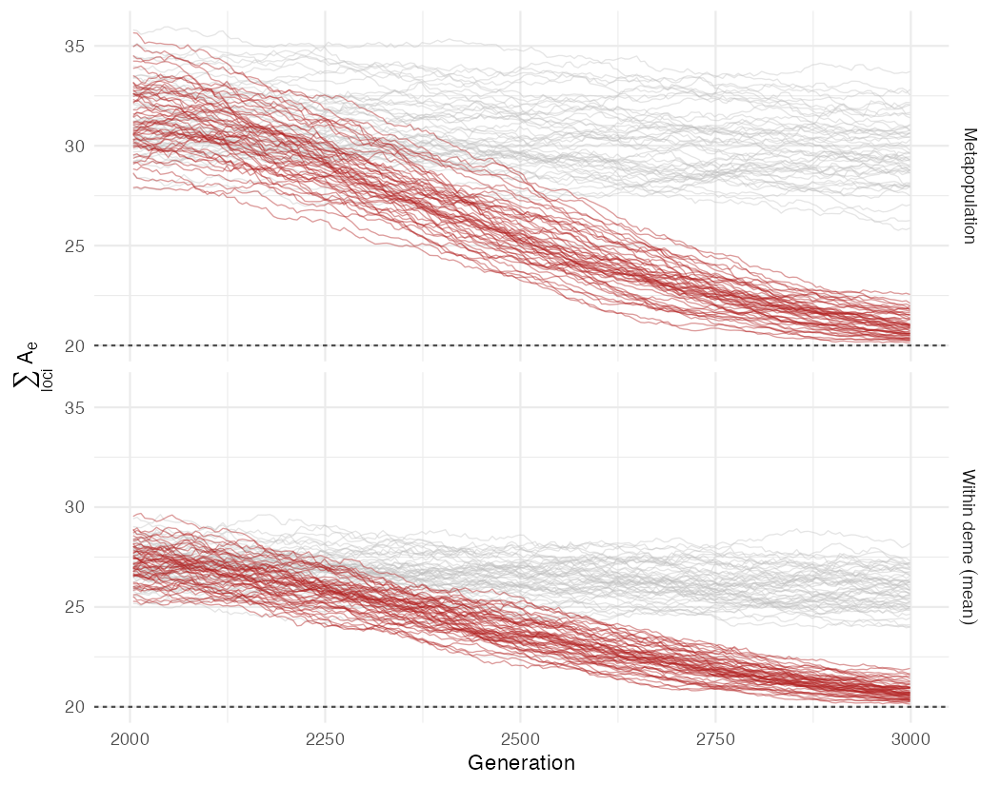
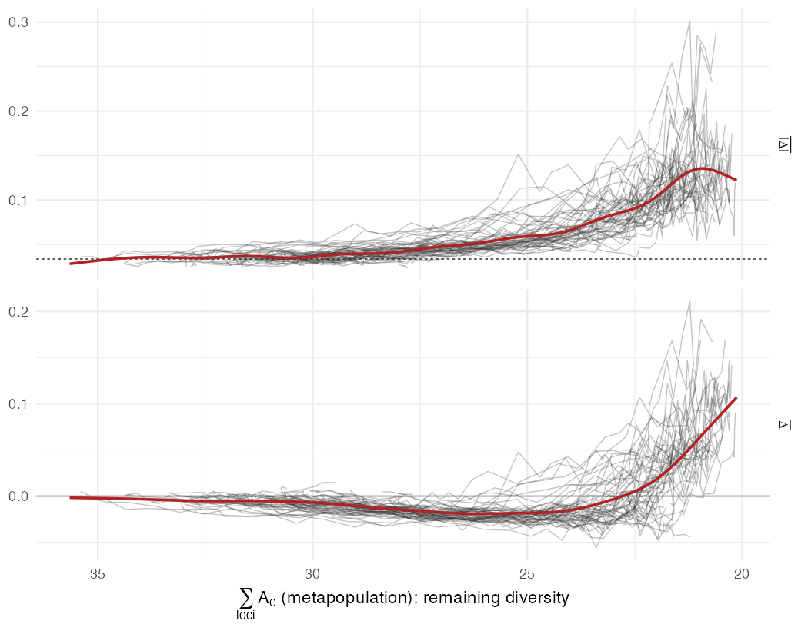
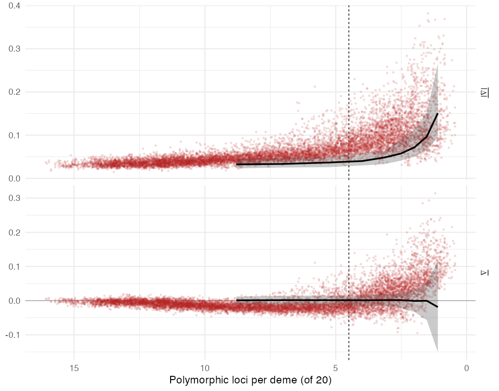
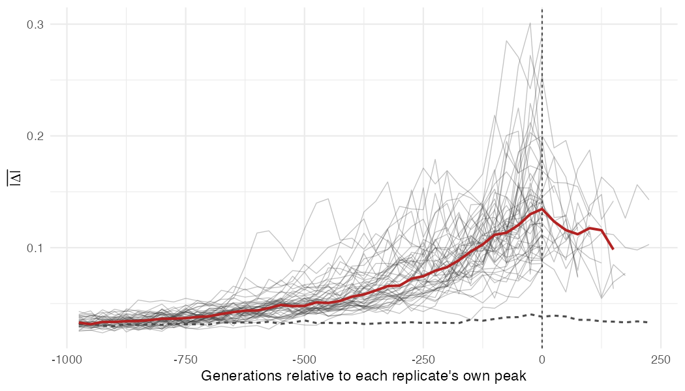
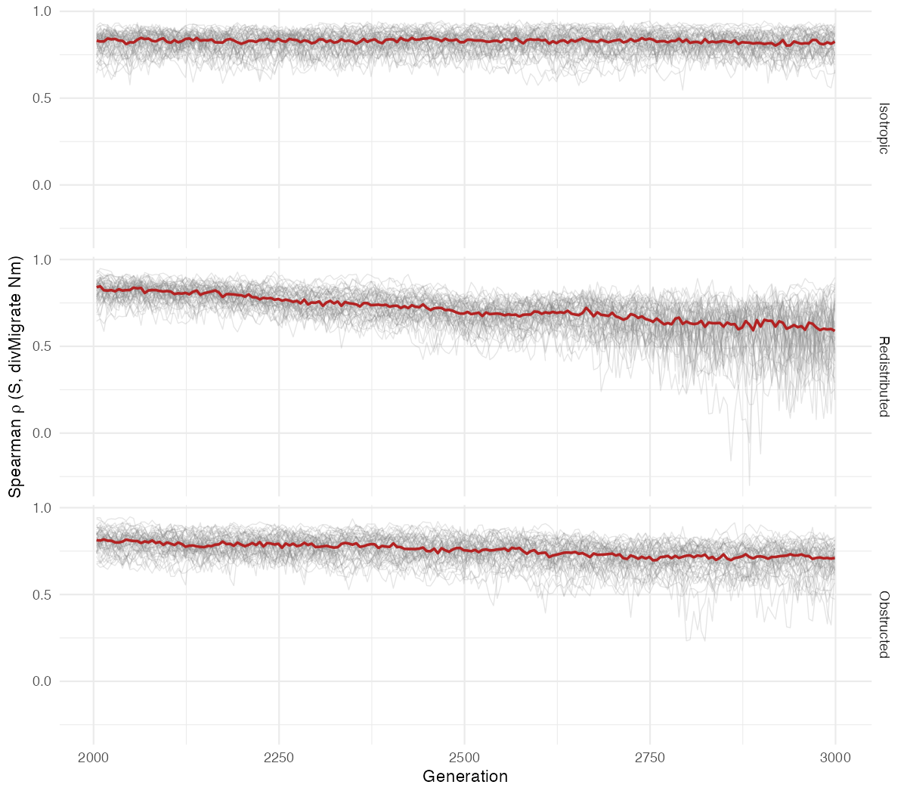
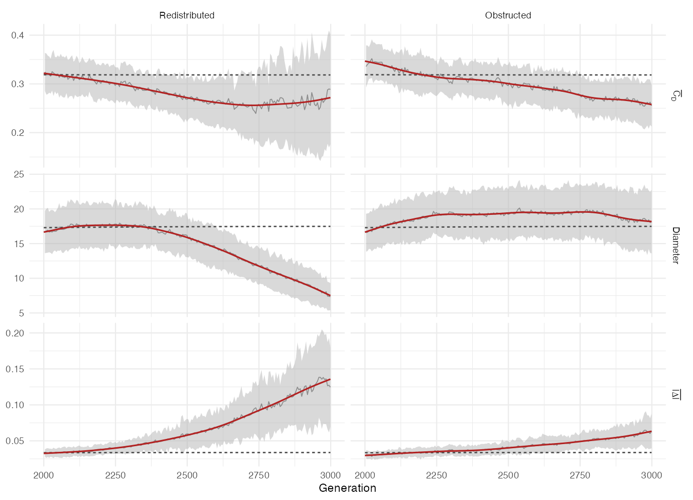
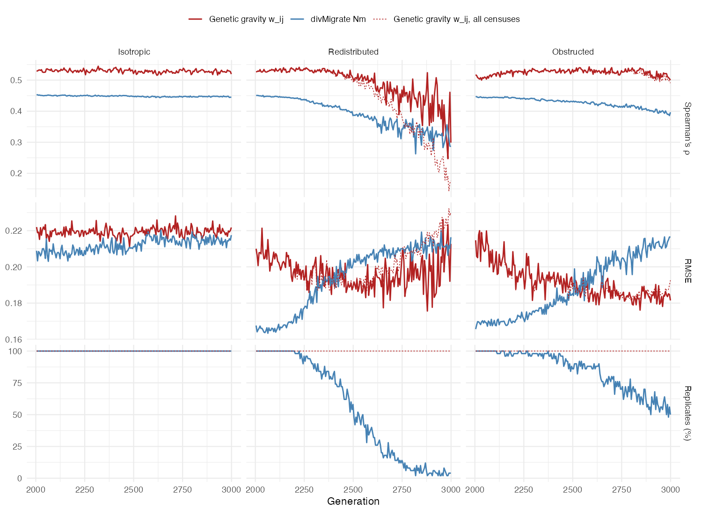
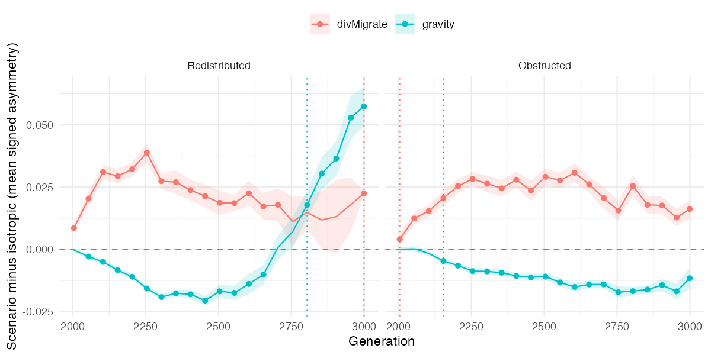
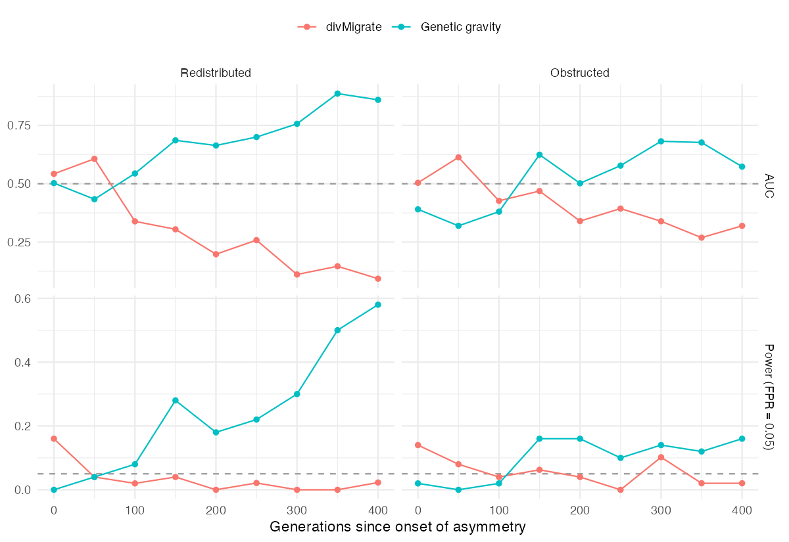

# Genetic Gravity I: Extracting Directional Gene Flow from Population Graphs

Rodney J. Dyer  
rjdyer@vcu.edu  
https://rodneydyer.com

[School of Life Sciences and Sustainability](https://slss.vcu.edu)  
[Virginia Commonwealth University](https://vcu.edu)  
Richmond, Virginia 23284

# Abstract

Inferring the directionality of gene flow from genetic data is a long-standing goal in evolutionary and landscape genetics, yet the measures most commonly employed, $F_{ST}$ pairwise genetic distances and model-based migration rates—are either explicitly symmetric or depend on equilibrium assumptions routinely violated in the colonizing, fragmenting, and environmentally filtered systems where directional flow matters most. Population Graphs (Dyer & Nason, 2004) recover the multivariate, conditional structure of genetic covariance as an undirected topology but do not, in canonical form, direct their edges. Here I introduce *genetic gravity*, a node-centric framework that converts a Population Graph’s undirected skeleton into a signed field of directional influence: for every retained edge, a pair of asymmetric weights $w_{i\rightarrow j}$ and $w_{j\rightarrow i}$ is derived from a Gaussian kernel over conditional genetic distances with a node-specific local bandwidth $b_i$, and their difference $\Delta_{ij}$ partitions the edge into directed components with no new connectivity and no free tuning parameter. Using stochastic individual-based simulations under isotropic and anisotropic migration, I characterize the index from single population-genetic snapshots: a hierarchy of significance tests matched to the inferential target; its specificity (it remains near zero under symmetric migration however much neutral differentiation accumulates); the sensitivity of its sign and rank to the bandwidth choice; its single-snapshot detection limits as functions of migration ratio and effective size; and its behaviour relative to the differentiation-based estimator `divMigrate`, which it complements while avoiding the latter’s drift-driven false positives and fixation artifacts. Genetic gravity offers a topology-derived, equilibrium-free measure of directional connectivity; its longitudinal dynamics are treated in a companion paper. All analyses are implemented in the gstudio R package.

# Introduction

Inferring the pattern and direction of genetic connectivity from molecular data is a central problem in evolutionary, population, and landscape genetics (Slatkin, 1985; Dyer, 2015).  The distribution of population genetic covariance we see today is the result of overlapping evolutionary processes—stochastic, neutral, and adaptive.  A common approach to elucidating the relative importance of these processes is to partition genetic variance into within- and among-stratum components using Wright’s $F_{ST}$ (or one of its many derivatives).  Applying an underlying evolutionary model then allows us to compute the expected values of evolutionarily relevant parameters, such as migration rate (*m*; Slatkin 1981, 1993), genetic effective population size ($N_e$; XXX), inbreeding ($F_{IS}$; XXXX), and others.  This process raises several specific challenges to using the current distribution of genetic variation to infer historical processes.  First, the relationship between a standardized parameter estimated and the stratigraphy of evolutionary and demographic histories that produced the set of sampled alleles and genotypes is non-reversible—the same ratio of within- and among-stratum variances can arise from completely non-overlapping demographic and evolutionary histories.   Second, treating connectivity as a scalar, undirected quantity is analytically convenient, but it homogenizes the varied histories of interactions that created these systems by taking an ‘average across generations under equilibrium conditions’ rather than directly embracing the potential for spatial and temporal heterogeneity within populations.  Estimating the effective number of migrants per generation, *Nem*, is critical for comparative inferences, but may be too coarse when the analytical questions focus on more intricate demographic processes or when attempting to include more granular landscape, demographic, or ecological features that may affect standing genetic structure.  Questions focusing on understanding how genetic structure is affected by colonization, range expansion, source–sink dynamics, wind- or water-mediated dispersal, and environmentally filtered gene flow benefit from approaches that are more fine-grained than a single summarizing parameter, as these inter-strata interactions are heterogeneous and fundamentally *directional* in nature (Baker & Dyer, 2011; Wogan et al., 2024).

The field is not, of course, without tools for addressing questions such as these, and an increasingly sophisticated set of approaches is available for estimating heterogeneity in connectivity and asymmetric gene flow from genetic data. Assignment-based tools such as `BayesAss` infer recent, directional migration rates from multilocus genotypes under linkage and Hardy–Weinberg assumptions (Wilson & Rannala, 2003), while coalescent and isolation-with-migration frameworks recover asymmetric long-term migration matrices, either by direct likelihood over genealogies (Beerli & Felsenstein, 2001) or by fitting the joint site-frequency spectrum of a few populations (e.g., Gutenkunst et al., 2009). Where the question is specifically the direction of a range expansion, the directionality index $\psi$ reads the origin and axis of spread from pairwise allele-frequency asymmetries (Peter & Slatkin, 2013). At the landscape scale, effective-migration-surface methods map spatial heterogeneity in gene flow (Marcus et al., 2021; Petkova et al., 2016), and recent extensions of that family relax their symmetry assumption to render the surface directional. Each of these is powerful within its domain, but each also exacts a characteristic cost: a prespecified demographic or spatial model, an assumption of migration–drift equilibrium, genome-scale marker panels, a small number of demes, explicit spatial coordinates, or substantial computational resources. This manuscript provides a lightweight, assumption-free summary of *directional structure* that can be read directly from the multivariate covariance dependency topology and scales to many populations from a single snapshot. The framework extended herein is intended to fill this niche by using conditional genetic covariance structures, as represented within Population Graphs (Dyer & Nason, 2004; Dyer, 2007, 2015), to identify and quantify asymmetry in population migration.

Population Graphs offer a partial escape from the symmetry assumption using multilocus conditional genetic covariance within a graph-theoretic model. Rather than estimating a single pairwise statistic that describes the average among-stratum variance structure, the Population Graph framework translates the among-stratum variance into a weighted network of connectivity using conditional genetic covariance.  Population Graphs are distinct from pairwise structure or genetic distance analyses in one important way.  Pairwise approaches focus on estimates from each combinatorial pair of strata and, for example, reconstruct a relationship with pairwise distance (such as Slatkin’s $\hat{M}$ 19XX) to estimate isolation.  Conversely, estimates of stratum-to-stratum covariance in a Population Graph are based on the multilocus covariance between the two populations in question, statistically conditional on their covariance structures with the remaining populations in the analysis.  This resulting covariance topology captures dependencies that pairwise measures obscure. Moreover, the networks shape is diagnostic of the evolutionary processes that produced it—range expansions, vicariance, and equilibrium isolation-by-distance each leave characteristic signatures in node degree, edge length, and network diameter (Dyer, 2007, 2015). Population Graphs have been used to address questions of connectivity and structure in a broad range of scenarios including landscape genetics (Daniel et al., 2024; Dyer, 2015), conservation planning (Vilaça et al., 2024), biogeography (Wogan et al., 2024), life-history effects (Reed et al., 2023), invasive species management (Baker & Dyer, 2011), and pollen-mediated gene flow (Dileo et al., 2014; Dyer et al., 2004; Smouse et al., 2001).

The edges in a Population Graph are weighted estimates of conditional inter-population covariance: the conditional covariance $e_{ij}$ is a scalar, and the overall genetic covariance topology produced by the approach is, by definition, undirected.  Both source and sink populations may share a strong conditional dependency, but the *direction* of that dependency—who is overwriting whose allele frequencies—is a biologically distinct question that cannot be read directly from the undirected edge any more easily than it can be addressed with pairwise structure statistics. The same edge weight can be produced by a stable, symmetric exchange and by a unidirectional colonization pulse, yet the evolutionary implications are opposite, and in most cases, the actual inference of highest practical interest to the researcher.

Here, I introduce the concept of *genetic gravity*, an extension of the topology of the classic Population Graph that creates a node-centric framework for extracting directional information from an otherwise undirected Population Graph.  The goal here is to determine whether the conditional genetic structure encoded in the Population Graph topology itself can be used to partition symmetric covariance into asymmetric components, without invoking any new population-genetic model or incorporating additional outside information.  To this end,I begin by formalizing the notion of genetic-gravity deriving a pair of directional weights ($w_{i\rightarrow j}$ and  $w_{j\rightarrow i}$) for each edge ($e_{ij}$) to define an asymmetry index, $\Delta_{ij}$, associted with each edge.  For this, I introduce a node-local Gaussian kernel approach whose bandwidth is read directly from the Population Graph.  Second, I characterize the parameters' behavior—highlighting boundary effects that arise at low-degree nodes—under both stochastic models of symmetric and asymmetric connectivity. I validate the framework with stochastic individual-based simulations under three migration regimes—isotropic, redistributed anisotropic, and obstructed anisotropic—tracking both the canonical undirected Population Graph metrics and their directed counterparts derived from genetic gravity, as well as a mean asymmetry index $\Delta^{-}$. Next, I characterize the temporal dynamics and detectability of the directional signal against a within-replicate empirical null, using a standardized mixed-effects framework that explicitly models the strong autocorrelation of densely sampled graph trajectories.  Finally, I benchmark the asymmetry index against an existing approach suitable for the kinds of data found in the simulations using `divMigrate`, a widely used differentiation-based estimator of directional relative migration (Sundqvist et al., 2016).  The comparison is to evaluate the similarity in response of the two approaches, the sensitivity to changes in the underlying population covariance matrix driven by asymmetry in connectivity, and the relative accuracy at which each can approximate the true migration matrix used in the simulations.  All simulation routines and analysis functions have been implemented in the `gstudio` R package maintained by the author and are freely available. 
# Methods
The directional framework proposed here assumes that a Population Graph has already been constructed from multilocus genetic data; the relevant inputs are the symmetric edge weights $e_{ij}$ and the adjacency structure of the graph $G=\{V,E\}$ retained by the construction of this Markov independence graph. Notation follows the *Q*-mode formulation of Dyer et al. (2004) and the original Population Graph derivation in Dyer & Nason (2004); a compact summary sufficient for the derivation below is collected in the Supplementary Materials (Tab_Notation).
## The Model of Genetic Gravity
A Population Graph is a Markov independence graph and possesses several statistical features, two of which are relevant to the development of asymmetry models. First, a core property of all independence graphs concerns *graph separation*. Any pair of populations *directly* connected in a graph topology (e.g., $A\leftrightarrow B$ denoted by the edge $e_{AB}$) are, by definition, not genetically independent. Evolutionary processes that lead to conditional dependence include ongoing genetic connectivity or recent divergence from a common ancestral population.  Cessation of connectivity through time allows genetic drift and other processes to lead populations towards genetic independence. If populations are connected only *through* one or more other populations, in a stepwise fashion (e.g., $A\leftrightarrow B\leftrightarrow C$), populations not directly connected (such as $A$ and $C$) are, in population graphs, conditionally independent such that $P(A,C\mid B)=P(A\mid B)P(C\mid B)$.

Second, nodes in a Population Graph have pairwise *Markov independence*, meaning that any two non-adjacent populations are genetically independent, conditional to *all other populations* in the topology. If a sampling population is added or removed from the data set, the entire topology must be re-evaluated because the presence (and absence) of each edge depends on *all the data simultaneously*, not just the populations attached to that edge. This is one feature of Population Graphs that distinguishes them from more traditional pairwise structure estimators commonly used in evolutionary, landscape, and population genetic analyses. Markov independence is also reflexive: each target population is evolutionarily independent of all other populations in the topology, *given its* direct neighbors. Biologically, this guarantees that an edge weight reflects a genuine, direct evolutionary relationship between the two populations it connects, rather than an artifact of which other populations happened to be included in the sample—a property that matters when attributing a directional signal to a specific corridor of gene flow rather than incidental sampling design artifcacts. 
## Directional Weights
Each symmetric edge in a Population Graph is the pooled product of two conditional relationships: the contribution of population $j$ to the genetic structure of $i$, and the symmetric and opposite contribution of $i$ to $j$.  The edge weight, $e_{ij}$,  has been used as a measure of conditional genetic distance (cGD) to infer isolation by graph distance (Dyer 2015; Miles et al. 2018).

Focusing on each target node and its collection of neighboring edges ($N(i)$), I define a *directional weight* from node $i$ to node $j$ as the conditional probability that $j$ is the most influential neighbor of $i$ given the other nodes in $N(i)$ using a t-distribution Stochastic Neighborhood Embedding (tSNE; van der Maaten & Hinton 2008) approach where:

$$
w_{i\rightarrow j}= \frac{exp\left({- e_{ij}^{2}/2b_i^{2}}\right)}{\sum\limits_{k\in N(i)}^{}exp\left({- e_{ik}^{2}/2b_i^{2}}\right)}
$$

where $e_{ij}$ is the symmetric conditional-covariance edge weight from the Population Graph and $b_{i}$ is a node-specific *local bandwidth* parameter. The kernel is strictly local: only retained neighboring nodes, $j\in N(i)$ contribute to the denominator, so nodes that are conditionally independent of $i$ in $G$ (e.g., those beyond the first degree neighbors) contribute nothing due to the Markov properties of the Population Graph.  The bandwidth $b_{i}$ controls the rate at which the Gaussian kernel in Equation 1 decays with distance: a large $b_{i}$ spreads influence broadly across the neighborhood, while a small $b_{i}$ concentrates it on the nearest neighbor. Intuitively, a node whose retained neighbors are genetically more divergent, whether because it occupies a bridging position between differentiated clusters in the connectivity network or because it lies at the edge of a stepping-stone chain, receives a broad kernel that distributes its directional influence proportionally over that extended neighborhood, whereas a node embedded in a tight cluster of genetically similar populations receives a narrow kernel that concentrates its signal on its closest retained neighbors.  I set the local bandwidth to the mean edge weight over node $i$’s retained neighborhood:

$$
b_{i} = \frac{s_{i}}{k_{i}} = \frac{1}{k_{i}}\sum\limits_{j\in N(i)}^{}e_{ij}
$$

where $s_{i}=\sum\limits_{j\in N(i)}^{}e_{ij}$ is the *strength* (weighted degree) of node $i$.  Moreover, this parameter is scale-equivariant: for any constant $c>0$, rescaling every conditional distance $e_{ij}\mapsto c e_{ij}$ sends $b_{i}\mapsto c b_{i}$, leaves each exponent $e_{ij}^{2}/2b_i^{2}$ fixed, and hence

$$
w_{i\rightarrow j}(c e)=w_{i\rightarrow j}(e),  \; \; \Delta_{ij}(c e)=\Delta_{ij}(e) \;\;  (c>0).
$$
In practice, this means $\Delta_{ij}$ captures relative directional imbalance rather than absolute genetic differentiation: two Population Graphs built from markers with very different overall levels of divergence—or the same graph with every distance rescaled by an arbitrary constant—will agree on which edges are directional and by how much in relative terms, so the index is comparable across datasets and marker panels rather than being an artifact of how much raw differentiation happens to be present.
## Genetic Gravity: The Asymmetry Index
For every edge $e_{ij}\in E$, the directional weights $w_{i\rightarrow j}$ and $w_{j\rightarrow i}$ are computed independently from the two nodes’ local bandwidths:
$$
w_{i\rightarrow j}=\frac{exp(-e_{ij}^{2}/2b_i^{2})}{\sum\limits_{k\in N(i)}^{}exp(-e_{ik}^{2}/2b_i^{2})}, \; \; \; \;  w_{j\rightarrow i}=\frac{exp(-e_{ij}^{2}/2b_j^{2})}{\sum\limits_{k\in N(j)}^{}exp(-e_{jk}^{2}/2b_j^{2})}
$$
Because $b_{i}\ne b_{j}$ in general, the weights differ. The signed difference
$$
\Delta_{ij} = w_{i\rightarrow j}-w_{j\rightarrow i}
$$
is the *asymmetry index*, interpretable as the net directional pressure exerted on edge $(i,j)$. Positive $\Delta_{ij}$ indicates that the edge contributes disproportionately more to the conditional structure of node $j$ than of node $i$—a signature consistent with $i$ acting as a source and $j$ as a sink. A value near zero indicates a symmetric balanced exchange; a large estimate of $|\Delta_{ij}|$ indicates a strongly directional edge (the sign of which will determine direction).   Disproportionate importance in conditional covariance is what I define as *Genetic Gravity* and can be though of as a kind of introgression pressure developed by the identity of individuals in the two populations and their topological location within the larger Population Graph.

It is worth being explicit about how a *directed* quantity can arise from an object that is symmetric by construction. The conditional-covariance structure underlying a Population Graph, and the edge weights $e_{ij}$ read from it, are symmetric (e.g., $e_{ij}=e_{ji}$); no manipulation of a single edge weight can yield a direction. The asymmetry index does not come from the edge itself, it comes from the two *neighborhoods the edge is compared against*.  The local bandwidth $b_{i}$ is node $i$’s native genetic-distance scale, the mean conditional distance over its retained neighborhood, and the directional weight $w_{i\rightarrow j}$ measures how near edge $(i,j)$ is *relative to that scale*. The same edge weight $e_{ij}$ therefore reads as relatively near when $i$ sits in a diffuse, genetically distant neighborhood (large $b_{i}$) and relatively far when $j$ sits in a tight, genetically similar one (small $b_{j}$). The difference between these two relative readings, $\Delta_{ij}$, determines whether the edge is more typical of $i$’s local scale or of $j$’s. Biologically, a tight local scale is what a population diverging largely on its own, with limited outside input, is expected to show, while a broad local scale is what a population absorbing gene flow from several more differentiated sources, or sitting at a junction between distinct clusters, is expected to exhibit—so comparing scales across an edge is, in effect, comparing how isolated versus how connected each of the two populations has been. A symmetric edge embedded between two neighborhoods of *different scales* are asymmetric in this relational sense, and that asymmetry is information the symmetric matrix contains but that a pairwise reading of the edge in isolation discards; hence the nomenclature of *Genetic Gravity.* For more on the separability of directionality from node degree, see Supplementary Materials, *Bandwidth is Not Degree*.

The same two directional weights that define $\Delta_{ij}$ also let the edge's conditional genetic distance itself be split directionally. Partitioning $e_{ij}$ in proportion to $w_{i\rightarrow j}$ and $w_{j\rightarrow i}$ yields a *partitioned conditional genetic distance* (pGD): $p_{ij} = e_{ij}\,w_{i\rightarrow j}/(w_{i\rightarrow j}+w_{j\rightarrow i})$, and correspondingly $p_{ji} = e_{ij}\,w_{j\rightarrow i}/(w_{i\rightarrow j}+w_{j\rightarrow i})$, so that $p_{ij}+p_{ji}=e_{ij}$, with $p_{ij}=p_{ji}=e_{ij}/2$ under symmetric connectivity. Unlike $e_{ij}$ itself, which is symmetric by construction, pGD assigns each direction of an edge its own share of the conditional distance, turning the Population Graph's otherwise-undirected edge set into a directed, asymmetrically-weighted graph over the same topology—used directly in the comparison with `divMigrate` below.

Classic population genetic theory provides some expectations for the asymmetry statistic in discrete populations under migration–drift processes. First, population size, $N_e$, dictates the degree to which drift can impact any population, and across a range of population sizes, we'd expect a real, migration-driven asymmetry to be harder to resolve from a single snapshot as $N_e$ shrinks and drift comes to dominate the conditional covariance structure the Population Graph itself is built from—the classical population-genetics scaling of migration against drift, $4N_e\Delta m$, offers a natural composite for how strongly a fixed migration differential should register against a given level of drift. Second, comparing systems with isotropic and anisotropic gene flow, we expect diverging responses in the trajectory of resident allele frequencies. In isotropic systems, the entire metapopulation is connected and will, eventually, tend to $\bar{p}$, minimizing structure and erasing any evidence of isolation by distance. The introduction of asymmetry will be impacted by two factors: 1) the magnitude of $m$, and 2) the relative ratio of asymmetry in $m_{i\rightarrow i+1}$ vs. $m_{i\leftarrow i+1}$. These act on different aspects of the system's response: the relative difference between the two rates sets the direction and strength of the net force driving the metapopulation away from a differentiated topology, while the absolute magnitude of both rates together sets how quickly the system moves along that trajectory, independent of direction. Two migration regimes with the same directional imbalance but different total flux are therefore expected to approach the same eventual state at different rates, and this should be visible both in how quickly the asymmetry index itself develops and in how quickly the graph's topology responds.

## Bandwidth sensitivity

Because the local bandwidth $b_{i}=s_{i}/k_{i}$ is itself a modeling choice, its sensitivity was assessed directly: $\Delta$ was recomputed on the forward-phase snapshots under three departures from this canonical local bandwidth—a fixed *global* bandwidth (a single scale, the mean retained edge weight, applied to every node), the local bandwidth *scaled* by $\frac{1}{2}$ and by $2$ (a sharper and a flatter kernel), and a *perplexity*-based per-node bandwidth (a tSNE-style $\sigma$ search)—and compared, edge by edge and at the graph-mean level, to the canonical estimator (Results; Supplementary Materials).

## Individual-based simulations
The sensitivity and temporal behavior of the asymmetry index were evaluated using *individual-based stochastic simulation* following Dyer (2007). Every replicate run tracks a metapopulation of $K=25$ discrete demes, each of which has $N=100$ diploid individuals with $L=20$ independently segregating, codominant, biallelic loci.  Each replicate run of the simulations started with random allele frequencies.  Generations were simulated as non-overlapping and all mating is random within the population.  Mutation was excluded to isolate drift–migration dynamics. Migrants were selected at random each generation according to the fixed migration rate.  Every replicate run begins with a 2,000-generation burn-in of symmetric gene flow on a one-dimensional symmetric stepping-stone topology ($m_{i\rightarrow i+1}=m_{i\leftarrow i+1}=0.025$, where the population pair is always ordered $(i,i{+}1)$ and the arrow alone indicates forward versus reverse flow).  For the burn in period, total emigration $m=0.05$ at interior nodes, $0.025$ at the two ends).  Simulations were evaluatd to ensure they were in drift–migration equilibrium.  Fifty replicates were run to provide confidence on resulting patterns.

After burn-in, each replicate run was used as the initial configuration to examine the consequences of separate patterns of connectivity for another 2,000 generations (Tab_ScenarioParameters) applied to the same evolutionary trajectory.  *Isotropic* migration continued symmetric connectivity between all populations ($m_{i\rightarrow i+1} = m_{i\leftarrow i+1} = 0.025$) and served as a null case onto which asymmetric connectivity was evaluated.  *Redistributed* asymmetry kept overall migration rate fixed ($m = 0.05$), but reconfigured it in a 4:1 bias in direction ($m_{i\rightarrow i+1} = 0.04$; $m_{i\leftarrow i+1} = 0.01$).  Across all simulated demes, bias was implemented in the same direction (as may be experienced under a model of range expansion or down stream dispersal).  Holding per-population drift dynamics fixed alowed changes in $\Delta_{ij}$ to reflect redistribution of total migration.  A second asymmetry scenario was also added, an *obstructed* asymmetry which held forward migration rate fixed but suppressed reverse migration by 60% ($m_{i\rightarrow i+1} = 0.025$; $m_{i\leftarrow i+1} = 0.01$), modeling ambient-rate forward dispersal (as in the *isotropic* case) against a partially obstructed return path connectivity.  Each asymmetric case was designed to deviate from the paired isotoropic simulation in exactly one parameter so their contrasts would elucidated orthogonal drivers on the parameter $\Delta_{ij}$: isotropic versus redistributed isolates directional balance at fixed total flux rates and isotropic versus obstructed isolates back-flow suppression at fixed forward rate.  Comparisons between the redistributed and obstructed scenarios also uncovers the incremental effect of forward-rate migration elevation. Because all three scenarios branch from the same burn-in state within each replicate, the isotropic trajectory at each forward generation serves as a within-replicate empirical, fixed evolutionary trajectory null. 

A snapshot of multilocus genotypes was retained every five generations in each replicate during both the burn-in period as well as through the application of *isotropic*, *redistributed*, and *obstructed* treatments.  The genotypes of each snapshot were converted into a Population Graph (Dyer & Nason 2004).  In addition to directional weights and asymmetry indices, edge density, graph diameter, and mean conditional genetic distance (cGD) were retained for each snapshot for compison to structure and isolation by distance inferences after Dyer (2007).

Forward-phase trajectories were not expected to share a single functional form across metrics or scenarios: the shape produced by 2,000 generations of imposed asymmetry, layered on burn-in equilibrium, is itself part of what the simulations were designed to reveal. Trends reported for each metric were therefore fit empirically rather than to a pre-specified parametric family, using whichever flexible curve satisfied two requirements: that it track the shape actually present in a given metric's replicate trajectories, and that the same fitting procedure be applied identically across the isotropic, redistributed, and obstructed forward phases so trends remain directly comparable to one another. The specific form used for each metric, and diagnostics supporting that choice, are reported alongside the corresponding result (Results; Supplementary Materials).

==Because each replicate begins its forward phase from the same burn-in-equilibrated genealogy but then evolves as an independent stochastic realization, replicates are not expected to track a single shared trajectory once asymmetric migration is imposed. The burn-in period homogenizes the conditional covariance structure within each replicate's own genealogy, but after treatment onset each replicate's Population Graph structure reorganizes from that shared symmetric starting point toward the imposed asymmetry at its own rate, governed by which lineages happen to drift toward fixation first. In the limit as $t\rightarrow\infty$ every replicate is expected to converge on the same homogenized equilibrium (above), but before that limit is reached, replicates that have already lost more of their standing genetic diversity are further along this reorganization than replicates that have not. We therefore expect the variance across replicates in any snapshot-based statistic—not just its mean—to change over the forward phase: as an increasing fraction of replicates begin losing diversity while others have yet to, across-replicate variance should rise, reach a zenith, and then fall again as the remaining replicates catch up and all trend toward the same fixed, homogenized endpoint. To evaluate this, replicate trajectories were examined both in ordinary generation time and re-indexed against each lineage's own remaining diversity (summed effective number of alleles across loci, $\sum A_e$; Fig_LineageDiversity, Fig_LineageClock), and the asymmetry index was compared against a null built from information loss alone (Fig_InformationNull) to rule out declining locus polymorphism, rather than genuine directional signal, as the source of the late-phase rise in $|\Delta_{ij}|$. Replicate trajectories were also aligned to each replicate's own smoothed peak in $|\Delta_{ij}|$, rather than to generation time, to separate the rise toward that peak from the differing timing between replicates (Fig_PeakAlignment); whether the decline that follows exceeds what a stable trajectory's own noise would produce is examined in Results.==

> ==In a closed migration–drift system without mutation, a sustained directional bias in pairwise migration rate is expected, in the limit as $t\rightarrow\infty$, to homogenize allele frequencies across the chain rather than sustain a differentiated topology—for two exchanging demes with $m_{i\rightarrow i+1}>m_{i\leftarrow i+1}$, classical migration theory gives $p_{i+1}\rightarrow p_{i}$ as $t\rightarrow\infty$, with reverse migration only slowing that convergence—so the redistributed and obstructed treatments examined below are, over a sufficiently long horizon, expected to erode rather than sustain the graph's differentiated topology.==  

The three-scenario design above holds population size fixed at $N=100$ to isolate the effect of migration ratio cleanly, following Dyer (2007); a complementary question is how the strength of genetic drift, set by effective population size, interacts with that ratio to determine whether a given directional signal can actually be detected from a single snapshot. To address this, the migration-asymmetry ratio (down to 1.5:1) was swept against effective size $N_e$ (via $N\in\{50,100,200,400\}$) under the redistributed convention, and single-snapshot power was scored against the matched 1:1 (isotropic) null at each $N_e$. This grid tests whether detectability collapses onto the composite scale $4N_e\Delta m$ introduced above, or instead tracks the migration ratio or $N_e$ more directly.

## Significance Testing for Asymmetry

The asymmetry index is derived from the conditional genetic distances among strata, the topologial configuration of the Population Graph, and the node bandwidths estimated from them, none of which has a closed-form sampling distribution; inference must therefore rely on resampling. Significance is assessed by permutation through a hierarchy of successively conditioned hypotheses: whether the graph shows any directional structure at all (*existence*), which edges carry it (*location*), and whether an edge's asymmetry reflects properties of the populations it connects (*mechanism*). 

1. **The Existence of Asymmetry.** $H_0:\Delta_{ij} = 0 \; \forall (i,j) \in E$.  This hypothesis tests whether gene flow across the Population Graph has directional structure (e.g., such as source–sink dynamics, range expansion, or movement along currents, winds or downstream corridors) beyond what similar topologies with the same size and connectivity characteristics would show.  Failing to reject this null indicates that the overall asymmetry in the graph is no greater than randomly generated Population Graphs would produce—there's no evidence that gene flow in this system has asymmetry and no basis for asking which edges carry it.
2. **Location of Asymmetry.** $H_0: \Delta_{ij} = 0$ for a specific edge $(i,j) \in E$ in the graph.  This hypothesis tests whether a particular pair of connected populations exchanges genes in one direction more than the other, marking that connection as a specific corridor of directional gene flow rather than just part of the general pattern of connectivity.  Failing to reject this null indicates that the apparent directionality between these two populations is no stronger than you would see if individuals were assigned to populations at random, so this connection can't be singled out as a member of a specific *directional corridor*, even if gene flow across the system as a whole has a preferred direction. Because this permutation holds the graph's adjacency and conditional distances fixed and reassigns only which centroid belongs to which node, the geometric component of $\Delta_{ij}$—the contribution to asymmetry from the graph's topology alone, independent of any biological signal—is reproduced identically in each edge's null; consequently, under symmetric migration, the empirical false-positive rate of this test is expected to stay at its nominal level regardless of how much neutral genetic differentiation has accumulated.
3. **Mechanisms of Asymmetry.** $H_0: \Delta_{ij}(\mathbf{b}) \overset{d}{=} \Delta_{ij}(\mathbf{b}_{\pi})$.  This hypothesis tests whether the apparent direction of gene flow along an edge comes from differences between the two populations themselves (how genetically close or isolated each is from its own neighbours, the kind of difference that separates a source from a sink) rather than from where they sit in the wider network of connectivity.  Failing to reject this null indicates that the edge's asymmetry comes from the fixed structure of the graph (its topology, node degrees and edge distances), not from which bandwidth each endpoint carries.

For each edge whose asymmetry is asserted, we can also estimate the confidence interval (by resampling individuals with replacement within each stratum, re-estimating the Population Graph on every resample, and taking the spread of the resulting $\Delta_{ij}$ values as the interval).  All of the preceding approaches have been added to the `gstudio` R package.

## Comparison with a differentiation-based method
To evaluate the sensitivity of the asymmetry statistic, $\Delta_{ij}$,  the data were also evaluated against an existing tool that ingests the same kinds of genetic data used for these individual-based simululations, `divMigrate` (Sundqvist et al., 2016).  This method estimates directional relative migration between population pairs by estimating genetic differentiation and is among the most widely used network-level descriptors of asymmetric gene flow that is applied to population-level sampling with co-dominant multilocus genotypes. The statistic used throughout this comparison, divMigrate's $N_m$, is not a classical migration-rate estimator despite the name; it is Alcalá et al.'s (2014) formula, which combines harmonic-mean $G_{ST}$ and Jost's $D$, and is the statistic Sundqvist et al. (2016) report behaves most like $G_{ST}$, their recommended choice. 

As noted in the Introduction, the Population Graph's minimal topology and divMigrate's exhaustive pairwise estimation are not directly comparable: the Population Graph retains only a subset of the $K(K-1)/2$ potential pairs as edges, and the more spatial genetic structure present in the system, the fewer edges remain (Dyer 2007). Comparing the two therefore required translating the Population Graph's edge weights into a form defined over all pairs (pGD, above), and the comparison was examined from several perspectives:

**Similarity in the evolution of asymmetry.** The pGD-weighted directed graph (*Genetic Gravity: The Asymmetry Index*) formed the basis for this comparison: all-pairs directed shortest-path distances $D_{ij}$ were computed across it, treating pGD as arc cost, rescaled to $[0,1]$, and converted to a bounded similarity $S_{ij}=1/(1+D_{ij})$, producing a dense $K\times K$ matrix comparable in form to divMigrate's output. We compared $S_{ij}$ to divMigrate's $N_m$-based relative migration matrix [@Sundqvist2016] at matching census points using Spearman's $\rho$ over the off-diagonal pairs, without significance testing; pairs unreachable in the Population Graph or undefined by divMigrate were excluded. This comparison was carried out across all three treatments — isotropic, redistributed, and obstructed — to assess whether the two independently derived measures of directional structure track one another, and how closely, over the course of the simulation (Fig_DivMigrateCorrelation).

**Correlation with the underlying migration matrix.** The parameter $S_{ij}$ (Similarity in the evolution of asymmetry, above) and `divMigrate`'s $N_m$ agree with one another, but agreement between two indirect estimators cannot by itself establish that either one is reading the real underlying process. Because the forward-phase simulations impose a known, fixed migration schedule (Tab_ScenarioParameters), the true directional migration matrix is available independently of any inference drawn from the simulated genotypes: for every scenario, $m_{i\rightarrow j}$ equals the scenario's forward or reverse rate on each stepping-stone link and zero for every non-adjacent pair.  These rates were held constant across the entire forward phase of the simulations. This lets `divMigrate`'s $N_m$ and genetic gravity's own directional weight, $w_{i\rightarrow j}$, each be tested directly against ground truth rather than each other. Because `divMigrate`'s $N_m$ is itself a relative-migration statistic, rescaled within each census to its own maximum, $w_{i\rightarrow j}$ and the true migration matrix values from the simulations were similarly standardized to homogenize comparisons.  At each census and replicate, agreement with the true matrix was summarized as Spearman's $\rho$ for both Nm and $w_{i \to j}$.  The deviance was also evaluated using the root mean square error (RMSE).  It is important to point out that the true migration rates throughout the majority of the K(K-1)/2 entries were zero, so RMSE is dominated by agreement on non-corridor pairs rather than by how well either estimator resolves the corridors that matter—restricting to only the first-neighbor migration rates used in the simulations felts biased since the entire purpose of doing this is to try to recover the underlying patterns of connectivity, which we never have *a priori*. It is reported nonetheless for transparency rather than omitted as an unfavorable or uninformative comparison. 

# Results

### Isotropic baseline

Individual-based simulations were run to establish that the burn-in period produces stable, comparable starting topologies before any directional treatment is applied. Dyer (2007) showed that mean degree centrality ($\bar{C}_D$) and graph diameter track standard population-genetic measures of structure and gene flow ($F_{ST}$ and Slatkin's $\hat{M}$); here, where the focus is the graph's topology itself rather than that correspondence, the same two metrics serve as a check that replicate runs have converged to equilibrium. Across the isotropic replicates, $\bar{C}_D$ falls and graph diameter rises from their initial values, each relaxing toward a stable plateau within the 2,000-generation burn-in and remaining flat through the subsequent isotropic forward phase (Fig_IsotropicBaseline). The magnitude of the asymmetry index, $\overline{|\Delta_{ij}|}$, follows the same relaxation on the same timescale—rising from near zero toward its own plateau—consistent with it inheriting the graph's topological legacy rather than reflecting any directional gene flow, since none is present in this scenario. The signed mean, by contrast, remains centered on zero throughout the simulation (not shown; forward-phase $\bar{\Delta}$ = 0.0014, 95% CI 0.0003–0.0025), confirming that the isotropic replicates carry no net directional bias. Every replicate therefore enters the forward phase—and the redistributed and obstructed treatments that follow—from a topologically equilibrated, directionally unbiased, and directly comparable starting configuration, establishing the isotropic scenario as the empirical null against which asymmetry in the other two scenarios is judged.

### Consequences of Redistributed and Obstructed connectivity

Trends across the forward phase were estimated with a penalized regression spline rather than the parametric exponential-equilibrium curve used for the isotropic burn-in (Fig_IsotropicBaseline). The burn-in is a relaxation to a single equilibrium and the exponential form fits it well, but the forward-phase trajectories are not: redistributed diameter follows a sigmoidal decline, redistributed signed $\bar{\Delta}$ is biphasic (negative before reversing to positive), and obstructed diameter rises before declining back toward its starting value (Fig_ScenarioComparison; Fig_SignedAsymmetry in Supplementary Materials) — no single parametric family fit all three without one or more parameters running to their bounds (e.g., a plateau parameter projected far beyond the range of the data). Each trend line is therefore a generalized additive model, $y \sim s(\text{generation}, k=20) + s(\text{replicate}, \text{bs}=\text{"re"})$, fit by REML (`mgcv`) to every replicate snapshot in the forward phase, with the per-replicate random intercept excluded from the plotted prediction; the random effect keeps a few extreme replicates from dominating the fitted trend without altering what the trend represents. The isotropic reference shown alongside each scenario is the burn-in's exponential-equilibrium fit (Fig_IsotropicBaseline), extrapolated across the forward phase.

Under the redistributed treatment, the topological signature of directional migration emerges within the forward phase itself, well before the terminal snapshot (Fig_ScenarioComparison, left). $\bar{C}_D$ and graph diameter, both flat through the isotropic forward phase (Isotropic baseline), diverge from the isotropic reference soon after treatment begins: over the final 50 snapshots (generations 2950–2999), $\bar{C}_D$ averages 0.270 against an isotropic 0.318, and diameter averages 7.90 — roughly half the isotropic 16.14 — following a sigmoidal decline. The asymmetry index tracks the same divergence: mean $|\Delta_{ij}|$ remains within the isotropic band through the early redistributed phase before climbing steadily to a late-phase average of 0.133 (isotropic: 0.034), roughly four-fold. This combination — rising asymmetry alongside a collapsing diameter and falling $\bar{C}_D$ — is consistent with the expectation noted in Methods that a sustained directional bias in a closed migration–drift system erodes rather than sustains a differentiated topology: redistribution is not only making gene flow asymmetric, it is progressively homogenizing the chain.

Under the obstructed treatment the asymmetry index also rises, but on this window's evidence, more slowly than under redistribution (Fig_ScenarioComparison, right). $\bar{C}_D$ declines in a similar fashion to redistributed (late-phase average 0.259 against isotropic 0.318). Graph diameter behaves qualitatively differently from redistributed, rather than tracing a delayed version of the same shape: redistributed diameter stays near the isotropic level until about generation 2350, then collapses sharply to roughly 7, while obstructed diameter instead rises substantially — to roughly 19.5 — around generation 2500–2750, holds near that peak, and only eases slightly after generation 2800 (late-phase average 18.37 against isotropic 16.14, still declining at generation 3000). The two trajectories differ in kind, not merely in timescale; it is the signed asymmetry index, not diameter, that preserves the same trough-and-reversal shape across both treatments. The signed asymmetry index shows the same ratio (Supplementary Materials, Fig_SignedAsymmetry): redistributed $\bar{\Delta}$ reaches its minimum around generation 2400 (~400 generations post-onset) before reversing sign near generation 2680, while obstructed $\bar{\Delta}$ reaches its minimum around generation 2800 (~800 generations post-onset) and is only beginning to reverse by the end of the window. This two-fold timescale difference tracks the difference in net directional migration bias between the scenarios exactly: $m_{i\rightarrow i+1}-m_{i\leftarrow i+1}=0.03$ for redistributed versus $0.015$ for obstructed (Methods; each scenario was designed to isolate one departure from isotropic rather than to hold total migration rate fixed against the other, so total flux also differs between them—0.05 versus 0.035—and is not excluded as a contributor, though its smaller, roughly 1.4-fold difference tracks the observed timescale ratio less closely than $\Delta m$ does). Mean $|\Delta_{ij}|$ is consistent with the same picture, rising more gradually than under redistribution to a late-phase average of 0.062, roughly half the redistributed value. The asymmetry index and diameter therefore diverge in what they show about obstructed's progress toward homogenization within this window: $|\Delta_{ij}|$ and the signed asymmetry index both trace slowed, roughly twice-as-slow versions of redistributed's trajectory, but graph diameter instead rises and holds near a new plateau rather than collapsing—==perhaps because the smaller net bias and reduced total flux under obstruction are enough to reshape the graph's connectivity pattern without yet driving the chain toward the single, fully homogenized topology that redistribution reaches within this window==; the 1,000-generation forward window may simply not be long enough to see obstructed's diameter collapse the way redistributed's does.

### Divergence among redistributed lineages

Because each replicate evolves as an independent stochastic realization once asymmetric migration is imposed, individual redistributed lineages are not expected to track a single shared trajectory (Methods). Two lines of evidence bear on this directly. First, redistributed lineages lose genetic diversity at markedly different rates: the summed effective number of alleles across loci, $\sum A_e$, diverges from the isotropic band over the course of the forward phase, and several replicates approach fixation well before others (Fig_LineageDiversity). Re-indexing asymmetry against each replicate's own remaining diversity rather than generation collapses much of this spread — mean $|\Delta_{ij}|$ and signed $\bar\Delta$ both stay within the isotropic band until $\sum A_e$ falls below roughly 25–27, then rise steeply as replicates approach fixation (Fig_LineageClock), consistent with the asymmetry signal tracking how far each lineage has progressed toward fixation rather than elapsed time alone. A companion comparison against a null built from information loss alone — rebuilding isotropic graphs from random subsets of polymorphic loci — shows that information loss inflates $|\Delta_{ij}|$ by more than 10% only below an informative horizon of about 4.5 polymorphic loci per deme (Fig_InformationNull), so the late-phase rise in asymmetry is not simply an artifact of shrinking locus counts, though it does contribute once replicates approach that horizon.

Second, aligning each replicate's own trajectory to its own smoothed peak in $|\Delta_{ij}|$ (Fig_PeakAlignment) isolates the within-replicate rise from the differing timing between replicates. Individual redistributed lineages climb steadily for roughly 700 generations before reaching their own peak; peaks are identified from a smoothing spline fit to each replicate rather than its single highest window, so the climb is not an artifact of noise. Sixteen of the 50 redistributed replicates turn over before generation 2950 (median peak at generation 2869); the remaining 34 are still rising when the simulation window ends at generation 3000. The isotropic control, given the identical alignment procedure, shows only a small bump around its own alignment point, confirming that the long climb seen in redistributed replicates is real signal rather than an artifact of the alignment itself.

Measured from each replicate's smoothed peak to generation 2999, the median decline among redistributed replicates is 13%, comparable in relative size to the 17% decline the isotropic control shows over the same post-alignment window, though redistributed's decline is larger in absolute terms because its peak is larger. The post-peak median is drawn from only the 16 early-turnover replicates and is shown only where at least five replicates contribute (Fig_PeakAlignment). The median peak (generation 2869) falls after the median informative-horizon crossing (generation 2674, Fig_InformationNull). Whether the decline is distinguishable from noise, and what would be needed to establish that it is, is taken up in Discussion (Caveats and limitations).

### Bandwidth sensitivity

The bandwidth estimator $b_{i}=s_{i}/k_{i}$ is a modeling choice (Methods); the question here is not its absolute scale but whether the *sign* and *rank order* of $\Delta_{ij}$—which edge flows which way, and which edges carry the strongest signal—survive a deliberately non-local choice. $\Delta$ was recomputed under each of the alternative bandwidths (Methods) and compared, edge by edge, to the canonical local estimator on the comparable $w_{i\rightarrow j}-w_{j\rightarrow i}$ scale: the fraction of edges with the same sign, the Spearman correlation of the signed $\Delta$ and of $|\Delta |$, and whether the graph-mean $\bar{\Delta}$ keeps its sign, all recorded against the canonical index over the directional scenarios.

The result separates the aggregate from the edge level (Tab_BandwidthSensitivity). Edge-level direction is only *moderately* preserved: across the four non-local alternatives, the sign of $\Delta_{ij}$ agrees with the canonical local estimator on 75–84% of edges—so roughly one edge in five changes orientation—and the signed rank order correlates at Spearman $\rho =0.38$–0.78, weakest for the perplexity kernel (a genuinely different construction rather than a rescaling) and imperfect even for the mild $\times \frac{1}{2}$ and $\times 2$ rescalings. The graph-mean $\bar{\Delta}$ is steadier: its sign is preserved across the alternatives in 87% of redistributed and 84% of obstructed snapshots. What these numbers mean for how edge-level versus aggregate results should be read is taken up in Discussion (Caveats and limitations).

### Comparison to `divMigrate`

Across all three scenarios, the pGD-derived similarity $S_{ij}$ and divMigrate's $N_m$ track a common signal for most of the forward phase before diverging, rather than disagreeing from the outset (Fig_DivMigrateCorrelation). Under isotropic migration the two remain in close agreement throughout, with Spearman's $\rho$ fluctuating narrowly around 0.80–0.85. Under redistributed connectivity, $\rho$ starts near this isotropic level (\~0.83) and declines steadily to roughly 0.60 by generation 3000, with the spread across replicates widening sharply from around generation 2700–2800 onward — coincident with the onset of census-to-census instability in $S_{ij}$ under this scenario (Supplementary Materials). Under obstructed connectivity the decline is shallower and more gradual, from roughly 0.80 to 0.70, with less replicate-to-replicate spread than under redistribution throughout.

Because the forward-phase simulations impose a known, fixed migration schedule, the true directional migration matrix is available independently of any inference drawn from the genotypes themselves — a comparison possible here only because the underlying process was simulated rather than observed, and one with no analog when applying either method to empirical data. Against this ground truth, genetic gravity's raw directional weight $w_{i\rightarrow j}$ tracks the true matrix more closely than divMigrate's $N_m$ under isotropic and obstructed migration throughout the forward phase (Fig_DivMigrateTruth). Under redistributed migration the same advantage holds until the topology itself begins to destabilize late in the window. Towards the end of the forward phase, loci at affected pairs become fixed and `divMigrate`'s $N_m$ turns undefined or spuriously negative rather than simply small (Fig_DivMigrateTimecourse); any census carrying such a value on any of the $K(K-1)$ pairs — not only retained graph edges — was excluded from the paired comparison entirely, for both `divMigrate` and its own rescaling denominator, rather than clipped or substituted. This exclusion is most severe in late-window redistributed censuses, where $N_m$'s own comparison ends up resting on an increasingly small and unrepresentative subset of replicates in which it remains defined (dropout approaching ==XX%== of censuses by generation 3000). To avoid crediting $w_{i\rightarrow j}$ with an advantage that is partly an artifact of that shrinking, easier subset, its agreement with the truth is also reported across every census regardless of $N_m$'s availability, alongside the percentage of replicates retained at each census; on that fairer, all-censuses basis, $w_{i\rightarrow j}$'s own agreement with the truth also declines late in the redistributed window, to roughly 0.15–0.18, coinciding with the same loss of topological structure evident in graph diameter and in census-to-census stability (Consequences of Redistributed and Obstructed connectivity; Supplementary Materials). Spearman's $\rho$ is the primary measure of agreement reported here; RMSE was also examined but discriminates less cleanly between the two estimators and is reported alongside it for completeness (Methods).

==[Pending] Sensitivity/timecourse Results paragraph not yet drafted — covers Fig_DivMigrateSensitivity and Fig_DivMigrateTimecourse (gravity reaches sustained significance at generation 2804 redistributed / 2154 obstructed; divMigrate's Nm-based AUC falls below chance under both scenarios, undermined by the fixation-driven breakdown documented in Fig_DivMigrateTimecourse). Draft when ready.==

# Discussion
## The contribution and its scope
Genetic gravity converts the undirected skeleton of a Population Graph into a signed field of directional influence using only the conditional edge weights the graph already produces, with no demographic model, no equilibrium assumption, no spatial layer, and no free tuning parameter. The preceding sections establish what the asymmetry index certifies from a single snapshot: it is specific, sitting near zero under symmetric migration however high neutral differentiation rises; its directional content is robust at the network level though bandwidth-sensitive at the level of the individual edge; it has a characterizable detection limit set chiefly by the migration ratio and bounded at small effective size by graph constructibility; and it avoids the drift-driven false positives and fixation artifacts of pairwise differentiation-based estimators. The complementary question of how these directional signals *accumulate over time*—the deep-time trajectory of $\bar{\Delta}$ and the restructuring of the graph’s spectral and path-based metrics under sustained asymmetric connectivity—is the subject of a companion paper. 

In the isotropic burn-in, $\overline{|\Delta_{ij}|}$ itself rises well above zero even with no directional gene flow present (Results); this reflects the graph's topological legacy from a finite burn-in rather than any real asymmetry, which is why the signed $\bar{\Delta}$, not $\overline{|\Delta_{ij}|}$, is the diagnostic quantity for directionality, and why every scenario is judged against its own empirical isotropic reference rather than an algebraic zero (Methods). The redistributed and obstructed simulations also test two specific theoretical expectations set out in Methods. First, that a sustained directional migration bias in a closed migration–drift system erodes rather than sustains a differentiated topology: under redistribution, rising asymmetry is accompanied by a collapsing graph diameter and falling $\bar{C}_D$ (Results), consistent with the chain being progressively homogenized rather than merely reshuffled. Second, that the relative difference between forward and reverse migration rates, $\Delta m$, rather than their combined total flux, should govern how strongly two asymmetric regimes are expected to differ. Both the magnitude of the interior asymmetry index and the speed with which it becomes detectable track the two-fold difference in $\Delta m$ between redistributed and obstructed more closely than they track the smaller, 1.4-fold difference in total flux between the same two scenarios (Results), supporting $\Delta m$ as the better predictor of cross-scenario strength.
## Relationship to existing methods
The directional methods surveyed in the Introduction each occupy a different point on the trade-off between demographic interpretability and assumption load. Assignment-based estimators of recent migration (Wilson & Rannala, 2003) and coalescent or site-frequency spectrum approaches (Beerli & Felsenstein, 2001; Gutenkunst et al., 2009) return demographically interpretable, asymmetric migration rates, but at the cost of equilibrium or explicit-model assumptions, genome-scale data or few populations, and substantial computational cost. Resistance-surface and effective-migration-surface methods (Daniel et al., 2024; Marcus et al., 2021; Petkova et al., 2016) recover landscape-level effective gene flow but require spatial coordinates and, in their classical form, treat migration as symmetric. The expansion directionality index $\psi$ (Peter & Slatkin, 2013) is closest in spirit—reading direction from allele-frequency asymmetry—but is tailored to a single range-expansion origin rather than to an arbitrary connectivity topology. Genetic gravity complements all of these: a topology-derived, coordinate-free index of directional influence that requires no demographic model, no equilibrium assumption, and no spatial layer, that can be computed from a single snapshot, and that scales trivially with sample and population size. It is not a replacement for migration-rate estimation; it is a prior structural summary that narrows the hypothesis space for those heavier methods.

The direct comparison with divMigrate above makes the trade-off concrete. ==[Placeholder — fold in once Comparison to divMigrate scope is settled.] We also looked at census-to-census stability of each index (Supplementary Materials); found ... — deal with this when the divMigrate section is finalized.== Where directional flow is genuinely present, the two indices agree on the edges and orientations involved; under symmetric migration, however, divMigrate’s reliance on pairwise differentiation leaves it reporting residual asymmetry driven by drift and effective-size heterogeneity, while the asymmetry index—calibrated against the conditional graph topology—remains near zero. The practical implication is that genetic gravity is the more specific screen for *whether* directionality is present, and the differentiation- and model-based estimators are the appropriate follow-ups for quantifying *how much* and *at what rate*, once it is present.

This contrast is, at root, about *network conditioning*. divMigrate, like any pairwise estimator, evaluates each dyad in isolation: the relative migration assigned to $(i,j)$ is computed from the differentiation of $i$ and $j$ alone, with no reference to the rest of the network. An indirect channel—gene flow from $A$ to $C$ routed through an intermediate $B$—therefore registers as direct $A$–$C$ differentiation, and across a landscape these indirect signals accumulate into a dense field of spurious directional edges that an analyst cannot easily separate from the genuine ones. Genetic gravity begins from a different object. A Population Graph is a Markov random field in which every retained edge has already been conditioned on the rest of the network, and conditionally independent pairs—precisely the indirect $A$–$C$ channels—are pruned before any direction is assigned; the kernel then reads direction only off edges that survived that conditioning. The conditional-independence structure thus acts as a structural filter against false-positive directional edges: the framework cannot manufacture an apparent $A\rightarrow C$ flow that is in fact $A\rightarrow B\rightarrow C$, because the $A$–$C$ edge does not exist in the graph to be directed. This is a categorical rather than incremental advantage—no degree of care in a pairwise method recovers the global conditioning the Population Graph performs by construction—and it is the deeper reason the asymmetry index stays near zero under symmetric migration where a differentiation-based estimator cannot.

The biological interpretation of $\Delta_{ij}$ is straightforward when the framework’s assumptions align with the system. Positive $\Delta_{ij}$ identifies edges where population $i$ is overwriting the conditional allele-frequency structure of population $j$—a signature of range expansion, source-sink dynamics, or asymmetric vector-mediated dispersal. More broadly, the emergent distinction between “extended” edges (high $w_{i\rightarrow j}$ at long $e_{ij}$; a putative corridor or expansion front) and “compressed” edges (low $w_{i\rightarrow j}$ at short $e_{ij}$; a putative vicariance or dispersal barrier) connects the framework directly to the evolutionary processes cataloged in R. Dyer (2007).
## Scope and reliability: matching the tool to the question
In the spirit of Box’s dictum that all models are wrong but some are useful, the genetic-gravity kernel is plainly an idealization—it imposes a Gaussian decay and a particular local bandwidth that the biology never guarantees—and the purpose of the simulations was less to vindicate it than to bench-test where it is useful and where it is not. The clearest result to emerge is a separation by *scale of inference*: the framework is robust at the aggregate, network level, and fragile at the level of the individual edge. The graph-mean asymmetry index $\bar{\Delta}$ and the longitudinal graph-metric trajectories reliably and specifically recover the presence, mechanism, and timing of asymmetric connectivity, and the aggregate orientation survives bandwidth changes that reshuffle individual edges. Individual-edge orientations, by contrast, are sensitive to the bandwidth choice (roughly one edge in five changes sign under a non-local bandwidth), carry a deterministic degree component, are not independent observations, and are only approximately calibrated by the available per-edge nulls; they are therefore best read as hypothesis-generating rather than confirmatory. One caveat applies even to the aggregate signal: because $|\bar{\Delta}|$ is the mean of a quantity centered near zero, it creeps upward as per-edge noise increases under high neutral differentiation (Results)—modestly, and far below the level the asymmetric scenarios reach, but enough that a rise in $|\bar{\Delta}|$ alone should be read alongside the signed $\bar{\Delta}$ before being attributed to directional gene flow.

This separation organizes the inferential targets into the hierarchy in Tab_ToolSummary (Supplementary Materials) and tells a practitioner which tool certifies what. At the network level, the question “is there directional structure, and of what kind?” is answered by $\bar{\Delta}$ and the graph metrics against the empirical isotropic null—the most reliable use of the framework. Edge-level scanning is the exploratory tier, supported by the Location test (mildly anti-conservative, since it compares against a panmixia rather than a symmetric-structure null) or the Mechanism test (conservative, since conditioning on the geometry the Location test's null does not hold fixed makes it err toward non-detection rather than false significance—the safer direction for a screening test), with multiplicity control. A complementary detection question—“is the signal strong enough relative to drift to be found at all?”—is characterized by the operating envelope, governed by the migration ratio and approximately invariant to $N_{e}$ over the tested range, with the binding constraint at small $N_{e}$ being whether a Population Graph can be constructed at all rather than the index’s sensitivity. And the contrast with divMigrate positions genetic gravity among differentiation-based estimators: concordant where directional flow is genuinely present, more specific under symmetry, and structurally insulated from the fixation-driven normalization blow-up that destabilizes differentiation-magnitude methods.

The contribution, then, is not a single index but a suite of complementary tools with an explicit reliability envelope around each. Stating those envelopes honestly—what is robust, what is exploratory, and which null answers which question—is what allows the framework to be applied responsibly: a practitioner who treats $\bar{\Delta}$ and the graph-level trajectories as load-bearing while reading individual-edge arrows as leads for further work, and who matches the significance test to the sampling design, can extract directional inference from undirected Population Graphs without overreaching what the data support.

The entire reason the graphical-Gaussian-model / precision-matrix approach in Population Graphs exists is to solve exactly this problem: a raw pairwise distance (or a pairwise `divMigrate` estimate) can't distinguish a direct relationship between two populations from an indirect one mediated through a third. Two populations that never exchange migrants but both receive alleles from a common intermediate will show up as "related" in any purely dyadic measure, because nothing in a pairwise calculation can partial out the intermediate's contribution. The Population Graph's edges are conditional on the whole topology precisely so that spurious indirect relationships collapse to non-edges — that's the theoretical payoff of the graphical model over a plain distance matrix and what motivated Dyer & Nason (2004).  `divMigrate` has no way to do that. It takes two populations, estimates a statistic from just their genotypes, and repeats for every pair.  It isn't a simplification that happens to be there; pairwise approaches are structurally incapable of representing anything beyond a two-population system, so they cannot differentiate a real direct signal from relatedness that's actually propagating through the rest of the connectivity network.  

==[Conjecture] It's not merely that downstream populations become similar and both indices get noisier together — it's that as indirect, multi-hop (?) relatedness accumulates (which is exactly what homogenization is, genetically), the marginal pairwise measure increasingly reflects that indirect relatedness as if it were real signal, while the graph-based distance, built from edges that are already conditional on the rest of the topology, doesn't. The two measures aren't just both degrading — they're diverging for a specific, structural reason: one can see through indirect paths, the other can't. That's a testable refinement too, if you wanted it: the correlation falloff should track more closely with the growth of indirect (multi-hop, non-adjacent) genetic similarity specifically, not just overall homogenization broadly.==

## Caveats and limitations
Several caveats apply. First, the bandwidth estimator $b_{i}=s_{i}/k_{i}$ is a modeling choice, though a constrained one, defended on the three grounds set out in the Methods (parameter-free, scale-equivariant, and singled out by the graph’s Markov structure). Whether the *sign* and rank order of $\Delta_{ij}$ are preserved under deliberately non-local alternatives—a fixed global bandwidth, a locally rescaled bandwidth, or a perplexity-based per-node bandwidth—was tested directly (Results; Tab_BandwidthSensitivity), and the answer is split by scale: edge-level direction is only *moderately* preserved, with the sign of $\Delta_{ij}$ agreeing with the canonical estimator on 75–84% of edges (roughly one edge in five reorienting) and signed rank order correlating at Spearman $\rho=0.38$–0.78, weakest for the perplexity kernel; the graph-mean $\bar{\Delta}$ is steadier, its sign preserved across alternatives in 87% of redistributed and 84% of obstructed snapshots. The bandwidth is therefore a genuine modeling choice at the edge level rather than an immaterial convenience; what is robust is the aggregate directional signal, which is what the conclusions in this manuscript rest on, while individual-edge $\Delta_{ij}$ should be read as exploratory, consistent with the edge non-independence and degree dependence discussed below. The local estimator remains the principled default on the grounds above, not on edge-level invariance.

Second, because the directional weights are normalized within each node’s neighborhood, the asymmetry index carries a purely topological component that is largest at the periphery of the graph. A degree-one node—a chain endpoint, or any population retained with a single neighbor—places its entire kernel mass on that one neighbor, so $w_{i\rightarrow j}=1$ irrespective of bandwidth or migration direction; the edge incident to such a node then registers a large $|\Delta_{ij}|$ that reflects graph geometry rather than directional gene flow. More generally, whenever two endpoints differ in degree or neighborhood composition, their directional weights differ even under perfectly symmetric migration. This is why $\bar{\Delta}$ is calibrated against the empirical isotropic null rather than an algebraic zero (Methods), and why edge-level $\Delta_{ij}$ values at low-degree nodes should be interpreted cautiously. I examine the boundary contribution directly in Supplementary Materials (Pendants, boundary effects, and other marginalia issues relevant to applying $\Delta_{ij}$), decomposing the signal into leaf-incident and interior edges and showing that scenario discrimination is an interior property. Consistent with this, no leaf-incident edges occurred under the isotropic scenario in this dataset at any sampled generation (Supplementary Materials)—degree-one termini appear to be themselves a signature of the asymmetric regimes rather than a scenario-independent geometric baseline, reinforcing the point below that the leaf-node behavior of $\Delta_{ij}$ tracks a genuine evolutionary regime rather than only a numerical edge case. That boundary contribution is not merely a nuisance to be calibrated away, however: a terminus deme exchanges with a single neighbor and so receives roughly half the immigrant input of an interior deme, tipping its drift–migration balance toward drift and accelerating the loss of the variation the graph is built from (Supplementary Materials) — the same process that, seen at the periphery, drives divMigrate's $N_m$ estimator to break down at late generations — because $N_m$ is a ratio built on pairwise differentiation, a pair fixed for the same allele at nearly every locus drives both numerator and denominator toward zero together and leaves the estimate undefined, precisely once drift has run polymorphism down — while the topology-derived index keeps reading the conditional structure that remains. The leaf-node behavior of $\Delta_{ij}$ is thus a marker of a genuine evolutionary regime at a stepping-stone terminus — weak immigration, strong drift, and an unambiguous source- or sink-terminus polarity — not only a geometric artifact; a principled correction—for instance, conditioning the null on node degree—is a natural refinement left to future work.

Third, the local kernel only reads directionality off edges that already exist in the topology; populations that are conditionally independent in the Population Graph receive zero directional weight by construction. The method therefore inherits the edge-retention properties of the underlying Population Graph estimator, and directional inference is only as good as the topology it rides on. Fourth, $\Delta_{ij}$ reflects the *structural* influence of one population on another, not a demographic migration rate; inferring $m$ from $\Delta$ requires an additional model and is outside the scope of this work. Finally, the validation simulations omit mutation, so allelic diversity decays slowly under drift across the 3,000-generation horizon; this isolates the drift–migration processes the framework is designed to detect, but it bounds the window over which the metapopulation retains the polymorphism needed to estimate conditional covariance, and a mutation–drift treatment would be required to extend the analysis to longer timescales. Two specific findings in Results are limited by this same window. Under obstructed connectivity, graph diameter rises and holds near a new plateau rather than collapsing the way it does under redistribution (Results); whether this reflects a genuinely different long-run endpoint—perhaps because the smaller net bias and reduced total flux under obstruction are enough to reshape the graph's connectivity pattern without yet driving it toward the single, fully homogenized topology redistribution reaches within this window—or simply a slower approach to the same eventual collapse that a 1,000-generation forward window is too short to observe, cannot be distinguished with the current simulations. Similarly, the apparent decline in $\overline{|\Delta_{ij}|}$ after each redistributed replicate's own peak (Fig_PeakAlignment) is not yet distinguishable from the noise a stable trajectory produces over the same interval—the redistributed decline (13%) and the isotropic control's decline over an equivalent window (17%) are comparable in relative size—and the peaks themselves fall close to where information loss begins to inflate the index (Results), so part of the pattern may reflect the last informative loci fixing rather than the underlying covariance settling toward equilibrium. Extending the redistributed and obstructed simulations past generation 3000, or repeating them with mutation, would let both questions be resolved directly.

#### The ‘why do downtowns always have 1-way streets’ correlary

==Since $p_{ij}\leq e_{ij}$ for every edge and every direction, every directed arc in the pGD graph is weighted at most as much as the corresponding symmetric cGD edge. Shortest-path distance is monotonic non-decreasing in edge weights — reduce any edge weight and no shortest path can get longer, only shorter or unchanged. So for every ordered pair  $(i,j)$, $D_{ij}$ computed on the pGD graph is $\leq$ what one would get running shortest paths on the plain symmetric cGD graph, and therefore the sum over all pairs is smaller too. Under full symmetry that reduction is exact and uniform — every edge is scaled by exactly $1/2$, so the total sum of all shortest paths is exactly half the cGD total, no exceptions.==

==Under real asymmetry, though, the reduction stops being uniform. As $\Delta_{ij}$ grows at a given edge, one direction's share drifts toward $e_{ij}$ (nearly the full weight) while the other drifts toward zero. A path that happens to route "with the grain" of the dominant flow direction (this is where i get the synergy with street planning for downtown areas) gets progressively cheaper as asymmetry increases; a path running against it stays close to the full cGD cost. So the total isn't just smaller than the symmetric case, it becomes increasingly *unevenly* smaller — concentrated specifically on pairs whose shortest route happens to align with wherever the strong asymmetric edges point.  And for the analogy, this is why all the important businesses are also, not coincidentlally on the 1-way streets in downtown—they are non-liearly closer and it is ‘faster’ to get to them.==

==That has a direct bearing on the homogenization story. Part of what would look like "downstream recipients homogenizing" in a falling $S_{ij}$-vs-$M$ correlation could be genuine biology — or it could be this mechanical property of the pGD partition itself: as asymmetry increases across the topology, with-the-grain pairs get systematically tighter distances by construction, independent of whether their underlying cGD has moved at all. Both effects push in the same direction at the same time, which makes them hard to tell apart from the correlation trend alone. Worth thinking about whether there's a way to isolate the two — for instance, whether cGD itself is also compressing for those same downstream pairs (which would support real homogenization) or whether it's holding roughly steady while only the directional partition of it swings (which would point at the construction effect instead).==

## Extensions
Several extensions follow naturally. Landscape-conditioned genetic gravity—in which the kernel bandwidth $b_{i}$ is modulated by at-site ecological covariates, after the gravity-model treatment of pollen flow in Dileo et al. (2014)—should improve the biological specificity of the directional signal. Temporal sampling, either by resampling the same populations across years or by using time-structured genotypes, converts the static $\Delta_{ij}$ into a series whose derivative directly encodes the expansion rate. And the Location-test framework introduced above generalizes to multi-edge test statistics (e.g., mean $|\Delta |$ over all edges incident to a node) that support hypothesis tests about individual populations acting as sources or sinks.

Taken together, these results argue that directionality is recoverable from the information already present in a Population Graph, without introducing new modeling machinery, and that the asymmetry index $\Delta_{ij}$—together with the directed-graph metrics and $\bar{\Delta}$ it generates—provides a useful, interpretable summary of that directional information. The approach is implemented in the gstudio R package and is ready for use on existing data.
## Software and data availability
The asymmetry index, the local-bandwidth estimator, and the significance procedures described here are implemented in the open-source gstudio R package (R. Dyer, 2013), which also incorporates the conditional genetic-covariance routines of the former popgraph package.  The simulation code, analysis scripts, and derived data that reproduce all figures and tables in this paper are available in the project repository.
# References
Alcalá, N., Goudet, J., & Vuilleumier, S. (2014). On the transition of genetic differentiation from isolation to panmixia: What we can learn from $G_{ST}$ and $D$. *Theoretical Population Biology*, *93*, 75–84.

Baker, S. A., & Dyer, R. J. (2011). Invasion genetics of Microstegium vimineum (Poaceae) within the James River basin of Virginia, USA. *Conservation Genetics*, *12*. [https://doi.org/10.1007/s10592-011-0186-0](https://doi.org/10.1007/s10592-011-0186-0)

Beerli, P., & Felsenstein, J. (2001). Maximum likelihood estimation of a migration matrix and effective population sizes in n subpopulations by using a coalescent approach. *Proceedings of the National Academy of Sciences*, *98*(8), 4563–4568.

Daniel, A., Savary, P., Foltête, J. C., Vuidel, G., Faivre, B., Garnier, S., & Khimoun, A. (2024). What can optimized cost distances based on genetic distances offer? A simulation study on the use and misuse of ResistanceGA. *Molecular Ecology Resources*. [https://doi.org/10.1111/1755-0998.14024](https://doi.org/10.1111/1755-0998.14024)

Dileo, M. F., Siu, J. C., Rhodes, M. K., Lõpez-Villalobos, A., Redwine, A., Ksiazek, K., & Dyer, R. J. (2014). The gravity of pollination: Integrating at-site features into spatial analysis of contemporary pollen movement. *Molecular Ecology*, *23*. [https://doi.org/10.1111/mec.12839](https://doi.org/10.1111/mec.12839)

Dyer, R. J., Westfall, R. D., Sork, V. L., & Smouse, P. E. (2004). Two-generation analysis of pollen flow across a landscape v: A stepwise approach tor extracting factors contributing to pollen structure. *Heredity*, *92*, 204–211.

Dyer, R. J. (2015). Population graphs and landscape genetics. In *Annual Review of Ecology, Evolution, and Systematics* (Vol. 46). [https://doi.org/10.1146/annurev-ecolsys-112414-054150](https://doi.org/10.1146/annurev-ecolsys-112414-054150)

Dyer, R. (2007). The evolution of genetic topologies. *Theoretical Population Biology*, *71*, 71–79.

Dyer, R. (2013). *Popgraph: An r package for estimating conditional genetic covariance.* [https://github.com/dyerlab/popgraph/](https://github.com/dyerlab/popgraph/)

Dyer, R. J., & Nason, J. D. (2004). Population graphs: The graph theoretic shape of genetic structure. *Molecular Ecology*, *13*, 1713–1727. [http://www.ncbi.nlm.nih.gov/pubmed/15189198](http://www.ncbi.nlm.nih.gov/pubmed/15189198)

Gower, J. C. (1966). Some distince properties of latent root and vector methods used in multivariate analysis. *Biometrika*, *53*, 325–338.

Gutenkunst, R. N., Hernandez, R. D., Williamson, S. H., & Bustamante, C. D. (2009). Inferring the joint demographic history of multiple populations from multidimensional SNP frequency data. *PLoS Genetics*, *5*(10), e1000695.

Marcus, J., Ha, W., Barber, R. F., & Novembre, J. (2021). Fast and flexible estimation of effective migration surfaces. *eLife*, *10*, e61927.

Miles, L. S., Dyer, R. J., & Verrelli, B. C. (2018). Urban hubs of connectivity: Contrasting patterns of gene flow within and among cities in the western black widow spider. *Proceedings of the Royal Society B: Biological Sciences*, *285*. [https://doi.org/10.1098/rspb.2018.1224](https://doi.org/10.1098/rspb.2018.1224)

Peter, B. M., & Slatkin, M. (2013). Detecting range expansions from genetic data. *Evolution*, *67*(11), 3274–3289.

Petkova, D., Novembre, J., & Stephens, M. (2016). Visualizing spatial population structure with estimated effective migration surfaces. *Nature Genetics*, *48*(1), 94–100.

Reed, E. M. X., Reiskind, M. H., & Reiskind, M. O. B. (2023). Life-history stage and the population genetics of the tiger mosquito, *Aedes albopictus*, at a fine spatial scale. *Medical and Veterinary Entomology*, *37*, 132–142. [https://doi.org/10.1111/mve.12618](https://doi.org/10.1111/mve.12618)

Slatkin, M. (1985). Gene flow in natural populations. *Annual Review of Ecology and Systematics*, *16*, 393–430.

Slatkin, M. (1981). Estimating levels of gene flow in natural populations. *Genetics*, *99*, 323–335.

Slatkin, M. (1993). Isolation by distance in equilibrium and non-equilibrium populations. *Evolution*, *47*, 264–279.

Smouse, P. E., Dyer, R. J., Westfall, R. D., & Sork, V. L. (2001). Two-generation analysis of pollen flow across a landscape i: Male gamete heterogeneity among females. *Evolution*, *55*, 260–271.

Sundqvist, L., Zackrisson, M., & Kleinhans, D. (2016). Directional genetic differentiation and relative migration. *Ecology and Evolution*, *6*(11), 3461–3475.

van der Maaten L. J. P., & Hinton, G. E.  2008.  Visualizing high-dimensional data using t-SNE.  *Journal of Machine Learning Research*, 9: 2579-2605.

Vilaça, S. T., Dalapicolla, J., Soares, R., Guedes, N. M. R., Miyaki, C. Y., & Aleixo, A. (2024). Prioritizing conservation areas for the hyacinth macaw (Anodorhynchus hyacinthinus) in Brazil from low-coverage genomic data. *Evolutionary Applications*, *17*. [https://doi.org/10.1111/eva.70039](https://doi.org/10.1111/eva.70039)

Wilson, G. A., & Rannala, B. (2003). Bayesian inference of recent migration rates using multilocus genotypes. *Genetics*, *163*(3), 1177–1191.

Wogan, G. O. U., Voelker, G., Jain, T., Kaliba, P., & Bowie, R. C. K. (2024). Niche dynamics modulate population connectivity between disjunct ranges of the Cape Robin-Chat (Cossypha caffra), supporting an aridlands species pump. *Frontiers of Biogeography*, *17*. [https://doi.org/10.21425/fob.17.132679](https://doi.org/10.21425/fob.17.132679)

Wright, S. (1943). Isolation by distance. *Genetics*, *28*, 114–156.
# Tables
*Tab_ScenarioParameters:* Post-burn-in migration parameters for the three simulation scenarios. All scenarios share an identical 2,000-generation isotropic burn-in before the treatment matrix is applied.

| Name          | $m_{i \rightarrow i+1}$ |  $m_{i \leftarrow i+1}$ |  $m_{Total}$ | Ratio | Constant               |
|---------------|:-----------------------:|:-----------------------:|:------------:|:-----:|------------------------|
| Isotropic     | 0.025                   | 0.025                   | 0.050        | 1:1   | Symmetric connectivity |
| Redistributed | 0.040                   | 0.010                   | 0.050        | 4:1   | Total emigration rate  |
| Obstructed    | 0.025                   | 0.010                   | 0.035        | 2.5:1 | Forward rate           |

*Tab_BandwidthSensitivity:* Bandwidth sensitivity of the asymmetry index, pooled over the two directional scenarios ($N=100$, generation 2999). Each row recomputes Delta under a non-local bandwidth and compares it edge-by-edge to the canonical local estimator $b_{i}=s_{i}/k_{i}$: the fraction of edges with the same sign, the Spearman correlation of the sign of Δ and of its absolute value (|Δ| rank order), and the fraction of snapshots whose graph-mean Delta-bar keeps its sign. Higher values indicate greater preservation of the canonical directional structure; the rows show moderate edge-level preservation alongside a steadier graph-mean.

| Bandwidth | Concordance | Rank ρ (signed) | Rank ρ (\|Δ\|) | Δ̄ sign kept |
| :---: | :---: | :---: | :---: | :---: |   
| Fixed global | 84.2% | 0.710 | 0.562 | 83% |   
| Local × ½ | 78.5% | 0.616 | 0.385 | 91% |   
| Local × 2 | 82.8% | 0.781 | 0.644 | 76% |   
| Perplexity  | 74.5% | 0.382 | 0.329 | 91% |   

# Figures

*Fig_LineageDiversity*: Loss of genetic diversity in independent redistributed lineages, measured as the sum across all 20 loci of the effective number of alleles, $\sum A_e$, for the metapopulation (top) and averaged within demes (bottom). Each red line is one redistributed replicate; grey lines are the isotropic replicates. The dashed line ($\sum A_e = 20$) marks fixation at every locus. The difference between the two panels is the among-deme component of diversity from which the Population Graph is estimated.

*Fig_LineageClock*: Asymmetry plotted against each lineage's own remaining diversity rather than generation, so that replicates are compared at equivalent genetic states. Mean absolute (top) and signed (bottom) asymmetry index for each redistributed replicate (faint lines, 25-generation windows) against its metapopulation $\sum A_e$. The red line is a penalized-spline trend across replicates, and the dashed line is the isotropic plateau of $\overline{|\Delta_{ij}|}$ (Fig_IsotropicBaseline).

*Fig_InformationNull*: Directional signal versus information loss. Mean absolute (top) and signed (bottom) asymmetry index for every redistributed snapshot (points) against the mean number of loci polymorphic within demes. The black line and band are the median and 90% range for isotropic graphs rebuilt from random subsets of polymorphic loci—the values expected from information content alone. The vertical dashed line marks the informative horizon (4.5 polymorphic loci per deme), below which information loss alone inflates $\overline{|\Delta_{ij}|}$ by more than 10%.

*Fig_PeakAlignment*: Redistributed lineages rise to a peak in mean absolute asymmetry, $\overline{|\Delta_{ij}|}$, and then decline. Each faint line is one replicate (25-generation windows), aligned at the peak of a penalized spline fit to that replicate's trajectory (vertical dashed line). The red line is the median across replicates, shown where at least five replicates contribute. The dashed grey line applies the same alignment to the isotropic replicates, whose $\overline{|\Delta_{ij}|}$ is stationary, and shows the rise and fall produced by the alignment procedure alone.

*Fig_DivMigrateCorrelation:* Similarity in the evolution of asymmetry between the pGD-derived similarity matrix $S_{ij}$ and divMigrate's $N_m$-based relative migration matrix (Similarity in the evolution of asymmetry), by treatment (panels): Spearman's $\rho$ between the two matrices' off-diagonal entries at each census, for every replicate (grey) with the across-replicate median (red). Under isotropic migration $\rho$ is flat throughout the forward phase, fluctuating narrowly around 0.80-0.85. Under redistribution $\rho$ starts near the isotropic level (\~0.83) and declines steadily to a median of roughly 0.60 by generation 3000, with the spread across replicates widening sharply from around generation 2700-2800 onward — well after diameter has already collapsed (Consequences of Redistributed and Obstructed connectivity) but coincident with the onset of the lag-1 instability in $S$ (Supplementary Materials, Fig_DivMigrateLag1). Under obstruction the decline is shallower and more gradual, from \~0.80 to \~0.70, with less replicate-to-replicate spread than redistribution throughout. In both asymmetric scenarios the two independently derived measures of directional structure track one another closely for most of the forward phase before diverging, rather than disagreeing from the outset.

*Fig_IsotropicBaseline*: Structural stability of Population Graphs under symmetric (isotropic) migration as depicted by degree centrality, $\bar{C}_D$, and graph diameter (following Dyer 2007), and by the mean absolute asymmetry index, $\overline{|\Delta_{ij}|}$, for the isotropic replicates. The background shading represents the empirical $\pm$ 1 standard deviation from the simulated data. The red line is an exponential approach to equilibrium, $y = y_\infty + (y_0 - y_\infty)e^{-t/\tau}$, fit to the burn-in period; it is extended as a dashed line to show its projection across the isotropic phase (n.b., the vertical dashed line represents the end of the ‘burn-in’ period).

*Fig_ScenarioComparison*: Forward-phase (generations 2000–2999) trends in graph structure and asymmetry magnitude under the redistributed (left) and obstructed (right) scenarios, on shared axes for direct comparison—mean degree centrality ($\bar{C}_D$), graph diameter, and mean absolute asymmetry ($\overline{|\Delta_{ij}|}$)—mirroring Fig_IsotropicBaseline. The dashed line is the isotropic burn-in's fitted exponential-equilibrium curve, extrapolated across the forward phase, as the null reference; the shaded band is the empirical $\pm$1 SD across replicates and the solid red line is a fitted trend (a penalized regression spline; see Results for the fitting rationale, Supplementary Materials for diagnostics). Diameter shows the clearest contrast: redistributed stays near the isotropic level before collapsing sharply after about generation 2350, while obstructed rises well above it, holds, and only eases slightly after generation 2800 — a qualitatively different trajectory, not simply a slower version of the same collapse.

*Fig_DivMigrateTruth:* Agreement of each directional estimator with the true simulated migration matrix, by scenario (columns) and metric (rows: Spearman's $\rho$, RMSE, and percent of replicates retained). At every census, $\rho$ and RMSE are computed between an estimate and the true matrix across all 600 ordered population pairs (diagonals excluded); the true matrix carries the scenario's forward and reverse rates on the 48 stepping-stone links and zero elsewhere. The gravity estimate is the raw directional weight $w_{i\rightarrow j}$, used directly rather than through the pGD transform (Methods), and divMigrate's estimate is its relative $N_m$. Each matrix, including the truth, is rescaled by its own maximum. Solid lines are the across-replicate median restricted to censuses at which $N_m$ is defined on every pair, the same censuses underlying $N_m$'s own curve; the dashed line ($w_{i\rightarrow j}$, all censuses) instead includes every census regardless of $N_m$'s availability, and the bottom row shows the percentage of replicates retained by the paired restriction at each census. Censuses at which $N_m$ was non-finite or negative on any pair are excluded from the paired series: ==X== of ==N== redistributed censuses (==XX.X%==), ==X== of ==N== obstructed (==XX.X%==), and none isotropic. Under isotropic and obstructed migration, $w_{i\rightarrow j}$ tracks the truth more closely than $N_m$ throughout, and the paired and all-censuses series stay close together, consistent with the low, gradual $N_m$ dropout in those two scenarios (bottom row). Under redistribution, dropout approaches ==XX%== by generation 3000; the paired series, resting on that shrinking and increasingly unrepresentative subset of replicates, stays elevated and noisy late in the window, while the all-censuses series — the fairer measure of $w_{i\rightarrow j}$'s own performance — declines to roughly ==0.15–0.18==, below $N_m$'s own late-window level. This late-redistributed decline coincides with the same loss of topological structure documented elsewhere (Supplementary Materials, Fig_DivMigrateLag1; Consequences of Redistributed and Obstructed connectivity) and should be read as both estimators degrading together once the topology itself destabilizes, not as $w_{i\rightarrow j}$ retaining an advantage throughout. RMSE is reported for completeness despite its limited utility here (Methods): it is dominated by the large majority of true-zero pairs, is weakened as a magnitude measure by the per-matrix rescaling both series require, and crosses between the two estimators at different points in each scenario without a clear mechanistic explanation.

*Fig_DivMigrateTimecourse:* Descriptive view of the raw signal underlying the sensitivity analysis (Fig_DivMigrateSensitivity). Each curve is the across-replicate mean (± 1 SE) of the per-replicate difference between an asymmetric scenario and its paired isotropic value, in mean signed edge asymmetry, over the forward phase; the dashed line at zero is the symmetric-migration null. Filled points mark generations at which the paired difference is significant at α = 0.05; the vertical rule marks each method’s first sustained-significant generation, shown for reference only. For genetic gravity this is generation 2804 under redistribution and 2154 under obstruction. For divMigrate it is generation 2004 under obstruction, where it is significant at every census, and generation 2999 under redistribution. That is the final census point, so under redistribution divMigrate never reaches sustained significance within the forward phase proper, although individual generations are significant from 2004 onward and its late estimates rest on the few replicates in which it has not yet broken down (see below). The two scenarios reach sustained significance in the opposite order from what their terminal effect sizes would predict, and this follows from the shape of the underlying signed asymmetry trajectory rather than from a difference in signal strength (Consequences of Redistributed and Obstructed connectivity; Fig_SignedAsymmetry in Supplementary Materials). Obstructed $\bar{\Delta}$ is negative and growing in magnitude throughout almost the entire forward phase, only beginning to reverse near the end of the window, so once its difference from the isotropic null clears the significance threshold it stays on the same side of zero and the run of significant generations holds continuously from generation 2154 on. Redistributed $\bar{\Delta}$, by contrast, passes through zero: it is transiently negative, reaches its minimum around generation 2400, and reverses to positive near generation 2680, so an early run of significant negative generations is broken as the difference crosses back through the isotropic null before re-accumulating, in the reversed direction, to the point of renewed significance. The later, generation-2804, sustained-significance point for redistributed therefore reflects the time needed to rebuild a significant difference after this sign reversal, not a weaker or later-emerging effect; over the full window redistributed's asymmetry signal is the stronger of the two. Panels are the two asymmetric scenarios. divMigrate uses the Nm statistic, and snapshots in which it breaks down are excluded from its curves, but not from the gravity curves. In 453 of 1,050 redistributed and 140 of 1,050 obstructed snapshots (none isotropic), Nm on at least one graph edge is undefined (NaN). Four further snapshots (1 redistributed, 3 obstructed) carry a finite but extremely large negative Nm on an edge. That drives the snapshot's mean $|A|$ to between $4\times10^{7}$ and $4.5\times10^{9}$, a value that valid relative migration, bounded in \[0, 1\], cannot produce. In three more (1 redistributed, 2 obstructed), Nm for a pair off the graph is infinite. Because divMigrate rescales each matrix by its maximum, every other value, and therefore every edge asymmetry, becomes exactly zero, which a valid matrix never produces. In all, 455 redistributed and 145 obstructed snapshots are excluded. Left in, these four single snapshots would break the run of significant obstructed generations at 2654, 2804, and 2904 by inflating that generation's variance. Both failures reflect loss of the differentiation signal as drift fixes loci. The undefined estimates occur at population pairs that are fixed for the same allele at nearly every locus: a third of such redistributed pairs are identically fixed at all 20 loci, and 81% have lower pooled heterozygosity than the unaffected pairs in the same snapshot. The negative estimates occur at pairs that are still polymorphic (none fully fixed) and only modestly less diverse than their unaffected neighbours, consistent with sampling error around a small true differentiation. With these snapshots excluded, every plotted mean and error band falls within the gravity index's range, so the y-axis is not truncated. The gravity index, which derives from the conditional graph topology rather than from pairwise differentiation, is unaffected.

*Fig_DivMigrateSensitivity:* Single-snapshot sensitivity of the two indices over the generations following the onset of asymmetry, treating each replicate as an independent trial scored against the isotropic null. Top row: rank-based AUC (separation of asymmetric from symmetric replicates; dashed line is the AUC = 0.5 no-discrimination null). Bottom row: power — the fraction of asymmetric replicates detected at a fixed 5% false-positive rate (dashed line at 0.05 is the chance rate). Columns are the two asymmetric scenarios. The window is restricted to the first \~400 generations, where the gravity curves rise toward their plateau and before the divMigrate fixation artifact (see below) sets in. divMigrate (Nm) is computed from the same genotype snapshots. Its AUC declines in both scenarios, but at different rates. Under redistribution it starts near 0.57–0.58 (+0 to +50 generations), sits at 0.51 by +100–150, and has crossed below the 0.5 line by +200 (0.35), falling to 0.15 by +400. Under obstruction it stays above 0.5 through the first 200 generations (0.51–0.67, peaking at +50), and only then drifts below, to 0.40 at +400. Under redistribution, divMigrate therefore crosses below 0.5 about 50 generations earlier and ends far lower (0.15 vs. 0.40 at +400). In both scenarios its power stays near the 5% chance rate (at most 0.18 under redistribution and 0.14 under obstruction). An AUC below 0.5 means asymmetric replicates carry *smaller* mean $|A|$ than isotropic ones, so divMigrate’s asymmetry magnitude does not separate asymmetric from symmetric replicates in the expected direction, whereas the gravity index’s AUC and power rise with time since onset.
