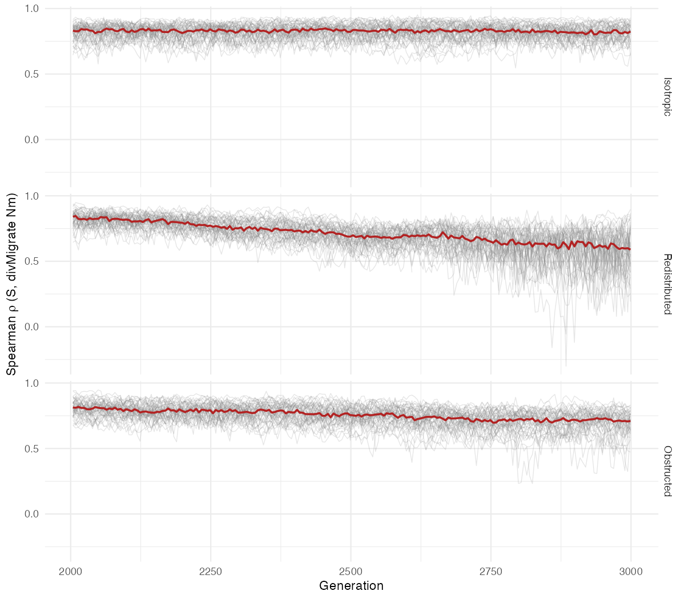
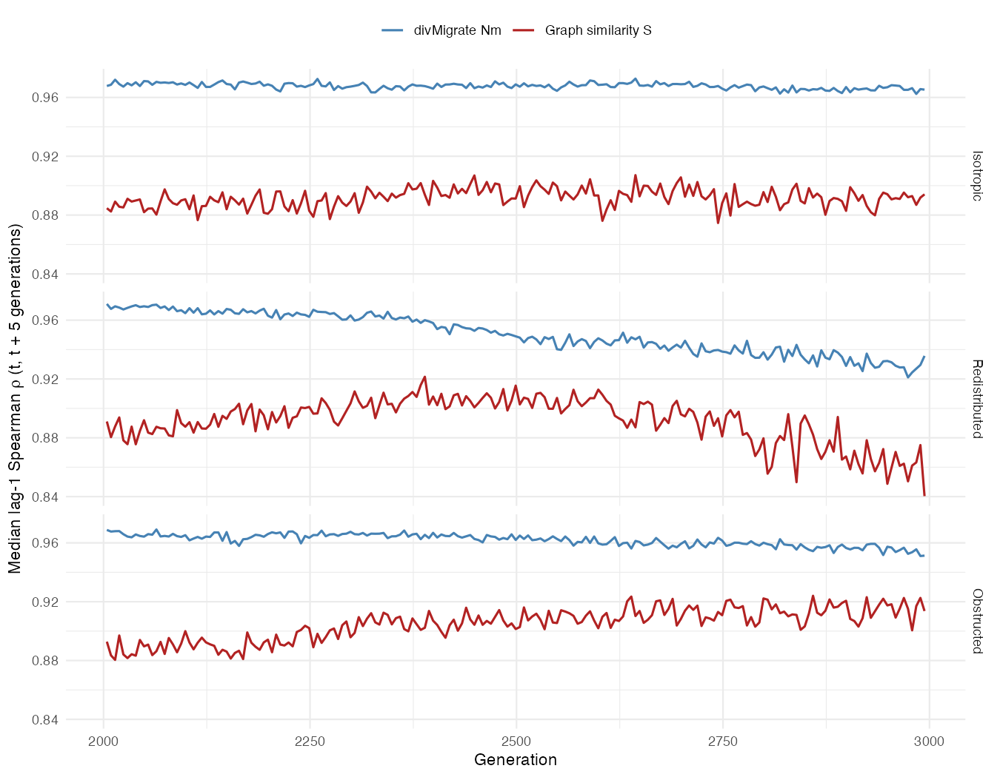

## Population Graphs

- Markov fields. 
- Coniditional covariance structure (all data). 
- Topology is the focus. 

## The Problem

Conditional covariance $A \leftrightarrow B$ is bidirectional, by *definition*.

## Directional Weights

$$
w_{i\rightarrow j}= \frac{\exp\left({- e_{ij}^{2}/2b_i^{2}}\right)}{\sum\limits_{k\in N(i)}\exp\left({- e_{ik}^{2}/2b_i^{2}}\right)}
$$

$e_{ij}$ : conditional genetic distance (cGD). 

$b_i$ : local bandwidth at node $i$

## Local Bandwidth

$$
b_{i} = \frac{s_{i}}{k_{i}} = \frac{1}{k_{i}}\sum\limits_{j\in N(i)}e_{ij}
$$

Scale-equivariant: $w_{i\rightarrow j}(ce) = w_{i\rightarrow j}(e)$, $\;\Delta_{ij}(ce) = \Delta_{ij}(e)$ for any $c>0$

## Asymmetry Index

$$
\Delta_{ij} = w_{i\rightarrow j}-w_{j\rightarrow i}
$$

$\Delta_{ij} > 0$ : $i$ source, $j$ sink
$\Delta_{ij} \approx 0$ : symmetric exchange

## Partitioned Conditional Genetic Distance (pGD)

$$
p_{ij} = e_{ij}\,\frac{w_{i\rightarrow j}}{w_{i\rightarrow j}+w_{j\rightarrow i}}, \quad p_{ij}+p_{ji}=e_{ij}
$$

$p_{ij}=p_{ji}=e_{ij}/2$ under symmetric connectivity

## Simulation Design

| Name          | $m_{i \rightarrow i+1}$ |  $m_{i \leftarrow i+1}$ |  $m_{Total}$ | Ratio |
|---------------|:-----------------------:|:-----------------------:|:------------:|:-----:|
| Isotropic     | 0.025                   | 0.025                   | 0.050        | 1:1   |
| Redistributed | 0.040                   | 0.010                   | 0.050        | 4:1   |
| Obstructed    | 0.025                   | 0.010                   | 0.035        | 2.5:1 |

$K=25$ demes, $N=100$, $L=20$ loci, 2000-generation burn-in, 1000-generation forward phase

## Isotropic Baseline

## Redistributed vs. Obstructed

## Peak Alignment

## Detection Sensitivity

## Genetic Gravity vs. divMigrate

| Scenario | gravity \|Δ\| | divM \|A\| | median ρ (Δ, A) |
| :---- | :---: | :---: | :---: |
| Isotropic | 0.0329 | 0.053 | 0.112 |
| Redistributed | 0.1246 | NA | -0.054 |
| Obstructed | 0.0637 | NA | 0.036 |

## Agreement Through Time (pGD vs. $N_m$)

## Lag-1 Stability

