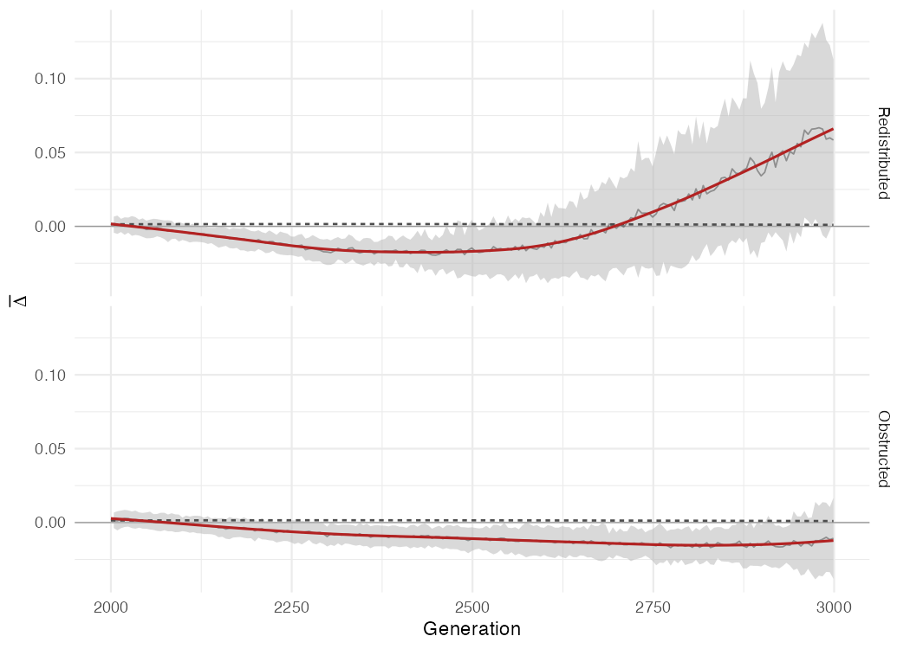

# Supplementary Materials

### Notation

Briefly, $K$ populations are represented as centroids in a multivariate genetic space, with the $K\times K$ Euclidean distance matrix $D$ double-centered via the idempotent operator $H=I-\frac{1}{K}\mathbf{1}\mathbf{1}^{T}$ to yield the covariance matrix $C=-\frac{1}{2}HD^{2}H$ (Dyer et al., 2004; Gower, 1966). Population Graph edges are retained where the corresponding partial correlation (from $C^{-1}$) is significant, so that an edge $e_{ij}\in E$ indicates a conditional genetic dependency between $i$ and $j$ that cannot be explained through intermediate populations (Dyer & Nason, 2004). I write $N(i)$ for the neighbors of node $i$ in $G$ and $k_{i}=|N(i)|$ for its degree.

### Trend-fitting for forward-phase metrics

The isotropic burn-in relaxes to a single equilibrium, and a three-parameter exponential-equilibrium curve fits it well (Fig_IsotropicBaseline). The same form was tried for the forward-phase trajectories under the redistributed and obstructed treatments and rejected: for redistributed diameter and signed $\bar\Delta$, and for obstructed diameter, at least one parameter (typically the plateau) was driven far outside the range of the observed data by the optimizer rather than converging to a value the fit could support — a sign that the underlying trajectory is not a simple relaxation to one equilibrium over this window, consistent with the biphasic and rise-then-plateau shapes described in Results.

Trends reported for these metrics are instead generalized additive models, $y \sim s(\text{generation}, k=20) + s(\text{replicate}, \text{bs}=\text{"re"})$, fit by REML (`mgcv`) to every replicate snapshot in the forward phase. The smooth term over generation captures the shape of the trend without committing to a functional form; the replicate-level random intercept absorbs stable between-replicate offsets so that a few extreme replicates do not dominate the fitted trend, and is excluded from the plotted prediction, which reports the population-level smooth only. The same fitting procedure was applied identically across the isotropic, redistributed, and obstructed forward phases so that trends remain directly comparable to one another.

### Bandwidth is Not Degree

This makes the natural objection—that $\Delta_{ij}$ is merely a function of node degree and neighborhood composition—correct only in form but not in consequence. The parameter $\Delta_{ij}$ is indeed a deterministic function of the graph; it has no other inputs. The question is whether the neighborhood scales $b_{i}$ $b_{j}$ carry *biological* directionality or only *topological* position, and whether the two contributions are separable. Topology contributes a component that is present even under symmetric migration and is largest at low-degree boundary nodes (the leaf-node effect discussed below); this component is independent of the direction of gene flow. Directional gene flow contributes a second component through its effect on neighborhood scale: when population $i$ persistently exports migrants to population $j$, it homogenizes $j$’s allele frequencies toward its own, compressing the conditional distances in $j$’s neighborhood (shrinking $b_{j}$) while $i$’s own neighborhood scale is comparatively preserved. The resulting $b_{i}>b_{j}$ is exactly the configuration that drives $\Delta_{ij}>0$, so the bandwidth difference is a reading of *introgression pressure* rather than of centrality alone. Crucially, the two components are distinguished empirically rather than by assertion: because every scenario branches from a shared burn-in state with the same stepping-stone connectivity, the purely topological contribution is shared with the isotropic null and cannot separate the scenarios. The validation bears this out—$\bar{\Delta}\approx 0$ and single-snapshot discrimination is at random under symmetric migration, with both rising only once migration becomes asymmetric, as demonstrated by the simulation results show. A degree artifact cannot discriminate between scenarios that share a topology; the observed separation is therefore migration-driven, not the sole property of the graph’s pattern of connectivity.

This separation can be made explicit. In the *no-direction limit*, where node $i$’s retained neighbor distances are equal, the directional weight reduces to the uniform value $w_{i\rightarrow j}=1/k_{i}$ and the asymmetry index collapses to a purely topological term that depends only on the endpoint degrees,
$$
\Delta_{ij}^{0} = \frac{1}{k_{i}}-\frac{1}{k_{j}} = \frac{k_{j}-k_{i}}{k_{i} k_{j}}
$$ 
which vanishes exactly when the endpoints share a degree, grows with the degree imbalance, and is largest at low-degree nodes—recovering a leaf-node effect (where $k_{i}=1$ forces $w_{i\rightarrow j}=1$) as the extreme case. Writing $\Delta_{ij}=\Delta_{ij}^{0}+\delta_{ij}$, the directional signal is carried entirely by the second term $\delta_{ij}$, which enters only through the bandwidth contrast $b_{i}\ne b_{j}$ that asymmetric gene flow induces; $\Delta_{ij}^{0}$ is invariant to migration. Because every forward scenario branches from a shared burn-in topology, the topological term $\Delta_{ij}^{0}$ is held in common with the isotropic null and cancels in any scenario contrast—which is precisely why $\bar{\Delta}$ is calibrated against the empirical isotropic null rather than an algebraic zero (Equation A1 makes the term being absorbed explicit).

### Directional balance vs. backflow suppression

The redistributed and obstructed scenarios (main text, Consequences of Redistributed and Obstructed connectivity) both impose a net directional bias in migration, but by different means: redistributed raises forward migration while holding total flux fixed, whereas obstructed suppresses reverse migration while holding forward flux at its isotropic value. The signed graph-mean asymmetry, $\bar{\Delta}$, over the forward phase resolves the two (Fig_SignedAsymmetry): both scenarios are transiently negative before turning positive, rather than moving monotonically toward the treatment's imposed direction from the outset. Redistributed $\bar{\Delta}$ reaches its minimum around generation 2400 (~400 generations after treatment onset) and reverses sign near generation 2680; obstructed $\bar{\Delta}$ reaches its minimum around generation 2800 (~800 generations post-onset) and is only beginning to reverse by the end of the simulated window. The two-fold difference in timing tracks the two-fold difference in net directional migration bias between the scenarios exactly: $m_{i\rightarrow i+1}-m_{i\leftarrow i+1}=0.03$ for redistributed versus $0.015$ for obstructed (Tab_ScenarioParameters) — the same process, running at half the rate. Each scenario was designed to isolate one departure from isotropic rather than to hold total migration fixed against the other (Methods), so total flux also differs between them (0.05 versus 0.035); that difference is smaller and less closely tracks the observed 2:1 timescale ratio than $\Delta m$ does, but it is not excluded as a contributor.

==The early negative excursion shared by both scenarios is consistent with backflow suppression acting on a faster timescale than the redistribution effect that ultimately dominates — cutting reverse migration compresses the receiving neighborhood's bandwidth before the (for redistributed, elevated; for obstructed, merely undiminished) forward flux has had time to compound into a detectable positive bias — but this mechanistic reading has not been checked against the simulation directly and should be confirmed before it stands as a claim.==

*Fig_SignedAsymmetry*: Signed graph-mean asymmetry, $\bar{\Delta}$, for the redistributed and obstructed scenarios (rows) over the forward phase (generations 2000–2999), fit with the same penalized-regression-spline approach used for Fig_ScenarioComparison in the main text; the dashed line is the fitted isotropic trend (centered near zero) as the null reference. Redistributed $\bar{\Delta}$ is transiently negative before reversing to positive around generation 2680; obstructed $\bar{\Delta}$ remains negative throughout the window, only beginning to turn over near its end.

### Tables

*Tab_SensitivityAUC:* Single-snapshot sensitivity at several checkpoints after onset, by index, for each asymmetric scenario (panels). Each cell is AUC (power at a fixed 5% false-positive rate); column headers are generations since onset (targets \~50–400, snapped to the every-fifth-generation census grid). AUC is the rank-based separation of asymmetric from symmetric replicates (0.5 = no discrimination, 1 = perfect). The checkpoints span the early window, where AUC can dip toward or below 0.5 before recovering, as well as the later plateau.

*A. Redistributed* 

| Method          | +50        | +100       | +150       | +200       | +250       | +300       | +350       | +400       |
|-----------------|:-----------:|:-----------:|:-----------:|:-----------:|:-----------:|:-----------:|:-----------:|:-----------:|
| Genetic gravity | 0.43 (0.04) | 0.54 (0.08) | 0.69 (0.28) | 0.66 (0.18) | 0.70 (0.22) | 0.76 (0.30) | 0.89 (0.50) | 0.86 (0.58) |
| divMigrate      | 0.61 (0.04) | 0.34 (0.02) | 0.30 (0.04) | 0.20 (0.00) | 0.26 (0.02) | 0.11 (0.00) | 0.15 (0.00) | 0.09 (0.02) |

*(B) Obstructed*

| Method          | +50        | +100       | +150       | +200       | +250       | +300       | +350       | +400       |
|-----------------|:-----------:|:-----------:|:-----------:|:-----------:|:-----------:|:-----------:|:-----------:|:-----------:|
| Genetic gravity | 0.32 (0.00) | 0.38 (0.02) | 0.62 (0.16) | 0.50 (0.16) | 0.58 (0.10) | 0.68 (0.14) | 0.68 (0.12) | 0.57 (0.16) |
| divMigrate      | 0.61 (0.08) | 0.43 (0.04) | 0.47 (0.06) | 0.34 (0.04) | 0.39 (0.00) | 0.34 (0.10) | 0.27 (0.02) | 0.32 (0.02) |
