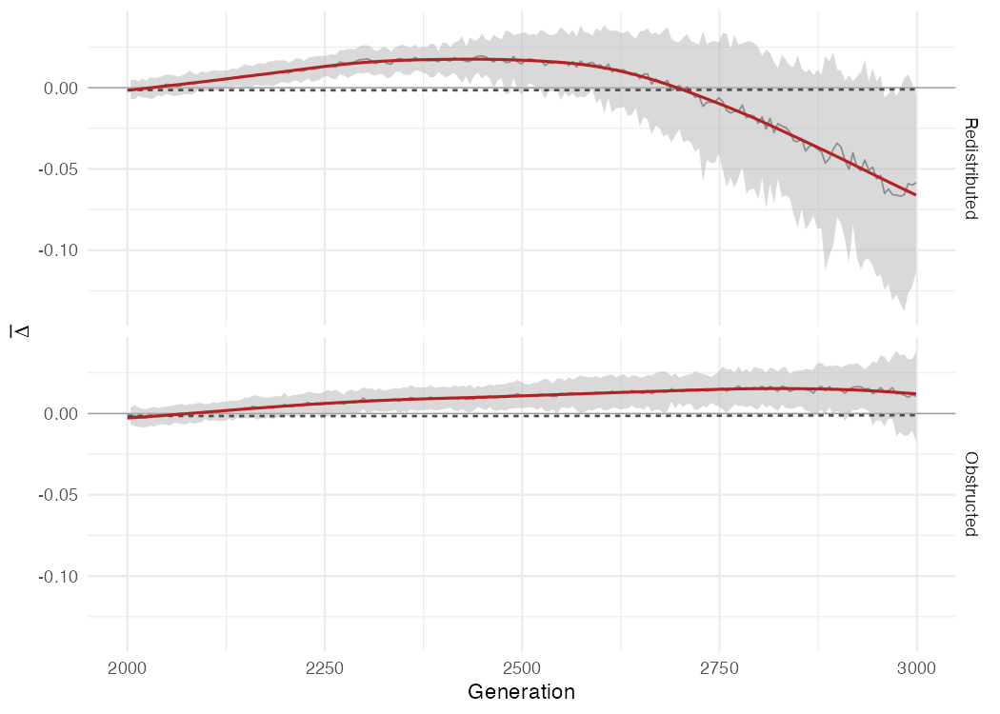
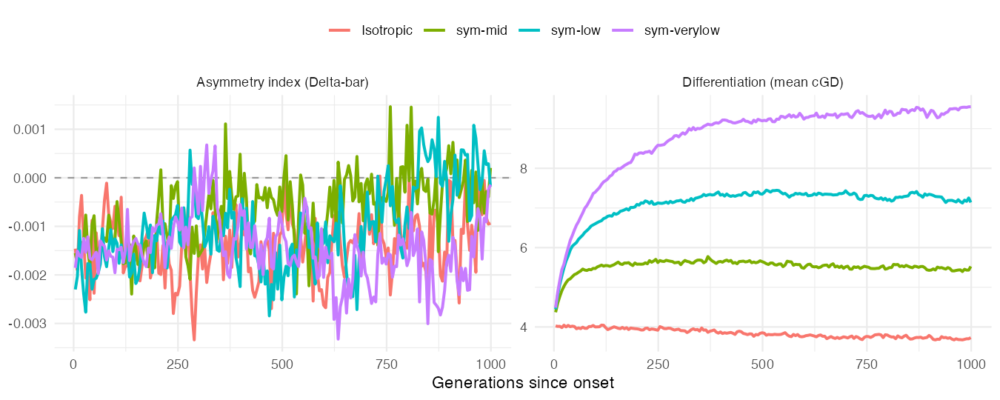
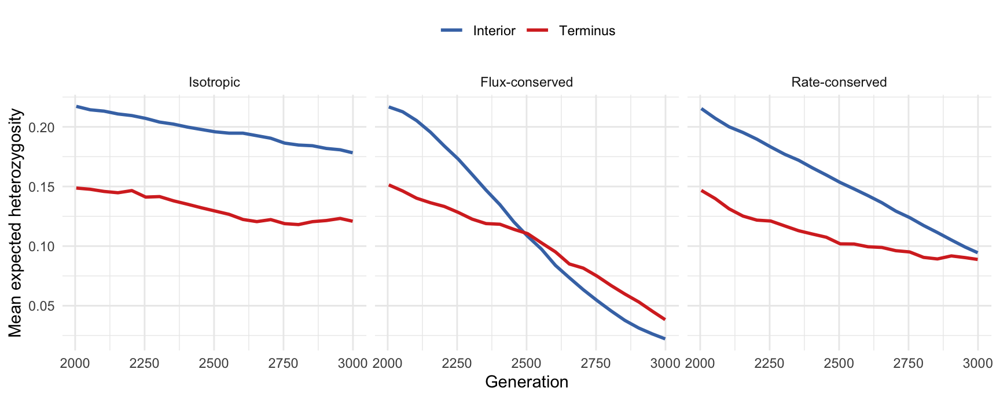
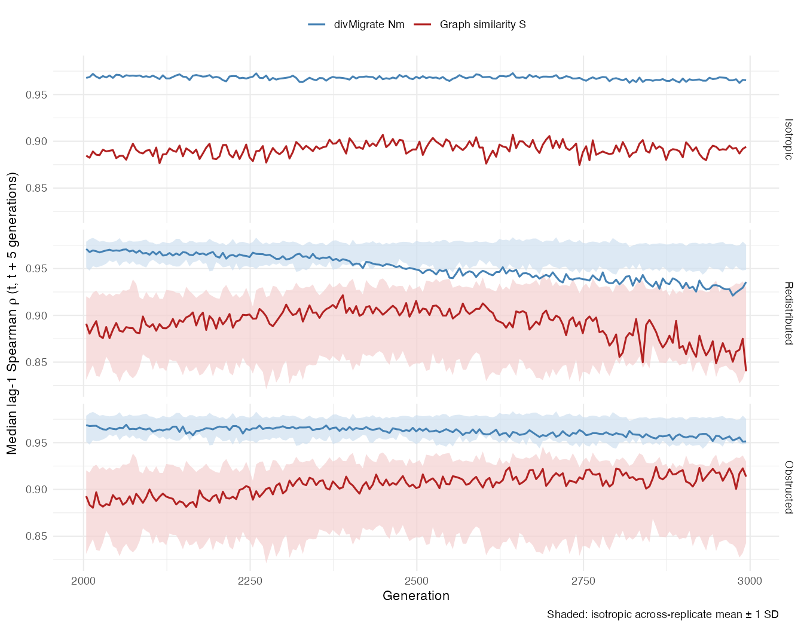

# Supplementary Materials

### Notation

Briefly, $K$ populations are represented as centroids in a multivariate genetic space, with the $K\times K$ Euclidean distance matrix $D$ double-centered via the idempotent operator $H=I-\frac{1}{K}\mathbf{1}\mathbf{1}^{T}$ to yield the covariance matrix $C=-\frac{1}{2}HD^{2}H$ (Dyer et al., 2004; Gower, 1966). Population Graph edges are retained where the corresponding partial correlation (from $C^{-1}$) is significant, so that an edge $e_{ij}\in E$ indicates a conditional genetic dependency between $i$ and $j$ that cannot be explained through intermediate populations (Dyer & Nason, 2004). I write $N(i)$ for the neighbors of node $i$ in $G$ and $k_{i}=|N(i)|$ for its degree.

*Tab_Notation:* Mathematical notation used throughout.

| Symbol                   | Description                                                  |
|:------------------------:|--------------------------------------------------------------|
|  $K$                     | Number of populations (strata)                               |
|  $N$                     | Number of individuals per population                         |
|  $L$                     | Number of loci                                               |
|  $D$                     | $K\times K$ matrix of inter-centroid Euclidean distances in genetic space  |
|  $C$                     | Double-centered covariance matrix derived from $D$           |
|  $H$                     | Idempotent centering operator  $I-\frac{1}{K}\mathbf{1}\mathbf{1}^{T}$ |
|  $G=\{V,E\}$             | Population Graph with vertex set $V$ and edge set $E$        |
| $N(i)$                   | Neighbor set of node $i$ in $G$                              |
| $k_{i}$                  | Topological degree of node $i$                               |
| $e_{ij}$                 | Symmetric edge weight between populations $i$ and $j$        |
| $b_{i}$                  | Local genetic-gravity bandwidth of the node $i$              |
| $w_{j\mid i}$            | Neighbourhood weight: $j$'s weight in $i$'s neighbourhood (a Gaussian-SNE conditional probability $p_{j\mid i}$) |
| $\Delta_{i\rightarrow j}$ | Gravity asymmetry along an edge, $w_{i\mid j}-w_{j\mid i}$; positive when $i$ is the source and $j$ the sink |
| $\Delta^{0}_{i\rightarrow j}$ | Topological (no-direction-limit) component of $\Delta_{i\rightarrow j}$, $1/k_{j}-1/k_{i}$ |
| $g_{i}$                  | Gravity of population $i$, $\sum_{j\in N(i)} w_{i\mid j}$ (total weight $i$ holds in its neighbours' neighbourhoods) |
| $g_{i}-1$                | Source–sink balance of population $i$ ($>0$ source, $<0$ sink); sums to zero over the graph because $\sum_i g_i=K$ |
| $S_{i}$                  | Source-sink score: population scores whose pairwise differences best reproduce the gravity asymmetries, $S_{i}-S_{j}\approx\Delta_{i\rightarrow j}$; high $S$ = source |
| $n_{i}$                  | Orientation imbalance of population $i$: the number of its edges on which it is the upstream endpoint minus the number on which it is the downstream endpoint; the part of $\|E\|\bar{\Delta}$ reproduced by $S$ equals $\sum_i S_i n_i$ |
| $\bar{\Delta}$           | Mean gravity asymmetry over all retained edges, each written with $i$ upstream of $j$ along the hypothesized axis of flow, $\|E\|^{-1}\sum\limits_{(i,j)\in E}^{}\Delta_{i\rightarrow j}$; requires an axis, so it is used descriptively in the simulations only  |
| $p_{ij}$                 | Partitioned conditional genetic distance (pGD), $e_{ij}\,w_{j\mid i}/(w_{j\mid i}+w_{i\mid j})$; shorter in the direction of gene flow |
| $P_{ij}$                 | All-pairs directed shortest-path distance over the pGD-weighted graph |
| $\sigma_{ij}$            | Bounded path similarity, $1/(1+P_{ij})$, used in the comparison with divMigrate |
| $\hat{y}_{i,2000}$       | Replicate-specific MM-predicted equilibrium of metric $y$ at the final burn-in census (generation 2000)  |
| $\delta y_{i,t}$         | Standardized forward-phase deviation $y_{i,t}-{\hat{y}}_{i,2000}$  |
| $\bar{C}_D$             | Mean degree centrality of the Population Graph, averaged over nodes |
| Diameter                 | Longest shortest-path distance between any two nodes in the Population Graph |

### Trend-fitting for forward-phase metrics

The isotropic burn-in relaxes to a single equilibrium, and a three-parameter exponential-equilibrium curve fits it well (Fig_IsotropicBaseline). The same form was tried for the forward-phase trajectories under the redistributed and obstructed treatments and rejected: for redistributed diameter and signed $\bar\Delta$, and for obstructed diameter, at least one parameter (typically the plateau) was driven far outside the range of the observed data by the optimizer rather than converging to a value the fit could support — a sign that the underlying trajectory is not a simple relaxation to one equilibrium over this window, consistent with the biphasic and rise-then-plateau shapes described in Results.

Trends reported for these metrics are instead generalized additive models, $y \sim s(\text{generation}, k=20) + s(\text{replicate}, \text{bs}=\text{"re"})$, fit by REML (`mgcv`) to every replicate snapshot in the forward phase. The smooth term over generation captures the shape of the trend without committing to a functional form; the replicate-level random intercept absorbs stable between-replicate offsets so that a few extreme replicates do not dominate the fitted trend, and is excluded from the plotted prediction, which reports the population-level smooth only. The same fitting procedure was applied identically across the isotropic, redistributed, and obstructed forward phases so that trends remain directly comparable to one another.

### Bandwidth is Not Degree

This makes the natural objection—that $\Delta_{i\rightarrow j}$ is merely a function of node degree and neighborhood composition—correct only in form but not in consequence. The parameter $\Delta_{i\rightarrow j}$ is indeed a deterministic function of the graph; it has no other inputs. The question is whether the neighborhood scales $b_{i}$, $b_{j}$ carry *biological* directionality or only *topological* position, and whether the two contributions are separable. Topology contributes a component that is present even under symmetric migration and is largest at low-degree boundary nodes (the leaf-node effect discussed below); this component is independent of the direction of gene flow. Directional gene flow contributes a second component through its effect on neighborhood scale, but not in the direction a naive reading of "exporting migrants compresses the recipient's bandwidth" would suggest. Empirically, under imposed gene flow the source—not the sink—more often carries the *smaller* own bandwidth (57–59% of edges at peak asymmetry): a source's own neighbours increasingly resemble it as it exports its structure outward, compressing its own neighbourhood scale rather than the recipient's. Independently, and even under symmetric migration, a larger own bandwidth leans toward a more source-like (positive) own $\Delta$, because a flatter kernel spreads a node's weight away from its nearest neighbour, lowering the weight it places on that neighbour relative to the weight the neighbour places back on it; this is a property of the kernel, not evidence of direction. The two effects pull against each other: sources tend to carry the smaller bandwidth, yet a smaller bandwidth on its own leans sink-like. Neither fact licenses a simple story of "small bandwidth marks the source" read off in isolation—$\Delta_{i\rightarrow j}$ combines both nodes' bandwidths with the raw edge distances, and it is the combination, not either bandwidth alone, that carries directional information. Crucially, the topological and directional components are distinguished empirically rather than by assertion: because every scenario branches from a shared burn-in state with the same stepping-stone connectivity, the purely topological contribution is shared with the isotropic null and cannot separate the scenarios. The validation bears this out—$\bar{\Delta}\approx 0$ and single-snapshot discrimination is at random under symmetric migration, with both rising only once migration becomes asymmetric, as demonstrated by the simulation results show. A degree artifact cannot discriminate between scenarios that share a topology; the observed separation is therefore migration-driven, not the sole property of the graph's pattern of connectivity.

This separation can be made explicit. In the *no-direction limit*, where node $i$'s retained neighbor distances are equal, the neighbourhood weight reduces to the uniform value $w_{j\mid i}=1/k_{i}$ and the gravity asymmetry collapses to a purely topological term that depends only on the endpoint degrees,
$$
\Delta_{i\rightarrow j}^{0} = \frac{1}{k_{j}}-\frac{1}{k_{i}} = \frac{k_{i}-k_{j}}{k_{i} k_{j}}
$$
which vanishes exactly when the endpoints share a degree, grows with the degree imbalance, and is largest at low-degree nodes—recovering a leaf-node effect (where $k_{i}=1$ forces $w_{j\mid i}=1$) as the extreme case. Writing $\Delta_{i\rightarrow j}=\Delta_{i\rightarrow j}^{0}+\delta_{i\rightarrow j}$, the directional signal is carried entirely by the second term $\delta_{i\rightarrow j}$, which arises whenever a node's retained neighbour distances are unequal—through which neighbours are near and which are far and, secondarily, through the bandwidth contrast $b_{i}\ne b_{j}$ (with a single bandwidth shared by every node, $\delta_{i\rightarrow j}$ is still non-zero); $\Delta_{i\rightarrow j}^{0}$ is invariant to migration. This topological term is itself an exact difference of population values, $\Delta^{0}_{i\rightarrow j}=S^{0}_{i}-S^{0}_{j}$ with a topological source–sink score $S^{0}_{i}=-1/k_{i}$, under which hubs read as sources and leaves as sinks—the same pattern the full $S$ shows under symmetric migration (main text, *Genetic gravity at the population level*), and the reason the population-level score absorbs the topological floor as cleanly as the edge-level term does. Because every forward scenario branches from a shared burn-in topology, the topological term $\Delta_{i\rightarrow j}^{0}$ is held in common with the isotropic null and cancels in any scenario contrast—which is precisely why $\bar{\Delta}$ is calibrated against the empirical isotropic null rather than an algebraic zero (the expression above makes the term being absorbed explicit).

### Least-squares source–sink score

The source–sink score $S$ (main text, *Genetic gravity at the population level*) is the set of population values whose pairwise differences best reproduce the gravity asymmetries along every retained edge. It minimizes

$$
\sum_{(i,j)\in E}\left(\Delta_{i\rightarrow j}-(S_{i}-S_{j})\right)^{2}.
$$

Write $B$ for the $|E|\times K$ edge–population incidence matrix, with $+1$ in the column of each edge's first population and $-1$ in the column of its second (the choice of which endpoint is first does not matter, because reversing an edge negates both its row of $B$ and its $\Delta$). The objective is $\lVert \boldsymbol{\Delta}-BS\rVert^{2}$, and its normal equations are $B^{T}B\,S=B^{T}\boldsymbol{\Delta}$. Here $B^{T}B$ is the unweighted graph Laplacian $L$—each population's degree $k_i$ on the diagonal and $-1$ for every retained edge—and the $i$th entry of $B^{T}\boldsymbol{\Delta}$ is $\sum_{j\in N(i)}\Delta_{i\rightarrow j}=g_i-1$, the source–sink balance. The score is therefore

$$
S = L^{+}(\mathbf{g}-\mathbf{1}),
$$

where $L^{+}$ is the Moore–Penrose pseudoinverse. $L$ is singular: adding a constant to every score in a connected component leaves every difference unchanged. The pseudoinverse selects the solution centred within each connected component, so scores are comparable only within a component and each component's scores average to zero. In the simulations this rarely mattered: 7 of 7,000 analysed census graphs had more than one component.

The fit leaves a *non-directional residual*, $\Delta_{i\rightarrow j}-(S_i-S_j)$: the part of the edge asymmetries that no ordering of the populations can reproduce, which arises only where the graph contains cycles. The residual is orthogonal to the fitted part, so the two shares of $\sum\Delta_{i\rightarrow j}^{2}$ add to one. With the local bandwidth the residual carries a median 15–19% of $\sum\Delta_{i\rightarrow j}^{2}$ (burn-in 18.8%, isotropic 19.1%, obstructed 17.8%, redistributed 14.7%; interquartile ranges within 8–23%), so the population-level ordering reproduces 81–85% of the edge-level variation. On any tree the residual is exactly zero, because a tree has no cycles and every set of edge values is a difference of population values.

### Identities

The quantities above satisfy the following identities, each checked numerically in the sign convention used throughout (higher = more of a source) on 20 census graphs (10 burn-in graphs at generation 1999 and 10 redistributed graphs at generation 2454).

*Tab_Identities:* Identities of the neighbourhood weights, gravity and source–sink score, with the largest absolute numerical error over the 20 graphs.

| Identity | Max. abs. error |
| :---- | :---: |
| Each population's neighbourhood weights sum to one, $\sum_{j\in N(i)}w_{j\mid i}=1$ | $4\times10^{-16}$ |
| The source–sink balance is the sum of a population's edge asymmetries, $g_i-1=\sum_{j\in N(i)}\Delta_{i\rightarrow j}$ | $4\times10^{-16}$ |
| The balance sums to zero over the graph, $\sum_i(g_i-1)=0$ | $1\times10^{-15}$ |
| With one bandwidth $b$ shared by all populations, $\Delta_{i\rightarrow j}=K_{ij}\left(1/d_{j}-1/d_{i}\right)$, where $K_{ij}=\exp(-e_{ij}^{2}/2b^{2})$ and $d_{i}=\sum_{k\in N(i)}K_{ik}$ | $1\times10^{-16}$ |
| On a spanning tree the source–sink score reproduces every asymmetry (non-directional residual = 0) | $3\times10^{-15}$ |
| The part of $\|E\|\bar{\Delta}$ reproduced by $S$ equals $\sum_i S_i n_i$ | $7\times10^{-16}$ |

The shared-bandwidth identity shows how the direction of an edge arises when every population uses the same kernel scale: $w_{i\mid j}=K_{ij}/d_j$ and $w_{j\mid i}=K_{ij}/d_i$, so $i$ reads as the source for $j$ exactly when $d_i>d_j$, that is, when the kernel weights of $i$'s retained neighbours sum to more than $j$'s—because $i$'s neighbours are closer, more numerous, or both. Each edge's asymmetry is then $K_{ij}$ times the difference of the population values $-1/d_i$ and $-1/d_j$, so an ordering of the populations reproduces the asymmetries exactly once each edge is weighted by $K_{ij}$; the unweighted fit that defines $S$ reproduces most, but not all, of them. The telescoping identity follows from writing every edge with its upstream population first: summing $S_i-S_j$ over edges counts each $S_i$ once for every edge on which population $i$ is upstream and subtracts it once for every edge on which it is downstream.

### Directional balance vs. backflow suppression

The redistributed and obstructed scenarios (main text, Consequences of Redistributed and Obstructed connectivity) both impose a net directional bias in migration, but by different means: redistributed raises forward migration while holding total flux fixed, whereas obstructed suppresses reverse migration while holding forward flux at its isotropic value. The signed graph-mean asymmetry, $\bar{\Delta}$, over the forward phase resolves the two (Fig_SignedAsymmetry). Both scenarios carry the imposed direction through reorganization, with $\bar{\Delta}>0$: upstream populations read as sources. Redistributed $\bar{\Delta}$ reaches its maximum around generation 2435 (~400 generations after treatment onset). Obstructed $\bar{\Delta}$ reaches its maximum around generation 2820 (~800 generations post-onset) and stays positive through the end of the simulated window, easing only slightly. The two-fold difference in time to peak directional signal tracks the two-fold difference in net directional migration bias between the scenarios exactly: $m_{i\rightarrow i+1}-m_{i\leftarrow i+1}=0.03$ for redistributed versus $0.015$ for obstructed (Tab_ScenarioParameters)—the same process, running at half the rate. Each scenario was designed to isolate one departure from isotropic rather than to hold total migration fixed against the other (Methods), so total flux also differs between them (0.05 versus 0.035); that difference is smaller and less closely tracks the observed 2:1 timescale ratio than $\Delta m$ does, but it is not excluded as a contributor.

Redistributed $\bar{\Delta}$ then changes sign late in the window. The fitted trend crosses zero near generation 2700; lineage by lineage, it crosses in 39 of the 50 lineages, at a median of generation 2684 (IQR 2626–2789), against only 9 obstructed lineages. This is not a reversal of the direction of gene flow. The population-level source–sink score keeps the imposed ordering through the crossing—$r(S,x)<0$ in 97% of redistributed censuses in generations 2504–2749—and weakens only as lineages collapse. The crossing itself is carried by the interior of the graph, not by the chain ends or by the part of the asymmetries no source-to-sink ordering reproduces (*Decomposition of the late sign change in $\bar{\Delta}$*, below). It falls in the collapse phase, after the directional isolation gain has peaked (main text, Fig_DirectionalIBGD).

*Fig_SignedAsymmetry*: Signed graph-mean asymmetry, $\bar{\Delta}$ (positive when upstream populations are the sources, the imposed direction), for the redistributed and obstructed scenarios (rows) over the forward phase (generations 2000–2999), fit with the same penalized-regression-spline approach used for Fig_ScenarioComparison in the main text. The shaded band is the across-replicate $\pm$1 SD, and the dashed line is the fitted isotropic trend, which sits slightly below zero ($-0.0016$ to $-0.0010$; the burn-in lineage lean, main text, Isotropic baseline), as the null reference. Redistributed $\bar{\Delta}$ rises to a maximum near generation 2435 and changes sign near generation 2700, an interior-topology effect rather than a reversal of direction (*Decomposition of the late sign change in $\bar{\Delta}$*); obstructed $\bar{\Delta}$ rises to a maximum near generation 2820 and stays positive throughout the window.

### Decomposition of the late sign change in $\bar{\Delta}$

The chain-oriented sum $|E|\bar{\Delta}=\sum\Delta_{i\rightarrow j}$ (each edge written with $i$ upstream) splits exactly into the part reproduced by the source–sink score, which equals $\sum_i S_i n_i$ (*Identities*, below), and the non-directional residual. The reproduced part splits further into the terms of the two chain ends (demes 1 and 25) and those of the interior. A separate check sums $\Delta_{i\rightarrow j}$ over interior edges only, those with both endpoints in demes 3–23. All components were computed for every redistributed and obstructed census from generation 2254 to 2954 (every 5 generations, 50 replicates).

*Tab_DeltaBarDecomposition:* Median components of $|E|\bar{\Delta}$ under redistributed migration, by generation. Components are medians taken separately, so they need not sum exactly.

| Generation | $\|E\|\bar{\Delta}$ | Part reproduced by $S$ | Non-directional residual | Chain ends | Interior | Interior edges only |
| :---: | :---: | :---: | :---: | :---: | :---: | :---: |
| 2254 | 1.18 | 1.14 | 0.04 | 0.54 | 0.57 | 0.78 |
| 2454 | 1.65 | 1.52 | 0.05 | 0.94 | 0.62 | 1.17 |
| 2604 | 1.26 | 1.23 | 0.06 | 0.95 | 0.50 | 1.25 |
| 2654 | 1.01 | 0.90 | 0.06 | 0.91 | 0.08 | 1.11 |
| 2704 | 0.61 | 0.75 | 0.03 | 0.91 | −0.60 | 0.69 |
| 2754 | −0.27 | −0.35 | 0.06 | 0.87 | −0.97 | 0.23 |
| 2804 | −1.63 | −1.73 | 0.09 | 0.77 | −2.21 | −1.07 |
| 2904 | −2.85 | −2.65 | −0.02 | 0.86 | −3.53 | −1.82 |
| 2954 | −4.13 | −4.04 | −0.06 | 0.59 | −4.82 | −2.93 |

Under obstructed migration every component stays positive through generation 2954 (median $|E|\bar{\Delta}$ rising from 0.47 to 1.47).

*Tab_DeltaBarCrossings:* First zero crossing after generation 2400, from each lineage's smoothed series: the number of lineages (of 50) in which each component crosses, and the median (IQR) generation.

| Component | Redistributed | Obstructed |
| :---- | :---- | :---- |
| $\|E\|\bar{\Delta}$ | 39 — 2684 (2626–2789) | 9 — 2799 (2464–2874) |
| Part reproduced by $S$ | 40 — 2686 (2635–2795) | 8 |
| Interior | 42 — 2646 (2580–2783) | 14 |
| Interior edges only | 40 — 2716 (2664–2814) | 7 |
| Chain ends | 10 — 2926 (2912–2934) | 9 |
| Non-directional residual | 33 — 2654 (2554–2789) | 36 (fluctuating around zero) |

Among the 39 redistributed lineages in which $\bar{\Delta}$ changes sign, the crossing coincides (within 50 generations) with that of the interior-edge sum in 92%, the interior part of the reproduced sum in 59%, the non-directional residual in 26%, and the chain-end terms in none. The chain-end terms stay positive throughout (0.5–0.95) and cross, in only 10 lineages, about 240 generations later. The sign change is therefore an interior phenomenon, not an effect of the chain ends. It is also compatible with the ordering of sources and sinks being preserved: the sum weights each population's score $S_i$ by its orientation imbalance $n_i$, not by its position, and as lineages collapse the interior graph rewires, changing which populations carry long edges up or down the chain. The ordering of $S$ along the chain can hold ($r(S,x)$ stays negative) while its $n$-weighted sum changes sign. How much of the interior change comes from $S$ and how much from the rewiring of $n$ has not been separated.

### Comparison of $\Delta_{i\rightarrow j}$ behavior under both scenarios

With the boundary's leaf-incident edges set aside (their large mean $|\Delta |$ ≈ 0.493 is a topological artifact, not a scenario discriminator — see Pendants, boundary effects, below), the interior edges separate the two scenarios cleanly within the roughly 254–354-generations-after-onset window: interior $\bar{\Delta}$ = 0.016 under redistributed, 0.007 under obstructed, and −0.002 under isotropic — smaller in typical magnitude (about 0.038) than the leaf edges, but the only place in the graph where scenario identity is actually distinguishable.

This interior-edge contrast also lets the two mechanisms be compared quantitatively. Redistributed and obstructed reach their asymmetry through different manipulations of the same migration matrix (Methods; Tab_ScenarioParameters): redistributed raises forward migration while holding total flux fixed at the isotropic value, whereas obstructed suppresses reverse migration while holding forward flux fixed—so the same net directional bias can arise either from redistributing a fixed budget of migration or from throttling one direction of it. Over this window, redistributed's interior $\bar\Delta$ (0.016) is roughly 2.3 times obstructed's (0.007), close to the two-fold difference in $\Delta m$ between the scenarios (0.03 versus 0.015) and closer to that than to the smaller, roughly 1.4-fold difference in total flux (0.05 versus 0.035), consistent with the pattern already seen in the timing of the signed asymmetry index (Asymmetry of redistributed and obstructed connectivity, above; Discussion).

The same ordering holds for detection power. Scored against the matched isotropic null at each checkpoint (Tab_SensitivityAUC), genetic gravity's single-snapshot AUC for redistributed climbs from 0.70 at +250 generations post-onset to 0.89 at +350, while obstructed's AUC over the same interval rises only from 0.58 to 0.68 — redistributed is both a stronger and a more rapidly resolving signal than obstructed throughout the window used for the interior-edge comparison above. divMigrate, over the same checkpoints, remains at or below its symmetric-null expectation for both scenarios (Tab_SensitivityAUC).

### Differentiation without Direction

The framework also claims *specificity*: the asymmetry index should respond to the *direction* of gene flow, not to the *amount* of genetic structure. This was tested with a gradient of symmetric (1:1) scenarios at progressively lower migration—conditions that tip the drift–migration balance toward drift and raise neutral differentiation without imposing any direction. As per-direction migration falls across the gradient, neutral differentiation climbs sharply—mean cGD at the lowest-migration arm reaches roughly 2.6$\times$ its isotropic value (Tab_DifferentiationVsAsymmetry)—giving a direct test of whether that rise in structure alone is read as direction by either measure below.

Both single-graph tests were re-run on this gradient's snapshots (50 replicates per arm).

- **Source–sink gradient test** (Methods; every 50 generations, 1,000 censuses per arm). Its false-positive rate at $\alpha=0.05$ stays at the nominal level however much differentiation rises: 5.1% (sym-mid), 5.8% (sym-low) and 3.6% (sym-verylow), against 6.0% for the isotropic forward phase (main text, Tab_SourceSinkCalibration).
- **Directional isolation model comparison** (every 5 generations, 10,000 censuses per arm). The decision rule $\Delta R^2>0$ is *not* specific under strong drift. It fired in 5.8% of sym-mid censuses (95% CI 5.3–6.3%), close to the 4.1% isotropic rate, but in 13.6% of sym-low (12.9–14.3%) and 14.3% of sym-verylow (13.6–15.0%) censuses. Median $\Delta R^2$ stayed negative in every arm ($-0.054$, $-0.043$, $-0.040$), but standard IBGD itself weakens as drift rises (median $R^2_{cGD}$ 0.74, 0.65, 0.57), and the directional description is preferred more often.
  - These false detections cluster in particular lineages: the median lineage's rate is 1.5–9%, but the worst reach 39–74%.
  - They mostly point away from the imposed direction of the asymmetric treatments: the forward-to-reverse slope ratio exceeds one in 59–67% of them (median ratio 1.7–1.9).
  - They are therefore largely the lineage lean (below), amplified as drift weakens the symmetric fit, rather than spurious detections of the imposed direction.

The lineage lean itself is present across the gradient. Averaged over each lineage's censuses, $r(S,x)$ is positive (sources slightly downstream) in 31 of 50 sym-mid lineages, 33 of 50 sym-low and 35 of 50 sym-verylow, as in the burn-in (36 of 50, sign test $p=0.003$) from which every arm branches. The simulation's migration and mating steps do not produce it. From each of the 50 saved burn-in states at generation 1999, every individual was tagged with its deme of origin and one generation of the simulation's migrate–mate–resample cycle was run under the symmetric matrix, 20 times per state. Across interior demes, 50.4% of the parents contributing from a neighbouring deme came from the upstream neighbour (115,336 of 228,896 parental gametes; 95% CI 50.0–50.8%, treating each simulated generation as the independent unit), immigrant individuals were balanced (50.3% upstream), and upstream and downstream immigrants contributed equally many gametes each (1.99 against 1.98; paired $p=0.39$).

The same specificity is evident in the graph-mean index $\bar{\Delta}$, a descriptive complement to the calibrated per-edge test above. If the index were merely a differentiation detector, $\bar{\Delta}$ would climb with the gradient; if it is direction-specific, it should stay at the isotropic null however high differentiation rises—the "scissors" of Fig_StreamCScissors. Across the symmetric gradient, the drift–migration balance tips steadily toward drift: as the per-direction rate falls, neutral differentiation climbs sharply—mean cGD at the lowest-migration arm reaches roughly 2.6$\times$ its isotropic value—yet the *signed* mean asymmetry index never leaves the isotropic null, staying below 9e-04 across the entire gradient with no trend in sign (Tab_DifferentiationVsAsymmetry). That is the scissors of Fig_StreamCScissors: the *amount* of structure rises sharply while its *direction* does not. The absolute index $|\bar{\Delta}|$ does creep up modestly (from 0.0047 under isotropy to about 0.0058 at the lowest-migration arm) as differentiation rises (Discussion), but it stays well below the levels the asymmetric scenarios reach, which depart from the null at differentiation far below what this gradient reaches.

*Tab_DifferentiationVsAsymmetry:* Differentiation versus asymmetry at the final forward generation across the symmetric gradient. Mean cGD rises as migration falls (drift-driven differentiation); the signed and absolute mean asymmetry index stay near the isotropic baseline.

| Scenario | Mean cGD | Signed Δ̄ | \|Δ̄\| |
| :---- | :---: | :---: | :---: |
| Isotropic | 3.730 | 9e-04 | 0.0047 |
| sym-mid | 5.526 | -2e-04 | 0.0050 |
| sym-low | 7.140 | 2e-04 | 0.0067 |
| sym-verylow | 9.553 | 1e-04 | 0.0058 |

*Fig_StreamCScissors:* Specificity ‘scissors’ across the symmetric differentiation gradient. Left: neutral differentiation (mean conditional genetic distance) rises as per-direction migration falls and drift dominates. Right: the mean asymmetry index stays pinned at the isotropic null (dashed line at zero) over the same gradient. Symmetric migration raises the amount of structure but imposes no direction, so the index does not move.

### Pendants, boundary effects, and other marginalia issues relevant to applying $\Delta_{i\rightarrow j}$

The asymmetry index carries a topological component at low-degree nodes (the leaf-node effect discussed under Caveats and limitations). Under the sign convention adopted throughout (main text, *Genetic Gravity: The Asymmetry Index*), a degree-one leaf reads explicitly as a sink: with $k_{i}=1$, $w_{j\mid i}=1$ and $\Delta^{0}_{i\rightarrow j}=1/k_{j}-1\le 0$ for every neighbour $j$, so a leaf's topological floor is always negative regardless of any directional gene flow (main text, *Bandwidth is Not Degree*). Because the simulated stepping stone has two degree-limited termini, two questions follow: whether that component biases the directional signal, and—since the same termini are the most drift-exposed demes in the system—whether the boundary is better read as a genuine evolutionary regime than as a numerical edge case. Both were addressed by decomposing the forward-phase snapshots by chain position, separating edges that touch a degree-one terminus from interior edges, and tracking expected heterozygosity at the ends versus the interior.

Decomposing the index by edge class separates the topological boundary effect from the directional signal (Tab_EdgeClassDecomposition). Leaf-incident edges—those touching a degree-one terminus, where one directional weight is forced to $1$—carry a large mean $|\Delta |$ (about 0.493) under both asymmetric scenarios, a component the directional-vs-symmetric IBGD comparison does not need to calibrate away, since it compares whole-graph fits rather than scoring individual edges (Methods). No leaf-incident edges occur under the isotropic scenario in this dataset at any sampled generation (Discussion). With the leaf edges removed, the interior edges carry the directional signal as a distributed graph property — the periphery contributes magnitude but no scenario discrimination. (Numbers reported under "Comparison of $\Delta_{i\rightarrow j}$ behavior under both scenarios," above.)

Expected heterozygosity at the chain ends sits below the interior in every scenario (Fig_BoundaryDiversity; Discussion) and falls fastest under obstructed connectivity, where the lower total migration (0.035 versus 0.050) compounds the peripheral isolation (terminus $H_{e}$ ≈ 0.089 versus interior 0.094 by the end of the window).

*Fig_BoundaryDiversity:* Expected heterozygosity at the chain termini versus the interior over the forward phase, by scenario (mean across replicates and populations within each class). Termini exchange with a single neighbor and thus receive roughly half the immigrant input of an interior deme; they lose variation faster, and fastest under obstructed connectivity, where lower total migration compounds peripheral isolation.

### Census-to-census stability of directional structure (divMigrate comparison)

*(Moved from Methods, "Comparison with a differentiation-based directional method," and the Figures section; the figure's own filename and caption are unchanged, only relocated.)*

**Census-to-census stability.** To assess how consistently each index's picture of directional structure was changing over time, we computed the census-to-census (lag-1, 5-generation) stability of each matrix series: Spearman's $\rho$ between the matrix at census $t$ and the matrix at the following census $t+5$, restricted to pairs defined at both censuses, computed separately for divMigrate's $N_m$ matrix and for $\sigma_{ij}$. This was computed for every replicate and treatment, without significance testing, and summarized as the median across replicates at each census (Fig_DivMigrateLag1).

*Fig_DivMigrateLag1:* Census-to-census (lag-1, 5-generation) stability of directional structure, by treatment (panels) and matrix type (color): median Spearman's $\rho$ between each census's matrix and the following census's matrix, for divMigrate's $N_m$ matrix (blue) and the pGD-derived similarity matrix $\sigma_{ij}$ (red), across all replicates. The shaded bands, carried into the redistributed and obstructed panels, are the isotropic across-replicate mean $\pm$ 1 SD for each series, shown as a null reference. Under isotropic migration both series are flat throughout. Under redistributed, $N_m$ departs below its isotropic band from roughly generation 2500–2600 onward, while $\sigma$ instead stays within its band until becoming markedly more volatile and dropping below it from approximately generation 2700 on. Under obstructed, $N_m$ stays close to its isotropic band throughout, while $\sigma$ rises steadily above its band from roughly generation 2400–2500 onward.

### Detection rates for the directional isolation test

*Tab_IBGDDetection:* Fraction of censuses in which the directional isolation model ($\text{pGD}_{ij} \sim |dx_{ij}| + |dx_{ij}|\cdot r_{ij}$, adjusted $R^2$) fits better than standard IBGD (cGD against $|dx_{ij}|$), by scenario and forward-phase window, with the median $\Delta R^2 = R^2_{pGD}-R^2_{cGD}$. Under symmetric migration this fraction is the false-positive rate; under the asymmetric treatments it is the detection rate. 50 replicates; 5-generation censuses (1,000 per window for the burn-in reference, 2,500 per 250-generation forward window, 10,000 for the isotropic forward phase).

| Scenario | Window | Directional model preferred | Median $\Delta R^2$ |
| :---- | :---- | :---: | :---: |
| Burn-in (symmetric) | 1904–1999 | 1.9% | −0.055 |
| Isotropic | 2004–2999 | 4.1% | −0.055 |
| Redistributed | 2004–2249 | 11.6% | −0.049 |
| Redistributed | 2254–2499 | 53.6% | 0.005 |
| Redistributed | 2504–2749 | 73.2% | 0.033 |
| Redistributed | 2754–2999 | 55.5% | 0.011 |
| Obstructed | 2004–2249 | 6.4% | −0.055 |
| Obstructed | 2254–2499 | 20.1% | −0.033 |
| Obstructed | 2504–2749 | 43.2% | −0.008 |
| Obstructed | 2754–2999 | 54.3% | 0.006 |

### Permutation nulls for $\Delta_{i\rightarrow j}$

Before adopting the model comparison (Methods, Significance Testing for Asymmetry), significance tests built directly on the asymmetry index were evaluated against the same symmetric reference (the final 100 generations of burn-in; 1,000 censuses, 95,903 edges). None was usable as a test.

- **Graph-level rewiring null** (mean $|\Delta_{i\rightarrow j}|$ against degree-preserving random rewiring with shuffled edge weights). The null could not be generated for dense graphs (valid draws fell to 0.3% above 100 edges on 25 nodes), and where it could, the test never rejected, under symmetric or asymmetric migration: stepping-stone graphs are degree-assortative and locally smooth, so the observed graph always sat 2.4–3.4 SD *below* the rewired null.
- **Edge-level label-permutation null** (individuals permuted among populations and the graph refit on the fixed topology). Under symmetric migration, 8.4% of edges were significant at $\alpha=0.05$, with an excess of p-values near both 0 and 1. Centring the p-value on the null mean removed the excess near 1 but raised the false-positive rate to 24.6%. The permuted (panmictic) data flatten each node's kernel, so the null centres on the degree term $\Delta^{0}_{i\rightarrow j}=1/k_j-1/k_i$, whereas the observed $\Delta_{i\rightarrow j}$ averages about 0.65 of it; the null is also too narrow (a 15.7% false-positive rate even on edges whose endpoints have equal degree).
- **Sign-exchangeability null** (edge signs flipped independently, magnitudes fixed). Under symmetric migration, a median 81% of $\sum\Delta_{i\rightarrow j}^2$ is reproduced by a single population-level ordering ($\Delta_{i\rightarrow j}\approx S_i-S_j$), against 25% expected if edge signs were independent. Edges sharing a node are therefore not exchangeable, and every sign- or node-permutation statistic tried, including permuting $S$ directly across nodes, was anti-conservative (14–100% false positives at $\alpha=0.05$; permuting $S$ alone gives 24%).

The common cause is that $\Delta_{i\rightarrow j}$ and $S$ carry node-level structure (degree and bandwidth) and a drift-generated, spatially smooth trend along the graph that no null built by exchanging parts of a single graph reproduces. Two things do reproduce it. Asking whether a directional description of the graph explains isolation better than a symmetric one (main text, *Directional isolation by graph distance*) sidesteps the problem entirely: both descriptions carry the same node-level structure, and only directional gene flow favors the directional one. Alternatively, a null that preserves the graph's own spectral structure rather than shuffling it away—Moran spectral randomization on the census's own Population Graph—reproduces the node-level smoothness directly: it brings the false-positive rate on $S$ from 24% under plain permutation down to 4–6% (main text, *Source–sink gradient test*), and does so more reliably than randomizing against the true landscape adjacency that generated the data (11%), making the Population Graph itself the better spatial null basis.

### Tables

*Tab_ToolSummary:* What each tool in the framework certifies, the null it is referenced to, and its principal limitation. $\bar{\Delta}$ against a replicate-based empirical null is the most reliable use of the framework but needs replicates; the directional-vs-symmetric IBGD comparison trades some of that reliability for working on a single graph. Individual-edge $\Delta_{i\rightarrow j}$ has no calibrated significance test (Permutation nulls for $\Delta_{i\rightarrow j}$) and should be read as exploratory only, not as a third tier with its own row here.

| Inferential target | Recommended tool | Null / reference | Reliably certifies | Principal limitation |
| :---- | :---- | :---- | :---- | :---- |
| Network-level direction | $\bar{\Delta}$, graph metrics | Empirical isotropic null | Presence, cause, and timing of asymmetry | Needs a replicate or time-series null; sign needs a node ordering |
| Single-graph, node-resolved direction test | Source–sink gradient test, $r(S,x)$ | Moran spectral randomization on the graph's own topology ($N1w$) | Presence of a source-to-sink gradient along a hypothesized covariate, resolved to individual populations, from one graph | Needs a hypothesized covariate; modest single-census power (~40%) though the sign is reliable once detected |
| Single-graph direction test | Directional-vs-symmetric IBGD model comparison ($\Delta R^2$) | Empirical FPR (burn-in / isotropic forward phase) | Presence of asymmetry from one graph, no replicates needed; motivated by a source–sink gradient found above | One-sided (a preferred symmetric fit is not evidence against asymmetry); coarser than edge level |
| Cross-method check | divMigrate comparison | — | Concordance where flow is present | divMigrate confounds differentiation magnitude; blows up at fixation |

*Tab_SensitivityAUC:* Single-snapshot sensitivity at several checkpoints after onset, by index, for each asymmetric scenario (panels). Each cell is AUC (power at a fixed 5% false-positive rate); column headers are generations since onset (targets \~50–400, snapped to the every-fifth-generation census grid). AUC is the rank-based separation of asymmetric from symmetric replicates (0.5 = no discrimination, 1 = perfect). The checkpoints span the early window, where AUC can dip toward or below 0.5 before recovering, as well as the later plateau.

*A. Redistributed* 

| Method          | +50        | +100       | +150       | +200       | +250       | +300       | +350       | +400       |
|-----------------|:-----------:|:-----------:|:-----------:|:-----------:|:-----------:|:-----------:|:-----------:|:-----------:|
| Genetic gravity | 0.43 (0.04) | 0.54 (0.08) | 0.69 (0.28) | 0.66 (0.18) | 0.70 (0.22) | 0.76 (0.30) | 0.89 (0.50) | 0.86 (0.58) |
| divMigrate      | 0.61 (0.04) | 0.34 (0.02) | 0.30 (0.04) | 0.20 (0.00) | 0.26 (0.02) | 0.11 (0.00) | 0.15 (0.00) | 0.09 (0.02) |

*(B) Obstructed*

| Method          | +50        | +100       | +150       | +200       | +250       | +300       | +350       | +400       |
|-----------------|:-----------:|:-----------:|:-----------:|:-----------:|:-----------:|:-----------:|:-----------:|:-----------:|
| Genetic gravity | 0.32 (0.00) | 0.38 (0.02) | 0.62 (0.16) | 0.50 (0.16) | 0.58 (0.10) | 0.68 (0.14) | 0.68 (0.12) | 0.57 (0.16) |
| divMigrate      | 0.61 (0.08) | 0.43 (0.04) | 0.47 (0.06) | 0.34 (0.04) | 0.39 (0.00) | 0.34 (0.10) | 0.27 (0.02) | 0.32 (0.02) |

*Tab_EdgeClassDecomposition:* Asymmetry index decomposed by edge class, pooled over an established-signal window (generations 2254-2354, ~254-354 generations after onset), averaged across replicates and snapshots in that window. Leaf-incident edges touch a degree-one terminus (e.g., a solitary directional weight); interior edges have both endpoints of degree \>= 2; ‘all’ pools both. Mean signed Δ carries the directional signal; mean |Δ| is the typical magnitude. No leaf-incident edges occurred under the Isotropic scenario in the sampled window (see prose).

| Scenario | Edge class | Mean signed Δ | Mean \|Δ\| | Edges/graph |
| :---- | :---: | :---: | :---: | :---: |
| Isotropic | interior | 0.002 | 0.034 | 96.1 |
| Isotropic | all | 0.002 | 0.034 | 96.1 |
| Redistributed | interior | -0.016 | 0.042 | 88.6 |
| Redistributed | leaf-incident | 0.357 | 0.491 | 2.0 |
| Redistributed | all | -0.016 | 0.043 | 88.6 |
| Obstructed | interior | -0.007 | 0.037 | 91.6 |
| Obstructed | leaf-incident | 0.495 | 0.495 | 1.0 |
| Obstructed | all | -0.007 | 0.037 | 91.6 |
