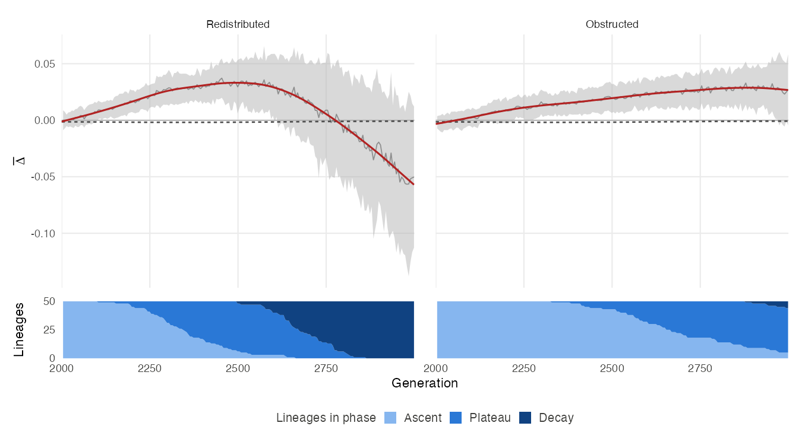
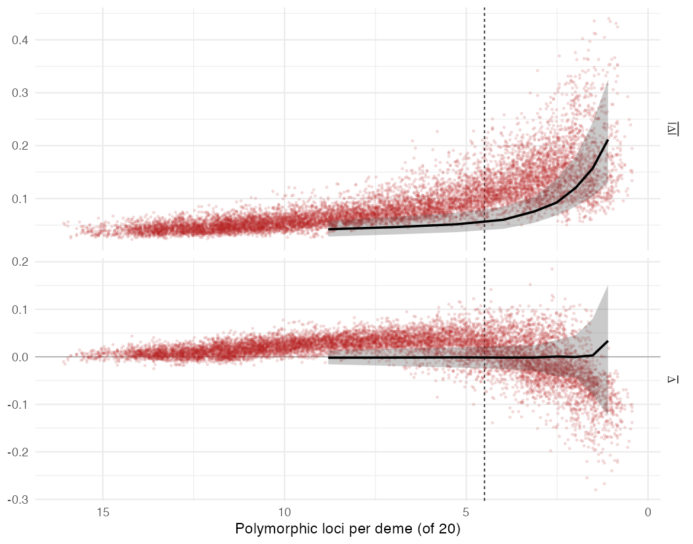

# Supplementary Materials

### Notation

Briefly, $K$ populations are represented as centroids in a multivariate genetic space, with the $K\times K$ Euclidean distance matrix $D$ double-centered via the idempotent operator $H=I-\frac{1}{K}\mathbf{1}\mathbf{1}^{T}$ to yield the covariance matrix $C=-\frac{1}{2}HD^{2}H$ (Dyer et al., 2004; Gower, 1966). Population Graph edges are retained where the corresponding partial correlation (from $C^{-1}$) is significant, so that an edge $e_{ij}\in E$ indicates a conditional genetic dependency between $i$ and $j$ that cannot be explained through intermediate populations (Dyer & Nason, 2004). I write $N(i)$ for the neighbors of node $i$ in $G$ and $k_{i}=|N(i)|$ for its degree.

*Tab_Notation:* Mathematical notation used throughout.

| Symbol                   | Description                                                  |
|:------------------------:|--------------------------------------------------------------|
|  $K$                     | Number of populations (strata)                               |
|  $N$                     | Number of individuals per population                         |
|  $L$                     | Number of loci                                               |
|  $D$                     | $K\times K$ matrix of inter-centroid Euclidean distances in genetic space  |
|  $C$                     | Double-centered covariance matrix derived from $D$           |
|  $H$                     | Idempotent centering operator  $I-\frac{1}{K}\mathbf{1}\mathbf{1}^{T}$ |
|  $G=\{V,E\}$             | Population Graph with vertex set $V$ and edge set $E$        |
| $N(i)$                   | Neighbor set of node $i$ in $G$                              |
| $k_{i}$                  | Topological degree of node $i$                               |
| $e_{ij}$                 | Symmetric edge weight between populations $i$ and $j$        |
| $b_{i}$                  | Local genetic-gravity bandwidth of the node $i$              |
| $w_{j\mid i}$            | Neighborhood weight: $j$'s weight in $i$'s neighborhood (a Gaussian-SNE conditional probability $p_{j\mid i}$) |
| $\Delta_{i\rightarrow j}$ | Gravity asymmetry along an edge, $w_{i\mid j}-w_{j\mid i}$; positive when $i$ is the source and $j$ the sink |
| $\Delta^{0}_{i\rightarrow j}$ | Topological (no-direction-limit) component of $\Delta_{i\rightarrow j}$, $1/k_{j}-1/k_{i}$ |
| $g_{i}$                  | Gravity of population $i$, $\sum_{j\in N(i)} w_{i\mid j}$ (total weight $i$ holds in its neighbors' neighborhoods) |
| $g_{i}-1$                | Source–sink balance of population $i$ ($>0$ source, $<0$ sink); sums to zero over the graph because $\sum_i g_i=K$ |
| $S_{i}$                  | Source-sink score: population scores whose pairwise differences best reproduce the gravity asymmetries, $S_{i}-S_{j}\approx\Delta_{i\rightarrow j}$; high $S$ = source |
| $n_{i}$                  | Orientation imbalance of population $i$: the number of its edges on which it is the upstream endpoint minus the number on which it is the downstream endpoint; the part of $\|E\|\bar{\Delta}$ reproduced by $S$ equals $\sum_i S_i n_i$ |
| $\bar{\Delta}$           | Mean gravity asymmetry over all retained edges, each written with $i$ upstream of $j$ along the hypothesized axis of flow, $\|E\|^{-1}\sum\limits_{(i,j)\in E}^{}\Delta_{i\rightarrow j}$; requires an axis, so it is used descriptively in the simulations only  |
| $p_{ij}$                 | Partitioned conditional genetic distance (pGD), $e_{ij}\,w_{j\mid i}/(w_{j\mid i}+w_{i\mid j})$; shorter in the direction of gene flow |
| $\hat{y}_{i,2000}$       | Replicate-specific MM-predicted equilibrium of metric $y$ at the final *burn-in* census (generation 2000)  |
| $\delta y_{i,t}$         | Standardized forward-phase deviation $y_{i,t}-{\hat{y}}_{i,2000}$  |
| $\bar{C}_D$             | Mean degree centrality of the Population Graph, averaged over nodes |
| Diameter                 | Longest shortest-path distance between any two nodes in the Population Graph |

### Trend-fitting for forward-phase metrics

The *burn-in* relaxes to a single equilibrium, and a three-parameter exponential-equilibrium curve fits it well (Fig_SymmetricBaseline). The same form was tried for the forward-phase trajectories under the *Redistributed* and *Obstructed* scenarios and rejected: for *Redistributed* diameter and signed $\bar\Delta$, and for *Obstructed* diameter, at least one parameter (typically the *plateau*) was driven far outside the range of the observed data by the optimizer rather than converging to a value the fit could support — a sign that the underlying trajectory is not a simple relaxation to one equilibrium over this window, consistent with the rise–hold–decline shapes described in the main text, which pass through the three phases at different times in different lineages.

Trends reported for these metrics are instead generalized additive models, $y \sim s(\text{generation}, k=20) + s(\text{replicate}, \text{bs}=\text{"re"})$, fit by REML (`mgcv`; Wood, 2017) to every replicate snapshot in the forward phase. The smooth term over generation captures the shape of the trend without committing to a functional form; the replicate-level random intercept absorbs stable between-replicate offsets so that a few extreme replicates do not dominate the fitted trend, and is excluded from the plotted prediction, which reports the population-level smooth only. The same fitting procedure was applied identically across the *Symmetric*, *Redistributed*, and *Obstructed* forward phases so that trends remain directly comparable to one another.

### Bandwidth is Not Degree

This makes the natural objection—that $\Delta_{i\rightarrow j}$ is merely a function of node degree and neighborhood composition—correct only in form but not in consequence. The parameter $\Delta_{i\rightarrow j}$ is indeed a deterministic function of the graph; it has no other inputs. The question is whether the neighborhood scales $b_{i}$, $b_{j}$ carry *biological* directionality or only *topological* position, and whether the two contributions are separable. Topology contributes a component that is present even under symmetric migration and is largest at low-degree boundary nodes (the leaf-node effect); this component is independent of the direction of gene flow. Directional gene flow contributes a second component through its effect on neighborhood scale, but not in the direction a naive reading of "exporting migrants compresses the recipient's bandwidth" would suggest. Empirically, under imposed gene flow the source—not the sink—more often carries the *smaller* own bandwidth (57–59% of edges at peak asymmetry): a source's own neighbors increasingly resemble it as it exports its structure outward, compressing its own neighborhood scale rather than the recipient's. Independently, and even under symmetric migration, a larger own bandwidth leans toward a more source-like (positive) own $\Delta$, because a flatter kernel spreads a node's weight away from its nearest neighbor, lowering the weight it places on that neighbor relative to the weight the neighbor places back on it; this is a property of the kernel, not evidence of direction. The two effects pull against each other: sources tend to carry the smaller bandwidth, yet a smaller bandwidth on its own leans sink-like. Neither fact licenses a simple story of "small bandwidth marks the source" read off in isolation—$\Delta_{i\rightarrow j}$ combines both nodes' bandwidths with the raw edge distances, and it is the combination, not either bandwidth alone, that carries directional information. Crucially, the topological and directional components are distinguished empirically rather than by assertion: because every scenario branches from a shared *burn-in* state with the same stepping-stone connectivity, the purely topological contribution is shared with the *Symmetric* null and cannot separate the scenarios. The validation bears this out—$\bar{\Delta}\approx 0$ and single-snapshot discrimination is at random under symmetric migration, with both rising only once migration becomes asymmetric, as demonstrated by the simulation results show. A degree artifact cannot discriminate between scenarios that share a topology; the observed separation is therefore migration-driven, not the sole property of the graph's pattern of connectivity. The bandwidth statistics in this paragraph refer to the local mean ($\gamma=1$); at the degree-neutral bandwidth used for directional inference the topological term explains only 2–4% of the variance in $\Delta_{i\rightarrow j}$ under symmetric migration (main text).

This separation can be made explicit. In the *no-direction limit*, where node $i$'s retained neighbor distances are equal, the neighborhood weight reduces to the uniform value $w_{j\mid i}=1/k_{i}$ and the gravity asymmetry collapses to a purely topological term that depends only on the endpoint degrees,
$$
\Delta_{i\rightarrow j}^{0} = \frac{1}{k_{j}}-\frac{1}{k_{i}} = \frac{k_{i}-k_{j}}{k_{i} k_{j}}
$$
which vanishes exactly when the endpoints share a degree, grows with the degree imbalance, and is largest at low-degree nodes—recovering a leaf-node effect (where $k_{i}=1$ forces $w_{j\mid i}=1$) as the extreme case. Writing $\Delta_{i\rightarrow j}=\Delta_{i\rightarrow j}^{0}+\delta_{i\rightarrow j}$, the directional signal is carried entirely by the second term $\delta_{i\rightarrow j}$, which arises whenever a node's retained neighbor distances are unequal—through which neighbors are near and which are far and, secondarily, through the bandwidth contrast $b_{i}\ne b_{j}$ (with a single bandwidth shared by every node, $\delta_{i\rightarrow j}$ is still non-zero); $\Delta_{i\rightarrow j}^{0}$ is invariant to migration. This topological term is itself an exact difference of population values, $\Delta^{0}_{i\rightarrow j}=S^{0}_{i}-S^{0}_{j}$ with a topological source–sink score $S^{0}_{i}=-1/k_{i}$, under which hubs read as sources and leaves as sinks—the same pattern the full $S$ shows under symmetric migration (main text), and the reason the population-level score absorbs the topological floor as cleanly as the edge-level term does. Because every forward scenario branches from a shared *burn-in* topology, the topological term $\Delta_{i\rightarrow j}^{0}$ is held in common with the *Symmetric* null and cancels in any scenario contrast—which is precisely why $\bar{\Delta}$ is calibrated against the empirical *Symmetric* null rather than an algebraic zero (the expression above makes the term being absorbed explicit).

### Least-squares source–sink score

The source–sink score $S$ (main text) is the set of population values whose pairwise differences best reproduce the gravity asymmetries along every retained edge. It minimizes

$$
\sum_{(i,j)\in E}\left(\Delta_{i\rightarrow j}-(S_{i}-S_{j})\right)^{2}.
$$

Write $B$ for the $|E|\times K$ edge–population incidence matrix, with $+1$ in the column of each edge's first population and $-1$ in the column of its second (the choice of which endpoint is first does not matter, because reversing an edge negates both its row of $B$ and its $\Delta$). The objective is $\lVert \boldsymbol{\Delta}-BS\rVert^{2}$, and its normal equations are $B^{T}B\,S=B^{T}\boldsymbol{\Delta}$. Here $B^{T}B$ is the unweighted graph Laplacian $L$—each population's degree $k_i$ on the diagonal and $-1$ for every retained edge—and the $i$th entry of $B^{T}\boldsymbol{\Delta}$ is $\sum_{j\in N(i)}\Delta_{i\rightarrow j}=g_i-1$, the source–sink balance. The score is therefore

$$
S = L^{+}(\mathbf{g}-\mathbf{1}),
$$

where $L^{+}$ is the Moore–Penrose pseudoinverse. $L$ is singular: adding a constant to every score in a connected component leaves every difference unchanged. The pseudoinverse selects the solution centered within each connected component, so scores are comparable only within a component and each component's scores average to zero. In the simulations this rarely mattered: 7 of 7,000 analyzed census graphs had more than one component.

The fit leaves a *non-directional residual*, $\Delta_{i\rightarrow j}-(S_i-S_j)$: the part of the edge asymmetries that no ordering of the populations can reproduce, which arises only where the graph contains cycles. The residual is orthogonal to the fitted part, so the two shares of $\sum\Delta_{i\rightarrow j}^{2}$ add to one. At the degree-neutral bandwidth used for directional inference the residual carries a median 38% of $\sum\Delta_{i\rightarrow j}^{2}$ under *Symmetric* migration, 36–38% during *ascent*, 30–31% on the asymmetric *plateau* and 13% in *Redistributed* *decay* (censuses every 50 generations), so the population-level ordering reproduces about 60–70% of the edge-level variation, and more as directional structure builds. At the local mean bandwidth the residual is smaller, a median 15–19% (*burn-in* 18.8%, *Symmetric* 19.1%, *Obstructed* 17.8%, *Redistributed* 14.7%; interquartile ranges within 8–23%), because the degree floor it carries is itself an exact difference of population values (above). On any tree the residual is exactly zero, because a tree has no cycles and every set of edge values is a difference of population values.

### Identities

The quantities above satisfy the following identities, each checked numerically in the sign convention used throughout (higher = more of a source) on 20 census graphs (10 *burn-in* graphs at generation 1999 and 10 *Redistributed* graphs at generation 2454).

*Tab_Identities:* Identities of the neighborhood weights, gravity and source–sink score, with the largest absolute numerical error over the 20 graphs.

| Identity | Max. abs. error |
| :---- | :---: |
| Each population's neighborhood weights sum to one, $\sum_{j\in N(i)}w_{j\mid i}=1$ | $4\times10^{-16}$ |
| The source–sink balance is the sum of a population's edge asymmetries, $g_i-1=\sum_{j\in N(i)}\Delta_{i\rightarrow j}$ | $4\times10^{-16}$ |
| The balance sums to zero over the graph, $\sum_i(g_i-1)=0$ | $1\times10^{-15}$ |
| With one bandwidth $b$ shared by all populations, $\Delta_{i\rightarrow j}=K_{ij}\left(1/d_{j}-1/d_{i}\right)$, where $K_{ij}=\exp(-e_{ij}^{2}/2b^{2})$ and $d_{i}=\sum_{k\in N(i)}K_{ik}$ | $1\times10^{-16}$ |
| On a spanning tree the source–sink score reproduces every asymmetry (non-directional residual = 0) | $3\times10^{-15}$ |
| The part of $\|E\|\bar{\Delta}$ reproduced by $S$ equals $\sum_i S_i n_i$ | $7\times10^{-16}$ |

The shared-bandwidth identity shows how the direction of an edge arises when every population uses the same kernel scale: $w_{i\mid j}=K_{ij}/d_j$ and $w_{j\mid i}=K_{ij}/d_i$, so $i$ reads as the source for $j$ exactly when $d_i>d_j$, that is, when the kernel weights of $i$'s retained neighbors sum to more than $j$'s—because $i$'s neighbors are closer, more numerous, or both. Each edge's asymmetry is then $K_{ij}$ times the difference of the population values $-1/d_i$ and $-1/d_j$, so an ordering of the populations reproduces the asymmetries exactly once each edge is weighted by $K_{ij}$; the unweighted fit that defines $S$ reproduces most, but not all, of them. The telescoping identity follows from writing every edge with its upstream population first: summing $S_i-S_j$ over edges counts each $S_i$ once for every edge on which population $i$ is upstream and subtracts it once for every edge on which it is downstream.

### Directional balance vs. backflow suppression

The *Redistributed* and *Obstructed* scenarios (main text) both impose a net directional bias in migration, but by different means: *Redistributed* raises forward migration while holding total flux fixed, whereas *Obstructed* suppresses reverse migration while holding forward flux at its *Symmetric* value. The signed graph-mean asymmetry, $\bar{\Delta}$ (degree-neutral bandwidth), over the forward phase resolves the two (Fig_SignedAsymmetry). Both scenarios carry the imposed direction through *ascent* and the *plateau*, with $\bar{\Delta}>0$: upstream populations read as sources. Over the core of each lineage's own phase (main text), *Redistributed* $\bar{\Delta}$ is positive in 98% of lineages during *ascent* (median 0.013) and in 98% of the 46 lineages with a *plateau* (median 0.034); *Obstructed* $\bar{\Delta}$ is positive in 96% and 98% of lineages (44 with a *plateau*; medians 0.015 and 0.030). On the *plateau* the two scenarios therefore carry nearly the same directional signal; what differs is when they reach it. The across-lineage trend peaks around generation 2493 under *Redistributed* migration (~500 generations after onset) and around 2884 under *Obstructed* migration (~900 generations), and in lineages whose rise exceeded drift, *ascent* ends at a median of generation 2332 and 2642 respectively. *Obstructed* lineages reach each stage 1.8–2.8 times later depending on the measure (1.9 times for the end of *ascent*), close to the two-fold difference in net directional bias ($m_{i\rightarrow i+1}-m_{i\leftarrow i+1}=0.03$ for *Redistributed* against $0.015$ for *Obstructed*; Tab_ScenarioParameters)—the same process, running more slowly. Each scenario was designed to isolate one departure from *Symmetric* rather than to hold total migration fixed against the other, so total flux also differs between them (0.05 against 0.035) and is not excluded as a contributor.

*Redistributed* $\bar{\Delta}$ then changes sign, and it does so in the *decay* phase: after the informative horizon it is negative in 70% of lineages (median $-0.020$). The fitted trend crosses zero near generation 2776; lineage by lineage, the smoothed series crosses in 37 of the 50 lineages, at a median of generation 2729 (IQR 2674–2824), against a median horizon of 2674, and in only 6 *Obstructed* lineages. This is not a reversal of the direction of gene flow. The population-level source–sink score keeps the imposed ordering through the crossing—$r(S,x)<0$ in 98% of *plateau* censuses and 86% of *decay* censuses—and weakens only as lineages enter *decay*. The crossing itself is carried by the interior of the graph, not by the terminal demes (below).

*Fig_SignedAsymmetry*: Signed graph-mean asymmetry, $\bar{\Delta}$ (degree-neutral bandwidth; positive when upstream populations are the sources, the imposed direction), for the *Redistributed* and *Obstructed* scenarios (columns) over the forward phase (generations 2000–2999), fit with the same penalized-regression-spline approach used for Fig_ScenarioComparison in the main text. The shaded band is the across-replicate $\pm$ 1 SD, and the dashed line is the fitted *Symmetric* trend, which sits slightly below zero ($-0.0019$ to $-0.0008$; the *burn-in* lineage lean), as the null reference. *Redistributed* $\bar{\Delta}$ rises to a maximum near generation 2493 and changes sign near generation 2776, an interior-topology effect rather than a reversal of direction (below); *Obstructed* $\bar{\Delta}$ rises to a maximum near generation 2884 and stays positive throughout the window. The strip beneath shows, at each census, how many of the 50 lineages in each asymmetric scenario are in *ascent*, on the *plateau*, or in *decay*, each lineage assigned by its own boundaries. The late *Redistributed* sign change coincides with lineages entering the *decay* phase.

### Decomposition of the late sign change in $\bar{\Delta}$

The axis-oriented sum $|E|\bar{\Delta}=\sum\Delta_{i\rightarrow j}$ (each edge written with $i$ upstream) splits exactly into the part reproduced by the source–sink score, which equals $\sum_i S_i n_i$ (above), and the non-directional residual. The reproduced part splits further into the terms of the two terminal demes (demes 1 and 25) and those of the interior. A separate check sums $\Delta_{i\rightarrow j}$ over interior edges only, those with both endpoints in demes 3–23. All components were computed for every *Redistributed* and *Obstructed* census from generation 2254 to 2954 (every 5 generations, 50 replicates).

*Tab_DeltaBarDecomposition:* Median components of $|E|\bar{\Delta}$ under *Redistributed* migration (degree-neutral bandwidth), by generation. Components are medians taken separately, so they need not sum exactly.

| Generation | $\|E\|\bar{\Delta}$ | Part reproduced by $S$ | Non-directional residual | Terminal demes | Interior | Interior edges only |
| :---: | :---: | :---: | :---: | :---: | :---: | :---: |
| 2254 | 2.04 | 1.33 | 0.71 | 0.69 | 0.50 | 1.43 |
| 2454 | 3.22 | 1.97 | 1.04 | 1.31 | 0.73 | 2.29 |
| 2604 | 2.61 | 1.84 | 0.87 | 1.39 | 0.46 | 2.37 |
| 2654 | 2.25 | 1.37 | 0.98 | 1.37 | 0.06 | 2.07 |
| 2704 | 1.42 | 0.76 | 0.90 | 1.44 | −1.57 | 1.21 |
| 2754 | 0.08 | −0.13 | 0.75 | 1.37 | −1.23 | 1.07 |
| 2804 | −1.10 | −1.53 | 0.80 | 1.56 | −3.23 | −0.65 |
| 2904 | −2.13 | −2.53 | 0.40 | 1.46 | −4.47 | −1.46 |
| 2954 | −3.58 | −4.69 | 0.48 | 1.30 | −5.79 | −3.12 |

Under *Obstructed* migration $|E|\bar{\Delta}$ stays positive through generation 2954 (median rising from 0.86 to 2.82).

*Tab_DeltaBarCrossings:* First zero crossing after generation 2400, from each lineage's smoothed series: the number of lineages (of 50) in which each component crosses, and the median (IQR) generation.

| Component | *Redistributed* | *Obstructed* |
| :---- | :---- | :---- |
| $\|E\|\bar{\Delta}$ | 37 — 2729 (2674–2824) | 6 — 2679 (2514–2870) |
| Part reproduced by $S$ | 40 — 2702 (2658–2809) | 6 |
| Interior | 43 — 2634 (2552–2769) | 17 |
| Interior edges only | 37 — 2759 (2664–2834) | 3 |
| Terminal demes | 1 — 2954 | 8 |
| Non-directional residual | 12 — 2912 (2872–2932) | 5 |

Among the 37 *Redistributed* lineages in which $\bar{\Delta}$ changes sign, the crossing coincides (within 50 generations) with that of the interior-edge sum in 97%, the interior part of the reproduced sum in 11%, and the non-directional residual and the terminal-deme terms in none. The terminal-deme terms stay positive throughout (0.7–1.6) and cross in only one lineage. At the degree-neutral bandwidth the non-directional residual is not negligible: it stays positive (0.4–1.0) throughout and delays the crossing of $|E|\bar{\Delta}$ relative to the part reproduced by $S$, but it does not change sign with $\bar{\Delta}$. (At the local mean bandwidth it was negligible, $-0.06$ to $0.09$, and the crossing otherwise behaved alike: 39 lineages, median generation 2684, 92% coinciding with the interior-edge sum.) The sign change is therefore an interior phenomenon, not an effect of the terminal demes. It is also compatible with the ordering of sources and sinks being preserved: the sum weights each population's score $S_i$ by its orientation imbalance $n_i$, not by its position, and as lineages collapse the interior graph rewires, changing which populations carry long edges upstream or downstream along the stepping stone. The ordering of $S$ along the stepping stone can hold ($r(S,x)$ stays negative) while its $n$-weighted sum changes sign. How much of the interior change comes from $S$ and how much from the rewiring of $n$ has not been separated.

### Differentiation without Direction

The framework also claims *specificity*: the asymmetry index should respond to the *direction* of gene flow, not to the *amount* of genetic structure. This was tested with a gradient of symmetric (1:1) scenarios at progressively lower migration—conditions that tip the drift–migration balance toward drift and raise neutral differentiation without imposing any direction. As per-direction migration falls across the gradient, neutral differentiation climbs sharply—mean cGD at the lowest-migration arm reaches roughly 2.6$\times$ its *Symmetric* value (mean cGD 3.73 *Symmetric*; 5.53, 7.14 and 9.55 across the gradient at the final forward generation)—giving a direct test of whether that rise in structure alone is read as direction by either measure below.

Both single-graph tests were re-run on this gradient's snapshots (50 replicates per arm).

- **Source–sink gradient test** (every 50 generations, 1,000 censuses per arm). Its false-positive rate at $\alpha=0.05$ stays at or below the nominal level however much differentiation rises: 4.2% (sym-mid), 2.9% (sym-low) and 3.2% (sym-verylow), against 2.9% for the *Symmetric* forward phase (main text, Tab_SourceSinkCalibration).
- **Directional isolation model comparison** (every 5 generations, 10,000 censuses per arm). The decision rule $\Delta R^2>0$ is *not* specific under strong drift. It fired in 6.9% of sym-mid censuses (lineage-clustered 95% CI 4.2–10.1%), close to the 4.4% *Symmetric* rate, but in 12.2% of sym-low (7.9–17.1%) and 14.6% of sym-verylow (9.6–20.3%) censuses. Median $\Delta R^2$ stayed negative in every arm ($-0.26$, $-0.21$, $-0.19$), but standard IBGD itself weakens as drift rises (median $R^2_{cGD}$ 0.74, 0.64, 0.57), and the directional description is preferred more often.
  - These false detections cluster in particular lineages: the worst reach 54–81%.
  - They do not consistently point one way along the axis: the forward-to-reverse slope ratio exceeds one in 45–54% of them. (At the local mean bandwidth 59–67% pointed against the imposed direction, following the lineage lean.)
  - They are therefore drift-generated structure, amplified as drift weakens the symmetric fit, rather than spurious detections of the imposed direction.

The lineage lean itself is weak at the degree-neutral bandwidth. Averaged over each lineage's censuses, $r(S,x)$ is positive (sources slightly downstream) in 26 of 50 sym-mid lineages, 33 of 50 sym-low ($p=0.033$) and 34 of 50 sym-verylow ($p=0.015$), and in 33 of 50 *burn-in* lineages ($p=0.033$) from which every arm branches; at the local mean bandwidth it is stronger (36 of 50 *burn-in* lineages, $p=0.003$). In the *Symmetric* forward phase it is 31 of 50 ($p=0.12$). Rebuilding the Population Graphs after mirroring the deme labels reverses $r(S,x)$ exactly, and it did not recur in 50 further lineages simulated with new seeds (23 of 50 *Symmetric* lineages at the degree-neutral bandwidth and 27 of 50 at the local mean, both $p=0.67$). It contributes nothing to the false-positive rates beyond ordinary between-lineage variation, which the lineage-clustered intervals (below) already include. The simulation's migration and mating steps do not produce it. From each of the 50 saved *burn-in* states at generation 1999, every individual was tagged with its deme of origin and one generation of the simulation's migrate–mate–resample cycle was run under the symmetric matrix, 20 times per state. Across interior demes, 50.4% of the parents contributing from a neighboring deme came from the upstream neighbor (115,336 of 228,896 parental gametes; 95% CI 50.0–50.8%, treating each simulated generation as the independent unit), immigrant individuals were balanced (50.3% upstream), and upstream and downstream immigrants contributed equally many gametes each (1.99 against 1.98; paired $p=0.39$).

### Phase delineation

**End of *ascent*.** At each census the $H_e$ gradient was computed as the least-squares slope of within-deme expected heterozygosity on deme index over the interior demes (3–23), and each lineage's trajectory was smoothed with a penalized spline ($k=10$). *Ascent* ends when the smoothed gradient has completed 90% of its rise from the lineage's own *burn-in* level. To separate a directional rise from drift, each lineage's rise was compared with the 95th percentile of rises among *Symmetric* lineages; 46 of 50 *Redistributed* and 44 of 50 *Obstructed* lineages exceeded it, against 4 of 50 *Symmetric* lineages when each was compared with the other 49, close to the 5% expected by construction, and the largest *Symmetric* rise was about half the median asymmetric rise. The 4 *Redistributed* and 6 *Obstructed* lineages below the threshold show no rise distinguishable from drift, so they were held in *ascent* until the onset of *decay* and contribute no *plateau* censuses. Assigning them to phases from their own 90% point instead, as for every other lineage, changes no *plateau* rate reported in the main text by more than 2.4 percentage points and no *ascent* rate by more than 4.3.

**Onset of *decay*.** *Decay* begins at the first census at which the lineage's demes carry, on average, fewer than 4.5 polymorphic loci. The threshold is the informative horizon of Fig_InformationNull, calibrated on *Symmetric* graphs only, roughly below which the loss of polymorphic loci alone inflates $\overline{|\Delta_{i\rightarrow j}|}$ by more than 10%. The marker never fired in a *Symmetric* lineage. Every *Redistributed* lineage crossed it; only 6 of 50 *Obstructed* lineages did, all after generation 2900.

**Phase cores and boundary sensitivity.** The boundaries separate regimes; they are not constants of the system. Main-text phase summaries are therefore taken from the core of each lineage's phase, the middle half of the interval between its boundaries. Phases that end at generation 2999 because the next boundary was never reached are censored, and their core is the middle half of the observed interval: this applies to 39 of the 44 *Obstructed* *plateaus* and to every *decay* phase. On the 50-generation grid the cores lose no *Redistributed* lineage and two *Obstructed* *plateau* lineages whose core holds no census. Taking the core rather than the whole phase sharpens the contrast between phases (*plateau* source–sink rejection 65% and 45% against 57% and 43% over the full phase; directional isolation detection 89% and 78% against 85% and 76%) and leaves mean $|\Delta_{i\rightarrow j}|$, agreement with the truth matrix and corridor direction essentially unchanged.

The core summaries were recomputed with the end of *ascent* placed at 80% or 95% of the $H_e$-gradient rise instead of 90%, and with the onset of *decay* at 6 or 8 polymorphic loci instead of 4.5. Moving the end of *ascent* left every *Redistributed* *plateau* value within 3 percentage points; under *Obstructed* migration, the 80% rule lowered *plateau* rejection from 45% to 42% and detection from 78% to 72%. With the horizon at 6, *plateau* rates fell by up to 7 points (source–sink rejection 58% and 40%, detection 85% and 78%). With the horizon at 8 the *plateau* largely disappears: 48 of 50 *Obstructed* lineages reach *decay* (6 at 4.5), the median *Redistributed* *plateau* shortens from 325 to 112 generations, and what remains is the stretch just after *ascent* (rejection 45% and 37%, detection 76% and 75%). Eight polymorphic loci of 20 is not a low-diversity regime, so this variant measures a different window rather than perturbing the same one. Under every variant, 97–100% of *plateau* lineages placed the sources upstream (median $r(S,x)$ −0.69 to −0.81), the slope ratio was below one in every *plateau* detection, and every census flagged by both tests agreed on direction.

### Information loss and the asymmetry signal

As lineages approach fixation the number of loci still polymorphic within demes falls, and a Population Graph built from fewer informative loci could show larger asymmetries for that reason alone. To separate the two, *Symmetric* graphs were rebuilt from random subsets of polymorphic loci, giving the asymmetry expected from information content alone at each level of remaining polymorphism, and every *Redistributed* snapshot was placed against that reference (Fig_InformationNull). At the degree-neutral bandwidth the null $\overline{|\Delta_{i\rightarrow j}|}$ is 1.07 times the *Symmetric* reference level between 4.5 and 6 polymorphic loci per deme and 1.25 times between 3.5 and 4.5, so information loss inflates the index by more than about 10% only below roughly 4.5 polymorphic loci per deme (as at the local mean). The horizon depends on how the reference level is defined: with the observed forward *Symmetric* level, or the late *burn-in* level, as the reference instead of the fitted *burn-in* asymptote, it would sit at 6–8 polymorphic loci. It is therefore used as a heuristic marker of where information loss begins to matter rather than as a threshold of the system, and the main-text conclusions on *ascent* and the *plateau* are unchanged with the horizon at 6 (above). A researcher can run the same check on their own data by rebuilding the graph from random subsets of loci.

*Fig_InformationNull*: Directional signal versus information loss. Mean absolute (top) and signed (bottom) asymmetry index (degree-neutral bandwidth) for every *Redistributed* snapshot (points) against the mean number of loci polymorphic within demes. The black line and band are the median and 90% range for *Symmetric* graphs rebuilt from random subsets of polymorphic loci—the values expected from information content alone. The vertical dashed line marks the informative horizon (4.5 polymorphic loci per deme), below which information loss alone inflates $\overline{|\Delta_{i\rightarrow j}|}$ by more than 10%.

### Detection rates for the source–sink gradient test

*Tab_SourceSinkPower:* Rejection rate of the source–sink gradient test at $\alpha=0.05$ (degree-neutral bandwidth), median $r(S,x)$, the fraction of censuses with sources upstream ($r(S,x)<0$), and the fraction of lineages whose mean $r(S,x)$ in the phase is negative, by scenario and each lineage's own phase (main text), over the full phase and over its core (the middle half; main-text values). Censuses every 50 generations in 2004–2954, 50 replicates. *Obstructed* lineages reach the *decay* phase in only 6 censuses (4 lineages), which are not tabulated.

| Scenario | Phase | Window | Censuses (lineages) | Rejected | Median $r(S,x)$ | Censuses with sources upstream | Lineages with sources upstream |
| :---- | :---- | :---- | :---: | :---: | :---: | :---: | :---: |
| *Symmetric* | whole forward phase | — | 1,000 (50) | 2.9% | 0.05 | 42% | 38% |
| *Redistributed* | *ascent* | full | 375 (50) | 14.9% | −0.34 | 83% | 98% |
| *Redistributed* | *ascent* | core | 179 (50) | 14.5% | −0.38 | 91% | 98% |
| *Redistributed* | *plateau* | full | 328 (46) | 56.7% | −0.78 | 98% | 100% |
| *Redistributed* | *plateau* | core | 160 (46) | 65.0% | −0.81 | 98% | 100% |
| *Redistributed* | *decay* | full | 297 (50) | 29.3% | −0.43 | 85% | 100% |
| *Redistributed* | *decay* | core | 160 (50) | 26.2% | −0.38 | 86% | 98% |
| *Obstructed* | *ascent* | full | 707 (50) | 12.7% | −0.36 | 85% | 98% |
| *Obstructed* | *ascent* | core | 346 (50) | 10.4% | −0.39 | 92% | 96% |
| *Obstructed* | *plateau* | full | 287 (43) | 43.2% | −0.73 | 98% | 100% |
| *Obstructed* | *plateau* | core | 152 (42) | 45.4% | −0.73 | 99% | 100% |

### Detection rates for the directional isolation test

*Tab_IBGDDetection:* Fraction of censuses in which the directional isolation model ($\text{pGD}_{ij} \sim |dx_{ij}| + |dx_{ij}|\cdot r_{ij}$, adjusted $R^2$, degree-neutral bandwidth) fits better than standard IBGD (cGD against $|dx_{ij}|$), by scenario and, for the asymmetric scenarios, each lineage's own phase (full phase and core; main text), with the median $\Delta R^2 = R^2_{pGD}-R^2_{cGD}$ and, among detections, the fraction with a forward-to-reverse slope ratio below one. Under symmetric migration the preferred fraction is the false-positive rate; under the asymmetric scenarios it is the detection rate. 50 replicates; 5-generation censuses (1,000 for the *burn-in* reference, 10,000 for the *Symmetric* forward phase and for each symmetric differentiation-gradient scenario; asymmetric phases as listed). The *Obstructed* *decay* row rests on 6 lineages. Under strong drift (sym-low, sym-verylow) the rule is anti-conservative.

| Scenario | Window or phase | Censuses | Directional model preferred | Median $\Delta R^2$ | Slope ratio < 1 among detections |
| :---- | :---- | :---: | :---: | :---: | :---: |
| *Burn-in* (symmetric) | 1904–1999 | 1,000 | 2.6% | −0.287 | 27% |
| *Symmetric* | 2004–2999 | 10,000 | 4.4% | −0.272 | 43% |
| sym-mid (symmetric) | 2004–2999 | 10,000 | 6.9% | −0.259 | 47% |
| sym-low (symmetric) | 2004–2999 | 10,000 | 12.2% | −0.213 | 55% |
| sym-verylow (symmetric) | 2004–2999 | 10,000 | 14.6% | −0.192 | 46% |
| *Redistributed* | *ascent*, full / core | 3,534 / 1,793 | 28.6% / 26.1% | −0.126 / −0.127 | 98.7% / 100% |
| *Redistributed* | *plateau*, full / core | 3,262 / 1,640 | 84.5% / 89.1% | 0.108 / 0.120 | 100% / 100% |
| *Redistributed* | *decay*, full / core | 3,204 / 1,584 | 80.3% / 81.6% | 0.106 / 0.109 | 99.9% / 100% |
| *Obstructed* | *ascent*, full / core | 6,876 / 3,459 | 25.8% / 22.8% | −0.130 / −0.130 | 99.0% / 100% |
| *Obstructed* | *plateau*, full / core | 3,044 / 1,513 | 75.6% / 77.9% | 0.079 / 0.081 | 100% / 100% |
| *Obstructed* | *decay*, full | 80 | 82.5% | 0.117 | 100% |

### Lineage-clustered intervals for false-positive rates

Censuses from one lineage share its history, so they are not independent replicates. Every false-positive rate was therefore also given a lineage-clustered 95% interval: the 50 lineages were resampled with replacement 10,000 times and the rate recomputed (percentile interval). The design effect is the ratio of the bootstrap variance to the binomial variance that treats censuses as independent.

*Tab_FPRClustered:* False-positive rates (%) with lineage-clustered 95% intervals, degree-neutral bandwidth. Source–sink test at $\alpha=0.05$ (every 50 generations; *burn-in* every 5); directional isolation comparison ($\Delta R^2>0$) and the post hoc rule ($\Delta R^2>0$ with $b_{fwd}/b_{rev}<1$), every 5 generations in the original lineages and every 50 in the fresh lineages. Design effects: 0.9–1.7 for the source–sink test, 3–60 for the directional isolation comparison in the original lineages.

| Lineages | Sample | Source–sink | $\Delta R^2>0$ | Post hoc rule |
| :---- | :---- | :---: | :---: | :---: |
| Original | *Burn-in* | 3.0 (2.0–4.1) | 2.6 (1.0–4.6) | 0.7 (0.0–1.9) |
| Original | *Symmetric* | 2.9 (2.0–3.9) | 4.4 (2.8–6.1) | 1.9 (0.8–3.2) |
| Original | sym-mid | 4.2 (2.8–5.8) | 6.9 (4.2–10.1) | 3.2 (1.3–5.8) |
| Original | sym-low | 2.9 (1.7–4.3) | 12.2 (7.9–17.1) | 6.7 (3.3–10.8) |
| Original | sym-verylow | 3.2 (2.1–4.4) | 14.6 (9.6–20.3) | 6.8 (3.0–11.4) |
| Fresh | *Symmetric* | 4.2 (3.0–5.5) | 4.4 (1.8–7.5) | — |
| Fresh | sym-low | 6.5 (4.5–8.7) | 6.2 (4.3–8.1) | — |

At the local mean bandwidth the source–sink rates were 3.8–6.4% (clustered intervals 2.2–8.2%) and the directional isolation rates 1.9–14.3%, with the *Symmetric* forward phase at 4.1% (2.7–5.7%).

### Agreement between the two tests

*Tab_TestOverlap:* Census-level agreement between the source–sink gradient test (rejection at $\alpha=0.05$) and the directional isolation model comparison ($\Delta R^2>0$), both at the degree-neutral bandwidth, by scenario and each lineage's own phase, summarized over phase cores (the middle 50% of each lineage's phase; main text). "Both / either" is the fraction of censuses flagged by either test that were flagged by both; "Same direction" counts joint detections in which both tests place the sources upstream ($r(S,x)<0$ together with $b_{fwd}/b_{rev}<1$). Censuses every 50 generations, 50 replicates; *burn-in*: generations 1904–1999, every 5 generations. The *Obstructed* *decay* row rests on 3 censuses (3 lineages) and is shown for completeness only.

| Scenario | Phase | Censuses | Both | Source–sink only | $\Delta R^2$ only | Neither | Both / either | Same direction |
| :---- | :---- | :---: | :---: | :---: | :---: | :---: | :---: | :---: |
| *Redistributed* | *ascent* | 179 | 18 | 8 | 33 | 120 | 0.31 | 18/18 |
| *Redistributed* | *plateau* | 160 | 94 | 10 | 50 | 6 | 0.61 | 94/94 |
| *Redistributed* | *decay* | 160 | 36 | 6 | 95 | 23 | 0.26 | 36/36 |
| *Obstructed* | *ascent* | 346 | 19 | 17 | 68 | 242 | 0.18 | 19/19 |
| *Obstructed* | *plateau* | 152 | 59 | 10 | 64 | 19 | 0.44 | 59/59 |
| *Obstructed* | *decay* | 3 | 1 | 1 | 1 | 0 | (0.33) | 1/1 |
| *Symmetric* | whole forward phase | 1,000 | 2 | 27 | 37 | 934 | 0.03 | 1/2 |
| *Burn-in* | generations 1904–1999 | 1,000 | 1 | 29 | 25 | 945 | 0.02 | 0/1 |

### Per-graph bandwidth tuning

A natural alternative to a fixed multiplier is to choose it separately for each graph: $\gamma^{*}$, the value in $[0.25, 2]$ at which that graph's source–sink scores are uncorrelated with the degree-only score, $\text{cor}(S,S^{0})=0$. It uses the graph alone and preserves scale invariance. It held the source–sink test's false-positive rate (2.9–3.9% at $\alpha=0.05$ on every symmetric sample) but failed its own premise. Under directional migration degree becomes part of the directional structure, so $\gamma^{*}$ rose with the signal it was meant to be neutral to: its median was 0.49 under *Symmetric* migration but 0.73–0.75 on the asymmetric *plateau*, about 1.5 times higher than edge count and mean conditional genetic distance predict. Over full phases, *plateau* power at $\gamma^{*}$ was 35% (*Redistributed*) and 26% (*Obstructed*), below both the local mean (40% and 32%) and the degree-neutral bandwidth (55% and 44%), and the same ordering held in 50 independent lineages (26% and 25%, against 33% and 33%, and 46% and 47%). The share of $\Delta_{i\rightarrow j}$ explained by degree did not mark a range in which $\gamma^{*}$ and the local mean gave the same inference (80–94% agreement in every decile, falling as the variation in degree rose). Fixing the multiplier from the symmetric null, as the degree-neutral bandwidth does (main text), avoids letting the signal under test set the bandwidth.

### Permutation nulls for $\Delta_{i\rightarrow j}$

Before adopting the source–sink gradient test and the model comparison (main text), significance tests built directly on the asymmetry index were evaluated against the same symmetric reference (the final 100 generations of *burn-in*; 1,000 censuses, 95,903 edges), with the index at the local mean bandwidth ($\gamma=1$). None was usable as a test.

- **Graph-level rewiring null** (mean $|\Delta_{i\rightarrow j}|$ against degree-preserving random rewiring with shuffled edge weights). The test rejected in none of the symmetric censuses and almost never under asymmetric migration (3.4% of *Redistributed* and 0.3% of *Obstructed* *plateau* censuses; 22% of *Redistributed* censuses after the informative horizon): stepping-stone graphs are degree-assortative and locally smooth, so the observed graph sat a median 2.6–3.3 SD *below* the rewired null.
- **Edge-level label-permutation null** (individuals permuted among populations and the graph refit on the fixed topology). Under symmetric migration, 8.4% of edges were significant at $\alpha=0.05$, with an excess of p-values near both 0 and 1. Centering the p-value on the null mean removed the excess near 1 but raised the false-positive rate to 24.6%. The permuted (panmictic) data flatten each node's kernel, so the null centers on the degree term $\Delta^{0}_{i\rightarrow j}=1/k_j-1/k_i$, whereas the observed $\Delta_{i\rightarrow j}$ averages about 0.65 of it; the null is also too narrow (a 16.0% false-positive rate even on edges whose endpoints have equal degree).
- **Sign-exchangeability null** (edge signs flipped independently, magnitudes fixed). Under symmetric migration, a median 81% of $\sum\Delta_{i\rightarrow j}^2$ is reproduced by a single population-level ordering ($\Delta_{i\rightarrow j}\approx S_i-S_j$), against 25% expected if edge signs were independent. Edges sharing a node are therefore not exchangeable, and every sign- or node-permutation statistic tried, including permuting $S$ directly across nodes, was anti-conservative (14–100% false positives at $\alpha=0.05$; permuting $S$ alone gives 24%).

The common cause is that $\Delta_{i\rightarrow j}$ and $S$ carry node-level structure (degree and bandwidth) and a drift-generated, spatially smooth trend along the graph that no null built by exchanging parts of a single graph reproduces. Two things do reproduce it. Asking whether a directional description of the graph explains isolation better than a symmetric one (main text) sidesteps the problem entirely: both descriptions carry the same node-level structure, and only directional gene flow favors the directional one. Alternatively, a null that preserves the graph's own spectral structure rather than shuffling it away—Moran spectral randomization on the census's own Population Graph—reproduces the node-level smoothness directly: it brings the false-positive rate on $S$ from 24% under plain permutation down to 4–6% (main text), and does so more reliably than randomizing against the true landscape adjacency that generated the data (11%), making the Population Graph itself the better spatial null basis.

# References

Dyer, R. J., & Nason, J. D. (2004). Population graphs: The graph theoretic shape of genetic structure. *Molecular Ecology*, *13*, 1713–1727. [http://www.ncbi.nlm.nih.gov/pubmed/15189198](http://www.ncbi.nlm.nih.gov/pubmed/15189198)

Dyer, R. J., Westfall, R. D., Sork, V. L., & Smouse, P. E. (2004). Two-generation analysis of pollen flow across a landscape V: A stepwise approach for extracting factors contributing to pollen structure. *Heredity*, *92*, 204–211.

Gower, J. C. (1966). Some distance properties of latent root and vector methods used in multivariate analysis. *Biometrika*, *53*, 325–338.

Wood, S. N. (2017). *Generalized additive models: An introduction with R* (2nd ed.). Chapman and Hall/CRC.
