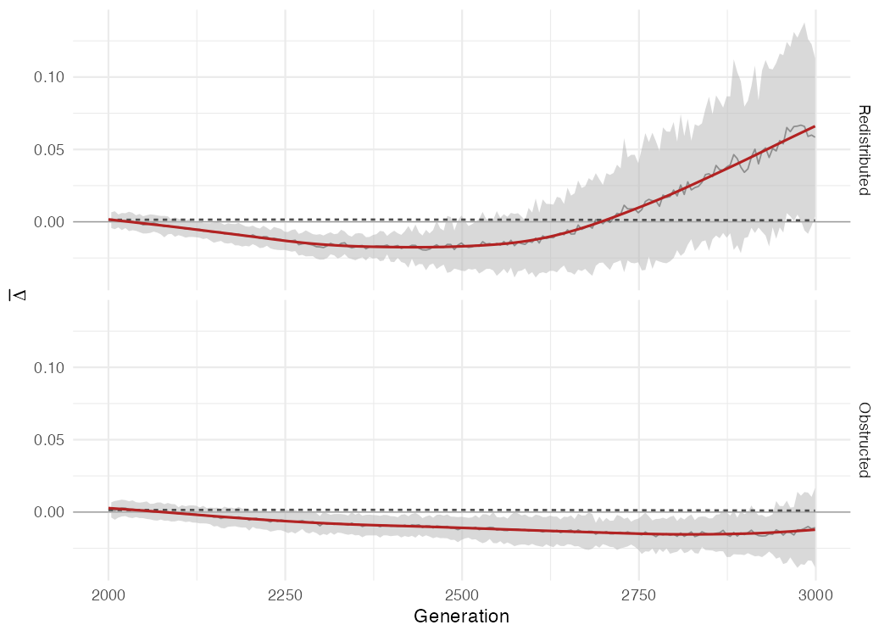
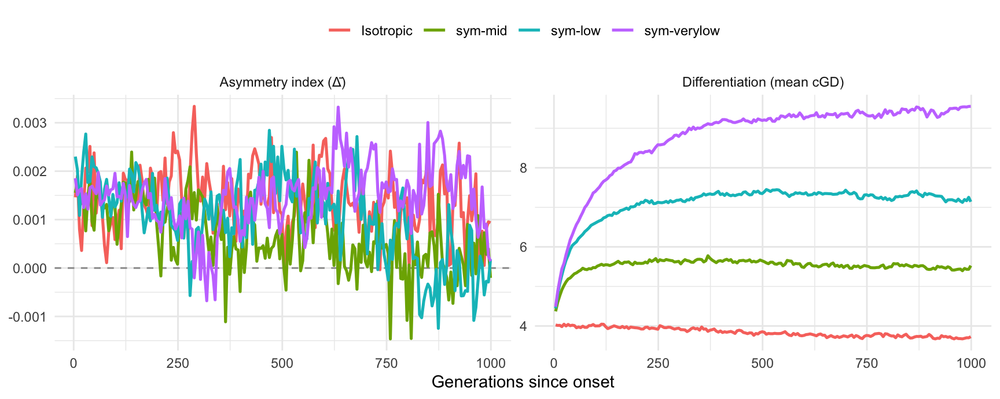

# Supplementary Materials

### Notation

Briefly, $K$ populations are represented as centroids in a multivariate genetic space, with the $K\times K$ Euclidean distance matrix $D$ double-centered via the idempotent operator $H=I-\frac{1}{K}\mathbf{1}\mathbf{1}^{T}$ to yield the covariance matrix $C=-\frac{1}{2}HD^{2}H$ (Dyer et al., 2004; Gower, 1966). Population Graph edges are retained where the corresponding partial correlation (from $C^{-1}$) is significant, so that an edge $e_{ij}\in E$ indicates a conditional genetic dependency between $i$ and $j$ that cannot be explained through intermediate populations (Dyer & Nason, 2004). I write $N(i)$ for the neighbors of node $i$ in $G$ and $k_{i}=|N(i)|$ for its degree.

*Tab_Notation:* Mathematical notation used throughout.

| Symbol                   | Description                                                  |
|:------------------------:|--------------------------------------------------------------|
|  $K$                     | Number of populations (strata)                               |
|  $N$                     | Number of individuals per population                         |
|  $L$                     | Number of loci                                               |
|  $D$                     | $K\times K$ matrix of inter-centroid Euclidean distances in genetic space  |
|  $C$                     | Double-centered covariance matrix derived from $D$           |
|  $H$                     | Idempotent centering operator  $I-\frac{1}{K}\mathbf{1}\mathbf{1}^{T}$ |
|  $G=\{V,E\}$             | Population Graph with vertex set $V$ and edge set $E$        |
| $N(i)$                   | Neighbor set of node $i$ in $G$                              |
| $k_{i}$                  | Topological degree of node $i$                               |
| $e_{ij}$                 | Symmetric edge weight between populations $i$ and $j$        |
| $b_{i}$                  | Local genetic-gravity bandwidth of the node $i$              |
| $p_{j\mid i}$            | Conditional probability that $j$ is a neighbor of $i$        |
| $w_{i\rightarrow j}$     | Directional weight from $i$ to $j$ (equal to $p_{j\mid i}$ ) |
| $\Delta_{ij}$            | Asymmetry index $w_{i\rightarrow j}-w_{j\rightarrow i}$      |
| $\bar{\Delta}$           | Mean asymmetry index over all retained edges, $\|E\|^{-1}\sum\limits_{(i,j)\in E}^{}\Delta_{ij}$  |
| $\hat{y}_{i,2000}$       | Replicate-specific MM-predicted equilibrium of metric $y$ at the final burn-in census (generation 2000)  |
| $\delta y_{i,t}$         | Standardized forward-phase deviation $y_{i,t}-{\hat{y}}_{i,2000}$  |
| $\bar{C}_D$             | Mean degree centrality of the Population Graph, averaged over nodes |
| Diameter                 | Longest shortest-path distance between any two nodes in the Population Graph |

### Trend-fitting for forward-phase metrics

The isotropic burn-in relaxes to a single equilibrium, and a three-parameter exponential-equilibrium curve fits it well (Fig_IsotropicBaseline). The same form was tried for the forward-phase trajectories under the redistributed and obstructed treatments and rejected: for redistributed diameter and signed $\bar\Delta$, and for obstructed diameter, at least one parameter (typically the plateau) was driven far outside the range of the observed data by the optimizer rather than converging to a value the fit could support — a sign that the underlying trajectory is not a simple relaxation to one equilibrium over this window, consistent with the biphasic and rise-then-plateau shapes described in Results.

Trends reported for these metrics are instead generalized additive models, $y \sim s(\text{generation}, k=20) + s(\text{replicate}, \text{bs}=\text{"re"})$, fit by REML (`mgcv`) to every replicate snapshot in the forward phase. The smooth term over generation captures the shape of the trend without committing to a functional form; the replicate-level random intercept absorbs stable between-replicate offsets so that a few extreme replicates do not dominate the fitted trend, and is excluded from the plotted prediction, which reports the population-level smooth only. The same fitting procedure was applied identically across the isotropic, redistributed, and obstructed forward phases so that trends remain directly comparable to one another.

### Bandwidth is Not Degree

This makes the natural objection—that $\Delta_{ij}$ is merely a function of node degree and neighborhood composition—correct only in form but not in consequence. The parameter $\Delta_{ij}$ is indeed a deterministic function of the graph; it has no other inputs. The question is whether the neighborhood scales $b_{i}$ $b_{j}$ carry *biological* directionality or only *topological* position, and whether the two contributions are separable. Topology contributes a component that is present even under symmetric migration and is largest at low-degree boundary nodes (the leaf-node effect discussed below); this component is independent of the direction of gene flow. Directional gene flow contributes a second component through its effect on neighborhood scale: when population $i$ persistently exports migrants to population $j$, it homogenizes $j$’s allele frequencies toward its own, compressing the conditional distances in $j$’s neighborhood (shrinking $b_{j}$) while $i$’s own neighborhood scale is comparatively preserved. The resulting $b_{i}>b_{j}$ is exactly the configuration that drives $\Delta_{ij}>0$, so the bandwidth difference is a reading of *introgression pressure* rather than of centrality alone. Crucially, the two components are distinguished empirically rather than by assertion: because every scenario branches from a shared burn-in state with the same stepping-stone connectivity, the purely topological contribution is shared with the isotropic null and cannot separate the scenarios. The validation bears this out—$\bar{\Delta}\approx 0$ and single-snapshot discrimination is at random under symmetric migration, with both rising only once migration becomes asymmetric, as demonstrated by the simulation results show. A degree artifact cannot discriminate between scenarios that share a topology; the observed separation is therefore migration-driven, not the sole property of the graph’s pattern of connectivity.

This separation can be made explicit. In the *no-direction limit*, where node $i$’s retained neighbor distances are equal, the directional weight reduces to the uniform value $w_{i\rightarrow j}=1/k_{i}$ and the asymmetry index collapses to a purely topological term that depends only on the endpoint degrees,
$$
\Delta_{ij}^{0} = \frac{1}{k_{i}}-\frac{1}{k_{j}} = \frac{k_{j}-k_{i}}{k_{i} k_{j}}
$$ 
which vanishes exactly when the endpoints share a degree, grows with the degree imbalance, and is largest at low-degree nodes—recovering a leaf-node effect (where $k_{i}=1$ forces $w_{i\rightarrow j}=1$) as the extreme case. Writing $\Delta_{ij}=\Delta_{ij}^{0}+\delta_{ij}$, the directional signal is carried entirely by the second term $\delta_{ij}$, which enters only through the bandwidth contrast $b_{i}\ne b_{j}$ that asymmetric gene flow induces; $\Delta_{ij}^{0}$ is invariant to migration. Because every forward scenario branches from a shared burn-in topology, the topological term $\Delta_{ij}^{0}$ is held in common with the isotropic null and cancels in any scenario contrast—which is precisely why $\bar{\Delta}$ is calibrated against the empirical isotropic null rather than an algebraic zero (Equation A1 makes the term being absorbed explicit).

### Directional balance vs. backflow suppression

The redistributed and obstructed scenarios (main text, Consequences of Redistributed and Obstructed connectivity) both impose a net directional bias in migration, but by different means: redistributed raises forward migration while holding total flux fixed, whereas obstructed suppresses reverse migration while holding forward flux at its isotropic value. The signed graph-mean asymmetry, $\bar{\Delta}$, over the forward phase resolves the two (Fig_SignedAsymmetry): both scenarios are transiently negative before turning positive, rather than moving monotonically toward the treatment's imposed direction from the outset. Redistributed $\bar{\Delta}$ reaches its minimum around generation 2400 (~400 generations after treatment onset) and reverses sign near generation 2680; obstructed $\bar{\Delta}$ reaches its minimum around generation 2800 (~800 generations post-onset) and is only beginning to reverse by the end of the simulated window. The two-fold difference in timing tracks the two-fold difference in net directional migration bias between the scenarios exactly: $m_{i\rightarrow i+1}-m_{i\leftarrow i+1}=0.03$ for redistributed versus $0.015$ for obstructed (Tab_ScenarioParameters) — the same process, running at half the rate. Each scenario was designed to isolate one departure from isotropic rather than to hold total migration fixed against the other (Methods), so total flux also differs between them (0.05 versus 0.035); that difference is smaller and less closely tracks the observed 2:1 timescale ratio than $\Delta m$ does, but it is not excluded as a contributor.

==The early negative excursion shared by both scenarios is consistent with backflow suppression acting on a faster timescale than the redistribution effect that ultimately dominates — cutting reverse migration compresses the receiving neighborhood's bandwidth before the (for redistributed, elevated; for obstructed, merely undiminished) forward flux has had time to compound into a detectable positive bias — but this mechanistic reading has not been checked against the simulation directly and should be confirmed before it stands as a claim.==

*Fig_SignedAsymmetry*: Signed graph-mean asymmetry, $\bar{\Delta}$, for the redistributed and obstructed scenarios (rows) over the forward phase (generations 2000–2999), fit with the same penalized-regression-spline approach used for Fig_ScenarioComparison in the main text; the dashed line is the fitted isotropic trend (centered near zero) as the null reference. Redistributed $\bar{\Delta}$ is transiently negative before reversing to positive around generation 2680; obstructed $\bar{\Delta}$ remains negative throughout the window, only beginning to turn over near its end.

### Comparison of $\Delta_{ij}$ behavior under both scenarios

With the boundary's leaf-incident edges set aside (their large mean $|\Delta |$ ≈ 0.493 is a topological artifact, not a scenario discriminator — see Pendants, boundary effects, below), the interior edges separate the two scenarios cleanly within the roughly 254–354-generations-after-onset window: interior $\bar{\Delta}$ = -0.016 under redistributed, -0.007 under obstructed, and 0.002 under isotropic — smaller in typical magnitude (about 0.038) than the leaf edges, but the only place in the graph where scenario identity is actually distinguishable.

This interior-edge contrast also lets the two mechanisms be compared quantitatively. Redistributed and obstructed reach their asymmetry through different manipulations of the same migration matrix (Methods; Tab_ScenarioParameters): redistributed raises forward migration while holding total flux fixed at the isotropic value, whereas obstructed suppresses reverse migration while holding forward flux fixed—so the same net directional bias can arise either from redistributing a fixed budget of migration or from throttling one direction of it. Over this window, redistributed's interior $\bar\Delta$ (-0.016) is roughly 2.3 times obstructed's (-0.007), close to the two-fold difference in $\Delta m$ between the scenarios (0.03 versus 0.015) and closer to that than to the smaller, roughly 1.4-fold difference in total flux (0.05 versus 0.035), consistent with the pattern already seen in the timing of the signed asymmetry index (Asymmetry of redistributed and obstructed connectivity, above; Discussion).

The same ordering holds for detection power. Scored against the matched isotropic null at each checkpoint (Tab_SensitivityAUC), genetic gravity's single-snapshot AUC for redistributed climbs from 0.70 at +250 generations post-onset to 0.89 at +350, while obstructed's AUC over the same interval rises only from 0.58 to 0.68 — redistributed is both a stronger and a more rapidly resolving signal than obstructed throughout the window used for the interior-edge comparison above. divMigrate, over the same checkpoints, remains at or below its symmetric-null expectation for both scenarios (Tab_SensitivityAUC).

### Differentiation without Direction

The framework also claims *specificity*: the asymmetry index should respond to the *direction* of gene flow, not to the *amount* of genetic structure. This was tested with a gradient of symmetric (1:1) scenarios at progressively lower migration—conditions that tip the drift–migration balance toward drift and raise neutral differentiation without imposing any direction. As per-direction migration falls across the gradient, neutral differentiation climbs sharply—mean cGD at the lowest-migration arm reaches roughly 2.6$\times$ its isotropic value (Tab_DifferentiationVsAsymmetry)—giving a direct test of whether that rise in structure alone is read as direction by either measure below.

==[Pending] This section previously tested edge-level false-positive-rate calibration across this gradient using the Location and Mechanism permutation tests (Tab_FPRCalibration, Fig_FPRCalibration). Both nulls were found to be unusable as significance tests on their own terms (Supplementary Materials, Permutation nulls for $\Delta_{ij}$) and have been retired in favor of the directional-vs-symmetric IBGD model comparison (Methods, Significance Testing for Asymmetry). That test's false-positive rate has been characterized on symmetric burn-in and isotropic-forward-phase samples (1.9% and 4.1% respectively; Results, Significance Testing & False Positive Rates) but not yet re-run across this specific differentiation gradient, which was designed as a more targeted specificity stress test than either of those samples. Re-run the model-comparison FPR on this gradient's snapshots before restoring a per-edge or per-census calibration claim here.==

The same specificity is evident in the graph-mean index $\bar{\Delta}$, a descriptive complement to the calibrated per-edge test above. If the index were merely a differentiation detector, $\bar{\Delta}$ would climb with the gradient; if it is direction-specific, it should stay at the isotropic null however high differentiation rises—the "scissors" of Fig_StreamCScissors. Across the symmetric gradient, the drift–migration balance tips steadily toward drift: as the per-direction rate falls, neutral differentiation climbs sharply—mean cGD at the lowest-migration arm reaches roughly 2.6$\times$ its isotropic value—yet the *signed* mean asymmetry index never leaves the isotropic null, staying below 9e-04 across the entire gradient with no trend in sign (Tab_DifferentiationVsAsymmetry). That is the scissors of Fig_StreamCScissors: the *amount* of structure rises sharply while its *direction* does not. The absolute index $|\bar{\Delta}|$ does creep up modestly (from 0.0047 under isotropy to about 0.0058 at the lowest-migration arm) as differentiation rises (Discussion), but it stays well below the levels the asymmetric scenarios reach, which depart from the null at differentiation far below what this gradient reaches.

*Tab_DifferentiationVsAsymmetry:* Differentiation versus asymmetry at the final forward generation across the symmetric gradient. Mean cGD rises as migration falls (drift-driven differentiation); the signed and absolute mean asymmetry index stay near the isotropic baseline.

| Scenario | Mean cGD | Signed Δ̄ | \|Δ̄\| |
| :---- | :---: | :---: | :---: |
| Isotropic | 3.730 | 9e-04 | 0.0047 |
| sym-mid | 5.526 | -2e-04 | 0.0050 |
| sym-low | 7.140 | 2e-04 | 0.0067 |
| sym-verylow | 9.553 | 1e-04 | 0.0058 |

*Fig_StreamCScissors:* Specificity ‘scissors’ across the symmetric differentiation gradient. Left: neutral differentiation (mean conditional genetic distance) rises as per-direction migration falls and drift dominates. Right: the mean asymmetry index stays pinned at the isotropic null (dashed line at zero) over the same gradient. Symmetric migration raises the amount of structure but imposes no direction, so the index does not move.

### Pendants, boundary effects, and other marginalia issues relevant to applying $\Delta_{ij}$

The asymmetry index carries a topological component at low-degree nodes (the leaf-node effect discussed under Caveats and limitations). Because the simulated stepping stone has two degree-limited termini, two questions follow: whether that component biases the directional signal, and—since the same termini are the most drift-exposed demes in the system—whether the boundary is better read as a genuine evolutionary regime than as a numerical edge case. Both were addressed by decomposing the forward-phase snapshots by chain position, separating edges that touch a degree-one terminus from interior edges, and tracking expected heterozygosity at the ends versus the interior.

Decomposing the index by edge class separates the topological boundary effect from the directional signal (Tab_EdgeClassDecomposition). Leaf-incident edges—those touching a degree-one terminus, where one directional weight is forced to $1$—carry a large mean $|\Delta |$ (about 0.493) under both asymmetric scenarios, a component the directional-vs-symmetric IBGD comparison does not need to calibrate away, since it compares whole-graph fits rather than scoring individual edges (Methods). No leaf-incident edges occur under the isotropic scenario in this dataset at any sampled generation (Discussion). With the leaf edges removed, the interior edges carry the directional signal as a distributed graph property — the periphery contributes magnitude but no scenario discrimination. (Numbers reported under "Comparison of $\Delta_{ij}$ behavior under both scenarios," above.)

Expected heterozygosity at the chain ends sits below the interior in every scenario (Fig_BoundaryDiversity; Discussion) and falls fastest under obstructed connectivity, where the lower total migration (0.035 versus 0.050) compounds the peripheral isolation (terminus $H_{e}$ ≈ 0.089 versus interior 0.094 by the end of the window).

*Fig_BoundaryDiversity:* Expected heterozygosity at the chain termini versus the interior over the forward phase, by scenario (mean across replicates and populations within each class). Termini exchange with a single neighbor and thus receive roughly half the immigrant input of an interior deme; they lose variation faster, and fastest under obstructed connectivity, where lower total migration compounds peripheral isolation.

### Census-to-census stability of directional structure (divMigrate comparison)

*(Moved from Methods, "Comparison with a differentiation-based directional method," and the Figures section; the figure's own filename and caption are unchanged, only relocated.)*

**Census-to-census stability.** To assess how consistently each index's picture of directional structure was changing over time, we computed the census-to-census (lag-1, 5-generation) stability of each matrix series: Spearman's $\rho$ between the matrix at census $t$ and the matrix at the following census $t+5$, restricted to pairs defined at both censuses, computed separately for divMigrate's $N_m$ matrix and for $S_{ij}$. This was computed for every replicate and treatment, without significance testing, and summarized as the median across replicates at each census (Fig_DivMigrateLag1).

*Fig_DivMigrateLag1:* Census-to-census (lag-1, 5-generation) stability of directional structure, by treatment (panels) and matrix type (color): median Spearman's $\rho$ between each census's matrix and the following census's matrix, for divMigrate's $N_m$ matrix (blue) and the pGD-derived similarity matrix $S_{ij}$ (red), across all replicates. The shaded bands, carried into the redistributed and obstructed panels, are the isotropic across-replicate mean $\pm$ 1 SD for each series, shown as a null reference. Under isotropic migration both series are flat throughout. Under redistributed, $N_m$ departs below its isotropic band from roughly generation 2500–2600 onward, while $S$ instead stays within its band until becoming markedly more volatile and dropping below it from approximately generation 2700 on. Under obstructed, $N_m$ stays close to its isotropic band throughout, while $S$ rises steadily above its band from roughly generation 2400–2500 onward.

### Detection rates for the directional isolation test

*Tab_IBGDDetection:* Fraction of censuses in which the directional isolation model ($\text{pGD}_{ij} \sim |dx_{ij}| + |dx_{ij}|\cdot r_{ij}$, adjusted $R^2$) fits better than standard IBGD (cGD against $|dx_{ij}|$), by scenario and forward-phase window, with the median $\Delta R^2 = R^2_{pGD}-R^2_{cGD}$. Under symmetric migration this fraction is the false-positive rate; under the asymmetric treatments it is the detection rate. 50 replicates; 5-generation censuses (1,000 per window for the burn-in reference, 2,500 per 250-generation forward window, 10,000 for the isotropic forward phase).

| Scenario | Window | Directional model preferred | Median $\Delta R^2$ |
| :---- | :---- | :---: | :---: |
| Burn-in (symmetric) | 1904–1999 | 1.9% | −0.055 |
| Isotropic | 2004–2999 | 4.1% | −0.055 |
| Redistributed | 2004–2249 | 11.6% | −0.049 |
| Redistributed | 2254–2499 | 53.6% | 0.005 |
| Redistributed | 2504–2749 | 73.2% | 0.033 |
| Redistributed | 2754–2999 | 55.5% | 0.011 |
| Obstructed | 2004–2249 | 6.4% | −0.055 |
| Obstructed | 2254–2499 | 20.1% | −0.033 |
| Obstructed | 2504–2749 | 43.2% | −0.008 |
| Obstructed | 2754–2999 | 54.3% | 0.006 |

### Permutation nulls for $\Delta_{ij}$

Before adopting the model comparison (Methods, Significance Testing for Asymmetry), significance tests built directly on the asymmetry index were evaluated against the same symmetric reference (the final 100 generations of burn-in; 1,000 censuses, 95,903 edges). None was usable as a test.

- **Graph-level rewiring null** (mean $|\Delta_{ij}|$ against degree-preserving random rewiring with shuffled edge weights). The null could not be generated for dense graphs (valid draws fell to 0.3% above 100 edges on 25 nodes), and where it could, the test never rejected, under symmetric or asymmetric migration: stepping-stone graphs are degree-assortative and locally smooth, so the observed graph always sat 2.4–3.4 SD *below* the rewired null.
- **Edge-level label-permutation null** (individuals permuted among populations and the graph refit on the fixed topology). Under symmetric migration, 8.4% of edges were significant at $\alpha=0.05$, with an excess of p-values near both 0 and 1. Centring the p-value on the null mean removed the excess near 1 but raised the false-positive rate to 24.6%. The permuted (panmictic) data flatten each node's kernel, so the null centres on the degree difference $1/k_i-1/k_j$, whereas the observed $\Delta_{ij}$ averages about 0.65 of it; the null is also too narrow (a 15.7% false-positive rate even on edges whose endpoints have equal degree).
- **Sign-exchangeability null** (edge signs flipped independently, magnitudes fixed). Under symmetric migration, a median 81% of $\sum\Delta_{ij}^2$ is the gradient of a node-level potential ($\Delta_{ij}\approx\phi_j-\phi_i$), against 25% expected if edge signs were independent. Edges sharing a node are therefore not exchangeable, and every sign- or node-permutation statistic tried was anti-conservative (14–100% false positives at $\alpha=0.05$).

The common cause is that $\Delta_{ij}$ carries node-level structure (degree and bandwidth) and a drift-generated, spatially smooth potential that no null built by exchanging parts of a single graph reproduces. Asking whether a directional description of the graph explains isolation better than a symmetric one sidesteps the problem: both descriptions carry the same node-level structure, and only directional gene flow favors the directional one.

### Tables

*Tab_ToolSummary:* What each tool in the framework certifies, the null it is referenced to, and its principal limitation. $\bar{\Delta}$ against a replicate-based empirical null is the most reliable use of the framework but needs replicates; the directional-vs-symmetric IBGD comparison trades some of that reliability for working on a single graph. Individual-edge $\Delta_{ij}$ has no calibrated significance test (Permutation nulls for $\Delta_{ij}$) and should be read as exploratory only, not as a third tier with its own row here.

| Inferential target | Recommended tool | Null / reference | Reliably certifies | Principal limitation |
| :---- | :---- | :---- | :---- | :---- |
| Network-level direction | $\bar{\Delta}$, graph metrics | Empirical isotropic null | Presence, cause, and timing of asymmetry | Needs a replicate or time-series null; sign needs a node ordering |
| Single-graph direction test | Directional-vs-symmetric IBGD model comparison ($\Delta R^2$) | Empirical FPR (burn-in / isotropic forward phase) | Presence of asymmetry from one graph, no replicates needed | One-sided (a preferred symmetric fit is not evidence against asymmetry); coarser than edge level |
| Cross-method check | divMigrate comparison | — | Concordance where flow is present | divMigrate confounds differentiation magnitude; blows up at fixation |

*Tab_SensitivityAUC:* Single-snapshot sensitivity at several checkpoints after onset, by index, for each asymmetric scenario (panels). Each cell is AUC (power at a fixed 5% false-positive rate); column headers are generations since onset (targets \~50–400, snapped to the every-fifth-generation census grid). AUC is the rank-based separation of asymmetric from symmetric replicates (0.5 = no discrimination, 1 = perfect). The checkpoints span the early window, where AUC can dip toward or below 0.5 before recovering, as well as the later plateau.

*A. Redistributed* 

| Method          | +50        | +100       | +150       | +200       | +250       | +300       | +350       | +400       |
|-----------------|:-----------:|:-----------:|:-----------:|:-----------:|:-----------:|:-----------:|:-----------:|:-----------:|
| Genetic gravity | 0.43 (0.04) | 0.54 (0.08) | 0.69 (0.28) | 0.66 (0.18) | 0.70 (0.22) | 0.76 (0.30) | 0.89 (0.50) | 0.86 (0.58) |
| divMigrate      | 0.61 (0.04) | 0.34 (0.02) | 0.30 (0.04) | 0.20 (0.00) | 0.26 (0.02) | 0.11 (0.00) | 0.15 (0.00) | 0.09 (0.02) |

*(B) Obstructed*

| Method          | +50        | +100       | +150       | +200       | +250       | +300       | +350       | +400       |
|-----------------|:-----------:|:-----------:|:-----------:|:-----------:|:-----------:|:-----------:|:-----------:|:-----------:|
| Genetic gravity | 0.32 (0.00) | 0.38 (0.02) | 0.62 (0.16) | 0.50 (0.16) | 0.58 (0.10) | 0.68 (0.14) | 0.68 (0.12) | 0.57 (0.16) |
| divMigrate      | 0.61 (0.08) | 0.43 (0.04) | 0.47 (0.06) | 0.34 (0.04) | 0.39 (0.00) | 0.34 (0.10) | 0.27 (0.02) | 0.32 (0.02) |

*Tab_EdgeClassDecomposition:* Asymmetry index decomposed by edge class, pooled over an established-signal window (generations 2254-2354, ~254-354 generations after onset), averaged across replicates and snapshots in that window. Leaf-incident edges touch a degree-one terminus (e.g., a solitary directional weight); interior edges have both endpoints of degree \>= 2; ‘all’ pools both. Mean signed Δ carries the directional signal; mean |Δ| is the typical magnitude. No leaf-incident edges occurred under the Isotropic scenario in the sampled window (see prose).

| Scenario | Edge class | Mean signed Δ | Mean \|Δ\| | Edges/graph |
| :---- | :---: | :---: | :---: | :---: |
| Isotropic | interior | 0.002 | 0.034 | 96.1 |
| Isotropic | all | 0.002 | 0.034 | 96.1 |
| Redistributed | interior | -0.016 | 0.042 | 88.6 |
| Redistributed | leaf-incident | 0.357 | 0.491 | 2.0 |
| Redistributed | all | -0.016 | 0.043 | 88.6 |
| Obstructed | interior | -0.007 | 0.037 | 91.6 |
| Obstructed | leaf-incident | 0.495 | 0.495 | 1.0 |
| Obstructed | all | -0.007 | 0.037 | 91.6 |
